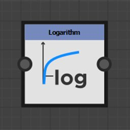

# Function nodes

Function nodes transform the input value according to the mathematical function they represent.

Although their input connectors are generally not typed, they do not support all value types.

## Node list

+++Pow

Returns the first input raised to the power of the second input: <b>X^Y</b>.

+++

+++2Pow

Returns 2 to the power of its input value: <b>2^X</b>.

+++

+++Square root

Returns the square root of its input value: <b>√X</b>.

+++

+++Exponential

Returns the exponential value of its input value: <b>e^X</b>

<b>e</b> is approximately equal to 2.7182818.

+++

+++Logarithm

Returns the natural logarithm of its input value: <b>ln(X)</b>.

+++

+++Logarithm base 2

Returns the base 2 logarithm of its input value: <b>log2(X)</b>.

+++

+++Absolute

Returns the absolute value of its input: <b>abs(X)</b>.

+++

+++Ceil

Rounds its input value up. It returns the smallest integer value not less than X: <b>ceil(X)</b>.

+++

+++Floor

Rounds its input value down. It returns the largest integer value not greater than X: <b>floor(X)</b>.

+++

+++Linear interpolation

Returns the linear interpolation between two values in function of a floating value: <b>(1 - X)\*A + X\*B</b>.

+++

+++Minimum

Returns the lowest of the two input values: <b>min(A, B)</b>.

+++

+++Maximum

Returns the highest of the two input values: <b>max(A, B)</b>.

+++

+++Cosine

Returns the cosine of its input value in radians: <b>cos(X)</b>.

+++

+++Sine

Returns the sine of its input value in radians: <b>sin(X)</b>.

+++

+++Tangent

Returns the tangent of its input value in radians: <b>tan(X)</b>.

+++

+++Arc tangent 2

Returns the angle between the input 2D vector and the horizontal.

It is the reciprocal of the <b>Cartesian</b> function.

It is not necessary to switch the X and Y component of the input vector as in the usual <b>atan2</b> function.

+++

+++Cartesian

Converts polar coordinates to cartesian coordinates.

It is the reciprocal of the <b>Arc tangent 2 </b>function: <b>Length \* Float2(cos(Angle), sin(Angle).</b>

Polar coordinates are a distance from the origin and an angle in radians from the horizontal.

+++

+++Random

Returns a random value between 0 and the input value <b>X</b>.

+++
