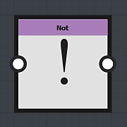

# Logical nodes

Logical nodes are used to add multiple conditions to your graph:

## The *And* node

The And node takes two Boolean nodes as input:

* If both of the inputs are True, then the output of the *And* node will be *True*
* In any other case the *And* node will return *False*

## The *Or* node

The Or node takes two Boolean nodes as input:

* If at least one of the input isTrue (1), then the output of the *Or* node will be *True*
* If both of the inputs are False, the *Or* node will return *False*

## The *Not* node

The Not node takes a Boolean as input: it will will look at the input value and return its opposite:

* *True* input gives *False* output
* *False* input gives *True* output
