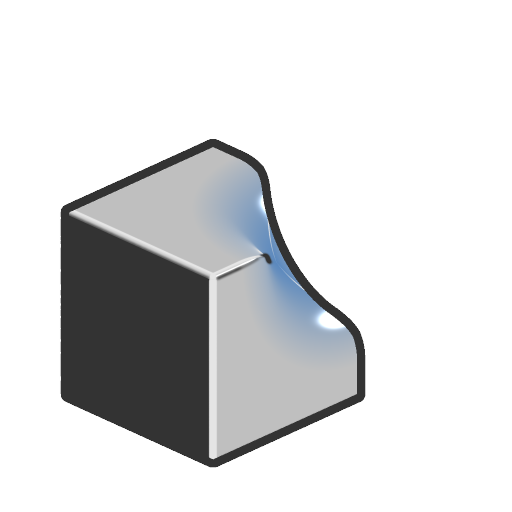

# Subtraction smooth 

<table>
<tr style="border: 0;">
<td width="33.33%" style="border: 0;" valign="top">

<b>In:</b> SDF function &gt; Operator

</td>
<td width="100.00%" style="border: 0;" valign="top">

## Description

Subtracts the volume of the SDF 1 shape from the SDF 2 shape, with adjustable smoothing applied at the intersection of the two.

</td>
</tr>
</table>

## Inputs

|  |  |
| :--- | :--- |
| <b>SDF 1</b> *Float* | The SDF shape being subtracted from. |
| <b>SDF 2</b> *Float* | The SDF shape being subtracted from the SDF 1 shape. |
| <b>Smoothness</b> *Float* | The smoothing applied at the intersection of the two shapes.  <i>Note:</i> hard edges may appear where the smoothing radiuses intersect. |
