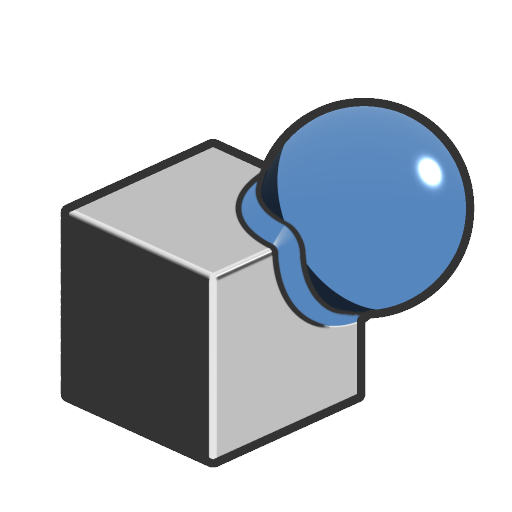

# Union chamfer

<table>
<tr style="border: 0;">
<td width="33.33%" style="border: 0;" valign="top">

<b>In:</b> SDF function &gt; Operator

</td>
<td width="100.00%" style="border: 0;" valign="top">

## Description

Returns the added volumes of two SDF shapes, with an additional volume of adjustable radius along the edges of their intersection.

</td>
</tr>
</table>

## Inputs

|  |  |
| :--- | :--- |
| <b>SDF 1</b> *Float* | The first SDF shape. |
| <b>SDF 2</b> *Float* | The second SDF shape. |
| <b>Radius</b> *Float* | The radius of the volume added along the edges of the shapes' intersection.  <i>Default: 0</i> |
