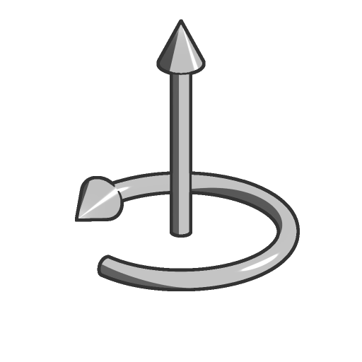

# Rotate

<table>
<tr style="border: 0;">
<td width="33.33%" style="border: 0;" valign="top">

<b>In:</b> SDF function &gt; Transform

</td>
<td width="100.00%" style="border: 0;" valign="top">

## Description

Rotate an SDF shape around one or several axes from an adjustable pivot point, in turns. Use the <b>Transform pivot</b> helper of the <b>3D Viewer</b> to visualize the performed rotation.

</td>
</tr>
</table>

>[!INFO]
> 
> To learn more about concepts and workflows involving SDF functions, go to the dedicated page: [Working with SDF functions](../../working-with-sdf-functions.md)

## Inputs

|  |  |
| :--- | :--- |
| <b>SDF</b> *Float* | The input SDF shape. |
| <b>Angle</b> *Float* | The angle, in turns, at which the SDF shape is rotated.  The angle is visualized by a circle in the <b>Transform pivot</b> helper of the <b>3D Viewer</b>. Align the camera so as to see the <b>Axis</b> arrow as the center of this circle to clearly see the angle of your rotation as a fraction of a turn.  <i>Default: 0</i> |
| <b>Axis</b> *Float3* | The normalized vector defining the axis around which the SDF shape is rotated. E.g. (0, 1, 0) will rotate the SDF shape around the Y axis of its local pivot point.  The axis is visualized by an arrow in the <b>Transform pivot</b> helper of the <b>3D Viewer</b>. The color of the arrow is mapped on the XYZ components of this vector.  <i>Default: (0, 1, 0)</i> |
| <b>Pivot position</b> *Float3* | The world space position of the local pivot of the SDF shape, where (0, 0, 0) places the pivot at the center of the SDF shape. Defines the origin of the rotation.  The pivot is visualized by the start of the arrow in the <b>Transform pivot</b> helper of the <b>3D Viewer</b>. |
| <b>P</b> *Float3* | The transformed world space position. Use this input to apply additional transformations using the <b>Offset P</b> and <b>Rotate P</b> nodes.  <i>Default: The untransformed world space position.</i> |
