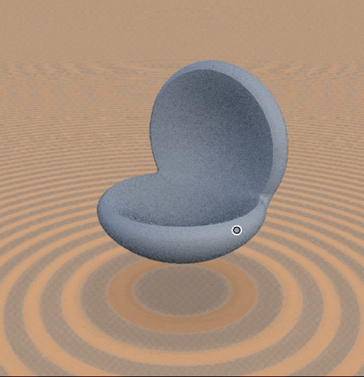
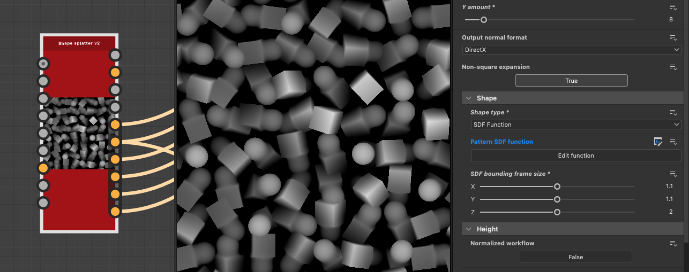
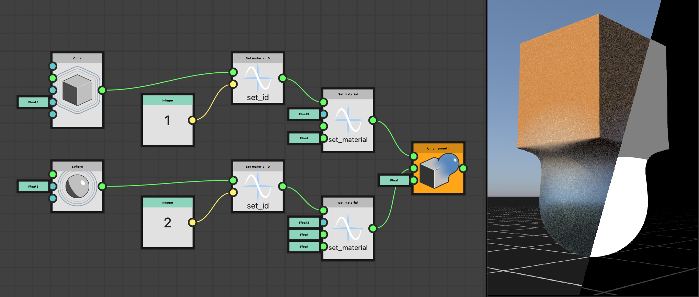
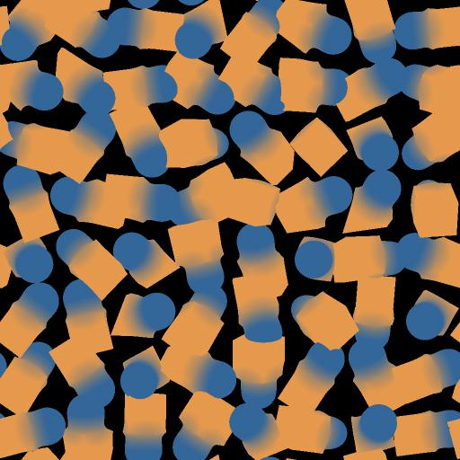
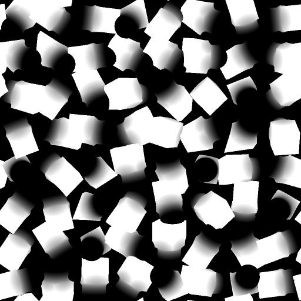

# Working with SDF functions

In version 16.0.0, Substance 3D Designer introduced a powerful set of nodes to author SDF functions, which can be used to create and manipulate procedural 3D shapes.

SDF functions are Substance function graphs that combine SDF nodes available in the toolset and are applied to dedicated parameters in nodes that support SDF functions.

As a starting point, keep in mind the basic workflow looks like this:

1. Author an SDF function in a [3D viewer](../../../../compositing-graphs/nodes-reference-for-com/node-library/filters/effects/3d-viewer/3d-viewer.md) node for visualizing the result.
2. Copy it the final function graph (or [instantiate it](../../../../glossary/glossary.md#instance-node)) into the SDF function parameter of a node that supports SDF functions, such as [Shape splatter v2](../../../../compositing-graphs/nodes-reference-for-com/node-library/texture-generators/patterns/shape-splatter-v2/shape-splatter-v2.md).

## What is an SDF function?

<table style="border: none">
    <tr style="border: 0">
        <td style="border: 0; vertical-align: top">
            
Just like mathematical functions can be plotted in 2D as curves, they can be plotted in 3D as surfaces.

A signed distance field is a mathematical function that defines a surface in 3D space by calculating the distance from any point in space to the nearest point on the surface.

Let us break down the name 'signed distance field' to understand it better:<ul><li><b>Signed</b> means that the function returns a positive value if the point is outside/in front of the surface, a negative value if the point is inside/behind the surface, and zero if the point is exactly on the surface.</li><li><b>Distance</b> refers to the fact that the function calculates the distance from any point in space to the *nearest* point on the surface.</li><li><b>Field</b> means the function describes a field of values, as each point in space has a corresponding value that represents its distance to the nearest surface.</li></ul>

        </td>
        <td style="border: 0; width: 33%; vertical-align: top">
            
        </td>
    </tr>
</table>

These functions have many applications in computer graphics, such as drawing surfaces, shadow casting, contour masking, collision detection and more.

In Substance 3D Designer, SDF functions are used to create and manipulate 3D shapes in a procedural way.

### The output and intended use of an SDF function

SDF function nodes output a single float value: the signed distance to the nearest surface.

Yet there is more to them: they internally get and set the values of variables that the host nodes need to define and/or know about to manipulate and draw the resulting shapes.

This means these nodes need to be used in the context of nodes that *support SDF functions* because it knows about these variables and integrates them natively.

The nodes include [Shape splatter v2](../../../../compositing-graphs/nodes-reference-for-com/node-library/texture-generators/patterns/shape-splatter-v2/shape-splatter-v2.md) and [3D viewer](../../../../compositing-graphs/nodes-reference-for-com/node-library/filters/effects/3d-viewer/3d-viewer.md).

### The Substance function graph

SDF function nodes are meant to be used in dedicated Substance function graphs, and are therefore only available in that graph type.
Node parameters that are meant to be expressed as a function use an 'Edit function' button.

What you need to know about Substance function graphs:
* Similarly to Substance graphs, nodes connectors are *specialized*, meaning they can only be connected to other connectors of *matching color* [representing their type](../../function-nodes-overview/function-nodes-overview.md#color-coding).
* Nodes do not have parameters, they can only have inputs. (With a few specific exceptions)
* The graph has a single output node. Right-click on a node and select `Set as output` to designate it as the output node.
* Also similarly to Substance graphs, there are *atomic* nodes – the base building blocks – and *instance* nodes which represent other Substance function graphs.
* There are separate operators (algebraic, logical and comparison) that let you perform operations on the values in the graph, however SDF nodes have [their own operators](#operators)

+++ Example of a function graph defining an SDF function

+++

## Getting started

To author SDF functions, we first need to visualize them so we can understand the effect of the nodes and parameters we are adjusting.

The [3D viewer](../../../../compositing-graphs/nodes-reference-for-com/node-library/filters/effects/3d-viewer/3d-viewer.md) node has a dedicated mode for visualizing shapes authored using SDF functions: Set the node's <b>Scene type</b> parameter to `SDF function` and click the **Edit function** button to open the function graph that will host the SDF function itself.

The node offers dedicated features for visualizing aspects of the SDF function that will let us build them more intuitively and efficiently, such as a bounding frame and isolines.

The [Physical sun/sky](../../../../compositing-graphs/nodes-reference-for-com/node-library/3d-view-library/hdri-tools/physical-sun-sky/physical-sun-sky.md) node can be used to quickly set up environment lighting in the 3D viewer.

>[!TIP]
> 
> <table style="border: none"><tr style="border: none"><td style="border: none; vertical-align: top">
All SDF function nodes as well as their input connectors have tooltips that will let you know more about their purpose and how to use them.

Make sure to check them out!
</td><td style="border: none; width: 33%; vertical-align: top"></td></tr></table>

### Setting node values

As with all nodes in Substance function graphs, SDF function nodes do not have parameters but only input connectors which are used as parameters.

To set the value of those inputs, you can use [constant nodes](../../atomic-function-nodes/constant-nodes/constant-nodes.md) such as **Float**, **Float3** and **Integer3**.  
You may create these the usual way through the node menu, or you can drag a new connection from the connectors to benefit from a filtered list of nodes of matching types.

Most input connectors of SDF function nodes have a default value, which is disclosed in its tooltip.

>[!TIP]
> 
> <table style="border: none"><tr style="border: none"><td style="border: none; vertical-align: top">
If you do not need to keep some values visible at all times, dock nodes using the <code>D</code> key to save space and declutter the graph.

You can also use comments to keep track of the values.
</td><td style="border: none; width: 67%; vertical-align: top"></td></tr></table>

### The bounding frame

<table style="border: none">
    <tr style="border: none">
        <td style="border: none; vertical-align: top">
            
The bounding frame is a box in 3D space that defines the <i>bounds</i> in which the SDF function is evaluated and drawn in the <a href="../../../../compositing-graphs/nodes-reference-for-com/node-library/texture-generators/patterns/shape-splatter-v2/shape-splatter-v2.md">Shape splatter v2</a> node.

If the bounding frame is too small, parts of the shape may be trimmed. If it is too large, it may lead to unnecessary computations and longer processing times.

The <b>Bounding frame</b> parameter lets you enable the visualization of the bounding frame. You can then adjust the size of the bounding frame by changing the values of the <b>Bounding frame size</b> parameter.

Use the <b>Colorize out of frame</b> parameter to visualize the areas outside the bounding frame in bright red so you can adjust the frame accordingly.

        </td>
        <td style="border: none; width: 33%; vertical-align: top">
            
        </td>
    </tr>
</table>

### Isolines

<table style="border: none">
    <tr style="border: none">
        <td style="border: none; vertical-align: top">
            
Because transforming shapes involves actually *transforming the space* in which they are drawn, the result of nodes used after some transformations may be surprising. In those cases, it is helpful to visualize the space itself, and that can be done by <i>visualizing the distance field</i> of the shape.

For that, the 3D viewer node uses <i>isolines</i>, which are repeating contour lines representing a given distance from the shape's surface. The <b>SDF isolines</b> parameter enables that visualization. The isolines are drawn on a horizontal plane placed at the height specified by the <b>SDF isolines position</b> parameter.

Seeing how isolines are deformed by the transformations applied to the shape can help understand how the shape itself is transformed, and adjust the parameters of the nodes accordingly.

        </td>
        <td style="border: none; width: 33%; vertical-align: top">
            
        </td>
    </tr>
</table>

## SDF function nodes categories

SDF functions nodes are categorized in the Library based on their function and purpose.

You can create as many Library views as needed to organize your workspace in such a way that the SDF functions toolset is arranged by category while keeping everything on hand. Go to **Windows > New Library** view to add separate, independent views of the Library.

+++ Example workspace

+++

### Primitives

The base building blocks of SDF functions, which let you create basic shapes such as spheres, boxes, cylinders and more.

+++ Nodes

[Capped cone](./sdf-functions-primitives/3d-sdf-capped-cone/3d-sdf-capped-cone.md)  
[Capped cone (2 points)](././sdf-functions-primitives/3d-sdf-capped-cone-2-points/3d-sdf-capped-cone-2-points.md)  
[Capped torus](./sdf-functions-primitives/3d-sdf-capped-torus/3d-sdf-capped-torus.md)  
[Capsule](./sdf-functions-primitives/3d-sdf-capsule/3d-sdf-capsule.md)  
[Cone](./sdf-functions-primitives/3d-sdf-cone/3d-sdf-cone.md)  
[Cube](./sdf-functions-primitives/3d-sdf-cube/3d-sdf-cube.md)  
[Cylinder](./sdf-functions-primitives/3d-sdf-cylinder/3d-sdf-cylinder.md)  
[Cylinder (2 points)](./sdf-functions-primitives/3d-sdf-cylinder-2-points/3d-sdf-cylinder-2-points.md)  
[Ellipsoid](./sdf-functions-primitives/3d-sdf-ellipsoid/3d-sdf-ellipsoid.md)  
[Elongated cylinder](./sdf-functions-primitives/3d-sdf-elongated-cylinder/3d-sdf-elongated-cylinder.md)  
[Ground plane](./sdf-functions-primitives/3d-sdf-ground-plane/3d-sdf-ground-plane.md)  
[Helix](./sdf-functions-primitives/3d-sdf-helix/3d-sdf-helix.md)  
[Hexagonal prism](./sdf-functions-primitives/3d-sdf-hexagonal-prism/3d-sdf-hexagonal-prism.md)  
[Infinite plane](./sdf-functions-primitives/3d-sdf-infinite-plane/3d-sdf-infinite-plane.md)  
[Plane](./sdf-functions-primitives/3d-sdf-plane/3d-sdf-plane.md)  
[Pyramid](./sdf-functions-primitives/3d-sdf-pyramid/3d-sdf-pyramid.md)  
[Pyramid square](./sdf-functions-primitives/3d-sdf-pyramid-square/3d-sdf-pyramid-square.md)  
[Rock](./sdf-functions-primitives/3d-sdf-rock/3d-sdf-rock.md)  
[Sphere](./sdf-functions-primitives/3d-sdf-sphere/3d-sdf-sphere.md)  
[Torus](./sdf-functions-primitives/3d-sdf-torus/3d-sdf-torus.md)

+++

### Operators

These nodes let you combine and modify shapes created with primitives. They include:
* **Straight boolean** operators such as [Union](sdf-functions-operators/3d-sdf-op-union/3d-sdf-op-union.md), [Intersection](sdf-functions-operators/3d-sdf-op-intersection/3d-sdf-op-intersection.md) and [Subtraction](sdf-functions-operators/3d-sdf-op-subtraction/3d-sdf-op-subtraction.md) that let you combine shapes in various ways.
* **Deforming boolean** operators such as [Rounding](sdf-functions-operators/3d-sdf-op-rounding/3d-sdf-op-rounding.md) and [Morph](sdf-functions-operators/3d-sdf-op-morph/3d-sdf-op-morph.md) that let you combine shapes with a blending effect.
* **Other specialized** operators such as [Shell](sdf-functions-operators/3d-sdf-op-shell/3d-sdf-op-shell.md) and [Symmetry](sdf-functions-operators/3d-sdf-op-symmetry/3d-sdf-op-symmetry.md) that let you modify and/or duplicate a shape.

+++ Nodes

[Intersection](./sdf-functions-operators/3d-sdf-op-intersection/3d-sdf-op-intersection.md)  
[Intersection smooth](./sdf-functions-operators/3d-sdf-op-intersection-smooth/3d-sdf-op-intersection-smooth.md)  
[Intersection surface](./sdf-functions-operators/3d-sdf-op-intersection-surface/3d-sdf-op-intersection-surface.md)  
[Morph](./sdf-functions-operators/3d-sdf-op-morph/3d-sdf-op-morph.md)  
[Repeat mirror](./sdf-functions-operators/3d-sdf-op-repeat-mirror/3d-sdf-op-repeat-mirror.md)  
[Rounding](./sdf-functions-operators/3d-sdf-op-rounding/3d-sdf-op-rounding.md)  
[Shell](./sdf-functions-operators/3d-sdf-op-shell/3d-sdf-op-shell.md)  
[Subtraction](./sdf-functions-operators/3d-sdf-op-subtraction/3d-sdf-op-subtraction.md)  
[Subtraction smooth](./sdf-functions-operators/3d-sdf-op-subtraction-smooth/3d-sdf-op-subtraction-smooth.md)  
[Symmetry](./sdf-functions-operators/3d-sdf-op-symmetry/3d-sdf-op-symmetry.md)  
[Union](./sdf-functions-operators/3d-sdf-op-union/3d-sdf-op-union.md)  
[Union chamfer](./sdf-functions-operators/3d-sdf-op-union-chamfer/3d-sdf-op-union-chamfer.md)  
[Union smooth](./sdf-functions-operators/3d-sdf-op-union-smooth/3d-sdf-op-union-smooth.md)

+++

### Transforms

Shapes can be transformed in various ways, such as being [translated](sdf-functions-transforms/3d-sdf-transform-offset/3d-sdf-transform-offset.md), [rotated](sdf-functions-transforms/3d-sdf-transform-rotate/3d-sdf-transform-rotate.md), [scaled](sdf-functions-transforms/3d-sdf-transform-scale/3d-sdf-transform-scale.md), [twisted](sdf-functions-transforms/3d-sdf-transform-twist/3d-sdf-transform-twist.md) and more.
These nodes let you perform these transformations by *transforming the space itself* in which the surfaces are defined.

That space is referred to as `P`, move on to the next section to understand more about what that means and how space transformation works.

+++ Nodes

[Bend](./sdf-functions-transforms/3d-sdf-transform-bend/3d-sdf-transform-bend.md)  
[Elongate](./sdf-functions-transforms/3d-sdf-transform-elongate/3d-sdf-transform-elongate.md)  
[Flip](./sdf-functions-transforms/3d-sdf-transform-flip/3d-sdf-transform-flip.md)  
[Offset](./sdf-functions-transforms/3d-sdf-transform-offset/3d-sdf-transform-offset.md)  
[Offset P](./sdf-functions-transforms/3d-sdf-transform-offset-p/3d-sdf-transform-offset-p.md)  
[Rotate](./sdf-functions-transforms/3d-sdf-transform-rotate/3d-sdf-transform-rotate.md)  
[Rotate P](./sdf-functions-transforms/3d-sdf-transform-rotate-p/3d-sdf-transform-rotate-p.md)  
[Scale](./sdf-functions-transforms/3d-sdf-transform-scale/3d-sdf-transform-scale.md)  
[Twist](./sdf-functions-transforms/3d-sdf-transform-twist/3d-sdf-transform-twist.md)

+++

### Material

Basic material management is available for shapes authored using SDF functions.

You can define basic material attributes: color, roughness and metalness, to be used for direct visualization in the 3D viewer node or as a base for material work in the Shape splatter v2 nodes.  
You can also assign material IDs to different parts of a shape to separate them.

Learn more on applications of these nodes [below](#material-id).

+++ Nodes

* [Set material ID](./sdf-functions-material/set-id/set-id.md)
* [Set material](./sdf-functions-material/set-material/set-material.md)
* [Set color](./sdf-functions-material/set-color/set-color.md)
* [Set metalness](./sdf-functions-material/set-metalness/set-metalness.md)
* [Set roughness](./sdf-functions-material/set-roughness/set-roughness.md)

+++

## The 'P' input

When we apply a transformation to a shape, such as an offset or a rotation, we actually transform the space that the shape is defined in.

If we want a transformation to propagate to other shapes — for instance, if we want to rotate several shapes the same way — we need to make sure they are all using that same transformed space.

A transformed space is shared across nodes by using their dedicated `P` input, which you can find in most SDF nodes.  
The 'P' stands for world space **P**osition: A 3D vector representing the coordinates of a point in world space.

The [Offset P](sdf-functions-transforms/3d-sdf-transform-offset-p/3d-sdf-transform-offset-p.md) and [Rotate P](sdf-functions-transforms/3d-sdf-transform-rotate-p/3d-sdf-transform-rotate-p.md) nodes transform the space and let you propagate that transformation to all nodes that should inherit it.  
For instance, several shapes can be rotated together by connecting their `P` input to the same Rotate P node.

This is not merely a matter of convenience, it is making sure SDF nodes work with the same positions in space.

Here is an example:

A sphere is repeated to visualize space as a 3D grid. It is repeated by *repeating the space*.  
Without a shared `P`, the bent cylinder uses the repeating space used by the sphere.  
With a shared `P`, shapes can be correctly defined in a shared rotated space.

## Using SDF functions in the 'Shape splatter v2' nodes

Once you have completed an SDF function in the context of the 3D viewer node, you can copy the entire function and paste it in the [Shape splatter v2](../../../../compositing-graphs/nodes-reference-for-com/node-library/texture-generators/patterns/shape-splatter-v2/shape-splatter-v2.md) node to use it as a shape generator for that node.

Set the **Shape type** parameter to `SDF function`, then go to the **Pattern SDF function** parameter and click the **Edit function** button to open the parameter's function graph.
You can then paste the function you copied from the 3D viewer node in that graph. (Do not forget to set the function graph's output node again!)

Make sure to adjust the **SDF bounding frame size** parameter to match the [bounding frame](#the-bounding-frame) you were using in the 3D viewer node and ensure the shape is drawn properly.

  
*Shape splatter v2 with a **Shape type** set to `SDF function`. Note the **SDF bounding frame size** was adjusted to fit the shape.*

>[!TIP]
> 
> To easily reuse an SDF function, copy it to a new Substance function graph and use that graph as an **instance node** in both the 3D viewer and the Shape splatter v2 nodes.
> 
> This provides several benefits:
> * Any update you make to the function will be reflected in both nodes without needing to copy-paste it again. This is a great quality-of-life improvement for complex shapes.
> * The graph can have a descriptive name that will be visible in the instance nodes, which will make using your own library of SDF shapes much more manageable and your graphs more readable.
> * You can create inputs for the function graph that you can use with [Get](../../atomic-function-nodes/get-nodes/get-nodes.md) nodes. These inputs will be exposed as input connectors in the instance node, and will let you easily make variations of your shapes.

### Material ID

An SDF shape can have a material ID assigned to it, which is an integer value that can be used to differentiate parts of the shape and assign different materials to them in the [3D viewer](../../../../compositing-graphs/nodes-reference-for-com/node-library/filters/effects/3d-viewer/3d-viewer.md) and [Shape splatter v2](../../../../compositing-graphs/nodes-reference-for-com/node-library/texture-generators/patterns/shape-splatter-v2/shape-splatter-v2.md) nodes.

Note that surfaces with different material IDs are split with a hard edge across blended shapes, as is visible in the example below.

Use the [Set material ID](./sdf-functions-material/set-id/set-id.md) node after the portion of a shape you want to tag with a specific material ID, and use an [Integer](../../atomic-function-nodes/constant-nodes/constant-nodes.md) constant node to set the desired material ID value.  
In the 3D viewer node, set the **Output** parameter to `Material ID` to visualize the material IDs of the shapes.

  
*On the right, the output of two 3D viewer nodes are composited to show the shape (left) and its material IDs (right) to illustrate how, in blended shapes, materials are interpolated while material IDs are split.*

Material IDs can be leveraged by Shape splatter v2 companion nodes:
* [Shape splatter v2 mapper](../../../../compositing-graphs/nodes-reference-for-com/node-library/texture-generators/patterns/shape-splatter-v2-mapper-color/shape-splatter-v2-mapper-color.md) nodes can use these material IDs to assign different patterns.
* [Shape splatter v2 to mask](../../../../compositing-graphs/nodes-reference-for-com/node-library/texture-generators/patterns/shape-splatter-v2-to-mask/shape-splatter-v2-to-mask.md) can mask part of shapes according to their material ID.

<table style="border: none; margin-top: 32px">
    <tr style="border: 0">
        <td style="border: 0; width: 33%">
            <i>Material IDs used for color mapping in Shape splatter v2 mapper color</i>
        </td>
        <td style="border: 0; width: 33%">
            <i>Material IDs used for triplanar mapping in Shape splatter v2 mapper color</i>
        </td>
        <td style="border: 0; width: 33%">
             <i>Material IDs used for masking in Shape splatter v2 to mask</i>
        </td>
    </tr>
</table>

### Color, roughness and metalness

The [Set color](./sdf-functions-material/set-color/set-color.md), [Set roughness](./sdf-functions-material/set-roughness/set-roughness.md) and [Set metalness](./sdf-functions-material/set-metalness/set-metalness.md) nodes let you define these material attributes for shapes in the SDF function.

Then, when using that SDF function as a shape type in the [Shape splatter v2](../../../../compositing-graphs/nodes-reference-for-com/node-library/texture-generators/patterns/shape-splatter-v2/shape-splatter-v2.md) node, these material attributes will be available as maps in the **SDF color**, **SDF roughness** and **SDF metalness** outputs of the node. These maps may serve as a base for more complex material work using other nodes.

Note that distinctly from material IDs, values are *interpolated* across blended shapes as a gradient, as is visible in the examples below.

<table style="border: none; margin-top: 32px">
    <tr style="border: 0">
        <td style="border: 0; width: 33%">
            <i>SDF color output</i>
        </td>
        <td style="border: 0; width: 33%">
             <i>SDF roughness output</i>
        </td>
        <td style="border: 0; width: 33%">
            <i>SDF metalness output</i>
        </td>
    </tr>
</table>

### Material sample

<table style="border: none">
    <tr style="border: none">
        <td style="border: none; vertical-align: top">
            
The <b>Rusty bolts</b> <a href="../../../../compositing-graphs/creating-compositing-gra/material-samples/material-samples.md">material sample</a> is available to jump into SDF functions applied in the context of the Shape splatter v2 node.

The graph is organized and annotated to guide you through its structure, node settings and SDF function setups.

It is also <i>fully editable</i> so it can be used as a sandbox to get a more hands-on understanding of the Shape splatter v2 and SDF functions toolsets. You may create as many sample graphs as you like, so feel free to play around!

        </td>
        <td style="border: none; width: 20%; vertical-align: top; text-align: right">
            
        </td>
    </tr>
</table>
