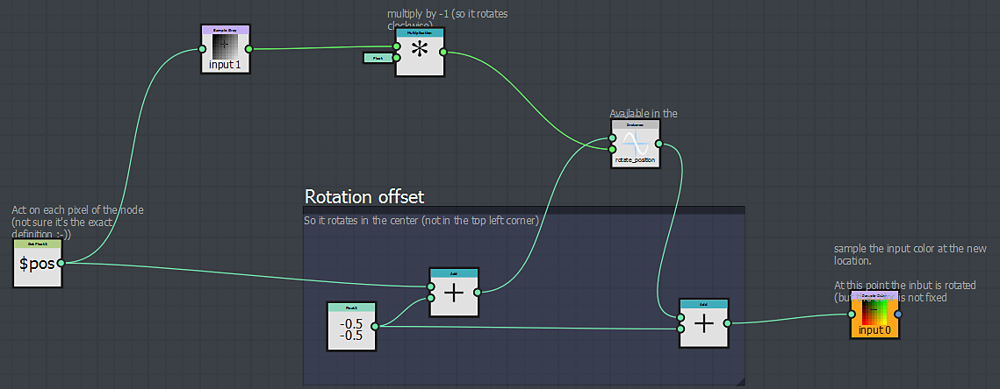
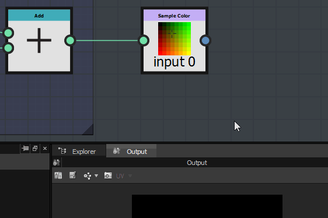

# Similarities with a Substance graph

At first sight, the Substance function graph is really similar to a Substance graph and the workflow is almost the same.

## Navigation is similar

In the Substance function graph, you can create and organize your nodes the same way you would do in a Substance graph.

you can access the nodes the same way:

* From the library
* by pressing space bar or Tab key
* by right-clicking and using the Add node menu

### Workflow is similar

Like in the Substance graph, you will build your function by chaining series of nodes, each of them using the result generated by the previous one(s).

The output will either define the value of a parameter or the output of the pixel processor node.

## Differences with a Substance graph

<table>
<tr style="border: 0;">
<td width="100.00%" style="border: 0;" valign="top">

### The nodes

The available nodes in the Substance function graph are completely different from the ones you would encounter in a Substance graph.

</td>
<td width="25.00%" style="border: 0;" valign="top">

</td>
</tr>
</table>

<table>
<tr style="border: 0;">
<td style="border: 0;" valign="top">

### The output

Contrary to Substance graphs, a function can have only one output.

Another point to note is that there is no specific output node where you plug your final result. Instead, you can directly flag as output, the node that generates the result you expect:

</td>
<td style="border: 0;" valign="top">

</td>
</tr>
</table>

#### How to define the output node?

To define the output, just right-click on the node that generates the expected output, and click on *Set as Output node:*

>[!WARNING]
>
> <b>Double check the generated result type</b>
> 
> If you notice that *Set as Output Node* is grayed out, it means that the value generated by the node is different than the value expected by the parameter or the pixel processor.

<table>
<tr style="border: 0;">
<td style="border: 0;" valign="top">

As for Substance graphs, you can import functions made in another graph. You can open the reference graph by right-clicking on it, and choose "Open Reference":

</td>
<td style="border: 0;" valign="top">

</td>
</tr>
</table>

If you have a sbs containing multiple functions, you can drag and drop it directly into a Substance function graph and choose the function you want to import in the appearing list:

