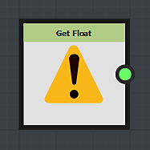
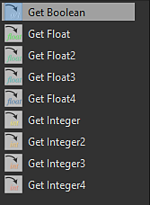
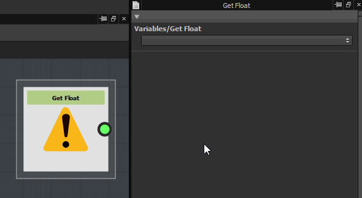

# Get a variable value

In order to use a variable in a function, you need to "call" it, meaning to need to import the value of the variable into the function.

To do so you need to use a *Get* node:

There is different kinds of Get nodes: choose the right one according of the type of value you want to import:

## Assign a variable to a Get node

By default, a get node will display a warning sign: it means that it is not linked to any variable yet.

To link a variable, go to the parameters, and choose one variable in "Variables/Get \*\*\*" list (\*\*\*will be replaced by the type of value your Get node can call).

The variable name will be displayed into the node:

Note that only the variables that are from the same type of the Get node will appear in the list.

>[!WARNING]
>
> Note that variables created with a *Set* node, will not appear in a *Get* node list.
> 
> But you can still get the variable by manually writing the name in the list.
> 
> Don't forget, that you can just call a variable created with a Set node, if :
> 
> * The Get and Set nodes are in function graphs controlling parameters of a same node
> * The parameter controlled by the *Get* node graph is either the same, or located below the parameter of the *Set* node graph, in the parameters stack..
