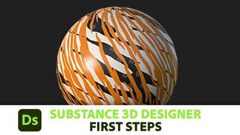
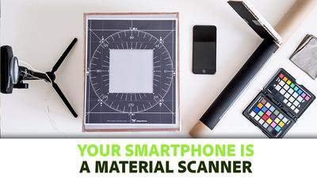

# Tutorials  learning

The documentation is mainly meant to be a thorough, technical reference. If you prefer to dive in with videos and other more focused learning material, these tutorials are good for getting started.

<table>
<tr style="border: 0;">
<td style="border: 0;" valign="top">

</td>
<td style="border: 0;" valign="top">

## First steps

Beginner-level series focused on taking your very first steps with Designer. Introduces the UI, basic concepts, then moves to core techniques and finally explains how to expose parameters and build a full material. It's short and focused, but keeps things light, making it the best start for absolute beginners.

</td>
</tr>
</table>

<table>
<tr style="border: 0;">
<td style="border: 0;" valign="top">

</td>
<td style="border: 0;" valign="top">

### Creating Your First Material

Large starter video series that takes you through the entire process of creating an extensive, fully procedural material. Every step of the process is covered and explained, so you will learn a lot upon completion, but can be intensive for absolute beginners.

</td>
</tr>
</table>

<table>
<tr style="border: 0;">
<td style="border: 0;" valign="top">

</td>
<td style="border: 0;" valign="top">

### Quicktips

Each quicktip video focuses on a bite-size set of nodes and techniques. We explain the result, the nodes as well as the most important parameters and then show you some ways to expand on the idea.

</td>
</tr>
</table>

<table>
<tr style="border: 0;">
<td style="border: 0;" valign="top">

</td>
<td style="border: 0;" valign="top">

### Your Smartphone is a Material Scanner

In-depth article that illustrates the entire process of taking photos and processing them using Designer. Serves as a good example usecase of how to use Substance 3D Designer to automate certain tasks.

</td>
</tr>
</table>
