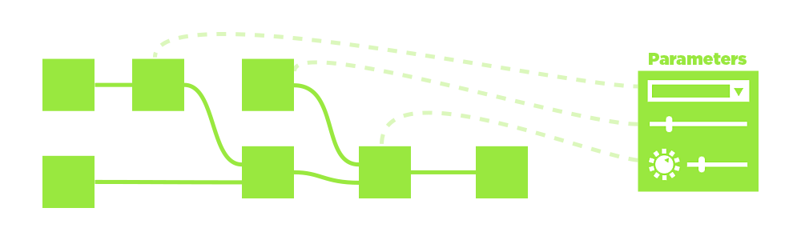
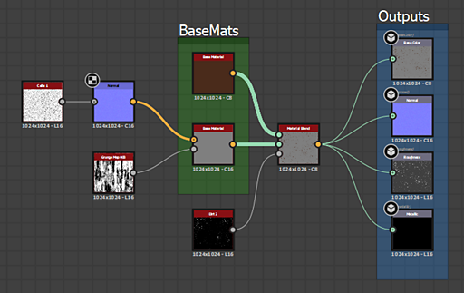

# Workflow overview

Substance 3D Designer is a Node-Based editor. That means almost every type of project or resource will involve placing nodes (building blocks) and connecting them to create a chain of operations (a Graph).This page explains the concept of Node-Based workflows, and provides a summary of the 3 main types of Graph you can author in Designer.

## Table of contents

[Node-based workflow](#node-workflow)

[Graph instance workflow](#instance-workflow)

[Custom parameters](#custom-parameters)

[Graph types](#graph-types)

## Node-based workflow

Working in Designer is different from other 2D image editing software such as Photoshop. Instead of performing an action manually (like adjusting saturation by going to a menu option and changing a slider), <b>you construct the logical steps</b> of editing or creating your image. This happens by building a network of little building blocks, called "[Nodes](https://helpx.adobe.com/substance-3d/unlisted/documentation/sddoc/nodes-reference-129368078.html)". Image data travels from<b> left to right</b> through the building blocks, connected by Links that determine the path of the information. Every Node, if connected, will contribute to the final results.

The major advantage is that your workflow becomes <b>non-linear</b>. Unlike actions performed manually that go into a history stack, you can always swap out or modify a Node at any point in time. If you decide that your very first Contrast adjustment, affecting the result of your image all the way to the end, was too much, then you can still go back and adjust it or even cut it out completely, without losing all the work you performed afterwards.

## Graph instance workflow

Instancing Graphs is a key process in Designer. It allows you to build your own nodes by taking any size or type of Graph and packaging it up as new Node building block. These types of Nodes are called "Graph Instances" This allows you to be much more efficient, save time and share work with others. Have you developed a great technique for edge wear for example? Create a Graph Instance out of it and re-use it yourself, share it with the community, or your team!

For more information about Graph Instances in [Substance graphs](../../compositing-graphs/substance-compositing-graphs.md), there is a [dedicated section](../../compositing-graphs/creating-compositing-gra/graph-instances-sub-gra/graph-instances-sub-graphs.md) about them in the documentation.

## Custom parameters

Any node in your chain of operations will have some form of control: buttons, sliders, settings for you to tweak, influencing the final result. If you create a Sub-Graph, or want to export your Substance File to another application, you can build your own "control panel" for your files, allowing anybody using the Graph to tweak and modify it with a fully unique control panel, exposing endless possiblities. [Learn about the general concept of custom parameters here](../../compositing-graphs/compositing-graph-key-con/substance-compositing-graph-key-concepts.md), or go more in depth and [start exposing parameters](../../compositing-graphs/manage-parameters/exposing-a-parameter/exposing-a-parameter.md).

## Graph types

Below you can find a summary of the three types of Graph you can edit in Substance 3D Designer, as well as a link to the relevant section of the documentation.

<table>
<tr style="border: 0;">
<td width="16.67%" style="border: 0;" valign="top">

[{width="120px"}](https://substance3d.adobe.com/)

</td>
<td width="100.00%" style="border: 0;" valign="top">

### Substance graphs

[Substance graphs](https://substance3d.adobe.com/) are the main type of graph created in Substance 3D Designer. Their purpose is to <b>generate and process 2D image data</b> that is not constrained to a set resolution, color or shape. They are meant as extremely versatile image-processing and generation tools, not just static, pre-set results.

The results can be in the form of a simple black-and-white pattern, a filter that only runs on other images and doesn't generate content by itself, or even a full-fledged procedural material with multiple channels.

Substance graphs are[ the most widely supported type of graph](../../getting-started/overview/overview.md), and can be exported and used in a plethora of different workflows.

</td>
</tr>
</table>

#### Examples

Below you can find some typical examples of common usecases.

+++Simple shape
{width="512px"}

A simple mask shape for a decal is created by generating[ a piece of text](../../compositing-graphs/nodes-reference-for-com/atomic-nodes/text/text.md) and a [disc shape](../../compositing-graphs/nodes-reference-for-com/node-library/texture-generators/patterns/shape/shape.md), [extracting the edge](../../compositing-graphs/nodes-reference-for-com/node-library/filters/effects/edge-detect/edge-detect.md) from the disc and the finally [blending them together](../../compositing-graphs/nodes-reference-for-com/atomic-nodes/blend/blend.md) before setting them as final [output](../../compositing-graphs/nodes-reference-for-com/atomic-nodes/output/output.md).

The Text with the number, or the thickness of the edge can be exposed externally to make this a more dynamic graph.

+++

+++Adjustment filter
{width="512px"}

A filter graph takes a normal map as [input ](../../compositing-graphs/nodes-reference-for-com/atomic-nodes/input/input.md)(with a custom preview), [converts it to curvature](../../compositing-graphs/nodes-reference-for-com/node-library/filters/effects/curvature-smooth/curvature-smooth.md) and then [adjusts the contrast](../../compositing-graphs/nodes-reference-for-com/node-library/filters/adjustments/histogram-scan/histogram-scan.md) to create a mask of convex edges as final [output](../../compositing-graphs/nodes-reference-for-com/atomic-nodes/output/output.md).

The contrast values set in the Histogram can be exposed, making this a simple but useful filter in combination with the dynamic Input slot.

+++

+++Full material
{width="512px"}

A more complicated graph[ blends two Base materials](../../compositing-graphs/nodes-reference-for-com/node-library/material-filters/blending-material/material-blend/material-blend.md). One[ Base material](../../compositing-graphs/nodes-reference-for-com/node-library/material-filters/pbr-utilities/base-material/base-material.md) is kept simple, the other uses some custom inputs to add interest. A mask is used to determine which of the two materials appear where before being set as final [outputs](../../compositing-graphs/nodes-reference-for-com/atomic-nodes/output/output.md).

This example makes use of [Link Creation Modes](../../interface/the-graph-view/link-creation-modes/link-creation-modes.md) to simplify using multiple links.

+++

<table>
<tr style="border: 0;">
<td width="16.67%" style="border: 0;" valign="top">

[{width="120px"}](https://substance3d.adobe.com/)

</td>
<td width="100.00%" style="border: 0;" valign="top">

### Substance function graphs

Functions <b>process single values</b> (integers, floats, vectors) instead of image data (whole sets of pixels). Functions are also Graphs with node networks, but the [Nodes used ](../../function-graphs/nodes-reference-for-fun/function-nodes-overview/function-nodes-overview.md)and the interface is different from [regular Substance graphs](../../compositing-graphs/substance-compositing-graphs.md). The workflow is completely based on <b>mathematical operations</b> and does not show any image preview thumbnails, making it a <b>much more advanced way to work</b> with Substance 3D Designer.

Functions can be used in many different contexts, the main ones being to modify the behaviour of [an exposed Parameter](../../compositing-graphs/manage-parameters/exposing-a-parameter/exposing-a-parameter.md), to author the behaviour of [Pixel Processors](../../compositing-graphs/nodes-reference-for-com/atomic-nodes/pixel-processor/pixel-processor.md) or [FX-Maps](../../compositing-graphs/nodes-reference-for-com/atomic-nodes/fx-map/fx-map.md) and to to use [Values in a Graph.](https://helpx.adobe.com/substance-3d/unlisted/documentation/sddoc/values-in-substance-3d-graphs-180192235.html)

</td>
</tr>
</table>

#### Examples

Below are some examples from common use cases for Substance function graphs.

+++Simple function
{width="256px"}

A simple function in the context of an exposed parameter. It gets an input float value called "Intensity" that is determined to go from 0 to 1 (a range easy to understand) and remaps it to a set range of 0.1 - 0.8. That means if the user sets Intensity ot 0, internally 0.1 will be used, if the Ui is set to 1, 0.8 wil be used, and any value in between will be interpolated linearly. This type of function is something commonly used when [exposing parameters](../../compositing-graphs/manage-parameters/exposing-a-parameter/exposing-a-parameter.md), but using custom functions.

This function could also be written as *lerp(0.1, 0.8, Intensity)* in a pseudocode similar to HLSL or GLSL.

+++

+++Advanced function
{width="512px"}

This advanced Function shows the inner workings of a [Pixel Processor](../../compositing-graphs/nodes-reference-for-com/atomic-nodes/pixel-processor/pixel-processor.md) meant for adjusting the Hue of a color map input based on the intensity of a second grayscale mask input.

It samples both inputs with the system "$pos" variable, then strips the Alpha, converts the color value to HSL and modifies the Hue component by multiplying it with the sampled grayscale value. Afterwards it re-assembles the vector, converts the HSL back to RGB and adds the Alpha back in for the final output.

in pseudo-code this would be a much more complicated function that would not fit on a single line.

+++

### MDL graphs

This page presents MDL graphs in Substance 3D Designer, which let you author MDL materials and preview their behavior in real time.
