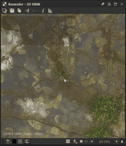
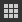
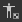
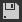
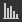
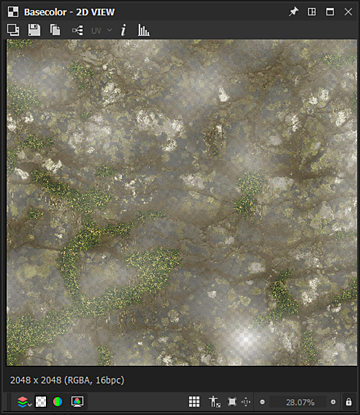
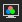
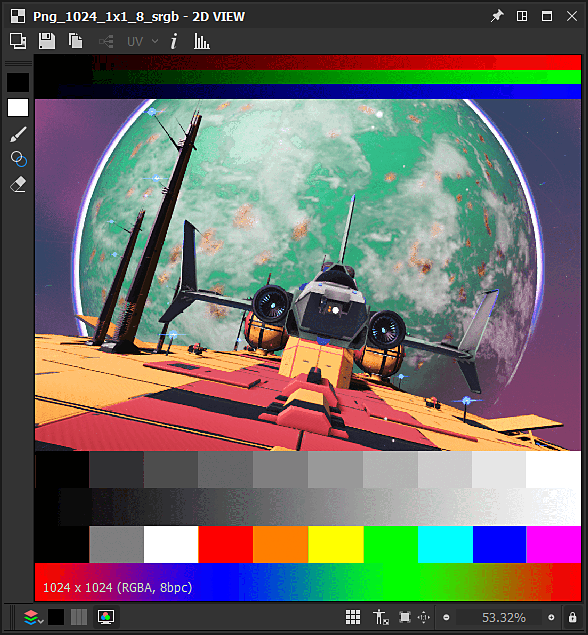

# 2D view

This pages describes the user interface and features of the **2D View** panel in Substance 3D Designer.

## Overview

The [2D View](https://substance3d.adobe.com/) is one of the main panels of Designer's user interface. Its main purposes are the following:

* displaying *value* or *image* output by a specified *node* or going through a specified *node connector*
* displaying [bitmaps](../../resources/bitmap-resource/bitmap-resource.md) and [vector graphics](../../resources/vector-graphics-svg-res/vector-graphics-svg-resource.md) [resources](../../resources/resources.md)
* displaying *additional information* about the content it currently holds, such as color channels or exact color values
* controlling parameters' *gizmos*

When a displayed image or value is modified, the 2D View *updates automatically* to stay in sync with the current state of the data.  
*Multiple* 2D View panels can be active at any time, and each can display different images or values. You can control when a new panel should be used by using the  <b>Pin</b> feature of the user interface panel.

### Displaying content in the 2D View

>[!WARNING]
>
> All mentions of actions made on *nodes* in this section only apply to [Substance graphs](../../compositing-graphs/substance-compositing-graphs.md).

The most straightforward way to display any image in the 2D View is to double-click *LMB*...

* ...on a [Bitmap](../../resources/bitmap-resource/bitmap-resource.md) or [vector graphics](../../resources/vector-graphics-svg-res/vector-graphics-svg-resource.md) resource in the [Explorer](../the-explorer-window/the-explorer-window.md)
* ...on a node or node connector in the [Graph View](../the-graph-view/the-graph-view.md)

Images can also be *dragged and dropped* directly into the viewport by holding *LMB* on a [resource](../../resources/resources.md) in the [Explorer](../the-explorer-window/the-explorer-window.md) panel, or *RMB* on a node in the Graph View.

In the Graph View, you can send an image to the 2D View using the <b>View output in 2D View</b> contextual menu option, which is accessed by clicking *RMB*...

* ...on a *node* to display *that node's output*. If the node has more than one output, select the desired output in the submenu
* ...on *empty space* in the Graph View to display *that graph's output*. If the graph has more than one output, select the desired output in the submenu

When loading a graph, its *first output* is automatically displayed in the 2D View by default. You can disable this behaviour in the [Preferences](../preferences-window/preferences-window.md). Go to <b>Edit &gt; Preferences &gt; Graph &gt; Substance compositing graph</b> and *uncheck* the <b>View output in 2D view when opening a graph</b> option.

## Viewport

The viewport is the *display area* of the <b>2D View</b>, and lets you *navigate* the displayed image using the following mouse and keyboard shortcuts:

<table>
<tr style="border: 0;">
<td style="border: 0;" valign="top">

* <b>Pan:</b> Ctrl+RMB / MMB
* <b>Zoom:</b> Alt+RMB / MouseWheel / 'Display scale' tool:  
  
* <b>Adjust to fit viewport:</b> F / 'Fit to view' button 
* <b>Adjust to 1:1 scale:</b> Z / 'Fit to scale' button 

</td>
<td style="border: 0;" valign="top">

</td>
</tr>
</table>

Using a trackpad (macOS only)

* <b>Pan: </b>Two-finger swipe
* <b>Zoom:</b> Two-finger pinch / Two-finger swipe while holding Cmd

>[!IMPORTANT]
>
> Unavailable actions
> 
> It is *not* possible to pan the image if the current display size of the image is *lower than the size of the viewport*.
> 
> It is *not* possible to zoom in/out of the image if the displayed content *does not exist anymore* – e.g. a image's reference node or resource was deleted.

>[!NOTE]
>
> Zoom direction
> 
> Each of the zooming methods is inverted with the other:
> 
> * Mouse wheel up *pulls* the image closer
> * Alt+RMB and drag up *pushes* the image away
> 
> The zoom direction can be inverted in the [Preferences](../preferences-window/preferences-window.md).

The image native *resolution*, *color format* and *bit depth* appear in the bottom left area of the viewport.

In addition to navigation, the viewport offers the following features:

* Tiled display: *repeats the image* in the viewport in a tiled pattern. This is useful for checking how a pattern or texture will repeat. It is enabled using the **Space bar** or  **Tiled display** button
* Physical size display: Displays the image with a *ratio* matching the [Physical size](../../compositing-graphs/graph-parameters/graph-parameters.md) property of the graph It is enabled using the  **Physical size ratio** button
* Keep view size: This option *locks the display scale* so it stays consistent throughout different images. It is *enabled by default* and can be disabled using the  **Keep view size** button

## Main toolbar

The main toolbar of the <b>2D View</b> panel lets you do more with your displayed images, and offers the following features:

+++Background image

You can *overlay a different image* on top of the currently displayed one. Press the  <b>Background Image</b> button and you will be prompted to select an image file to use as an overlay.

Once the file is selected, a new toolbar appears with the following controls for the image overlay:

<b>!&#91;&#93;(2d-view-icon-background-close.png) Close:</b> *close* the overlay controls toolbar and *disable* the background image overlay.

<b>!&#91;&#93;(2d-view-icon-background-loadpng.png) Load image:</b> select *another image file* to use as an overlay.

<b>!&#91;&#93;(2d-view-icon-background-0.png) Source image:</b> sets the overlay image to *0%* opacity.

<b>!&#91;&#93;(2d-view-icon-background-100.png) Background image:</b> sets the overlay image to *100%* opacity.

<b>!&#91;&#93;(2d-view-icon-background-50.png) Reset:</b> sets the overlay image to *50%* opacity.

A slider gives you *manual control* over the opacity of the overlay image.

+++

+++Export image

The image currently displayed can be *exported to an image file*. Press the  <b>Save Image...</b> button and you will be prompted to select an *location*, *name* and *file format* for the exported file.

While the image will be exported as its *native resolution* – which is displayed in the bottom left area of the viewport – the *bit depth* and *color format* will *depend on the image format* selected. For instance, 32-bit floating point precision images can only be exported at their full data range with image formats which support this precision, such as TIFF, EXR and HDR. If the image format does not support the data, clamping and/or color banding are likely to occur in the exported image.  
In general, be mindful of which precision and features are offered by the image formats you intend to use – floating point support, ICC profiles, etc.

If either <b>OCIO</b> or <b>Adobe ACE</b> [color management mode](../../color-management/color-management.md) is currently used, and additional option is available to select the *color space* of the exported image.

+++

+++Copy to clipboard

The image currently displayed can be *copied to the clipboard*. Press the  <b>Copy Image to Clipboard</b> button and the image will be ready to be pasted into any third party software, such as Adobe Photoshop.

The image will be copied as an *8-bit* precision image at its *native resolution*, which is displayed in the bottom left area of the viewport.

+++

+++Switch graph outputs

If the image currently displayed is a *graph output*, you can *quickly switch to any* other graph output using the  <b>Select output</b> button.

This feature is *not* available to other nodes, including nodes which have more than one output.

+++

+++UV overlay

If the <b>Display UVs in 2D View</b> option is enabled in the <b>Scene</b> menu of the [3D View](../3d-view/3d-view.md) dock, then the UV overlay feature is available in the 2D View.

You can enable it using the <b>UV</b> button. 

This displays the UVs of the mesh [currently selected in the 3D View](../3d-view/3d-view.md) as a colored wireframe.

If material color information is available in the mesh file, then the material color is used as the color of the UV overlay.

If the mesh has <b>multiple UV sets</b>, the desired UVs can be selected in the drop-down checklist which can be opened by clicking the arrow next to the 'UV' label in the button.

+++

+++Image information

You can display the *exact pixel values* *and coordinates* in an image with the <b>Information</b> panel, which is enabled using the  <b>Image Information</b> button. This is very helpful when inspecting HDR images, for instance, or making sure stepping between pixels follows the intended progression.

Colors are represented by <b>RGBA</b> and <b>HSV</b> values, and displayed depending on the *precision* of the image, as follows:

* <b>8-bit</b>: 0-255 integer / 0.0-1.0 floating point

* <b>16-bit</b>: 0-65532 integer / 0.0-1.0 floating point

* <b>16F</b> (16-bit floating point): raw floating-point value

* <b>32F</b> (32-bit floating point): raw floating-point value

Pixel coordinates are represented by <b>X</b> and <b>Y</b> values.

+++

+++Histogram

You can display the *histogram* of the image with the <b>Histogram</b> panel, which is enabled using the  <b>Display Histogram</b> button.

The following *histogram modes* are available:

* <b>Luminance</b>

* <b>Red</b>

* <b>Green</b>

* <b>Blue</b>

* <b>RGB</b>

* <b>Alpha</b>

The following information is listed below the modes:

* <b>Pixels</b>: the number of pixels in the image

* <b>Range</b>: the entire value range available

* <b>Used range</b>: the value range from the lowest value pixel to the highest

Additionally, you can click **LMB** on the histogram, or *hold* **LMB** and *drag* across the histogram to *select a specific portion* of the data. The following information is then displayed for this selection:

* **Selected pixels**: the number of pixels which have the selected values

* **Selected range**: the value range of the selected portion

* **Selected max**: the highest number of pixels which have a value included in the selected portion

The selection can be *cleared* by clicking **RMB** on the histogram.

How some of the values above are represented depends on the precision selected in the lower section of the panel, as follows:

* **8 bits**: 0-255 integer

* **16 bits**: 0-65532 integer

* **32 bits**: raw floating-point value

Some portions of the histogram may include very low pixel count values, and thus be challenging to read. In this case, you may enable the **square root** mode, using the **Sqrt** button, which uses the *square root of the actual values* to draw the histogram.

+++

## Display toolbar

The **Display** toolbar, which is located at the *bottom* of the **2D View** panel by default, lets you control how the image is displayed in the viewport.

The *leftmost* section includes controls for *color* and *transparency*, while the *rightmost* section includes the *viewport* controls detailed in the section of this page.

>[!NOTE]
>
> The toolbar can be *repositioned* around the **2D View** panel using the leftmost *handle* represented by three parallel lines.

{width="360px"}

### Color channels

You can display a single channel of the image using the  <b>Color channels</b> button. This opens a combo Box letting you select which of the <b>Red</b>, <b>Green</b>, <b>Blue</b> and <b>Alpha</b> channels should be displayed. The normal aspect of the image with all channels is restored by selecting the <b>RGB</b> option.

The following *keyboard shortcuts* can be used to quickly switch over to different color channels:

* RGB: <b>C</b>
* Red: <b>R</b>
* Green: <b>G</b>
* Blue: <b>B</b>
* Alpha: <b>A</b>

The *icon* of the <b>Color channels</b> button *changes* depending on the currently display channel(s).

>[!NOTE]
>
> Keyboard shortcuts can only be used if the 2D View panel has focus. You may click on this panel at least once to ensure this is the case.
> 
> Since the panel needs focus, these shortcuts *do not interfere* with any *custom shortcuts* you may have set for creating nodes in the graph – learn more about this feature [here](../preferences-window/preferences-window.md).

{width="360px"}

### Transparency toggle

Transparency display can be toggled on and off, using the / <b>Show checkerboard</b> button. When this is enabled, transparency is displayed using a checkerboard pattern.

There are two main ways to interpret transparency, which can be selected using the / <b>Transparency mode</b> button:

<b>!&#91;&#93;(2d-view-icon-transparency-straight.png) Straight:</b> transparency information is only stored in the alpha channel, and does not impact any other aspect of the image

<b>!&#91;&#93;(3d-view-icon-transparency-premultiplied.png) Premultiplied:</b> transparency information is stored in the alpha channel, and also impacts the RGB channels since they are effectively multiplied against the alpha channel

To display *correct colors*, the appropriate transparency mode should be selected in the <b>2D View</b> panel to match the transparency method which was applied when the image was *created*.

{width="360px"}

### Color space

For the most accurate representation of color, images are displayed by default in a *color space* which matches the one used by the *monitor*.

The available controls and the effect of the / <b>Color space</b> button will depend on the [Color management mode](../../color-management/color-management.md) set in the [Project settings](../preferences-window/project-settings/project-settings.md). Learn more about these controls in the section in this page.

<table>
<tr style="border: 0;">
<td style="border: 0;" valign="top">

## Bitmap painting tools

The <b>Bitmap painting tools</b> are available for [Bitmap resources](../../resources/bitmap-resource/bitmap-resource.md) matching these criteria:

* The bitmap uses *8-bit* precision
* The bitmap resource is *imported* into the package, linked images are *not* supported

>[!NOTE]
>
> *New* bitmap resources created within Substance 3D Designer will *automatically match* these criteria.

</td>
<td style="border: 0;" valign="top">

</td>
</tr>
</table>

>[!TIP]
>
> You can learn more in the [Bitmap painting editor](https://helpx.adobe.com/substance-3d/unlisted/documentation/sddoc/bitmap-painting-editor-102400057.html) page of the documentation.

<table>
<tr style="border: 0;">
<td style="border: 0;" valign="top">

## Vector graphics editor

The <b>Vector graphics editor</b> is available for *imported* [SVG resources](../../resources/vector-graphics-svg-res/vector-graphics-svg-resource.md), linked resources are *not* supported.

>[!NOTE]
>
> *New* SVG resources created within Substance 3D Designer will *automatically match* this criterion.

</td>
<td style="border: 0;" valign="top">

</td>
</tr>
</table>

>[!TIP]
>
> You can learn more in the [Vector Graphic Editor (deprecated)](https://helpx.adobe.com/substance-3d/unlisted/documentation/sddoc/vector-graphic-editor-deprecated-102400059.html) page of the documentation.

{width="360px"}

## Color management

The <b>2D View</b> offers simple *color management* controls to let you choose which *display color space* should be used when displaying the image.

These controls will adapt to the current [Color management mode](../../color-management/color-management.md) set in the [Project settings](../preferences-window/project-settings/project-settings.md), as follows:

* <b>Legacy:</b> you can disp.lay the image in the  sRGB or  Linear sRGB color spaces;
* <b>Adobe ACE:</b> you can  *enable* color management and set the most appropriate color space for the *current monitor* as detected by the Adobe ACE engine, or  *disable* color management and display the image using the Raw color values;
* <b>OCIO:</b> you can  *enable* color management and set the most appropriate one for the *current monitor* as detected by the OCIO engine, use the combo box and select any of the *display color spaces* available in the [OCIO configuration file](../../color-management/color-management.md) currently used, or  *disable* color management and display the image using the Raw color values.

>[!WARNING]
>
> Be mindful that these controls *only* impact the *display color space*. The *original color space* of images and the *working color space* should also be taken into account to make sure colors are displayed accurately in the **2D View**.

>[!TIP]
>
> Go to the [Color management](../../color-management/color-management.md) section of this documentation to learn more about this feature and its broader implementation in Designer.
