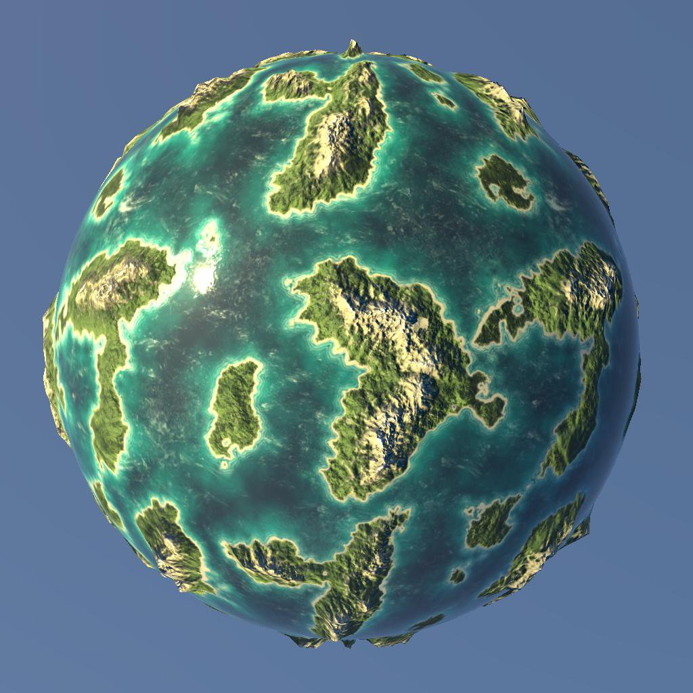

# 3D renderers

The 3D View offers four renderers:

* Two versions of Adobe's in-house 3D renderer: Rasterizer for real-time visualization with support for shadows, and GPU Pathtracer for accurate rendering of shadows, reflections, complex material properties and more.
* Two deprecated third-party renderers: OpenGL and NVIDIA's Iray.

>[!NOTE]
>
> Keep graphics drivers up to date!
> 
> The new 3D renderers are regularly upgraded and some of these upgrades require recent GPU drivers. Please update your system's GPU drivers to the latest version for the best reliability and support of rendering features.
> 
> You may find drivers here:&nbsp;&nbsp;&nbsp;&nbsp;[NVIDIA](https://www.nvidia.com/Download/index.aspx?lang=en-us)&nbsp;&nbsp;&nbsp;&nbsp;[AMD](https://www.amd.com/en/support)&nbsp;&nbsp;&nbsp;&nbsp;[Intel](https://downloadcenter.intel.com/product/80939/Graphics-Drivers)

+++ Rasterizer / GPU pathtracer comparison

<table>
  <tr>
    <td>
      
       <i>Before</i>
    </td>
    <td>
      
       <i>After</i>
    </td>
  </tr>
</table>

+++

Adobe's 3D renderer is built from the ground up to support modern technologies such as [MaterialX](https://materialx.org/) shading language and the [USD](https://openusd.org/release/index.html) scene description, and is poised to offer full visual consistency across the entire Substance 3D ecosystem.

Thanks to its reliance on USD, it can leverage Adobe's [USDFileFormat plugin](https://github.com/adobe/USD-Fileformat-plugins) to import many 3D scene formats, such as FBX and GLTF, and render these scenes fully, including materials, textures, cameras and lights.

+++ Scene import: Rasterizer vs. OpenGL

<table>
  <tr>
    <td>
      
       <i>Before</i>
    </td>
    <td>
      
       <i>After</i>
    </td>
  </tr>
</table>

+++

>[!TIP]
>
> You can select the renderer used by default when starting a new 3D View in the ["3D view" section of the project settings](../../../interface/preferences-window/project-settings/project-settings.md).

## Rasterizer

+++ Parameters

|                                                                 |                                                                                                                                                                                                                                                                             |
|-----------------------------------------------------------------|-----------------------------------------------------------------------------------------------------------------------------------------------------------------------------------------------------------------------------------------------------------------------------|
| **Samples** Float                                             | Specifies the number of pixel samples to compute before the image is considered to be converged.                                                                                                                                                                            |
| **Ambient occlusion opacity** Float                           | Specifies the value of the ambient occlusion opacity.                                                                                                                                                                                                                       |
| **Enable displacement** Boolean                               | Specifies whether displacement should be enabled.                                                                                                                                                                                                                           |
| **Displacement threshold** Float                              | Sets up a threshold to enable/disable GPU tessellation.                                                                                                                                                                                                                     |
| **Enable backface culling** Boolean                           | A true value will enable the culling of triangle meshes that have normals that face away from the camera. A false value will disable backface culling.                                                                                                                      |
| **Diagnostic mode** Integer                                   | Dictates the diagnostic mode to render.                                                                                                                                                                                                                                     |
| **Rasterizer shadow mode** Integer                            | Specifies the technique to use to render shadows:<ul data-preserve-html="true"> <li data-preserve-html="true"><i>No shadows:</i> No shadows will be rendered.</li> <li data-preserve-html="true"><i>Voxel marched:</i> March shadow rays into a voxelized scene.</li> </ul> |
| **Rasterizer shadow sample count** Integer                    | Specifies how many shadow rays are traced per pixel.                                                                                                                                                                                                                        |
| **Rasterizer shadow opacity** Float                           | Specifies the opacity of shadows, from 0.0 (no shadows) to 1.0 (fully shadows).                                                                                                                                                                                             |
| **Rasterizer order independent transparency enabled** Boolean | Does not account for the order of the transparent surfaces when rendering them. This sacrifices some accuracy for faster rendering of transparent surfaces.                                                                                                                 |
| **Enable rasterizer SSS** Boolean                             | Toggles the subsurface scattering effect.                                                                                                                                                                                                                                   |
| **Rasterizer SSS sample count** Integer                       | Specifies how many samples are taken per pixel for rendering subsurface scattering.                                                                                                                                                                                         |
| **Enable rasterizer accumulation antialiasing** Boolean       | Toggles accumulation antialiasing, which improves the smoothness or edges in the rendered image by jittering renders and computing the local average color of each pixel, cumulatively. I.e., it accumulates values to compute an average from.                             |
| **Rasterizer voxel grid resolution** Integer                  | Dictates the resolution of the voxel grid used in voxel marching the rasterizer.   Higher values result in more precise shadows at the cost of performance.                                                                                                                 |
| **Rasterizer IBL runtime sample count** Integer               | Specifies how many samples are used to compute the specular reflections from IBL when the technique is set to `runtimeSampled`.                                                                                                                                  |

+++

+++ Ground plane

|                               |                                                                                                                                                              |
|-------------------------------|--------------------------------------------------------------------------------------------------------------------------------------------------------------|
| **Enabled** Boolean        | Toggles the ground plane in the rendered scene.                                                                                                              |
| **Height** Float           | Controls the height offset of the ground plane.   If authored, the value is expected to have the appropriate bias baked in, based on the scale of the scene. |
| **Shadow intensity** Float | When shadows are enabled, controls the opacity of the shadows cast on the ground plane, from 0.0 (no shadows) to 1.0 (full shadows).                         |

+++

{zoomable="yes"}

## GPU Pathtracer

+++ Parameters

|                                                     |                                                                                                                                                                                                                                                                                                                                                                                                                                                                                                                                                                                                                                                                                                                               |
|-----------------------------------------------------|-------------------------------------------------------------------------------------------------------------------------------------------------------------------------------------------------------------------------------------------------------------------------------------------------------------------------------------------------------------------------------------------------------------------------------------------------------------------------------------------------------------------------------------------------------------------------------------------------------------------------------------------------------------------------------------------------------------------------------|
| **Samples** Float                                | Specifies the number of pixel samples to compute before the image is considered to be converged.                                                                                                                                                                                                                                                                                                                                                                                                                                                                                                                                                                                                                              |
| **Enable displacement** Boolean                  | Specifies whether displacement should be enabled.                                                                                                                                                                                                                                                                                                                                                                                                                                                                                                                                                                                                                                                                             |
| **Displacement threshold** Float                 | Sets up a threshold to enable/disable GPU tessellation.                                                                                                                                                                                                                                                                                                                                                                                                                                                                                                                                                                                                                                                                       |
| **Enable backface culling** Boolean              | A true value will enable the culling of triangle meshes that have normals that face away from the camera. A false value will disable backface culling.                                                                                                                                                                                                                                                                                                                                                                                                                                                                                                                                                                        |
| **Pixel cycling type** Integer                   | Specifies the technique to use to lower compute resolution for interactive rendering:<ul data-preserve-html="true"> <li data-preserve-html="true"><i>No cycling:</i> Disables pixel cycling and computes each full pixel sample.</li> <li data-preserve-html="true"><i>Device optimal:</i> Selects the ideal pixel cycling resolution based on the device used for rendering.</li> <li data-preserve-html="true"><i>4x4:</i> Samples 1/16th of the pixels per cycle pass.</li> <li data-preserve-html="true"><i>8x8:</i> Samples 1/64th of the pixels per cycle pass.</li><li data-preserve-html="true"><i>Blue noise:</i> Samples adaptively a number of pixels and splat them to target an objective frame rate.</li> </ul> |
| **Diagnostic mode** Integer                      | Dictates the diagnostic mode to render.                                                                                                                                                                                                                                                                                                                                                                                                                                                                                                                                                                                                                                                                                       |
| **View background through transmission** Boolean | A true value enables the background image to be seen through transmissive or refractive objects.   When this is false, transmissive objects will show the refracted image of the scene environment.                                                                                                                                                                                                                                                                                                                                                                                                                                                                                                                           |

+++

+++ Ground plane

|                                    |                                                                                                                                                                  |
|------------------------------------|------------------------------------------------------------------------------------------------------------------------------------------------------------------|
| **Enabled** Boolean             | Toggles the ground plane in the rendered scene.                                                                                                                  |
| **Height** Float                | Controls the height offset of the ground plane.   If authored, the value is expected to have the appropriate bias baked in, based on the scale of the scene.     |
| **Shadow intensity** Float      | When shadows are enabled, controls the opacity of the shadows cast on the ground plane, from 0.0 (no shadows) to 1.0 (full shadows).                             |
| **Enable local lights** Boolean | Controls whether direct lighting from local lights contributes to shadow catchers.                                                                               |
| **Enable reflections** Boolean  | Controls the visibility of all reflections on the ground plane.                                                                                                  |
| **Reflections opacity** Float   | When reflections are enabled, controls the opacity of the reflections, between 0.0 (no reflections) to 1.0 (full reflections).                                   |
| **Reflections roughness** Float | When reflections are enabled, controls the material roughness of the ground plane contributing to the reflections, from 0.0 (fully glossy) to 1.0 (fully rough). |

+++

{zoomable="yes"}

## OpenGL

The OpenGL renderer offers fast real-time rendering, with a few shaders available by default depending on your use case: see the list below.

+++ OpenPBR

A material model with growing support backed by major industry actors, including Adobe, and with the broadest feature set.

Two techniques are available for visualizing height:

<b>Parallax Occlusion</b> - Fakes height displacement without modifying geometry through localized UV deformation and occlusion.

<b>Tesselation + Displacement</b> - Subdivides geometry and displaced the vertices along their normals.

Learn more about OpenPBR in Designer [here](../material-properties/material-properties.md#openpbr).

+++

+++ Adobe Standard Material

Adobe's standardized shader. Ensures correct looks between al Adobe Substance 3D applications and supports a wide set of features.

Two techniques are available for visualizing height:

<b>Parallax Occlusion</b> - Fakes height displacement without modifying geometry through localized UV deformation and occlusion.

<b>Tesselation + Displacement</b> - Subdivides geometry and displaced the vertices along their normals.

The Adobe Standard Material is documented in detail in [this section](https://experienceleague.adobe.com/en/docs/substance-3d/general-knowledge/asm/adobe-standard-material) of our documentation.

+++

+++ AxF SVBRDF

A shader dedicated for visualising materials extracted from [AxF files](../../../resources/axf-appearance-exchange/axf-appearance-exchange-format.md) and using the <b>SVBRDF</b> representation.

Two techniques are available for visualizing height:

<b>Parallax Occlusion</b> - Fakes height displacement without modifying geometry through localized UV deformation and occlusion.

<b>Tesselation + Displacement</b> - Subdivides geometry and displaced the vertices along their normals.

This shader is currently a *work in progress* and provides an overview of the materials' characteristics, but should not be used for fine adjustments and some features are still unsupported.

+++

+++ Blinn

"Old - generation", non-PBR correct shader. Uses Diffuse, Specular and Glossiness channels next to standard channels like Opacity, Height and Normal.

Two techniques are available for visualizing height:

<b>Parallax Occlusion</b> - Fakes height displacement without modifying geometry through localized UV deformation and occlusion.

<b>Tesselation + Displacement</b> - Subdivides geometry and displaced the vertices along their normals.

+++

+++ Lambert

Very simple lambert lighting shader, only supports Diffuse channel. Uses the old point lights system, does not support HDR image lighting.

+++

+++ Mesh Info

Debug unlit shader to visualize the following geometry data:

* Normal

* Tangent

* Binormal

* UV

* UV Tile

* Vertex color

* Position (world space)

The visualization is clamped to &#91;0, 1&#93;. It is therefore not possible to acquire a direct reading of values outside of that range on the screen.

+++

+++ Metallic roughness

Standard PBR material for the Metallic Roughness model. Uses Base color, Metallic and Roughness channels.

Two techniques are available for visualizing height:

<b>Parallax Occlusion</b> - Fakes height displacement without modifying geometry through localized UV deformation and occlusion.

<b>Tesselation + Displacement</b> - Subdivides geometry and displaced the vertices along their normals.

+++

+++ Metallic roughness - Coated

Coated PBR material for the Metallic Roughness model. Uses Base color, Metallic and Roughness channels as well as extra "Coat" channels.

Two techniques are available for visualizing height:

<b>Parallax Occlusion</b> - Fakes height displacement without modifying geometry through localized UV deformation and occlusion.

<b>Tesselation + Displacement</b> - Subdivides geometry and displaced the vertices along their normals.

+++

+++ Metallic roughness - SSS

Sub-Surface-Scattering PBR material for the Metallic Roughness model. Uses Base color, Metallic and Roughness channels as well as extra Scattering channel.

Two techniques are available for visualizing height:

<b>Parallax Occlusion</b> - Fakes height displacement without modifying geometry through localized UV deformation and occlusion.

<b>Tesselation + Displacement</b> - Subdivides geometry and displaced the vertices along their normals.

+++

+++ Specular glossiness

Standard PBR material for the Specular Glossiness model. Uses Diffuse, Specular and Glossiness channels.

Two techniques are available for visualizing height:

<b>Parallax Occlusion</b> - Fakes height displacement without modifying geometry through localized UV deformation and occlusion.

<b>Tesselation + Displacement</b> - Subdivides geometry and displaced the vertices along their normals.

+++

+++ Unlit

Unlit debug shader to visualize texture maps without any lighting. Only uses a 'color' channel.

+++

Designer also offers the possibility to configure your own shaders for the OpenGL renderer [using GLSLFX files](../../../interface/3d-view/glslfx-shaders/glslfx-shaders.md).

>[!IMPORTANT]
> 
> This renderer is **deprecated**: It will not receive new features and will be retired in a future version of Designer.

{zoomable="yes"}
