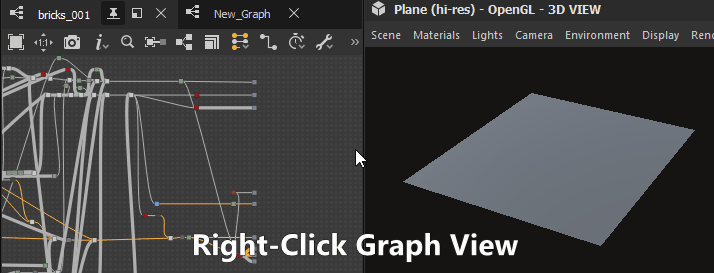
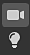

# 3D view

The 3D View helps you view and understand your materials with custom meshes and rendered PBR materials.

Like with all Substance 3D Designer Windows, it works together with other windows through right-click menu options and drag-and-drop operations. The 3D view also provides two main methods of rendering: fast, realtime OpenGL visualisation, with fluent smooth interaction, [and high-quality raytraced renders with Iray](iray/iray.md).

## Viewport interactions

The section below explains you how to do common actions in short, along with an animated gif to illustrate the process.

### navigation

The 3D View camera and environment may be manipulated in three ways:

* <b>Orbit:</b> LMB+Drag
* <b>Pan</b>: MMB+Drag / Ctrl+RMB+Drag
* <b>Zoom</b>: Scroll using MouseWheel / RMB+Drag
* <b>Rotate environment:</b> ⇧+RMB+Drag
* <b>Focus on a selected mesh:</b> F (focuses on entire scene if there is no selection)
* <b>Orbit point light 1:</b> Ctrl+⇧+LMB+Drag
* <b>Move point light 1 closer to/away from origin:</b> Ctrl+⇧+RMB+Drag
* <b>Reset camera orbit position:</b> R
* <b>Reset camera orbit position and properties:</b> ⇧+R

Using a trackpad (macOS only)

* <b>Orbit:</b> Two-finger swipe
* <b>Pan:</b> ⇧+Two-finger swipe
* <b>Zoom: </b>Two-finger pinch / ⌘+Two-finger swipe
* <b>Rotate environment:</b> ⇧+Two-finger swipe

>[!NOTE]
>
> Zoom direction
> 
> Each of the zooming methods is inverted with the other:
> 
> * Mouse wheel up *pulls* the scene closer
> * RMB and drag up *pushes* the scene away
> 
> The zoom direction can be inverted in the [Preferences](../preferences-window/preferences-window.md).

### Select and focus

You can interact with meshes directly in the viewport:

<b>Hold ⇧ and click LMB on a mesh to select a mesh.</b> Selected meshes have a blue outline.

<b>Press F to focus on a selected mesh</b>. Focusing a mesh moves the camera to frame it and orbit around it.

<b>Click RMB while a mesh is selected</b> to access its  in a contextual menu.

<b>Press Escape to unselect.</b> The cursor does not need to be on the mesh.

{zoomable="yes"}

*Select, focus, unselect*

{zoomable="yes"}

*Select, contextual menu*

>[!NOTE]
>
> These actions are not available for the deprecated [OpenGL](3d-renderers/3d-renderers.md) and [Iray](3d-renderers/3d-renderers.md) renderers.

### CHANGING THE environment LIGHTING

Designer works with image-based lighting (IBL) by default. A high-dynamic range bitmap is used to render environment lighting.

You can rotate this environment around your 3D object, or you can load either preset, or custom HDR light environments. Please note that your HDR images shoud use an equirectangular projection and have a precision of 32-bit floating point.

⇧+RMB+Drag <b>rotates the environment</b> in the 3D view.

To set a precise rotation, use <b>Environment &gt; Edit</b> in the top 3D View toolbar and change the <b>Rotation angle</b> slider in the properties window.

To use a preset HDR light environment, click the<b> HDRI environments</b> section of the <b>3D View category </b>in the [Library](../the-library/the-library.md), and then drag and drop any of the icons to the 3D view.

To use your own, custom HDR light environment, import an HDR image by dragging and dropping the file into a package in the Explorer Window (<b>Link</b> the file when prompted). Then drag and drop the resource, choose <b>Latitude/Longtitude Panorama</b> as the target.

### Point lights

Go to <b>Lights &gt; Edit properties</b> to toggle point lights in your scene.

Point light 1 can be moved around the scene's origin by holding LMB or RMB and dragging in the viewport in Lighting mode. 

While in Camera mode , you can also temporarily switch to Lighting mode by hold the Ctrl+⇧ keys in combination with the mouse buttons.

## View data in 3D View

### Substance graphs

You can view entire materials as a complete material in the 3D View. This is the most common way to work, and will match the [usage attributes on output nodes](../../compositing-graphs/nodes-reference-for-com/atomic-nodes/output/output.md) , to the relevant texture slots of the 3D view material. That means your outputs need to be set correctly (using Templates ensures this is the case), and that you selected material/viewport shader supports

You view all of a graph's outputs by clicking *RMB* an emtpy area in the [Graph view](../the-graph-view/the-graph-view.md), and choosing the **View Outputs in 3D View** option in the contextual menu.

You can also view a graph's outputs without having to open it, by clicking RMB on a graph resource in the [Explorer](https://helpx.adobe.com/substance-3d/unlisted/documentation/sddoc/the-explorer-129368147.html) dock and choosing the **View Outputs in 3D View** option in the contextual menu.

As an alternative to the graph's contextual menu, you can achieve the same result by dragging the graph from the [Explorer](https://helpx.adobe.com/substance-3d/unlisted/documentation/sddoc/the-explorer-129368147.html) dock to the [3D View](https://substance3d.adobe.com/).

When *loading a graph*, its outputs are automatically applied in the 3D View by default. You can disable this behaviour in the [Preferences](../preferences-window/preferences-window.md). Go to **Edit &gt; Preferences &gt; Graph &gt; Common** and uncheck the **View outputs in 3D view when opening a graph** option.

>[!NOTE]
>
> **Multiple Material Slots**
> 
> If you use custom meshes with more than one single material, you'll be asked to choose what material slot to assign the material to. With any of the above methods, click a slot to confirm your choice. For more information on Materials an their assignment, read the detailed section below.

### <b> Individual node/graph output</b>

You can view just a single output in any available material channel in the [3D View](https://substance3d.adobe.com/). This is less commonly used, but good for previewing quick tests or individual nodes with no output.

You can view any node, not just output nodes, by right clicking it in the [Graph view](../the-graph-view/the-graph-view.md), and choosing <b>View in 3D View</b>. You'll be shown a list with available channels to assign the node to. Click any to confirm.

You can also use *RMB* to drag and drop any node from the Graph view to the 3D View. You'll be shown a list with available channels to assign the node to. Click any to confirm.

You can view any individual graph output by expanding the graph resource in the [Explorer](https://helpx.adobe.com/substance-3d/unlisted/documentation/sddoc/the-explorer-129368147.html) dock, and using *LMB* to drag that output to the 3D View. You will be shown a list with available channels to assign the node to. Click any to confirm.

## View (custom) 3D scenes

Designer offers a dozen preset meshes. These meshes have uniform, useable UV coordinates and serve most scenarios for tiling textures. Importing and viewing your own 3D meshes is also possible.  
Pick any of the default meshes through the <b>Scene</b> dropdown menu in the top bar.

For custom 3D scenes, go to the [Working with 3D scenes](../../working-with-3d-scenes/working-with-3d-scenes.md) section.

## Change shader properties

There are a few different [shaders](../../glossary/glossary.md) available by default in Designer, and each shader has options beyond just texture channels. They can be configured individually.

Keep in mind shaders are different across Designer's [3D renderers](3d-renderers/3d-renderers.md) and only settings marked with a 'Common' label will carry over when switching renderers.

To change the current shader, go to<b> &#39;</b>Materials' menu then open the submenu for the material you wish to edit.

For example, to adjust the 'Height scale' property for the 'Default' material in the 'Plane (hi-res)' scene, go to 'Materials &gt; Default &gt; Edit properties'. Then find the 'Height scale' property in the Properties dock.

Shaders can be reset using the 'Reset material' or 'Reset to scene state' actions in the submenu. If you were viewing Substance graph outputs in the 3D view, you will need to reapply them again.

>[!NOTE]
>
> About tessellation
> 
> The 'Tessellation factor' property varies according to the selected 3D renderer:
> 
> * <b>Rasterizer/GPU Pathtracer:</b> Located in the renderer settings (Renderer &gt; Edit settings), impacts the *entire scene*.
> * <b>OpenGL:</b> Located in the material properties, impacts the material.
> * <b>Iray:</b> Located in the mesh properties (Select a mesh element in the [Scene browser](scene-browser/scene-browser.md)), impacts the mesh.

## Export scene

Learn about exporting 3D scenes in [this page](../../working-with-3d-scenes/exporting-scenes/exporting-scenes.md).

### Export tessellated mesh (OpenGL renderer only)

You can export the mesh from the <b>3D View</b> to a file in the <b>OBJ</b>, <b>FBX</b> or <b>PLY</b> formats. If *tessellation* displacement is enabled, the subdivision of the geometry is baked into the exported mesh.

However, the vertex normals of the original mesh may not match its new displaced shape, which means the displaced mesh may not render correctly. You can manage this in two ways:

* Use the mesh *normal map* which will provide the correct normals
* *Recompute the mesh normals* on export using the mesh normal map, which means these normals are baked into the exported mesh and the normal map is no longer necessary

To export the 3D View mesh, go to <b>Scene &gt; Export tessellated mesh...</b>, set your choice regarding normals recomputation, then select a location, name and file format for the exported mesh.

>[!NOTE]
>
> This feature is *not available* on **macOS**.

>[!IMPORTANT]
>
> A few caveats
> 
> If the original mesh has multiple materials and/or UV sets, these will be *merged into one*.
> 
> The duration of the export process and resulting file size depend on the mesh triangle count and *tessellation factor*. High tessellation factor values can result in instability depending on the GPU's onboard memory pool.
> 
> That being said, the vertex count of the tessellated mesh should be in the *same range* as the pixel count of the *height* map.
> 
> Having a mesh more dense than the height map can make for a slightly smoother mesh when using <b>Phong</b> tessellation, yet you should aim for reliably getting the mesh exported with the required height map detail first, and then refining the exported mesh in other software if needed.

>[!WARNING]
>
> **TDR (Windows only)**
> 
> This feature requires that the <b>Timeout Detection and Recovery (TDR)</b> match the recommended values in [this page](https://helpx.adobe.com/substance-3d-painter/technical-support/technical-issues/gpu-issues/gpu-drivers-crash-with-long-computations-tdr-crash.html) of our documentation, as stated in Designer's [Technical requirements](../../getting-started/system-requirements/system-requirements.md).

## Menu bar

The menu bar provides 7 menus with options related to the 3D View. below is an overview of all options available.

+++Scene
The <b>Scene</b> menu deals with the geometry (3D Resource) shown and with 3D view states. 3D Resource sare just the mesh, Scene states are lights, camera, and related settings, and can also contain the mesh alongside.

<b>Edit: </b>Loads scene options in the [Properties](../properties/properties.md) panel. Lets you toggle visibility of the 3D Mesh.

<b>Standard primitives:</b> Shows any of the below simple 3D meshes in the 3D View.

* Cube

* Cylinder

* Hollow Box

* Inner Box

* Plane

* Plane (hi-res)

* Sphere

<b>Extended primitives:</b> Shows any of the below 3D meshes in the 3D View.

* Cloth

* Mat Ball

* Rounded Cube

* Rounded Cylinder

* Sphere 2 tiles

* Torus

<b>Display UV&#39;s in 2D View:</b> Enables the display of the UVs for the as an overlay in [the 2D View](https://helpx.adobe.com/substance-3d/unlisted/documentation/sddoc/2d-view-deprecated-129368155.html) .

<b>Create 3D resource from current scene...:</b> Creates a new [3D scene resource](../../resources/3d-scene-resource/3d-scene-resource.md) in a package out of the current scene.

<b>Load state file...: </b>Loads an externally saved [scene state file](../../working-with-3d-scenes/working-with-3d-scenes.md) (\*.sbsscn). Does not replace the 3D mesh, only loads settings for 3D renderer, camera and lights.

<b>Load state file with mesh...:</b> Loads an externally saved [scene state file](../../working-with-3d-scenes/working-with-3d-scenes.md) (\*.sbsscn). Loads settings for 3D renderer, camera, lights, along with its references 3D scene. .

<b>Save state file...: </b>Save the current state of the 3D view to a [scene state file](../../working-with-3d-scenes/working-with-3d-scenes.md) (\*.sbsscn).

<b>Save current state as default: </b>Set the current state of the 3D view as as a [scene state file](../../working-with-3d-scenes/working-with-3d-scenes.md) to be used by default when creating new 3D Views. This file is loaded every time the 3D view is reset or intialised, and can be set in the [Project settings](../preferences-window/project-settings/project-settings.md).

<b>Export scene:</b> *(Rasterizer/GPU Pathtracer renderers only)* Exports the current scene as a [flattened scene](../../working-with-3d-scenes/exporting-scenes/exporting-scenes.md), where only the result scene is written and any references to the original scene are lost. The contents of the exported scene depend on the features supported by the selected export format.  
Available formats: STL, FBX, GLB, GLTF, PLY, USDC, USD, USDA, USDZ, OBJ.

<b>Export scene with layers:</b> *(Rasterizer/GPU Pathtracer renderers only)*Exports the current scene as a [layered scene](../../working-with-3d-scenes/exporting-scenes/exporting-scenes.md), where all edits to the original scene are saved to separate files in a non-destructive workflow. This is only available for USD file formats.  
Available formats are: USDC, USD, USDA.

<b>Export tessellated geometry:</b> *(OpenGL renderer only)* Exports the current scene with tessellation as raw geometry, see section.

<b>Reset scene: </b>Resets the 3D view to default.

Some software updates can change the way Scene state files are saved/loaded.

If the scene is *not restored correctly* from the file, it is recommended to manually set the desired state of the scene, and *reexport* the Scene state file.

+++

+++Materials
The <b>Materials</b> menu changes based on the 3D mesh loaded and the renderer used. [For Iray rendering, see the Iray page.](iray/iray.md)

The 'Materials' menu features a list of all materials assigned to a mesh in the scene. Each material listed in the 'Materials' menu has a submenu of material actions:

<b>Edit</b> - Edit settings of the current material in the Properties window.

<b>Shaders list</b> - All [shaders](../../glossary/glossary.md) available for the current [3D renderer](3d-renderers/3d-renderers.md).

<b>Load Definition...: </b>(OpenGL renderer only) Lets you load your own custom [GLSLFX shader.](glslfx-shaders/glslfx-shaders.md) The shader is added into the list above.

<b>Reset common parameters:</b> Resets all parameters that are common across shaders. For instance, when switching between the OpenGL and Iray renderers, several parameter values in the [Adobe Standard Material](https://helpx.adobe.com/substance-3d-general/adobe-standard-material.html) are carried across.

<b>Rename:</b> Change the label for this material.

<b>Reset material:</b> Resets all shader parameters to their default values. If textures are connected to any of the shader's samplers, they are disconnected.

<b>Reset material to scene state: </b>*(Rasterizer/GPU Pathtracer renderers only)* Resets all properties for [overridden materials](../../working-with-3d-scenes/overriding-scene-mat/overriding-scene-materials.md) to their original values from the scene, including original textures if any.

<b>Add: </b>Adds a new material to the list. It is unused by default and may be [connected to a scene material](../../working-with-3d-scenes/overriding-scene-mat/overriding-scene-materials.md) using the [Scene browser](scene-browser/scene-browser.md).

+++

+++Lights
The <b>Lights</b> menu only deals with older, legacy ambient and point lights. These lights are not PBR-compliant and do not give the same high-quality results as HDR image based rendering.

<b>Edit:</b> edit individual settings for the ambient light and the two point lights.

<b>Reset Lights:</b> resets light properties to default state.

+++

+++Camera
The <b>Camera</b> menu lets you change camera settings, go to predefined angles, and load Camera angles stored inside a custom 3D mesh file.

<b>Edit properties:</b> opens the default camera's settings in the Properties dock.

<b>Focus: </b>(F) Focuses the default camera on the currently selected mesh. I.e., frames the mesh and aligns the camera pivot to it. If there is no active selection, the scene's global bounding box is used.

<b>Scene cameras:</b> If the scenes includes one or more cameras, they are listed here and their settings are used as presets to be applied to the scene's default camera.

<b>Viewpoints:</b> Preconfigured point of views for the default camera. These only impact the camera's transformation (position and rotation).

* Default: A high-angle shot from the objects' front left.

* Back

* Bottom

* Front

* Left

* Right

* Top

<b>Save render...:</b> (Alt+S) Saves the currently rendered image to disk, at the resolution specified in the renderer properties, or default camera's properties if an overriding resolution was set up.

<b>Copy render to clipboard:</b> (Alt+C) Copies the currently rendered image to the clipboard, for pasting in an external image editor.

<b>Reset position:</b> (R) Resets the position of the camera.

<b>Reset selected:</b> (Shift+R) Resets the position and properties of the camera.

+++

+++Environment
The <b>Environment</b> menu lets you modify the settings related to the HDRI environment used to light PBR correct materials.

<b>Edit properties:</b> Gives access to the HDR environment settings, used for lighting in PBR. Specifically you can toggle visiblity, change exposure with a preview, and set rotation with a precise slider..

<b>Reset environment:</b> Resets all environment properties to default.

+++

+++Display
The display menu lets you toggle view modes, helpers and information for the rendered scene:

<b>Axis:</b> Toggles display of the 3D axis in the viewport.

<b>Grid:</b> Toggles display of the world frid.

<b>Resolution:</b> Toggles the display of a small resolution counter.

<b>Scene stats:</b> Toggles the display of scene statistics, such as polycount, materials count, static meshes count, etc.

<b>Render time:</b> The time to compute one sample for the full image.

<b>Samples:</b> The amount of pixel samples computed for accumulation antialiasing (Rasterizer) or pathtracing (GPU pathtracer).

<b>Backface culling:</b> disabling this option lets you see a mesh face from *both sides*. The option works in combination with Wireframe

<b>Bounding box:</b> toggles display of the mesh' bounding box.

<b>Wireframe:</b> toggles display of the mesh wireframe.

<b>Light:</b> toggles display of helper lines for the point lights.

<b>Vertex tangent space:</b> displays the tangent, binormal and normal vectors for all vertices as colored gizmos

Some of these options are available as button toggles in the .

+++

+++Renderer
The <b>Renderer</b> menu lets you switch 3D renderers and access the properties of the current 3D renderer through the <b>Edit properties</b> action.

The available renderers and their settings are documented in [this dedicated page](3d-renderers/3d-renderers.md).

+++

## Scene toolbar

The <b>Scene</b> toolbar, which is located on the *left border* of the 3D View by default, offers controls for orbiting the cameras or lights around the scene. It also lets you access the <b>Scene Browser</b> dock.

>[!NOTE]
>
> The toolbar can be *repositioned* around the <b>3D View</b> dock using the leftmost *handle* represented by three parallel lines.

### Camera/Light toggle

<table>
<tr style="border: 0;">
<td width="8.33%" style="border: 0;" valign="top">

</td>
<td width="100.00%" style="border: 0;" valign="top">

This toggle lets you select which of the *current camera* or the *scene lights* should orbit around the scene when holding *LMB* and dragging the mouse in the viewport.  
 The *camera* is selected by default.

</td>
</tr>
</table>

{width="512px"}

### Selection tool

<table>
<tr style="border: 0;">
<td width="8.33%" style="border: 0;" valign="top">

</td>
<td width="100.00%" style="border: 0;" valign="top">

Selects individual meshes in the scene. Selected meshes have a blue outline in the viewport and are highlighted in the [Scene browser](scene-browser/scene-browser.md).

A contextual menu is available for selected meshes and may be displayed by clicking RMB.

Meshes can also be selected in Camera or Light modes, by pressing Shift+LMB.

</td>
</tr>
</table>

### Scene browser

The <b>Scene browser</b> dock displays a hierachy of all elements in a 3D scene.

As a *nested* dock, it can be repositioned around the 3D View dock as well as *undocked* into a floating window.

Selecting the camera or environment objects created by Designer (listed in <b>bold</b>) will display their properties in the Properties dock. This is a convenient way to quickly access these settings instead of having to go through the menu bar.

Similarly, the properties of [overriding material copies](../../working-with-3d-scenes/overriding-scene-mat/overriding-scene-materials.md) can be accessed by selecting them.

*(OpenGL renderer only)* Selecting an *element of the scene* in the list will replace it in the viewport by a *wireframe overlay* of that element.

>[!NOTE]
>
> The Scene browser and its features are covered extensively in [the dedicated page](scene-browser/scene-browser.md).

>[!TIP]
>
> Once an item in the tree is selected, you can use the *arrow keys* to quickly move the selection through the items.
> 
> In combination with the wireframe overlay mentioned above, this is handy to *quickly identify objects* in complex scenes.

{width="512px"}

### Display options

Click the  <b>Show environment</b> button to toggle the display of the scene's environment. The same setting can be found in the Properties dock after going to <b>Environment &gt; Edit</b> in the 3D View's menu bar.

Similarly, click the  <b>Display options</b> button to display button toggles equivalents for the settings found in the <b>Display</b> menu.

<b>!&#91;&#93;(3d-view-display-axis.jpg) Axis:</b> Toggles display of the 3D axis in the viewport.

<b>!&#91;&#93;(3d-view-display-grid.jpg) Grid:</b> Toggles the display of the world grid.

<b>!&#91;&#93;(3d-view-display-scene-stats.jpg) Scene stats:</b> Toggles display of scene statistics, such as polycount, materials count, static meshes count, etc.

OpenGL renderer only

<b>!&#91;&#93;(3d-view-display-backface-culling.jpg) Backface culling:</b> Disabling this option lets you see a mesh face from *both sides*. The option works in combination with Wireframe.

<b> Bounding Box: </b>Toggles display of the mesh' bounding box.

<b>!&#91;&#93;(3d-view-display-vertex-tangent-space.jpg) Vertex tangent space: </b>Displays the tangent, binormal and normal vectors for all vertices as colored gizmos.

<b>!&#91;&#93;(3d-view-display-wireframe.jpg) Wireframe:</b> Toggles display of the mesh as a wireframe.

## Display toolbar

The <b>Display</b> toolbar, which is located at the *bottom* of the <b>3D View</b> panel by default, lets you control how the rendered image is displayed in the viewport.

>[!NOTE]
>
> The toolbar can be *repositioned* around the **3****D View** dock using the leftmost *handle* represented by three parallel lines.

### Color channels

You can display a single channel of the image using the  <b>Color channels</b> button. This opens a combo box letting you select which of the <b>Red</b>, <b>Green</b> and <b>Blue</b> channels should be displayed. The normal aspect of the image with all channels is restored by selecting the <b>RGB</b> option.

The *icon* of the <b>Color channels</b> button *changes* depending on the currently display channel(s).

### Color space

For the most accurate representation of color, images are displayed by default in a *color space* which matches the one used by the *monitor*.

The available controls will depend on the color management mode set in the [Project settings](../preferences-window/project-settings/project-settings.md). Learn more about these controls in the [Color management](../../color-management/color-management.md) section in this page.
