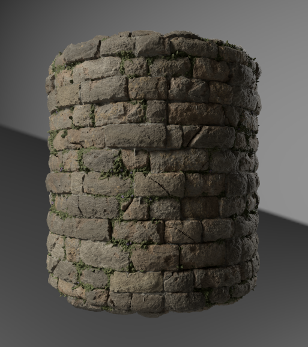
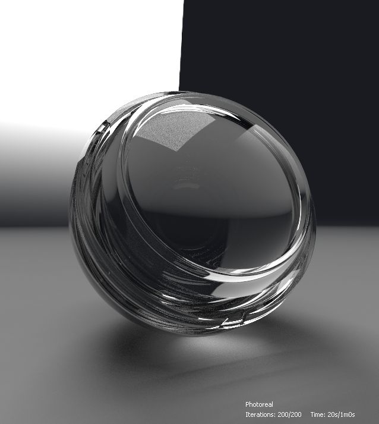

# Iray

This pages presents the Iray renderer available in the 3D view panel of [Substance 3D Designer](https://www.adobe.com/products/substance3d-designer.html), which offers interactive path tracing for photorealistic rendering with CPU and/or GPU acceleration (Nvidia GPUs only).

<table>
<tr style="border: 0;">
<td style="border: 0;" valign="top">

## Overview

<b>Iray</b> is a highly *interactive* and intuitive physically based rendering technology that generates *photorealistic imagery* by simulating the physical behaviour of light and materials. Learn more on the [Nvidia Iray](https://www.nvidia.com/en-us/design-visualization/iray/) webpage.

</td>
<td style="border: 0;" valign="top">

</td>
</tr>
</table>

<table>
<tr style="border: 0;">
<td style="border: 0;" valign="top">

As the 3D View uses Iray's *progressive renderer*, an image is produced as soon as at least one sample has been performed on each pixel. The image is *automatically updated* as sampling iterations are performed, resulting in an initial rough image becoming *cleaner on each iteration*.

The renderer is available in the [3D view](../3d-view.md) panel: open the <b>Renderer</b> menu and select the <b>Iray</b> option to switch the renderer used in that 3D view panel to Iray.  
Switching to the Iray renderer *changes the available options* in some of the 3D view menus. These changes are explained in the <b>3D view</b> section below.

By default, progressive rendering starts as soon as the Iray renderer is selected. The rendering process will run until *one* of these conditions is met:

* The *maximum number of samples* are performed
* The *rendering time limit* is met

See the <b>Renderer</b> section of this page to learn more about tweaking these conditions.

</td>
<td style="border: 0;" valign="top">

*Material: [Medieval castle wall](https://helpx.adobe.com/substance-3d/unlisted/assets/allassets/2b3f6eca9a6b6ab19d263d8b77819df431c3c973.html)* *by [Mark Foreman](https://www.artstation.com/oggyart)* *available in our [Substance 3D assets](https://helpx.adobe.com/substance-3d/unlisted/assets.html)* *library*

</td>
</tr>
</table>

>[!WARNING]
>
> Only *one* Iray rendering instance can be run at any time.  
> This means when a 3D view panel uses this renderer, the **Renderer** menu is *disabled* in other 3D view panels and these default to the **OpenGL** renderer.

## 3D view options

The following options are available for adjusting the rendered scene:

<table>
<tr style="border: 0;">
<td style="border: 0;" valign="top">

</td>
<td style="border: 0;" valign="top">

</td>
</tr>
</table>

### Scene

Select the <b>Edit</b> option in the <b>Scene</b> menu to find scene properties specific to Iray in the <b>Properties</b> panel.

* <b>Is enabled:</b> When set to *False*, the object is hidden and *no longer contributes* to the scene

Display component

* <b>Is visible</b>: When set to *False*, the object is hidden yet *still contributes* to the scene – i.e. reflecting light, absorbing light and projecting shadows

Mesh display component

* Subdivision
  * <b>Method</b>: The method used to procedurally subdivide the mesh into finer geometry
    * *None*: No subdivision is applied
    * *Parametric*: Subdivides the mesh into `4^x` triangles where `x` is the value specified by this parameter
    * *Length*: Subdivides the mesh until all edges have a length (in object space) below the value specified by the Minimum length parameter
  * <b>Minimum length</b>: Subdivides the mesh until all edges have a length below this specified value in object space (only applies to the *Length* method)
  * <b>Number</b>: The number of subdivision iterations which should be applied to the mesh (only applies to the *Parametric* method)

>[!WARNING]
>
> Subdividing the mesh *increases its processing time exponentially* before and during the render. We suggest being *conservative* with the values input.  
> Be careful about using *high* **Number** values for the Parametric method, and *low* **Minimum length** values for the Length method.

### Materials

Since Iray relies on the [MDL shading model](https://www.nvidia.com/en-us/design-visualization/technologies/material-definition-language/) developed by NVIDIA, available materials for scene materials are replaced with the MDL library loaded by Designer. This library is built using the following sources:

* The MDL files included in Designer's installation
* The MDL files found in the [directories listed by the user](../../preferences-window/project-settings/project-settings.md) in the loaded [Project files](../../../pipeline-and-project-con/project-configuration-fil/project-configuration-files-sbsprj.md)
* The [NVIDIA vMaterials](https://developer.nvidia.com/vmaterials) library if it is installed

>[!NOTE]
>
> For a deeper look into the MDL shading model, check out the [MDL Handbook](http://mdlhandbook.com/), written and maintainted by NVIDIA.

<table>
<tr style="border: 0;">
<td style="border: 0;" valign="top">

The cumulative list of loaded MDL materials is availabe in the <b>Materials</b> menu, under any of the listed materials' submenu as shown in the image on the right.

Additionally, if an [MDL graph](../../../mdl-graphs/creating-an-mdl-graph/creating-an-mdl-graph.md) is loaded in Designer, it can be applied to any material in the Scene. At that point, it is added to the list of available MDL materials.

Other notable options in this menu are:

* Select the <b>Edit</b> option to access the MDL's *exposed inputs* in the <b>Properties</b> panel and tweak the material as required
* The <b>Load...</b> option lets you *manually load any MDL file* to be added to the cumulative list and applied in the scene
* The <b>Export Preset...</b> option opens the <b>Export MDL Material Preset</b> dialog, which lets you export a preset MDL file using the current settings applied in the 3D View

</td>
<td style="border: 0;" valign="top">

</td>
</tr>
</table>

>[!NOTE]
>
> When loading an **MDL graph**, the 3D view renderer is *automatically switched to **Iray*** to load and apply it.

### Camera

The main difference between OpenGL and Iray regarding camera settings is how *depth of field* is managed. Indeed, Iray being a physically-accurate renderer, depth of field occurs "naturally" depending on the camera's *aperture*.

The following couple of parameters are available in the camera properties when the Iray renderer is selected:

* <b>Focus distance</b>: the distance from the camera of the focal point – i.e. where the image is at its sharpest
* <b>Aperture diameter</b>: the value driving the camera's aperture. The lower the value, the sharper the image elements are before and after the focal point – in simpler terms, this value controls the strength of the depth of field effect

### Environment

Open the <b>Environment</b> menu and select the <b>Edit</b> option to display the environment properties in the <b>Properties</b> panel.

The following properties are available:

Dome

* <b>Dome type</b>: sets the objects enclosing the scene, which the environment texture is projected on
  * *Infinite sphere*: infinite spherical environment
  * *Ground*: infinite spherical environment, but with a textured ground plane
  * *Sphere*: finite size sphere-shaped dome of custom radius
  * *Sphere with ground*: finite size sphere-shaped dome with custom radius where the lower part of the environment is projected onto the plane dividing upper and lower parts of the sphere
  * *Box with ground*: finite size box-shaped dome of custom width, height and length where the lower part of the environment is projected onto the plane dividing upper and lower parts of the box
* <b>Rotation angle</b>: controls the angle of rotation of the dome around the *Y axis*
* <b>Radius</b>: the radius of the sphere (only applies to the *Sphere* and *Sphere with ground* dome types)
* <b>Width</b>: the width of the box (only applies to the *Box with ground* dome type)
* <b>Height</b>: the height of the box (only applies to the *Box with ground* dome type)
* <b>Length</b>: the length of the box (only applies to the *Box with ground* dome type)
* <b>Visualize</b>: enables a false-color overlay of the finite size environment geometry. This can be used to align the geometry with the projection of the captured environment map (only applies to the *Sphere*, *Sphere with ground* and *Box with ground* dome types)

>[!NOTE]
>
> For finite size domes, all scene geometry should be *enclosed within* the dome.

Dome ground   
The following parameters apply to the *Ground*, *Sphere with ground* and *Box with ground* dome types:

* **Ground**: enables the ground plane
* **Position**: the position of the origin of the finite dome (also applies to the *Sphere* dome type)
* **Reflectivity**: the opacity and tint of the ground reflection, where black means the reflection is not visible
* **Glossiness**: the glossiness of the ground reflection
* **Shadow intensity**: the opacity of the shadow cast on the ground
* **Texture scale**: controls the size of the environment texture projection on the ground (also applies to the *Sphere* dome type)

The impact of some of these settings is demonstrated below:

+++Display environment

<table>
  <tr>
    <td>
      
       <i>Before</i>
    </td>
    <td>
      
       <i>After</i>
    </td>
  </tr>
</table>

+++

+++Enable ground plane

<table>
  <tr>
    <td>
      
       <i>Before</i>
    </td>
    <td>
      
       <i>After</i>
    </td>
  </tr>
</table>

+++

+++Rotate environment

+++

+++Adjust ground plane

+++

+++Adjust infinite sphere
")

+++

+++Adjust enclosing box
")

+++

### Display

These options display a *text overlay* on top of the rendered image with useful information regarding the render.

* <b>Elapsed time</b>: The duration of the render in seconds. This timer and the rendering process will both stop when one of the ending conditions are met
* <b>Iterations</b>: The number of sampling iterations performed. This counter and the rendering process will both stop when one of the ending conditions are met
* <b>Rendering method</b>: The rendering pathway used. For most purposes on a local machine, Photoreal is used
* <b>Resolution</b>: The effective rendering resolution. If the Use window resolution option in the camera properties is set to False, the ratio of the image is automatically adjusted to match the resolution ratio
* <b>Scene stats</b>: A list of statistics related to the rendered scene, which includes triangles count, and materials count among other data

{width="512px"}

### Renderer

Open the <b>Renderer</b> menu and select the <b>Edit</b> option to display the renderer properties in the <b>Properties</b> panel.

Progressive rendering

* <b>Min samples</b>: The minimum number of samples per pixel to compute before considering criteria to stop progressive rendering
* <b>Max samples</b>: If this number of samples per pixel has been rendered, then stop progressive rendering automatically
* <b>Max time (seconds)</b>: Time in seconds after which progressive rendering should terminate automatically
* <b>Caustic sampler enabled</b>: Augment the default sampler with a dedicated caustic sampler. Caustics are a result of light passing through a non-opaque object, thus is required only if an [MDL](../../../mdl-graphs/creating-an-mdl-graph/creating-an-mdl-graph.md) material supporting translucency is applied on any object in the scene
* <b>Firefly filter enabled</b>: enable the firefly filter, which uses a predefined algorithm to remove fireflies in the computed image as rendering progresses. Fireflies are visual artifacts where *isolated pixels* in an image which are *noticeably brighter* than their neighbours, and are a result of unsufficient ray samples to accurately determine the distribution of light
* Post denoiser  
  The Iray renderer uses the [NVIDIA Optix AI-Accelerated denoiser](https://developer.nvidia.com/optix-denoiser) algorithm for iterative high-quality denoising of the image as it is being rendered.

  * <b>Enabled</b>: enables a predefined *denoising algorithm* to be triggered at a set rendering iteration, and be active until the *end* of the render
  * <b>Start iteration</b>: If the denoiser is enabled, this option sets the iteration at which the denoising process starts. This can prevent the denoiser's performance overhead from impacting interactivity, for example, when moving the camera. Additionally, the first few iterations are often not suitable as input for the denoiser due to insufficient convergence, leading to unsatisfactory results.

The impact of some of these settings is demonstrated in the image comparisons below:

+++Caustic sampler

<table>
  <tr>
    <td>
      
       <i>Before</i>
    </td>
    <td>
      
       <i>After</i>
    </td>
  </tr>
</table>

+++

+++Firefly filter

<table>
  <tr>
    <td>
      
       <i>Before</i>
    </td>
    <td>
      
       <i>After</i>
    </td>
  </tr>
</table>

+++

+++Post-denoiser

<table>
  <tr>
    <td>
      
       <i>Before</i>
    </td>
    <td>
      
       <i>After</i>
    </td>
  </tr>
</table>

+++

*Material: Thick glass MDL* *available in the MDL Core definitions* *by NVIDIA*

## Hardware acceleration

The Iray renderer offers hardware acceleration on NVIDIA GPUs exclusively, which offers the following benefits:

* Significant increase of rendering speed
* [Optix AI-Accelerated denoising](https://developer.nvidia.com/optix-denoiser) (see "Post-denoiser" in the <b>Renderer</b> section of this page)

You may select the hardware which should be used by Iray for rendering in the <b>3D View</b> section of the [Preferences](../../preferences-window/preferences-window.md) window, as shown in the image on the right.

When a supported GPU is detected, it is listed in this section, is *automatically selected* by default and the CPU is unselected. Any manual change overrides this automatic behaviour so your custom changes are saved for future sessions.

>[!NOTE]
>
> If a supported GPU is detected and listed, we strongly recommend *leaving the CPU unselected* as using the CPU for Iray rendering has a *significant impact* on the overall performance and responsiveness of the application.

>[!WARNING]
>
> GPU hardware acceleration uses the [NVIDIA CUDA](https://developer.nvidia.com/cuda-zone) technology. Make sure your *graphics driver is up-to-date* for the best compatibility and reliability. Find the most recent driver for your NVIDIA GPU [here](https://www.nvidia.com/Download/index.aspx?lang=en-us).  
> For multi-GPUs configurations, it is recommended to *disable SLI* and select only one GPU for the best reliability.

