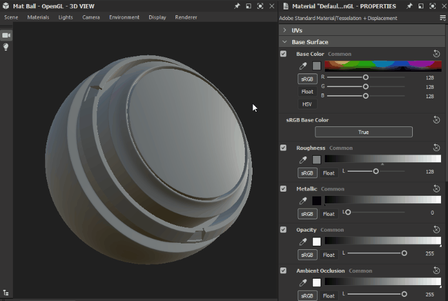

# Material properties

This pages presents common properties of the shader used in the [3D View](../../../interface/3d-view/3d-view.md) of Substance 3D Designer.

## Overview

The [3D View](../../../interface/3d-view/3d-view.md) renders the surface of models using a program called a *shader*. The shader defines the material applied to the model using a list of properties which impact various aspects of the model's appearance.

The <b>Materials</b> menu of the 3D View lets you check which shader is used for each of the scene's materials.

Designer uses the <b>Adobe Standard Material</b> by default, which supports several complex effects such as anisotropy, sheen and translucency.  
This shader's properties are sorted into the following groups:

* UVs
* Base Surface
* Normal
* Height
* Anisotropy
* Emission
* Sheen
* Subsurface scattering
* Coat

>[!NOTE]
>
> Some systems may not support this shader. In that case, Designer falls back to the **Metallic Roughness** shader.

## UVs

* <b>Tiling</b> *Float*  
  The amount of repetition of the texture both horizontally and vertically  
  *Default - 1.0*
* <b>UV Scale Enabled</b> *Boolean*  
  Modulates the tiling against the [Physical Size](../../../compositing-graphs/graph-parameters/graph-parameters.md) of the [Substance graph](../../../compositing-graphs/substance-compositing-graphs.md) which was last applied in the 3D View  
  *Default - False*

## Base surface

* <b>Base Color</b> *Float3/RGB*  
  The amount of repetition of the texture both horizontally and vertically  
  *Default - (0.5, 0.5, 0.5)*
* <b>sRGB Base Color</b> *Boolean*  
  Description  
  *Default - True*
* <b>Roughness</b> *Float*  
  Description  
  *Default - 0.5*
* <b>Metallic</b> *Float*  
  Description  
  *Default - 0.0*
* <b>Opacity</b> *Float*  
  Description  
  *Default - 1.0*
* <b>Ambient Occlusion</b> *Float*  
  Description  
  *Default - 1.0*
* <b>Specular Level</b> *Float*  
  Description  
  *Default - 0.5*
* <b>Specular Edge Color</b> *Float3/RGB*  
  Description  
  *Default - (1.0, 1.0, 1.0)*
* <b>sRGB Specular Edge Color</b> *Boolean*  
  Description  
  *Default - True*
* <b>Index of Refraction</b> *Float*  
  Description  
  *Default - 1.5*

## Normal

* <b>Normal</b> *Float3/RGB*  
  Description  
  *Default - (0.5, 0.5, 1.0)*
* <b>DirectX Normal</b> *Boolean*  
  Description  
  *Default - True*

## Height

* <b>Height</b> *Float*  
  Description  
  *Default - 0.5*
* <b>Height Scale</b> *Float*  
  Description  
  *Default - 1.0*
* <b>Height Level</b> *Float*  
  Description  
  *Default - 0.5*
* <b>Tessellation Factor</b> *Integer*  
  Description  
  *Default - 1*
* <b>Phong Tessellation</b> *Boolean*  
  Description  
  *Default - False*
* <b>Phong Tessellation Factor</b> *Float*  
  Description  
  *Default - 0.6*

## Anisotropy

* <b>Anisotropy Level</b> *Float*  
  Description  
  *Default - 1.0*
* <b>Anisotropy Angle</b> *Float*  
  Description  
  *Default - 0.0*

## Emission

* <b>Emission Intensity</b> *Float*  
  Description  
  *Default - 1.0*
* <b>Emission Color</b> *Float3/RGB*  
  Description  
  *Default - (0.0, 0.0, 0.0)*
* <b>sRGB Emission Color</b> *Boolean*  
  Description  
  *Default - True*

## Sheen

* <b>Sheen Opacity</b> *Float*  
  Description  
  *Default - 0.0*
* <b>Sheen Color</b> *Float3/RGB*  
  Description  
  *Default - (1.0, 1.0, 1.0)*
* <b>sRGB Sheen Color</b> *Boolean*  
  Description  
  *Default - True*
* <b>Sheen Roughness</b> *Float*  
  Description  
  *Default - 0.5*

## Subsurface Scattering

* <b>Translucency</b> *Float*  
  Description  
  *Default - 0.0*
* <b>Use Scattering Color Channel</b> *Boolean*  
  Description  
  *Default - False*
* <b>Scattering Color</b> *Float3/RGB*  
  Description  
  *Default - (1.0, 1.0, 1.0)*
* <b>sRGB Scattering Color</b> *Boolean*  
  Description  
  *Default - True*
* <b>Scattering Distance</b> *Float*  
  Description  
  *Default - 1.0*
* <b>Scattering Distance Scale</b> *Float3/RGB*  
  Description  
  *Default - (1.0, 1.0, 1.0)*
* <b>sRGB Scattering Distance</b> *Boolean*  
  Description  
  *Default - True*
* <b>Red Shift</b> *Float*  
  Description  
  *Default - 0.0*
* <b>Rayleigh</b> *Float*  
  Description  
  *Default - 0.0*

## Coat

* <b>Coat Opacity</b> *Float*  
  Description  
  *Default - 0.0*
* <b>Coat Color</b> *Float3/RGB*  
  Description  
  *Default - (1.0, 1.0, 1.0)*
* <b>sRGB Coat Color</b> *Boolean*  
  Description  
  *Default - True*
* <b>Coat Roughness</b> *Float*  
  Description  
  *Default - 0.0*
* <b>Coat IOR</b> *Float*  
  Description  
  *Default - 1.6*
* <b>Coat Specular Level</b> *Float*  
  Description  
  *Default - 0.5*
* <b>Coat Normal</b> *Float3/RGB*  
  Description  
  *Default - (0.5, 0.5 ,1.0)*
