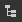
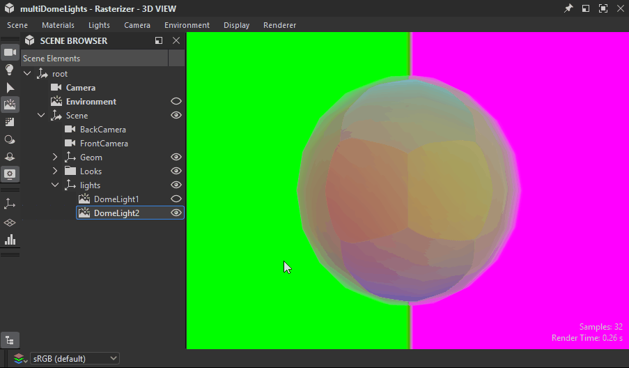
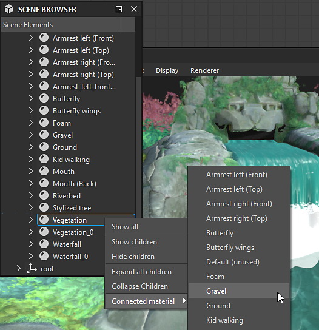

# Scene browser

The 3D view's scene browser lists all elements in the scene and their hierarchy.

It offers controls for selecting objects, toggling their visibility as well as selecting which material should [override a scene material](../../../working-with-3d-scenes/overriding-scene-mat/overriding-scene-materials.md).

As Designer uses [USD](https://openusd.org/release/index.html) for describing and managing its scenes, its terminology  and concepts are found in that scene tree.

It is displayed by clicking its dedicated toggle button  in the [3D view scene toolbar](../3d-view.md).

{zoomable="yes"}

<table>
<tr style="border: 0;">
<td style="border: 0;" valign="top">

</td>
<td style="border: 0;" valign="top">

</td>
<td style="border: 0;" valign="top">

</td>
</tr>
</table>

## Scene tree

<table>
<tr style="border: 0;">
<td width="100.00%" style="border: 0;" valign="top">

The scene browser displays a list of objects arranged in a hierarchical tree.

Objects are parented to other objects, up to the scene's root. A parent object has an arrow button which is used to expand or collapse the list of its children.

</td>
<td width="33.33%" style="border: 0;" valign="top">

{zoomable="yes"}

</td>
</tr>
</table>

Leave the cursor on any item in the tree for a couple of seconds to display a tooltip with the following information:

* <b>Path:</b> The full path of the object in the scene.
* <b>TypeName:</b> The USD type of the object.
* <b>Documentation:</b> Detailed information about the object as a USD scene element.

Meshes have additional information: Vertex count, face count and UV count.

### Objects added by Designer

<table>
<tr style="border: 0;">
<td width="100.00%" style="border: 0;" valign="top">

Designer adds some objects to any loaded scene. Objects added by Designer are labeled in <b>bold</b>.

When using the 'Edit ...' action in the Lights, Camera and Environment menus, these are the objects being edited, regardless of there being other lights, cameras or environments in the scene.

These objects are included in the scene when [exported](../../../working-with-3d-scenes/exporting-scenes/exporting-scenes.md).

</td>
<td width="33.33%" style="border: 0;" valign="top">

{zoomable="yes"}

</td>
</tr>
</table>

* <b>Camera:</b> The scene's default camera. This is the only camera you can interact with in Designer. Any cameras included in a loaded scene are added as presets for the default camera.
* <b>Environment:</b> The scene's default environment. Any texture applied to the scene's environment will be applied to that environment only. Similarly, rotating the environment only impacts that environment.  
  When a loaded scene includes one or more environment lights ([DomeLight](https://openusd.org/release/user_guides/schemas/usdLux/DomeLight.html) in USD), the default environment is automatically disabled to not interfere with the scene's environment lighting.
* <b>Point light &#35;:</b> If any of Designer's point light is enabled in Lights &gt; Edit properties, each point light is added to the scene.

## Toggling objects in the scene

### All types

Any object can be enabled and disabled in the scene. When disabled, an object no longer contributes to the scene: it does not cast shadows, emit or reflect light.

The state of a parent object carries over to its children, so disabling a parent object also disables its children.

The visibility of an object can be toggled by clicking its eye button  or from its contextual menu. The menu offers a few more actions for managing the visibility of scene objects:

* <b>Hide:</b> Disable the selected object.
* <b>Show:</b> Enable the selected object.

Some actions impact the visibility of meshes specifically:

* <b>Show only:</b> Disable all meshes but the selected one and its children.
* <b>Show all:</b> Enable all meshes.

Parent objects have these additional actions:

* <b>Hide children:</b> Disable all children of the selected object, recursively.
* <b>Show children:</b> Enable all children of the selected object, recursively.
* <b>Expand all children:</b> Expand all lists of children under the selected object, recursively.
* <b>Collapse all children:</b> Collapse all lists of children under the selected object, recursively.

{zoomable="yes"}

### Environments

The visibility of any environment light (DomeLight) can be enabled and disabled in the same way as other objects.

When an environment light is disabled, its lighting contribution to the scene is also disabled.

If more than one environment lights are enabled, their lighting contributions are *added cumulatively*.

{zoomable="yes"}

### Lights

The same goes for any lights in the scene: each can be toggled individually.

{zoomable="yes"}

## Connected materials

The scene browser also lets you connect any overridden material to another material listed by Designer in the 3D view's [Materials menu](../3d-view.md).

<table>
<tr style="border: 0;">
<td style="border: 0;" valign="top">

The materials listed by Designer are the Material objects in the scene tree used on at least one mesh.

When [overriding](../../../working-with-3d-scenes/overriding-scene-mat/overriding-scene-materials.md) any of these materials, a copy is created by Designer, with a numeric suffix.

An overridden material offers an additional item in its contextual menu: the '[Connected material](../../../working-with-3d-scenes/overriding-scene-mat/overriding-scene-materials.md)' submenu lists all other available materials that can be used to override this material.

</td>
<td style="border: 0;" valign="top">

{zoomable="yes"}

</td>
</tr>
</table>
