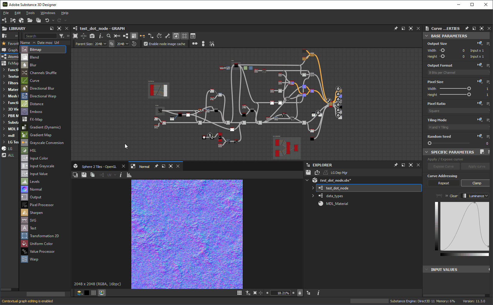

# Customizing your workspace

This page presents the ways of arranging the panels in [Adobe Substance 3D Designer's](https://www.adobe.com/products/substance3d-designer.html) user interface, and leveraging their features to enhance your workflows.

<table>
<tr style="border: 0;">
<td width="100.00%" style="border: 0;" valign="top">

## Windows menu

This menu lets you manage the main user interface elements of Designer. Each option is described in the <b>Windows</b> section of [this page](https://helpx.adobe.com/substance-3d/unlisted/documentation/sddoc/the-main-menu-143720673.html) about the main toolbar. Here, we will provide additional concepts related to this menu.

### Display/Hide a view

In order to display or hide a specific interface item, click its name in the *Windows* menu. Displayed items have a  checkmark.

### Populate a dock with a view

In Designer, a dock is a *container which is separate from its content*. This means a <b>Library</b> dock can exist and be empty as it holds no Library *view*.

The <b>New Explorer</b>, <b>New 3D view</b> and <b>New Library view</b> options create views, which will be placed according to the current state of the user interface:

* If an empty dock is available, the new view is created *within it*
* If empty docks are *not* available, a *new dock* is created to hold the new view

</td>
<td width="33.33%" style="border: 0;" valign="top">

</td>
</tr>
</table>

## Resizing docks

Docks can be resized by moving any of their edges. Other docks will be resized dynamically to fit.

## Moving docks

Any dock may be moved around the main window using its *title bar*. Depending on the location the dock is moved to, docks will be resized to fit.

## Tabbing docks

Docks may be stacked into tabs. This is useful to save screen real estate or aggregate views which relate to each other in some way.

You can tab docks by moving a dock using its title bar *over an existing dock* such as docks do not resize or move, but a *frame* appears around the target dock.

## Undocking

A dock may be undocked into a *floating window* which may be resized and moved out of the main window, including off to another display.

This can be done in two ways:

* Moving the dock using its *title bar* and placing it either *out of the main window* or on an area of the main window which is *not a dock*. You may redock this dock either by moving it on another dock *in the main window* or by clicking the <b>!&#91;&#93;(../../assets/dock-icons-redock.png) Redock</b> button;
* Clicking the <b>!&#91;&#93;(../../assets/dock-icons-undock.png) Undock</b> button. An dock undocked with this method may *only* be redocked by clicking the <b>!&#91;&#93;(../../assets/dock-icons-redock.png) Redock</b> button.

## Maximizing docks

Any dock may be maximised to fit the area or its *parent window*:

* Docked docks will spread over the entire area of the *main window*, excluding the title bar, main toolbar and status bar
* Undocked docks will spread over the *entire display*

Docks can be maximised in two ways:

* Placing the *cursor over the dock* and pressing the <b>Shift+Space</b> keystroke
* Clicking their <b>!&#91;&#93;(../../assets/dock-icons-maximise.png) Maximise</b> button

Maximised docks may be minimised into the size and location they held *before being maximised*. This can be done in three ways:

* Placing the *cursor over the dock* and pressing the <b>Shift+Space</b> keystroke
* Clicking their <b>!&#91;&#93;(../../assets/dock-icons-minimise.png) Minimise</b> button
* Opening the <b>Windows</b> menu and selecting the <b>Unmaximise window</b> option

>[!NOTE]
>
> Only *one* dock may be maximised at a time.

>[!IMPORTANT]
>
> When a dock is maximised, some interface behaviours may differ:
> 
> * Docks which appear/update automatically will do so in the background (e.g. Properties, 2D view)
> * Menu items are *disabled* in the **Windows** menu
> * Buttons are *disabled* in the dock title bar
> * A dock maximised in the main window *may not be moved* using its title bar

## Pinning docks

Pinning a dock *prevents it from being populated* with other content or a different view.

When a dock is pinned, any future content which should be displayed in its will instead *create a new dock* to host it. This new dock will not be pinned and thus can update and host new content.

To pin a dock, click its  <b>Pin</b> button. You can then *unpin* it using the  <b>Unpin</b> button to make it once more *available* to host any new content.

*More than one* dock can be pinned at a time, including multiple docks of the *same type*.

Pinning docks empowers you with the following abilities:

* Displaying and tweaking properties of multiple nodes at the same time
* Displaying two bitmaps or more concurrently
* Working on multiple graphs concurrently

## Closing docks

Any dock may be closed by clicing its  <b>Close</b> button.

## Resetting the interface layout

The entire user interface can be reset into its default layout by opening the <b>Windows</b> menu and selecting the <b>Reset layout</b> option.

Their display state will also be reset, meaning that closed docks may be *reopened* (e.g. 3D view) and displayed docks may be *closed* (e.g. Console, Dependency manager, docks created by plugins).

