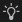

# Home screen

The <b>Home screen<b> </b></b>welcomes you when you launch Substance 3D Designer. It helps you get started with your projects and access useful links.

<table>
<tr style="border: 0;">
<td width="100.00%" style="border: 0;" valign="top">

To close the Home Screen, use the <b>Back</b> button on the top left or the <b>Close Home screen</b> button on the bottom left. A checkbox just below lets you toggle the automatic display of the Home screen after starting Designer.

</td>
<td width="16.67%" style="border: 0;" valign="top">

</td>
</tr>
</table>

{width="512px"}

## Home

The  <b>Home</b> section offers a banner with a highlighted suggestion for going further with Designer.  
This banner can be collapsed using the  <b>Hide suggestions</b> button on the right.

Below, a list of recent files under the <b>Recent</b> header offers quick access to the last loaded projects, from most recent to oldest.

Recent files can be filtered using the <b>Filter</b> input field on the top right of the list. Filtering matches any string of characters present in a project's filename.

>[!TIP]
>
> Leave the cursor on an entry for a few seconds to display the file's full path.

{width="512px"}

## Learn

The  <b>Learn</b> section offers useful learning resources for growing your understanding of Substance 3D Designer.

These resources are listed as card links and grouped as follows:

* <b>Hands-on tutorials</b> covers the latest features;
* <b>More resources</b> gathers resources that you may find useful to go back to regularly:
  * [First steps in Designer](https://substance3d.adobe.com/tutorials/courses/First-Steps-with-Substance-3D-Designer/youtube-VyFgpitTsYg) is our reference tutorial for beginners;
  * [Quicktips](https://substance3d.adobe.com/tutorials/courses/Designer-Quicktips/youtube-Q9mEcCWsOQc) is a curated playlist of techniques for creating materials, patterns, filters, etc.;
  * [Online documentation](../../home/home.md) brings you to this documentation.

{width="512px"}

## What's new

The  <b>What&#39;s new</b> button on the top right of the screen displays a screen listing the major features added in your version of Designer, as well as a link to the complete [release notes](../../release-notes/release-notes.md) for that version.

## Start project

On the left of the screen, you can find a list of shortcuts for creating a new graph in a new package:

* <b>New Substance graph:</b> Opens the [New Substance graph](../../compositing-graphs/creating-compositing-gra/creating-a-substance-compositing-graph.md) window;
* <b>Open package:</b> Lets you load an existing package;
* <b>New MDL graph:</b> Opens the [New MDL graph](../../mdl-graphs/creating-an-mdl-graph/creating-an-mdl-graph.md) window;
* <b>Import AxF:</b> Starts an [AxF importing workflow](../../resources/axf-appearance-exchange/axf-appearance-exchange-format.md).

{width="256px"}

## Links

On the bottom left of the screen, useful links are listed as follows:

* <b>About Designer:</b> Displays the About Designer screen (see above);
* <b>Online documentation:</b> Opens a webpage to [this documentation](../../home/home.md);
* <b>Website:</b> Opens a webpage to the Substance 3D Designer [product page](https://www.adobe.com/products/substance3d-designer.html);
* <b>Forums:</b> Opens a webpage to Substance 3D Designer's [Support Community](https://community.adobe.com/t5/substance-3d-designer/ct-p/ct-substance-3d-designer?page=1&amp;sort=latest_replies&amp;filter=all&amp;lang=all&amp;tabid=discussions);
* <b>Community assets:</b> Opens a webpage to Substance 3D [Community Assets](https://substance3d.adobe.com/community-assets/).
