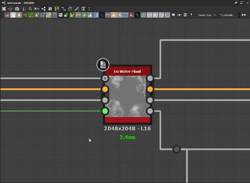

# Preferences window

This page presents the <b>Preferences</b> window and all its settings.

You can find the Preferences window through the <b>Edit</b> menu in the main top bar the application. This dialog lets you adjust a number of settings. It is organized in tabs covering different areas of behavior and functionality.  
We recommend reviewing all of these settings to get a better insight on how the application operates and how it can be tailored to your workflow.

>[!NOTE]
>
> For more information about how these preferences are stored and how you can integrate them in a production environment, you can refer to the [User Preferences - Automating Setup](../../pipeline-and-project-con/user-preferences-aut/user-preferences-automating-setup.md) page of the documentation.

## General

### Recent Documents

|  |  |
| --- | --- |
| <b>Recent documents list contains</b>  *Default: 10* | This allows you to select the number of documents to list in the <b>Recent Packages</b> entry of the <b>File</b> item in the [Main Menu](https://helpx.adobe.com/substance-3d/unlisted/documentation/sddoc/the-main-menu-143720673.html). |

### History

|  |  |
| --- | --- |
| **History stack size** *Default: 200* | This indicates the number of available undo operations at any given time in the <b>Edit &gt; Undo</b> item of the [Main Menu](https://helpx.adobe.com/substance-3d/unlisted/documentation/sddoc/the-main-menu-143720673.html).  **Caution:** The more undo operations you need, the more memory the application will require. |

### Language

|  |  |
| --- | --- |
| **Choose the language of the application** *Default: System* | This setting defines the language used in the application interface. The '*System*' option auto-detects language from your system language settings. The available languages are listed in our [System requirements](../../getting-started/system-requirements/system-requirements.md).  **Note:**  Changing this setting will only take effect after restarting the application. |

### Views

|  |  |
| --- | --- |
| <b>Invert zoom in views</b>  *Default: Unchecked* | If checked, the zoom controls will be inverted in the [2D View](../2d-view/2d-view.md), [3D View](../3d-view/3d-view.md) and [graphs](../the-graph-view/the-graph-view.md). |

### Paths

|  |  |
| --- | --- |
| <b>Save/Export path</b>  *Default: Last path* | Determines whether the suggested save/export path is your last selected path, or the [SBS package](../../getting-started/overview/overview.md)'s path. The last selected path is saved across sessions. |
| <b>Temporary folder</b>  *Default: Path depending on system OS* | When the image data of a graph exceeds the allocated memory pool (see below <b>Memory &gt; Image Cache</b>), the overflowing data is written on disk. This setting lets you define the location the overflowing image cache data is written to.   This location is also used to store a copy of the currently open SBS package with the latest modifications since the last manual save. |

### Memory

#### Image Cache

The application keeps in cache a *full-resolution, uncompressed image* for each rendered node in the current graph.  
Instance nodes will generate these images for all nodes of the graph they reference, and delete them once their [outputs](../../compositing-graphs/nodes-reference-for-com/atomic-nodes/output/output.md) have been computed. Only the outputs are kept in memory at that point.

You can set the maximum cache size allocated to thumbnails and images in system memory, and see the current usage. If the cache data overflows its allocated pool, the excess data is written to the <b>Temporary folder</b> (see above <b>Paths &gt; Temporary folder</b>).

|  |  |
| --- | --- |
| <b>Memory budget</b>  *Default: Automatic* | This allocation is calculated automatically to approximately 75% of the total system memory pool. To set this value manually, select the '*Custom*' option and set a value in the adjacent input field. |

Please note writing to disk is *orders of magnitude slower* than writing to system memory. Therefore, graph rendering time will *increase exponentially* as overflowing data needs to be written to the Temporary Folder.  
To prevent this from happening, we recommend taking a look at the suggestions for decreasing a graph's memory footprint in the [Performance Optimization Guidelines](../../best-practices/performance-optimization/performance-optimization-guidelines.md) section of the documentation.

#### Job Scheduler

During specific tasks, such as image conversions for thumbnails or the [2D View](../2d-view/2d-view.md), separate jobs will be created and distributed across the system processing cores for efficiency. Each job will write data to system memory to perform its operations.  
This setting lets you define the allocated memory pool for *all concurrent jobs*. When this pool is entirely used, new jobs will be queued until the current ones have completed.

|  |  |
| --- | --- |
| <b>Memory budget</b>  *Default: Automatic* | This allocation is calculated automatically to approximately 10% of the total system memory pool. To set this value manually, select the '*Custom*' option and set a value in the adjacent input field. |

### User Interface

|  |  |
| --- | --- |
| **Disable High DPI** *Default: Unchecked* | <b>High DPI</b> mode will maintain consistent scaling of text and user interface elements *independently* of the system's display and scaling settings.   Disabling (i.e. checkbox *filled*) this setting will let the interface be scaled, which results in larger and more readable text on some displays but can also create inconsistencies in text size, along with other layout issues.  **Caution:** Designer acquires the specific scale of user interface elements *from the OS*. Therefore any adjustments to the scaling of the user interface should be done in the display settings of the OS. To ensure display settings are applied correctly in Designer, *sign out* of your OS user session and sign back in after changing these settings.  **Note:**  Changing this setting will only take effect after restarting the application. |

### Auto Backup

An auto-save feature is included by default, which creates copies of the current state of open [SBS packages](https://docs.substance3d.com/display/DRAFTDESIGNER/.Overview+vDraftVersion) at set periods of time. Auto-saves are placed in an <b>.autosave</b> folder at the SBS package location.

|  |  |
| --- | --- |
| <b>Auto-backup every &#35; minutes</b>  *Default: 5* | The time period between each auto-save. |
| <b>Keep up to &#35; versions</b>  *Default: 6* | The maximum number of auto-saves to keep at any given time. |

When the maximum amount of versions is reached, newer backups will delete the oldest backups.  
Please also note auto-saves should be opened *after moving them* to the original SBS package location. They should *not* be opened at their current location.

### Publishing and sending SBSAR files

|  |  |
| --- | --- |
| <b>Always save .sbs file when publishing to .sbsar or sending to another application</b>  *Default: True* | Controls the automatic saving of the SBS package when [publishing it](https://helpx.adobe.com/substance-3d/unlisted/documentation/sddoc/publishing-sbsar-file-200574380.html) or [sending  it to another application](https://helpx.adobe.com/substance-3d/unlisted/documentation/sddoc/send-to-215286290.html). |

### Cooker

|  |  |
| --- | --- |
| <b>Cooking size limit</b>  *Default: 8192 pixels* | Defines the maximum pixel resolution permitted for all [nodes](https://helpx.adobe.com/substance-3d/unlisted/documentation/sddoc/nodes-reference-129368078.html) in any [graph](../../compositing-graphs/substance-compositing-graphs.md). As graph outputs are always square images of powers-of-2 resolutions, the value set here defines both the maximum width and height, in pixels. |

### Engine

|  |  |
| --- | --- |
| <b>GPU cache limit</b>  *Default: 2048 MB* | This setting lets you define how much memory should be reserved for caching render stages. Usually, the Substance Engine will cache the output of each node in a Substance graph. |

>[!NOTE]
>
> We recommend taking a look at the suggestions for decreasing a graph's memory footprint in the [Performance Optimization Guidelines](../../best-practices/performance-optimization/performance-optimization-guidelines.md) section of the documentation.

## Projects

Please refer to the [Projects settings](project-settings/project-settings.md) page.

## Graph

### Common

|  |  |
| --- | --- |
| <b>Tab key shows node menu</b>  *Default: Checked* | If checked, the 'Tab' key will open the <b>Node menu</b>, replicating the functionality of the 'Space' key. |
| <b>Enable creation of nodes by click-dragging connectors</b>  *Default: Checked* | If checked, when you click on any connector, drag the cursor and release the created link in graph empty space, to display the <b>Node menu</b>.   The menu will also be *filtered* according to the type of the connector which was clicked on. This means only nodes which are compatible with the clicked connector will be displayed. |
| <b>View outputs in 3D view when opening a graph</b>  *Default: Checked* | If checked, all graph outputs are automatically applied in the [3D View](../3d-view/3d-view.md) when that graph is opened.   This also has the effect of rendering all nodes which are part of a stream leading to an [Output](../../compositing-graphs/nodes-reference-for-com/atomic-nodes/output/output.md) node. |

### Substance compositing graph

|  |  |
| --- | --- |
| <b>Automatically compute all nodes thumbnails when opening a graph</b>  *Default: Checked* | If checked, automatically render all node thumbnails when loading the graph. |
| <b>View output in 2D view when opening a graph</b>  *Default: Checked* | If checked, the first graph output is automatically displayed in the [2D View](../2d-view/2d-view.md) when that graph is opened. This also has the effect of rendering all nodes which are part of a stream leading to that [Output](../../compositing-graphs/nodes-reference-for-com/atomic-nodes/output/output.md) node. |
| <b>Automatically display newly created compositing node</b>  *Default: Checked* | If checked, the [2D View](../2d-view/2d-view.md) will automatically update to display the output of a newly created node. |
| <b>Automatically insert color/greyscale conversion node</b>  *Default: Unchecked* | If checked, automatically resolve Color/Grayscale connection types mismatches, by *placing specific nodes* to perform the appropriate conversion.   When a *Grayscale* output (gray connector) is connected to a *Color* input (yellow connector), a [Gradient Map](../../compositing-graphs/nodes-reference-for-com/atomic-nodes/gradient-map/gradient-map.md) node is automatically placed between the two connectors.   When a *Color* output (yellow connector) is connected to a *Grayscale* input (gray connector), a [Grayscale Conversion](../../compositing-graphs/nodes-reference-for-com/atomic-nodes/grayscale-conversion/grayscale-conversion.md) node is automatically placed between the two connectors. |
| <b>Enable graph editing in context</b>  *Default: Unchecked* | By default, when opening a graph referenced by an [instance node](../../compositing-graphs/creating-compositing-gra/graph-instances-sub-gra/graph-instances-sub-graphs.md) with a right-click on the node and selecting <b>Open Reference</b>, that graph is loaded and edited *in isolation*.   If checked, you can edit graphs referenced by instances *using the information passed in the instance* by the current graph. To do this, right-click on an instance node and select <b>Open Reference In Context</b>, or use the Ctrl+E keystroke.   This means an instanced graph can be edited in the context of the graph it is instanced into. This is very useful for seeing the effects of the edits on the graph you were working in. See example below.  **Note:**  The <b>Preview</b> and <b>Presets</b> tabs are *disabled* in the [graph properties](../../compositing-graphs/graph-parameters/graph-parameters.md) when using in-context editing. |

<table>
<tr style="border: 0;">
<td style="border: 0;" valign="top">

*Open Reference*

</td>
<td style="border: 0;" valign="top">

*Open Reference In Context*

</td>
</tr>
</table>

## 3D View

### Misc

|  |  |
| --- | --- |
| <b>Environment hidden by default</b>  *Default: Checked* | Determines the [Environment](../3d-view/3d-view.md) default visibility setting. When hidden, the backdrop of the 3D View is replaced with a *solid color*. |
| <b>Descale factor</b>  *Default: 4* | Lets you can also define the *factor* by which the texture applied to the environment is scaled*down*. |
| <b>Viewport scaling</b>  *Default: Auto* | Controls the scaling of the 3D View's rendering resolution when the system uses display scaling.<ul data-preserve-html="true"> <li data-preserve-html="true"><i>Auto</i>: the rendering resolution is based on the <i>scaled</i> display resolution</li> <li data-preserve-html="true"><i>None</i>: the rendering resolution is based on the <i>native</i> display resolution</li> </ul> |

### OpenGL

|  |  |
| --- | --- |
| <b>Sample count</b>  *Default: 64* | Impacts the size of the 3D View shaders' sample table . A higher value will result in higher image quality at the cost of performance.  **Note:**  The shaders' sample table is also impacted by the system's GPU and OS. |

## Iray

|  |  |
| --- | --- |
| <b>Hardware</b>  *Default:  - CPU checked if no compatible GPU  - GPU checked and CPU unchecked otherwise.* | Defines which hardware resources are allocated to [Iray](../3d-view/iray/iray.md) computations. The list should include the CPU and all compatible NVIDIA GPU(s) detected.  **Note:**  If a compatible NVIDIA GPU is detected, the GPU is checked and the CPU is unchecked by default.  **Tip:** Learn more in the **Hardware acceleration** section of the [Iray](../3d-view/iray/iray.md) page. |

## Bakers

|  |  |
| --- | --- |
| <b>GPU raytracing</b>  *Default: Checked* | If checked, raytracing will be performed on the GPU for [compatible bakers](https://helpx.adobe.com/substance-3d-bake/features/gpu-raytracing.html).   The following GPU raytracing backends will be the default depending on the NVIDIA GPU architecture:<ul data-preserve-html="true"> <li data-preserve-html="true"><i>DXR</i>: Turing and newer</li> <li data-preserve-html="true"><i>Optix</i>: Pascal and Maxwell</li> </ul>  **Note:**  More information about GPU-powered bakers is available in the [GPU Raytracing](https://helpx.adobe.com/substance-3d-bake/features/gpu-raytracing.html) section of the [Substance Bakers](https://helpx.adobe.com/substance-3d-bake/home.html) documentation.  **Tip:** You can use the following *command line arguments* when starting the application to *force* the use of a different GPU raytracing backend: <ul data-preserve-html="true"> <li data-preserve-html="true"><code>--force-optix</code> : force the use of Optix on Nvidia Turing or newer GPUs</li> <li data-preserve-html="true"><code>--force-dxr</code> : force the use of DXR on Nvidia Pascal GPUs</li> </ul> |

## Library

|  |  |
| --- | --- |
| <b>Rebuild thumbnails</b> | The option will trigger a recomputation of all [Library](../the-library/the-library.md) thumbnails, which will automatically replace the previous ones. |

## Shortcuts

You can assign custom keyboard shortcuts for creating nodes in graphs.

Shortcuts can be assigned for nodes in all graph types: [Substance graphs](../../compositing-graphs/substance-compositing-graphs.md), [Substance function graphs](../../function-graphs/function-graphs.md),[ FX-Map graphs](../../function-graphs/fxmaps/fxmaps.md) and [MDL graphs](../../mdl-graphs/mdl-graphs.md).

Any node can be assigned a shortcut, even custom library nodes. A same shortcut can be assigned in different graph types. No shortcuts are assigned by default, you are free to customize this to your liking.

In case of a conflict with another node shortcut, or a built-in program shortcut, the entry will be highlighted a warning will be displayed. The shortcut will have *no effect* until the conflict is resolved.

>[!IMPORTANT]
>
> Shortcuts overridden by Python plugins
> 
> When a Python plugin defines a keyboard shortcut that is assigned to a node, the plugin will override that shortcut. This means the key will trigger the plugin action instead of creating a node.
> 
> This is already the case for the H, S and V keys used by the [node alignment tools](../the-graph-view/node-alignment-tools/node-alignment-tools.md).
