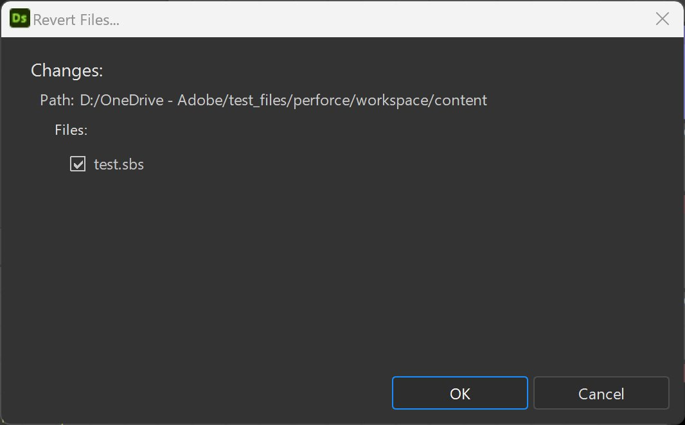

# Version control

>[!IMPORTANT]
>
> Substance 3D Designer version <b>14.0.0</b> upgrades the Perforce support to <b>Python 3</b>.
> 
> Make sure your other scripts and version control environment are adjusted accordingly.

Designer offers a Python integration of the [Perforce](https://www.perforce.com/) (P4) version control system.

The integration adds a custom 'Version Control' submenu to the contextual menu of packages in the [Explorer](../../the-explorer-window/the-explorer-window.md), as well as custom icons to match the status of a package in P4.

## Preparing P4

In [P4V](https://www.perforce.com/products/helix-core-apps/helix-visual-client-p4v), make a note of the workspace name and path, as shown below:

{zoomable="yes"}

In any text editor or IDE, open this script located in Designer's installation: '*tools/version\_control/perforce.py*'.

On line 19, edit the path to the location of the <b>&#39;p4&#39; executable</b> on your system.  
In the example below, this path is '*c:/Program Files/Perforce/p4.exe*'.

```

## Editable variables

cPerforceP4AbsPath = os.path.abspath("c:/Program Files/Perforce/p4.exe")

cVerbose = False
```


## Setup in Designer

Version control is configured in the [Project settings](../project-settings/project-settings.md), which are available in Designer's [Preferences](../preferences-window.md).

{zoomable="yes"}

1. Go to 'Edit &gt; Preferences'
1. Go to 'Projects', select the target [project file](../../../pipeline-and-project-con/project-configuration-fil/project-configuration-files-sbsprj.md) and go to the 'Version Control' tab
1. Check 'Version Control Enabled'
1. Fill this information in the 'Workspace' section:

   * <b>Name:</b> Enter the 'Workspace Name' you previously retrieved from P4V
   * <b>Path:</b> enter the 'Workspace Path' you previously retrieved from P4V

{zoomable="yes"}

### Setting up actions

The actions will be available in the contextual menu of a package in the Explorer. There are predefined actions that match most Version Control tool concepts:

* All action labels can be changed as needed.
* All actions need a script in order to be valid.

You may use:

* one script *per* action
* one script for *all* actions

A starter script for all actions is available in Designer's installation: '*tools/version\_control/perforce.py*'.

>[!IMPORTANT]
>
> To be available, the package needs to be saved under the 'Workspace path' (E.g., under '*f:/Dev/perforce*')

1. In the <b>Actions</b> group, click on the '...' button of the <b>Add</b> action
1. Select the following script in Designer's installation: '*tools/version\_control/perforce.py*'
1. The script should automatically be set up for all other actions.

{zoomable="yes"}

### Setting up custom actions

As all version control tools are different and include many features, we allow the user to add custom actions.

1. Click 'Add item'
1. Fill in the label of the new action, and set its script path

### Setting up the script interpreter

1. In the 'Interpreters' section, click 'Add item'
1. Set a script file extension or suffix, and the path to the interpreter executable
1. Edit the perforce.py script to update the location of the 'p4' binary

{zoomable="yes"}

## How to use version control

1. Create a new package
1. Save the package under the 'Workspace path' directory
1. Click RMB on the package: you now have access to the 'Version control' submenu
1. Several actions are available, depending on the status of the package file in the workspace:

   * <b>Add:</b> Mark the files as 'ToAdd'
   * <b>Submit:</b> Submit the selected packages. This action displays a dialog for specifying a change message (see below)
   * <b>Revert:</b> Revert the modifications. This action displays a dialog for selecting the files to revert (see below)
   * <b>Checkout:</b> Check the file out from the depot
   * <b>Get last version:</b> Retrieve the latest version from the depot
   * <b>Refresh status:</b> Refresh the package file status

   <table>
   <tr style="border: 0;">
   <td style="border: 0;" valign="top">

   {zoomable="yes"}

   </td>
   <td style="border: 0;" valign="top">

   {zoomable="yes"}

   </td>
   </tr>
   </table>

>[!NOTE]
>
> All actions support multi-selection
> 
> For P4 and other version control tools that use read-only file permission to restrict modifications, the user will first have to check out the package before modifying it.
> 
> Read-only package files can't be modified in SD.

The package will have the following icons, depending on its status:

<table>
<tr style="border: 0;">
<td style="border: 0;" valign="top">


Up to date

</td>
<td style="border: 0;" valign="top">


Checked out

</td>
<td style="border: 0;" valign="top">


Marked for add

</td>
<td style="border: 0;" valign="top">


Not in depot

</td>
</tr>
</table>

Note that an package which is not up to date is marked with a warning sign.

## Action scripts

The command executed by each action is built thusly:

my\_script <b>*WorkspaceName WorkspacePath ActionName&#91;ActionArgs&#93;*</b>

<b>WorkspaceName:</b> the name of the workspace

<b>WorkspacePath:</b> the path of the root directory of the workspace

<b>ActionName:</b> the name of the action:

* *add:* for the "Add" action
* *checkout:* for the "Checkout" action
* *submit:* for the "Submit" action
* *revert:* for the "Revert" action
* *get\_last\_version:* for the "Get Last Version" action
* *get\_status:* for the "Get Status" action

The label is set up in the project settings, with ' ' character replaced by '\_' — E.g.: "My Action" =&gt; "My\_Action".

<b>ActionArgs:</b> arguments of the action:

* *-desc*: A description string used by 'Submit' action
* *-files:* A list of files
* *-files\_list:* A text file that contains a list of files per line

<b>get\_status</b>: Returns a value depending of the status of the specified file:

* 0: Undefined status
* 1: not in the depot
* 2: previous version (not up to date)
* 3: latest version (up to date)
* 4: checked out
* 5: marked for addition
* other actions:
  * 0: success
  * other: error
