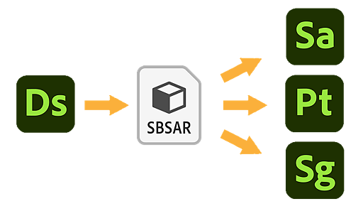

# Send to...  Interoperability

{width="512px"}

Adobe Substance 3D Designer has interoperability with [Substance 3D Sampler](https://www.adobe.com/products/substance3d-sampler.html), [Substance 3D Painter](https://www.adobe.com/products/substance3d-painter.html) and [Substance 3D Stager](https://www.adobe.com/products/substance3d-stager.html). It allows you to *send* and *resend* you work over quickly, facilitating iteration across the Substance 3D ecosystem.

The workflow is usually the following:

1. Set the <b>Type</b> attribute in a [Substance graph's properties](../../../compositing-graphs/graph-parameters/graph-parameters.md)
1. In the [Explorer](https://helpx.adobe.com/substance-3d/unlisted/documentation/sddoc/the-explorer-129368147.html) panel, select the package you wish to send
1. In the Explorer's <b>Publish/Send</b> drop-down, select the target application
1. Make changes to graph(s)
1. Repeat step 3 to resend the package and update the existing sent asset with your changes

>[!WARNING]
>
> Interoperability features are *not* available in the <b>Steam</b> version.

<table>
<tr style="border: 0;">
<td style="border: 0;" valign="top">

## Setting the graph type

Substance graphs can have many functionalities. You will have to define in advance what the exact functionality of a graph is, to make sure it can be sent over properly.

In the <b>Attributes </b>section of a [Substance graph's properties](../../../compositing-graphs/graph-parameters/graph-parameters.md), there is a <b>Type</b> option, with a dropdown that has the following options:

</td>
<td style="border: 0;" valign="top">


</td>
</tr>
</table>

* **Unspecified** is the default type if you have not set it. Depending on what application you send to, it might be interpreted differently. [Substance 3D Painter](https://www.adobe.com/products/substance3d-painter.html) will default to Material for example;
* **Standard Material** is for multi-channel PBR materials, with properly labeled [outputs](../../../compositing-graphs/nodes-reference-for-com/atomic-nodes/output/output.md);
* **Decal Material** is for a multi channel PBR material with alpha channel, to be applied as Decal in [Substance 3D Painter](https://www.adobe.com/products/substance3d-painter.html) or [Substance 3D Sampler](https://www.adobe.com/products/substance3d-sampler.html);
* **Atlas Material** is for a multi-channel PBR material consisting of several atlas images, for use with the [Atlas Scatter node](../../../compositing-graphs/nodes-reference-for-com/node-library/material-filters/scan-processing/atlas-scatter/atlas-scatter.md) in Designer or [Substance 3D Sampler](https://www.adobe.com/products/substance3d-sampler.html);
* **Filter** is for general-purpose filters, both used in [Substance 3D Painter](https://www.adobe.com/products/substance3d-painter.html) or [Substance 3D Sampler](https://www.adobe.com/products/substance3d-sampler.html);
* **Mesh-Based Generator** is for multi-input mask generators. This is used only by [Substance 3D Painter](https://www.adobe.com/products/substance3d-painter.html);
* **Texture Generator** is for single-channel maps, like 2D procedurals and noises;
* **Environment Light** is for a single-channel Lighting Environment, used to light scenes and objects;
* **Light texture** is for a single channel texture applied to a physical Light.

<table>
<tr style="border: 0;">
<td style="border: 0;" valign="top">

## 'Send to' menu

The sending process involved [publishing](../../../compositing-graphs/publishing-asset-files/publishing-substance-3d-asset-files-sbsar.md) one or more packages to Substance 3D asset files (SBSAR) behind the scenes.

Sending content may performed in the following ways:

* Right-click on a package and open the <b>Send to...</b> submenu in the contextual menu, then choose the <b>Send to...</b> option for the target application;
* Click on the  <b>Publish/Send</b> button at the top of the [Explorer](https://helpx.adobe.com/substance-3d/unlisted/documentation/sddoc/the-explorer-129368147.html) panel, then choose the <b>Send to...</b> option for the target application.

</td>
<td style="border: 0;" valign="top">


</td>
</tr>
</table>

### Resending

When sending again a package which was *already sent once* to the *same target* application, the asset will be *updated* in the target application with the new version.

## Send to Player

[Substance Player](https://helpx.adobe.com/substance-3d-player/home.html) has support for *both* <b>Substance 3D files</b> (SBS) and <b>Substance 3D assets</b> (SBSAR).

Sending to Player requires that the Substance Player executable is *manually located* by the user, which may be done:

* When prompted if Player was *never located* since Designer was installed;
* At any time in the <b>Tools</b> menu, using the <b>Substance Player &gt; Locate...</b> option.

In Player, receiving from Designer requires that the Substance 3D Designer *installation directory* is manually located by the user, which may be done:

* When prompted if Designer was *never located* since Player was installed;
* At any time in the <b>Options</b> menu, using the <b>Locate Adobe Substance 3D Designer</b> option.

>[!NOTE]
>
> When sending Substance 3D files (SBS) to Player, a Substance 3D asset (SBSAR) is published as a *temporary file*.

## Issues

You might get errors sending packages, such as:

```

Error sending package to Substance 3D Painter. Check the console for details. SBSAR export failed.
```


This usually is because of standard error and warnings, fix them to solve the issue:

* No [output ](../../../compositing-graphs/nodes-reference-for-com/atomic-nodes/output/output.md)nodes defined in your graph. Add output nodes and connect something to them;
* Missing or broken variables in [Get nodes](../../../function-graphs/nodes-reference-for-fun/atomic-function-nodes/get-nodes/get-nodes.md) in [function graphs](../../../function-graphs/function-graphs.md). Track them down by the *yellow warning badge* on impacted nodes.
