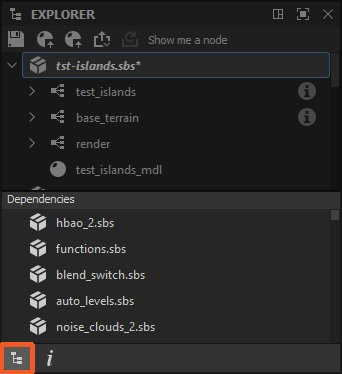

# Explorer

This page describes the Explorer dock in [Substance 3D Designer](https://www.adobe.com/products/substance3d-designer.html). This dock lets you manage packages and their resources.

<table>
<tr style="border: 0;">
<td style="border: 0;" valign="top">

## Overview

The Explorer dock is where you manage your files and resources currently open in Substance 3D Designer. It shows you a list of all packages currently open, with each package expanded as a hierarchy to show [resources ](../../resources/resources.md)inside of it.

The Explorer is where you start and end your projects, as it lets you create, save and export any kind of resource.

</td>
<td style="border: 0;" valign="top">

</td>
</tr>
</table>

You can do a few important actions through the Explorer dock:

* Create new packages and graphs
* Load existing packages
* Save and close loaded packages
* [Import and link resources](../../resources/importing-linking-and-new/importing-linking-and-new-resources.md)
* [Export graph results to textures](../../compositing-graphs/exporting-bitmaps/exporting-bitmaps.md)
* [Publish a package to a Substance 3D asset (SBSAR)](https://helpx.adobe.com/substance-3d/unlisted/documentation/sddoc/publishing-sbsar-file-200574380.html)
* [Send packages to other Substance 3D applications](https://helpx.adobe.com/substance-3d/unlisted/documentation/sddoc/send-to-215286290.html)
* [Bake maps from a mesh](../../bakers/bakers.md)

## Top toolbar

This toolbar lets you quickly perform functions related to your overall workflow. All buttons are *context-aware*, which means they activate and change their behaviour based on your current selection in the Explorer.

<b> Save</b> selected package.

<b>!&#91;&#93;(sendto-icon.jpg) Publish or &#91;send&#93;(send-to-interoperability/send-to-interoperability.md)</b> selected element(s):

* [Publish any selected package to a Substance 3D asset (SBSAR)](../../compositing-graphs/publishing-asset-files/publishing-substance-3d-asset-files-sbsar.md);
* Send the selected package to [Substance 3D Sampler](https://www.adobe.com/products/substance3d-sampler.html), [Substance 3D Painter](https://www.adobe.com/products/substance3d-painter.html) or [Substance 3D Stager](https://www.adobe.com/products/substance3d-stager.html).

<b>!&#91;&#93;(republish.png) Publish or send as previous:</b> Publish or send the selected elements with the same settings as before. This option is only available on a package that has already been published *at least once* in the *current* session.

<b>!&#91;&#93;(graph-cleaner.jpg) Remove unused nodes</b> in selected graph(s). The tool follows these rules:

* The tool is only available if selected items are of the *same type*: only graphs, folders or packages;
* When the selection includes folders or packages, the tool cleans all graphs therein *recursively*;
* If one of the targeted graphs is a [Substance graph](../../compositing-graphs/substance-compositing-graphs.md), a second option is available which lets you clean all parameter functions on nodes in that graph.

Learn more about the tool in the 'Remove unused nodes' section of the [Graph view](../the-graph-view/the-graph-view.md) page.

If the package contains at least one [MDL graph](../../mdl-graphs/mdl-graphs.md), two additional buttons are added in the toolbar:

<b>!&#91;&#93;(mdl-export-module-icon.png) Export MDL module (\*.mdl)</b>

<b>!&#91;&#93;(mdl-export-module-icon.png) Export MDL module archive (\*.mdr)</b>

Learn more about these two options in the [Exporting MDL content](../../mdl-graphs/exporting-mdl-content/exporting-mdl-content.md) section of this documentation.

<table>
<tr style="border: 0;">
<td style="border: 0;" valign="top">

*Publish/Send*

</td>
<td style="border: 0;" valign="top">

*Remove unused nodes*

</td>
</tr>
</table>

## Contextual menus

Most of your interaction with the Explorer is through contextual menus, which are displayed by clicking RMB on an item in the Explorer's tree view.

The available options differ depending on the selected and clicked item(s):

+++Empty space

Empty space is only available below any currently open Packages. Clicking next to existing items is not considered empty space.

New Package: Creates a new empty package;

Open Package: Opens a file dialog to open an SBS file.

+++

+++Package

Newlets you create new graphs (Substance graph,MDL graph,function graph),bitmapandvector graphicsresources, as well asfoldersfor sorting content

[Substance graph](../../compositing-graphs/substance-compositing-graphs.md)

[MDL graph](../../mdl-graphs/mdl-graphs.md)

[function graph](../../function-graphs/function-graphs.md)

[bitmap](../../resources/bitmap-resource/bitmap-resource.md)

[vector graphics](../../resources/vector-graphics-svg-res/vector-graphics-svg-resource.md)

ImportandLinklet you bring inresources

[resources](../../resources/importing-linking-and-new/importing-linking-and-new-resources.md)

Reload,Save, Save asandSave a copy aslet you save to disk or recall from disk a previously saved version of the package.

Publish .sbsar fileandRepublish .sbsar filelet youPublish your uncompiled, unoptimized Substance  graph, into an efficient and portable SBSAR file for us in other Substance applications and Integrations. Publish as Previous repeats the previous Publish action with the same options, skipping the options dialog for faster iteration. The toolbar contains buttons with the same functionality.

[Publish your uncompiled, unoptimized Substance  graph, into an efficient and portable SBSAR file for us in other Substance applications and Integrations](https://helpx.adobe.com/substance-3d/unlisted/documentation/sddoc/publishing-sbsar-file-200574380.html)

Export MDL ModuleandExport MDL Module Archiveoptions let your exportMDL graphsto compiled mdl files, for use in other iRay integrations. These options are only available if a package contains anMDL graph.

[MDL graphs](../../mdl-graphs/mdl-graphs.md)

[MDL graph.](../../mdl-graphs/mdl-graphs.md)

Export with dependenciesis different from saving and publishing. It takes your SBS files, collects all referenced resources and dependencies and creates a self-contained package. The dialog lets you choose what libraries to gather, and if the file should be a compressed archive (7-zip). This is a good choice for sharing an SBS file with someone else, without worrying about missing dependencies.

Send to...opens a sub-menu letting you directlysend your packagetoSubstance 3D Sampler,Substance 3D Painter,Substance 3D StagerorSubstance Player.

[send your package](https://helpx.adobe.com/substance-3d/unlisted/documentation/sddoc/send-to-215286290.html)

[Substance 3D Sampler](https://www.adobe.com/products/substance3d-sampler.html)

[Substance 3D Painter](https://www.adobe.com/products/substance3d-painter.html)

[Substance 3D Stager](https://www.adobe.com/products/substance3d-stager.html)

[Substance Player](https://helpx.adobe.com/substance-3d-player/home.html)

Copycopies the selected package.

Pastepastes copied graphs and/or resourcesintothe selected package.

Close package(s)closes all selected packages

Compute Outputsforces Designer to calculate all outputs of all graphs in the package.

Show In Explorer...opens the location of the package in your OS' file explorer window

Dependency Manageropens the Dependency Manager window for the selected package.

Open Dependenciesopens all dependenies in the Explorer (Substance graphsonly).

[Substance graphs](../../compositing-graphs/substance-compositing-graphs.md)

+++

+++Substance graph

Open:(Return) Opens this graph inthe graph View.

[the graph View](../the-graph-view/the-graph-view.md)

Copy:(Ctrl-C)Copies the current graph to clipboard.

Remove:(Delete) Deletes graph from this package.

Rename:(F2) Rename this graph.

View Outputs in 3D View:Sends this graph's outputs tothe 3D View, to display as a material.

[the 3D View](../3d-view/3d-view.md)

Compute Outputs:Computes this graph's Outputs and keeps them in memory.

Export outputs...:Opens the dialog forexporting to bitmaps.

[exporting to bitmaps.](../../compositing-graphs/exporting-bitmaps/exporting-bitmaps.md)

+++

+++MDL graph

Copy:(Ctrl-C) Copies the current graph to clipboard.

Remove:(Delete) Deletes graph from this package.

Rename:(F2) Rename this graph.

Export Preset:Exports this MDL graph as a preset.

Export as .mdle...:Exports this MDL graph as an encapsulated MDL file.

Set as Material Definition in 3D View:Use this MDL as the material in the 3D View. Works only in iRay, but viewport will automatically switch to iRay when this option is chosen.

+++

+++3D scene resource

Open:(Return) Uses this 3D Mesh inthe 3D View, replacing the standard cube or plane.

[the 3D View](../3d-view/3d-view.md)

Copy:(Ctrl-C) Copies this resource to clipboard.

Paste:(Ctrl-V) Pastes resource from clipboard.

Remove:(Del) Deletes resource from this package.

Rename:(F2) Rename this resource.

Reload:Force reload this mesh from disk.

Show in Explorer:Open a system file browser window at the location of the resource on disk.

Relocate:Change this Resource to be linked to another file.

Bake model information...:Opens theBaking dialog.

[Baking dialog.](../../bakers/bakers.md)

+++

+++Folder

New:Lets you create in the folder new graphs (Substance graph,Substance function graph,MDL graph),bitmapandvector graphicsresources, as well asfoldersfor sorting content.

[Substance graph](../../compositing-graphs/substance-compositing-graphs.md)

[Substance function graph](../../function-graphs/function-graphs.md)

[MDL graph](../../mdl-graphs/mdl-graphs.md)

[bitmap](../../resources/bitmap-resource/bitmap-resource.md)

[vector graphics](../../resources/vector-graphics-svg-res/vector-graphics-svg-resource.md)

ImportandLink:Let you bring inresourcesand place them in the folder.

[resources](../../resources/importing-linking-and-new/importing-linking-and-new-resources.md)

Copy:(Ctrl-C) Copies the folder and all its contents to clipboard.

Paste:(Ctrl-V) Pastes the folder and all its contents from clipboard.

Rename:(F2) Rename this folder.

Remove:(Del)Deletes the folder and all its contents from its package.

Compute Outputs:Computes the outputs of all graphs included in the folder and keeps them in memory.

+++

## Bottom toolbar

The toolbar at the bottom of the Explorer dock provides information about a package or a package resource:

<b>!&#91;&#93;(explorer-dependencies.jpg) Dependencies:</b> When a package is selected, its package dependencies are listed in a dedicated panel.

<b>!&#91;&#93;(explorer-information.jpg) Information:</b> Provides metadata related to the package or resource currently selected:

* Package: the full filepath of the package
* [Bitmap resource](../../resources/bitmap-resource/bitmap-resource.md): the full filepath of the resource, its [ICC profile](../../color-management/color-management.md), image size and [import method](../../resources/importing-linking-and-new/importing-linking-and-new-resources.md) (I.e., *linked* or *imported*)

<table>
<tr style="border: 0;">
<td style="border: 0;" valign="top">

*Dependencies*

</td>
<td style="border: 0;" valign="top">

*Information*

</td>
</tr>
</table>
