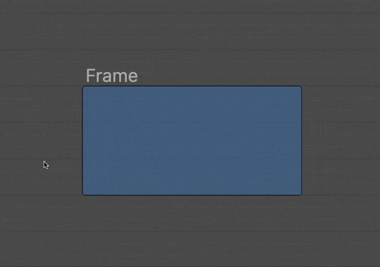
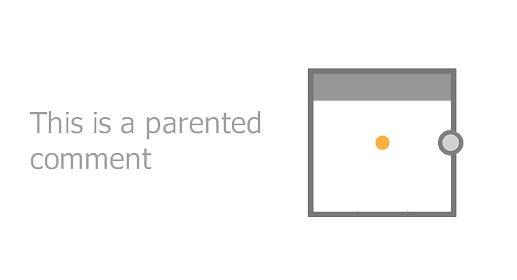

# Frame

<table>
<tr style="border: 0;">
<td width="25.00%" style="border: 0;" valign="top">


</td>
<td width="100.00%" style="border: 0;" valign="top">

A frame eases the readability and layout of graphs, by visually groupingobjects in that graph and letting you easily move all those objects together.

For instance, frames can be named and coloured so that the graph's structure comes out clearly when taking an overview, which is a great help as the complexity of a graph increases.

They can also be annotated and thus function as a documentation tool for explaining why some nodes were set up in a specific way.

</td>
</tr>
</table>

## Appearance

Depending on the position of the mouse cursor or whether it is part of a selection, a frame presents itself in different visual styles to let you know if and how you can interact with it.

+++Default
By default, the frame is a rectangle with rounded corners filled with the color selected in its <b>Frame Color</b> property. A darker shade of that color is applied on the frame's outline.

The title set in the <b>Title</b> property rests in grey on the frame's top left corner.

")


+++

+++Header hover
When hovering the top of the frame, a header bar is displayed.

The frame may be moved by dragging that header bar or its title.

")


+++

+++Selected
When selected, the title and outline of the frame are highlighted in white. The outline gets thicker.

")


+++

## Creating frames

Frames may be added in any graph type, in any of the following ways:

+++Node menu
Press <b>Spacebar</b> in the Graph view to open the <b>Node menu</b>, and select the 'Frame' item in the list.

Type 'frame' in the search field to surface the item and find it more quickly.

+++

+++Shortcut
If a keyboard shortcut is mapped to the 'Frame' item in the [Preferences](../../../preferences-window/preferences-window.md), press that shortcut when the Graph View has focus.

+++

+++Contextual menu
In the Graph View, press <b>RMB</b> on any object or in empty space and select the <b>Add Frame</b> option.

+++

+++Graph toolbar
In the Graph View toolbar, click the 'Frame' button in the <b>Node Palette</b>.

+++

+++Library
In the Library, select the <b>Graph Items</b> category then drag and drop the 'Frame' item into the Graph View.

+++

### Framing selections

If a selection is active in a graph when a frame is created, that frame will be automatically adjusted to fully include the selected objects.

With that in mind, creating frames using a keyboard shortcut makes it even faster to frame content in a graph.

{width="480px"}

>[!TIP]
>
> When a frame is created, its 'Title' property automatically gains focus so you can immediately edit the frame's title.

## Manipulating frames

<table>
<tr style="border: 0;">
<td style="border: 0;" valign="top">

Frames may be <b>panned</b> by dragging its title or header bar, and <b>resized</b> by dragging any of its borders or corners.

The illustration highlights the interaction zones for panning (blue) and resizing (yellow).

</td>
<td style="border: 0;" valign="top">


</td>
</tr>
</table>

<table>
<tr style="border: 0;">
<td style="border: 0;" valign="top">

### Grid snapping

By default, a frame snaps to the medium grid when moved or resized.

Hold the <b>Ctrl</b> (Windows) / <b>Cmd</b> (macOS) key to shift this snapping to the small grid for finer adjustments.

</td>
<td style="border: 0;" valign="top">



</td>
</tr>
</table>

## Properties

When a frame is selected, the following properties are available in the [Properties](../../../properties/properties.md) dock:

+++Title
The <b>Title</b> resting on the top left of the frame. Its visibility of the title can be toggled on or off by using the <b>Title Visible</b> property.

The size of the title can be locked at a minimum screen size so its stays readable when zooming out of the graph. You may do this by checking the 'Frame titles' option in the <b>Information</b> drop down of the [Graph view](../../the-graph-view.md) toolbar.

{width="640px"}


+++

+++Description
The <b>Description</b> is an optional, additional piece of text that may be used to annotate the frame's content.

The text can be formatted using HTML tags. This formatting is toggled by clicking the  <b>HTML markup</b> button.

Learn more in the section below.

{width="640px"}


+++

+++Color
The <b>Frame Color</b> is used to fill the frame in the Graph view. Use the color picker to select any color.

The color's alpha channel control the *opacity* of the frame, where a value of 0 means the frame is fully transparent.

{width="640px"}


+++

## Description

A frame can be annotated with a text that will be placed inside the frame. The text is aligned to the left and starts in the frame's top left corner. Use the frame's  property to edit that text.

<table>
<tr style="border: 0;">
<td style="border: 0;" valign="top">

### Standard

The <b>Title</b> is shown in a bold font resting on the top left of the frame. The visibility of the title can be toggled on or off.

Its size can be locked at a minimum screen size so its stays readable when zooming out of the graph. You may do this by checking the 'Frame titles' option in the <b>Information</b> drop down of the [Graph view](../../the-graph-view.md) toolbar.

</td>
<td style="border: 0;" valign="top">

"){zoomable="yes"}

</td>
</tr>
</table>

<table>
<tr style="border: 0;">
<td style="border: 0;" valign="top">

### HTML formatting

Text can be formatted using HTML tags in the frame's <b>Description</b> property. Formatting must be enabled by using the  <b>HTML markup</b> button in that same property.

</td>
<td style="border: 0;" valign="top">

"){zoomable="yes"}

</td>
</tr>
</table>

You may copy and paste this sample in the frame's Description property to test this feature for yourself:

```

<h2>HTML formatting</h2>

<p>This is a description formatted using <b>HTML markup</b>.</p>

<p>Formattig text makes it more <i>pleasant</i>, <font color="#CC8822">impactful</font> and <code>clearly structured</code> for users.</p>

<p>  Images are also supported! <sup>How nice!</sup></p>
```


Here is a list of useful tags for formatting text:

+++HTML formatting tags

|  |  |
| --- | --- |
| Bold | &lt;b&gt;...&lt;/b&gt; |
| Italic | &lt;i&gt;...&lt;/i&gt; |
| Color | &lt;font color="#4A567C"&gt;...&lt;/font&gt; |
| Paragraph | &lt;p&gt;...&lt;/p&gt; |
| Line break | &lt;br&gt; |
| Headings | &lt;h1&gt;...&lt;/h1&gt;, &lt;h2&gt;...&lt;/h2&gt;, etc. |
| Image | &lt;img src="{path\_to\_image}"&gt; |
| Superscript | &lt;sub&gt;...&lt;/sub&gt; |
| Unordered list (bullets) | &lt;ul&gt;   &lt;li&gt;...&lt;/li&gt;   &lt;li&gt;...&lt;/li&gt;  &lt;/ul&gt; |
| Ordered list (numbers) | &lt;ol&gt;   &lt;li&gt;...&lt;/li&gt;   &lt;li&gt;...&lt;/li&gt;  &lt;/ol&gt; |
| Code | &lt;code&gt;...&lt;/code&gt; |


+++

## Inclusion rules

An object is considered included in a frame if it meets its inclusion rule. These rules vary according to the object and special case. They are listed below.

The yellow symbol in each illustration represents the point or area that needs to be entirely within a frame's bounds for an object to be included in that frame.

+++Nodes
The <b>center point</b> is used.

Badges, connectors and information displayed below the node are all ignored.

Nodes may be of different heights, depending on their number of input or output connectors.

As connectors are displayed or hidden, added or removed, the node's height adjusts from its *center*.

Therefore, the location of a node's center point should not change until it is *deliberately moved*.


The <b>c</b><b>enter point</b> of the *host* node is used.

The host node is the node that a node is docked into.

If multiple nodes are docked into a chain, the host node of the last docked node is used for the entire chain.

Badges, connectors and information displayed below the node are all ignored.


+++

+++Dot nodes
The <b>center point</b> of the Dot is used.

Connectors, portal icons and names are all ignored.


+++

+++Comments
The <b>center point</b> of the comment's *bounding box* (yellow outline) is used.

Parented comments do not follow the inclusion rules for comments.

Instead, the <b>center point</b> of the *parent* node is used.

Badges, connectors and information displayed below the node are all ignored.





+++

+++Pins
The <b>tip</b> of the pin icon is used.


+++

+++Frames
The <b>bounding box</b> of the nested frame is used.

This means a nested frame must be entirely within another frame's bounds to be included in the latter.

The title is ignored.


+++

## Fit size to content


As you make adjustments in your graph, a frame may not be gracefully adjusted to its content anymore. In this case, it is possible to automatically adjust the position and size of the frame so it adjusts to the span of its content, with a padding of one medium grid cell.

To do this, click <b>RMB</b> on the frame's title or header bar – see – and select the <b>Fit Size to Content</b> option in the contextual menu.

>[!NOTE]
>
> The option is available if at least *one* graph object meets the frame's [inclusion rules](frame.md).

<table>
<tr style="border: 0;">
<td style="border: 0;" valign="top">

### Fitting the description text

If the frame has a description, its is adjusted to make use of any empty space next to the description, if possible.

If no included object can be fit into that space, the frame's height is adjusted further to accommodate the description.

</td>
<td style="border: 0;" valign="top">

")

</td>
</tr>
</table>

+++Example
"){width="640px"}


+++

## Auto-expand


As the graph grows, the frames' content may need to be rearranged. Nodes may shift to make room for additions or content may need to be spaced out more to promote readability.

To facilitate these adjustments, it is possible to automatically expand a frame when moving : hold <b>Shift</b> at any point while moving an object to have the frame borders automatically adjust to keep that object within their bounds.

This also applies to selections that may include multiple objects. In that case, each object's host frame will be adjusted simultaneously.

If an object is not fully enclosed by the frame's bounds but still satisfies its , the frame is adjusted to fully enclose it with an additional padding of one medium grid cell as soon as the <b>Shift</b> key is pressed.

>[!NOTE]
>
> While the <b>Shift</b> key may be pressed or released at any point during the move to trigger or cancel the automatic adjustment of the frame, it *must* be held when completing the move to effectively apply the adjustment.

+++Example
"){width="640px"}


+++
