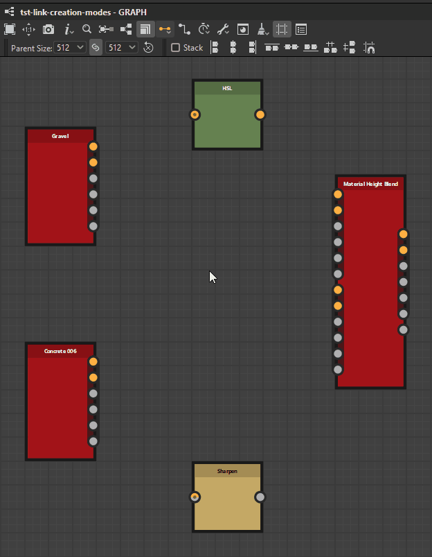
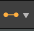
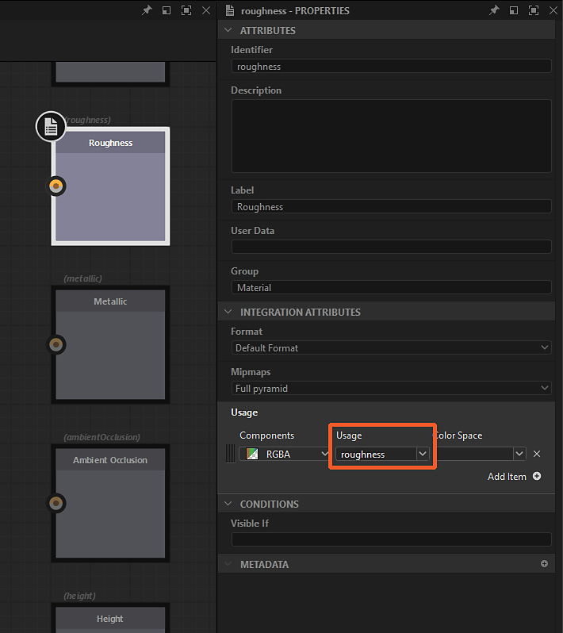

# Link creation modes

In [Substance graphs](../../../compositing-graphs/substance-compositing-graphs.md), you may connect nodes using one of 3 <b>link creation modes</b>:

<table>
<tr style="border: 0;">
<td style="border: 0;" valign="top">

{zoomable="yes"}

*Click to enlarge*

<b>!&#91;&#93;(image2020-10-6-19-40-25.png) Standard</b> (1)

No conditions are enforced.

</td>
<td style="border: 0;" valign="top">

{zoomable="yes"}

*Click to enlarge*

 <b>Material</b> (2)

Inputs and outputs are matched based on their usages.

If only one of the two has a usage, the connection is performed as in Standard mode.

</td>
<td style="border: 0;" valign="top">

{zoomable="yes"}

*Click to enlarge*

 <b>Compact Material</b> (3)

Same as Material.

Inputs and outputs belonging to a same *group* are collapsed.

</td>
</tr>
</table>

You can switch between modes at any moment in the graph toolbar by clicking on the  <b>Link creation mode</b> button or with the keyboard shortcuts listed above.

In <b>Material</b> and <b>Compact Material</b> modes, connections beteen inputs and outputs with *non-matching usages* are prohibited.

## The modes

|  | 

 Standard | 

 Compact | 

 Compact Material |
| --- | --- | --- | --- |
| <b>Inputs</b> | All inputs are visible | All inputs are visible | Only 1 input per group |
| <b>Outputs</b> | All outputs are visible | All outputs are visible | Only 1 output per group |
| <b>Links</b> | All links are visible | All links are visible | Only 1 link per group (green) |
| <b>Connections</b> | You connect links one by one | You connect links together as a multi-link material group based on matching usages.   When a usage is present on one end, the connection is a Standard one. | You connect links together as  a single-link material group. |

## Assigning groups

<table>
<tr style="border: 0;">
<td width="100.00%" style="border: 0;" valign="top">

You should assign groups to the graph's <b>Input</b> and <b>Output</b> nodes in order to use the <b>Material</b> and <b>Compact material</b> modes.

You assign a group in the <b>Attributes</b> parameters of the node, by filling the group name in the <b>Group</b> property. A group can be any string value, and links will be grouped if they share the *exact same*, case-sensitive group name.

Grouped inputs and outputs of a graph are denoted visually by being *enclosed in a dark capsule* on node instances referencing that graph.

</td>
<td width="25.00%" style="border: 0;" valign="top">

{zoomable="yes"}

</td>
</tr>
</table>

<table>
<tr style="border: 0;">
<td width="25.00%" style="border: 0;" valign="top">

</td>
<td width="100.00%" style="border: 0;" valign="top">

{zoomable="yes"}

*Click to enlarge*

</td>
<td width="25.00%" style="border: 0;" valign="top">

</td>
</tr>
</table>

## Link matching with usage

Once links are grouped, individual inputs need to be matched with outputs. This is done through the <b>Usage</b> attribute of <b>Input</b> and <b>Output</b> nodes. If the usage between both input and output *matches*, a link will be created. If no matching usage is found, no link is made.

<table>
<tr style="border: 0;">
<td width="25.00%" style="border: 0;" valign="top">

</td>
<td width="100.00%" style="border: 0;" valign="top">

{zoomable="yes"}

*Click to enlarge*

</td>
<td width="25.00%" style="border: 0;" valign="top">

</td>
</tr>
</table>
