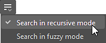
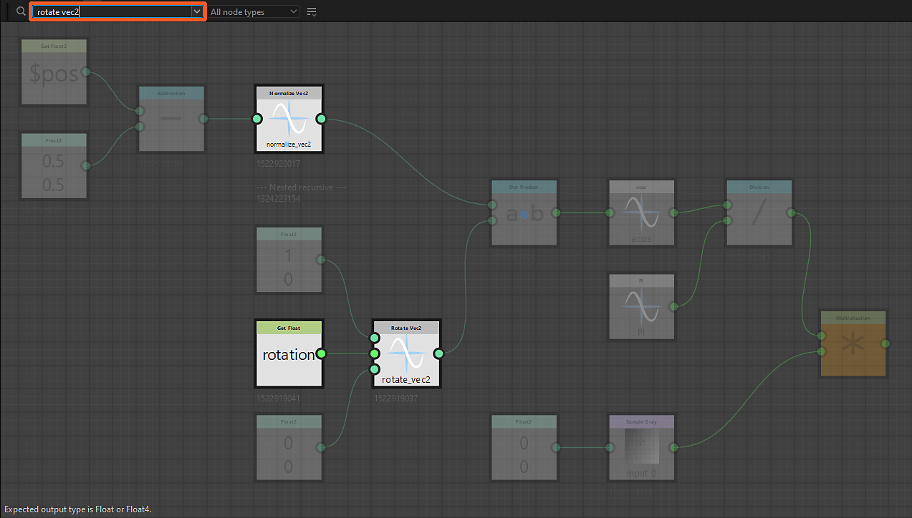

# Node finder

{zoomable="yes"}

The Node Finder tool lets you perform a <b>search for nodes and variables</b> using a text query. All nodes that do not match the query are dimmed to make the results stick out.

The query can match any of those criteria:

* An <b>identifier of a graph</b> referenced by an instance node
* An <b>identifier of an exposed parameter or variable</b> used in a node parameter function
* A node's <b>UID</b> (unique identifier)
* A node's <b>label</b>

The search can traverse [graph instances](../../../compositing-graphs/creating-compositing-gra/graph-instances-sub-gra/graph-instances-sub-graphs.md) recursively so nodes and variables can be found across [subgraphs](../../../compositing-graphs/creating-compositing-gra/graph-instances-sub-gra/graph-instances-sub-graphs.md). If you are unsure about the exact term you need to search, a fuzzy search option is available to apply a tolerance to the query.

## Interface

The Node Finder can be accessed in two ways:

In the Graph View, press <b>Ctrl+F</b> (Windows) / <b>Cmd+F</b> (macOS) to display the Node Finder toolbar and automatically set the focus on the query field. This lets you perform a search quickly.

In the Graph View toolbar, click the <b>Node Finder button !&#91;&#93;(graph-node-finder.png)</b> to display the Node Finder toolbar. Once displayed, the toolbar is only closed by clicking this button.

<b>Searches traverse graphs</b>. In other words, a search remains active when opening graphs through these actions:

* Instance node: Open reference in context (Ctrl+E / Cmd+E) (*Note:* graph editing in context needs to be enabled in Edit &gt; Preferences &gt; Graph)
* Pixel Processor: Edit function (Ctrl+E / Cmd+E)
* Value Processor: Edit function (Ctrl+E / Cmd+E)
* FX-Map: Edit FX-Map graph (Ctrl+E / Cmd+E)
* Node parameters: Edit function

{zoomable="yes"}

### Search query

{zoomable="yes"}

The search terms can be typed into this field and the arrow button opens a list of query suggestions which include some of the variables available in the current context.

Learn more about the queries you can perform in the  section below.

### Node type

{zoomable="yes"}

This combobox lets you filter search results to only retain a specific type of nodes.

Note that all instance nodes are the *same type* of node – indeed, the 'instance' type – while atomic nodes each are their own type.

+++Node type lists

The list is contextual to the current graph type.

Node types for compositing graphs

Node types for function graphs

+++

+++Searching for atomic nodes

Searching for the 'Levels' node type in a Substance graph

+++

+++Searching for instance nodes

Searching for the 'Instance' node type in a Substance graph

Searching for the 'Instance' node type in a Substance function graph

+++

### Search options

<table>
<tr style="border: 0;">
<td width="100.00%" style="border: 0;" valign="top">

The <b>Search options button !&#91;&#93;(node-finder-search-options.png)</b> opens a list of settings used for searching that can be toggled on and off.

Learn more about these options in the  section below.

</td>
<td width="33.33%" style="border: 0;" valign="top">

{zoomable="yes"}

</td>
</tr>
</table>

## Search query

To find nodes, a text query is matched against the node properties listed below.

>[!NOTE]
>
> Your query should be typed with the following caveats in mind:
> 
> * Search is not case-sensitive. E.g., 'my node label' and 'My Node Label' return the same results.
> * Whitespaces before and after the query are ignored.
> * Multiple queries cannot be performed at the same time in the same graph. E.g., 'levels blur' will not match both 'Levels' and 'Blur' nodes. Likewise, logical operators are not supported.

<table>
<tr style="border: 0;">
<td width="100.00%" style="border: 0;" valign="top">

### Instance graph identifiers

[Instance nodes](../../../compositing-graphs/creating-compositing-gra/graph-instances-sub-gra/graph-instances-sub-graphs.md) can be found using the <b>identifier</b> of the graphs they reference.

</td>
<td width="33.33%" style="border: 0;" valign="top">

{zoomable="yes"}

*Click image to enlarge*

</td>
</tr>
</table>

+++Identifier in Explorer

Graphs are listed by their identifiers in the Explorer.

+++

+++Identifier in instance node's tooltip

The tooltip of instance nodes includes the identifier of their referenced graph.

+++

<table>
<tr style="border: 0;">
<td width="100.00%" style="border: 0;" valign="top">

### Exposed parameters and variables

The identifier of [exposed parameters](../../../compositing-graphs/manage-parameters/exposing-a-parameter/exposing-a-parameter.md), or any other variable, can be searched directly.

</td>
<td width="33.33%" style="border: 0;" valign="top">

{zoomable="yes"}

*Click image to enlarge*

</td>
</tr>
</table>

+++Query suggestions

The query field can be expanded to reveal a list of suggestions.

These includebuilt-in variablesavailable for the current graph type, as well as the identifiers of the graph's exposed parameters.

[built-in variables](../../../function-graphs/variables/system-variables/system-variables.md)

The identifier of exposed parameters can also be copied or edited directly in theSubstance graph properties.

[Substance graph properties](../../../compositing-graphs/graph-parameters/graph-parameters.md)

Click image to enlarge

+++

+++Searching a variable from a Console warning/error

When a graph has errors or warnings raised by avariableused by a node, go toWindows &gt; Consoleto display the full error/warning message which will include the variable. You may then copy and paste this variable into the Node Finder query field to quickly locate the node causing the issue.

Variables can also be copied directly from the XML data in the SBS file using any text editor.

+++

+++Get/Set nodes

When searching a variable in a graph – including exposed parameters – the search will highlight all nodes where aGetorSetnode uses that variable in any of the node's parameter functions.

[Get](../../../function-graphs/nodes-reference-for-fun/atomic-function-nodes/get-nodes/get-nodes.md)

[Set](../../../function-graphs/fxmaps/using-functions-in-fxmaps/using-the-set-sequence/using-the-set-sequence-nodes.md)

+++

<table>
<tr style="border: 0;">
<td width="100.00%" style="border: 0;" valign="top">

### Node UID

Each node in a graph has a unique identifier number (UID) that can be used to search for that node.

</td>
<td width="33.33%" style="border: 0;" valign="top">

{zoomable="yes"}

*Click image to enlarge*

</td>
</tr>
</table>

+++Copying a node's UID

A node's UID can be copied to the clipboard from its contextual menu.

The action copies the UID in this format:

uid=1234567890

+++

+++Searching a node UID from a Console warning/error

When a graph has errors or warnings raised by a node, go to Windows &gt; Console to display the full error/warning message which will include the node'sUID. You may then copy and paste this UID into the Node Finder query field to quickly locate the node causing the issue.

Node UIDs can also be copied directly from the XML data in the SBS file using any text editor.

+++

### Node Label

Nodes can also be found using their labels.

Searching for specific nodes is particularly effective when using their exact label with fuzzy search turned off.

## Search options

<table>
<tr style="border: 0;">
<td width="100.00%" style="border: 0;" valign="top">

The <b>Search options button !&#91;&#93;(node-finder-search-options.png)</b> lets you toggle the <b>recursive</b> and <b>fuzzy</b> modes for searching nodes.

Both can be enabled at the same time.

</td>
<td width="33.33%" style="border: 0;" valign="top">

{zoomable="yes"}

</td>
</tr>
</table>

### Recursive mode

Enable this option to have searches traverse [graph instances](../../../compositing-graphs/creating-compositing-gra/graph-instances-sub-gra/graph-instances-sub-graphs.md) to include results from [subgraphs](../../../compositing-graphs/creating-compositing-gra/graph-instances-sub-gra/graph-instances-sub-graphs.md).

This option may be essential when troubleshooting graphs, if you need to find a node by its UID acquired from a warning or error message in the Console.

{zoomable="yes"}

*The query on the right highlights the instance node below, because its referenced graph on the left has matches for that query*

+++Example 1

An instance node references a graph where multiple nodes match the query.

+++

+++Example 2

Enabling the 'Recursive search' option highlights the instance node referencing a graph where a Pixel Processor node uses a variable matching the query.

+++

### Fuzzy mode

If you are unsure about the exact spelling of a query, this options enables a <b>tolerance</b> in the results.

Note that using this option will likely result in undesired matches.

{zoomable="yes"}
