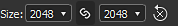

# Graph view

This page presents the Graph view dock of Substance 3D Designer.

The graph view is the main window of [Substance 3D Designer](https://www.adobe.com/products/substance3d-designer.html), where you author and edit your graphs. The graph view has two main areas: a toolbar at the top, providing quick access to certain functions, and the actual graph area where nodes are placed.

The graph view is used for all graph types, but differs slightly between [Substance graphs](../../compositing-graphs/substance-compositing-graphs.md), [function graphs](../../function-graphs/function-graphs.md), [MDL graphs](../../mdl-graphs/mdl-graphs.md) and [FX-Map graphs](../../function-graphs/fxmaps/fxmaps.md), mainly in the toolbar area.

## Viewport navigation

The graph may be navigated using the following actions:

* <b>Pan:</b> MMB / Ctrl+RMB
* <b>Zoom:</b> MouseWheel / Alt + RMB

Using a trackpad (macOS only)

* <b>Pan: </b>Two-finger swipe
* <b>Zoom:</b> Two-finger pinch / Two-finger swipe while holding Cmd

>[!NOTE]
>
> Zoom direction
> 
> Each of the zooming methods is inverted with the other:
> 
> * Mouse wheel up *pulls* the graph view closer
> * Alt+RMB and drag up *pushes* the graph view away
> 
> The zoom direction can be inverted in the [Preferences](../preferences-window/preferences-window.md).

You <b>focus</b> on the selected node(s), or the whole graph if nothing is selected, with the F key.

Navigation can also happen by using <b>Navigation pins </b>and the F2 key, see below[.](graph-items/graph-items.md)

## Moving objects

Click LMB on a object (I.e., a node or graph item) then hold and drag the cursor to <b>move a node</b> around the graph. If more than one object is selected, all selected objects are moved along with the one under the cursor.

If the cursor <b>reaches a border</b> of the Graph View while moving objects, the view is panned in the direction of the cursor. Note that the pan is faster as the cursor moves further away from the border.  
This also applies to drawing selection boxes across Graph View borders.

By default, objects are <b>snapped to the grid</b> as they are moved. Hold Ctrl (Windows) / ⌘ (macOS) while moving objects to disable that snapping.

## Graph items

Several helper objects are available to help organise and navigate the graph, especially when as it grows into a complex network of nodes which can be challenging to read:

<b>Dot nodes</b> let you reroute and merge connections, and can be used as <b>portals</b> to hide long or unwieldy connections;

<b>Frames</b> helps you group nodes with a visible title and color-coding;

<b>Comments</b> let you keep track of the purpose of a node or group of nodes, and make any other helpful annotations;

<b>Navigation pins</b> enable the ability to quickly jump to points of interest in the graph.

>[!NOTE]
>
> Learn more in the [Graph items](graph-items/graph-items.md) section of this documentation.

## Graph contextual menu

When clicking RMB in empty space in the graph, a contextual menu appears and can include the following options:

<b>Add node:</b> Open the Node menu to add a node in the graph;

<b>Add comment:</b> Add an unparented [Comment](graph-items/graph-items.md) graph object;

<b>Add frame:</b> Add a [Frame](graph-items/graph-items.md) graph object;

<b>Add pin:</b> Add a [Pin](graph-items/graph-items.md) graph object;

<b>Add Dot node:</b> Add a [Dot](graph-items/graph-items.md) node;

<b>View outputs in 3D view:</b> Assign all the graph's outputs to a material in the [3D view](../3d-view/3d-view.md) by matching usages, see below;

<b>Reset and view outputs in 3D view:</b> Reset a material in the [3D view](../3d-view/3d-view.md) and assign all the graph's outputs to that material by matching usages, see below;

<b>View output in 2D view:</b> Display one of the graph's outputs in the [2D view](../2d-view/2d-view.md), see below;

<b>Compute node thumbnails:</b> Trigger the computation of the result of all nodes in the graph – which will be stored in the [image cache](../preferences-window/preferences-window.md) – and use their first output as their thumbnail;

<b>Clear nodes thumbnails:</b> Clear the [image cache](../preferences-window/preferences-window.md) containing the result of all nodes in the graph, which in turn clears the node's thumbnails;

<b>Save package:</b> Save the package which contains this graph;

<b>Paste:</b> Paste the nodes currently copied in the clipboard, including their upstream connections, at the cursor's location. If the cursor is not in the Graph View viewport, the nodes are placed at the center of the viewport.

<b>Paste without link:</b> Paste the nodes currently copied in the clipboard, excluding their upstream connections, at the cursor's location. If the cursor is not in the Graph View viewport, the nodes are placed at the center of the viewport.

<b>Select all:</b> Select all nodes in the graph;

<b>Previous pin:</b> Navigate to the previous [Pin](graph-items/graph-items.md) object in the graph;

<b>Next pin:</b> Navigate to the next [Pin](graph-items/graph-items.md) object in the graph;

<b>Copy selection:</b> Copy the selected node(s), connection(s) and parameter value(s) to the clipboard;

<b>Delete selection:</b> Delete the selected node(s);

<b>Delete and relink:</b> Delete the selected node(s) and replace them by direct connections from their upstream nodes to their downstream nodes, if possible;

<b>Duplicate selection:</b> Duplicate the selected node(s) in the same graph, including their upstream connections, at the cursor's location. If the cursor is not in the Graph View viewport, the nodes are placed at the center of the viewport.

<b>Duplicate selection without link:</b> Duplicate the selected node(s) in the same graph, excluding their upstream connections, at the cursor's location. If the cursor is not in the Graph View viewport, the nodes are placed at the center of the viewport.

<b>Select upstream nodes:</b> Select all nodes upstream of the selected node(s);

<b>Select downstream nodes:</b> Select all nodes downstream of the selected node(s);

<b>Swap links\*:</b> Swap the connections between the selected pair of input and output connectors;

<b>Disable node/selection:</b> Disable the selected node(s) so they have no impact on the result of the stream, see <b>Disabling nodes</b> below.

<b>\*:</b> Only available when the selection includes two links, or three nodes where two of the nodes are connected to inputs of the same third node.

## Working with nodes

Graphs are primarily vessels for nodes which can ingest, generate and modifiy data then output it as the graph's result. Using nodes involve the following concepts and actions.

### Creating AND MANAGING NODES

Nodes can be placed in graphs in 5 ways, regardless of the graph type:

* Clicking or dragging from an icon on the node toolbar (see below). Only [Atomic nodes](../../compositing-graphs/nodes-reference-for-com/atomic-nodes/atomic-nodes.md) can be placed this way.
* Right-clicking on an empty area of the graph, and choosing <b>Add node</b>. Only [Atomic nodes](../../compositing-graphs/nodes-reference-for-com/atomic-nodes/atomic-nodes.md) can be placed this way.
* Dragging a thumbnail from the Library View into the graph View. This method works for[ all types of nodes, including node Instances](../../compositing-graphs/nodes-reference-for-com/node-library/node-library.md).
* Pressing <b>Spacebar</b> to access the <b>Node menu</b>. See below.
* Using the keyboard shortcut mapped to a node. Mapping is performed in the [Preferences window](../preferences-window/preferences-window.md).

If a node is placed when another node is selected, Designer will attempt to automatically connect the new node to the old node.  
This automatic connection always places the new node *after* the old one in the flow.

Removing nodes can be done in two ways, depending on how you want a lost link to be treated:

* Select a node and press Delete, or right-click and choose <b>Delete selection</b>. This breaks all existing connections, potentially leading to broken functionality.
* Select a node and press Backspace, or right-click and choose <b>Delete and relink</b>. This attempts to keep links when possible, preventing broken functionality.

<table>
<tr style="border: 0;">
<td width="100.00%" style="border: 0;" valign="top">

### Node menu

Pressing <b>Spacebar</b> in the Graph View displays the Node menu.

This menu provides access to all nodes in the [Library](../the-library/the-library.md) through a search interface and lets your favorite nodes so they appear on top of the list.

You may use the arrow keys to go through the search results. The lists *loops*, so that using the 'Up' arrow key on the first item goes to the last item.

Search is *fuzzy*, which means it is forgiving of small differences in the search term. E.g., 'Colour' vs 'Color', 'Normalize' vs 'Normalise', etc.

If a *single* node is selected in the graph, or the Node menu is spawned by dragging a node connector, the search results are automatically *filtered* based on the output type.  
For instance, only nodes with a [Primary Input](../../compositing-graphs/inheritance-compositing/inheritance-in-substance-compositing-graphs.md) of type Grayscale are listed for an output of type Grayscale.

</td>
<td width="33.33%" style="border: 0;" valign="top">

</td>
</tr>
</table>

### SELECTING NODES

You may select one or more nodes to copy them, delete them, move them around the graph, etc.

To select a *single* node, place the cursor on the node and click LMB.

To select *multiple* nodes, the several methods are available:

* <b>One-by-one:</b> Hold Ctrl then click LMB on nodes. Unselected nodes are *added* to the selection, while selected nodes are *removed* from the selection;
* <b>Selection box:</b> Click LMB on empty space in the graph, *hold then drag* the cursor to draw a selection box. Nodes *at least partially included* in the box are selected when releasing LMB;
* <b>Upstream:</b> Click RMB on a node and select the <b>Select upstream nodes</b> option: the node and all nodes which are part of streams connected to the node's *inputs* are selected;
* <b>Downstream:</b> Click RMB on a node and select the <b>Select downstream nodes</b> option: the node and all nodes which are part of streams connected to the node's *outputs* are selected.

### Node contextual menu

When clicking RMB on a node, a contextual menu appears and can include the following options:

<b>View output in 2D view:</b> Display one of the node's outputs in the [2D view](../2d-view/2d-view.md), see below;

<b>View in 3D view</b>: Assign all the node's outputs to a material in the [3D View](../3d-view/3d-view.md) by matching usages, see below;

<b>Reset and view in 3D view:</b> Reset a material in the [3D view](../3d-view/3d-view.md) and assign all the node's outputs to that material by matching usages, see below;

<b>View output in 3D view\*:</b> Assign a specific node output to a material in the [3D view](../3d-view/3d-view.md) by matching usages;

<b>Add comment:</b> Create a [Comment](graph-items/graph-items.md) graph object and parent it to this node;

<b>Add frame:</b> Create a [Frame](graph-items/graph-items.md) graph object and fit it to the selected node(s);

<b>Copy info to clipboard:</b> Copy the node's unique identifier (UID) to the clipboard;

<b>Expose parameters:</b> Display the [Expose node parameters](../../compositing-graphs/manage-parameters/exposing-a-parameter/exposing-a-parameter.md) dialog for this node;

<b>Create\*:</b> Create input and/or output nodes for each of this node's inputs and/or outputs;

<b>Open reference\*:</b> Load the graph [referenced by this node](../../compositing-graphs/creating-compositing-gra/graph-instances-sub-gra/graph-instances-sub-graphs.md) as a separate Graph view tab;

<b>Open reference in context\*\*:</b> Load the graph [referenced by this node](../../compositing-graphs/creating-compositing-gra/graph-instances-sub-gra/graph-instances-sub-graphs.md) in the context of the current graph, as a breadcrumb in the existing Graph View tab;

<b>Create graph from selection:</b> Copy the selected node(s) into a new graph;

<b>Copy selection:</b> Copy the selected node(s), connection(s) and parameter value(s) to the clipboard;

<b>Delete selection:</b> Delete the selected node(s);

<b>Delete and relink:</b> Delete the selected node(s) and replace them by direct connections from their upstream nodes to their downstream nodes, if possible;

<b>Duplicate selection:</b> Duplicate the selected node(s) in the same graph including their upstream connections;

<b>Duplicate selection without link:</b> Duplicate the selected node(s) in the same graph excluding their upstream connections;

<b>Select upstream nodes:</b> Select all nodes upstream of the selected node(s);

<b>Select downstream nodes:</b> Select all nodes downstream of the selected node(s);

<b>Swap links\*\*\*:</b> Swap the connections between the selected pair of input and output connectors;

<b>Disable node/selection:</b> Disable the node or selected node(s) so they have no impact on the result of the stream, see <b>Disabling nodes</b> below.

<b>\*</b>: Only available for [graph instance](../../compositing-graphs/creating-compositing-gra/graph-instances-sub-gra/graph-instances-sub-graphs.md) nodes.  
<b>\*\*:</b> Only available for [graph instance](../../compositing-graphs/creating-compositing-gra/graph-instances-sub-gra/graph-instances-sub-graphs.md) nodes and if the <b>Enable in-context editing</b> option is checked in the [Preferences](../preferences-window/preferences-window.md).  
<b>\*\*\*:</b> Only available when the selection includes two links, or three nodes where two of the nodes are connected to inputs of the same third node.

>[!IMPORTANT]
>
> If *RMB* was clicked when the cursor is placed *over a node*, several of these contextual menu options will target *that* node, regardless of whether other nodes are currently *selected* in the graph.
> 
> Therefore, for a consistently predictable outcome it is recommended to always place the cursor over the node which is part of the selection you actually want to target with a contextual menu action.

### Connecting nodes

A node A's *output connector* can be connected to another node B's *input connector*, which will result in node B using the data output by A for performing its computations.

>[!NOTE]
>
> All of a node's connectors do *not* have to necessarily be connected. Leaving connectors bare results in the following:
> 
> * for a *input* connector: the node falls back to a default value set for that input;
> * for an *output* connector: the data is ignored and discarded when the graph is computed.

You may <b>create</b> a new link by clicking LMB on each of those connectors, in *any order*.  
Also, if a node B is created while a node A is selected, then the *first output* of node A will be automatically connected to the *primary input* of node B.

The following operations may be performed on *existing* links:

<b>Delete:</b> Delete links by either clicking LMB on the link and pressing *Delete*<b>, </b>or by Alt-clicking on any connection that has links. Alt-clicking deletes all links on that connection;

<b>Duplicate:</b> Duplicate links by holding Ctrl, clicking LMB on a connector and dragging the cursor. Click LMB on another connector to connect the link;

<b>Move:</b> Links can be picked up and moved from a connector to another by holding Shift, clicking LMB on a connector and dragging the cursor. Click LMB on another connector to connect the link.

### Disabling nodes

>[!NOTE]
>
> This only applies to [Substance graphs](../../compositing-graphs/substance-compositing-graphs.md).

Nodes can be disabled so they have *no effect* in the graph but do not need to be disconnected or deleted.

Disabled nodes have the following behaviour:

* They are displayed with the  <b>Disabled</b> badge*,*a *dashed outline*, and an interior *rerouting* link instead of a thumbnail;
* The nodes will output the data received in their *main input*;
* Disabled nodes can be *chained* together;
* Their properties and connections are *not modified*;
* Their disabled state is *saved* and persists across sessions;
* When publishing to SBSAR, the resulting file takes *into account* the disabled state of nodes – i.e. what you see is what you get.

You can disable a node or a group of selected nodes by using the <b>Shift+D</b> keystroke, or by right-clicking in the graph and selecting the <b>Disable node/Disable selection</b> item in the contextual menu.

>[!IMPORTANT]
>
> Only nodes which match the following criteria may be disabled:
> 
> * The node has at least *one input*
> * The node has only *one output*
> * The *types* of the main input and of the output must *match* – i.e. grayscale to grayscale, color to color
> * All selected nodes must have the *same state* – i.e. all must be enabled, the same rule applies for enabling them

{width="512px"}

## Interacting with the 2D view

>[!NOTE]
>
> This only applies to [Substance graphs](../../compositing-graphs/substance-compositing-graphs.md).

To display a node output in the [2D view](../2d-view/2d-view.md), double-click LMB on a node, or click RMB on the node and select the option in the contextual menu. If the node has more than one output, select the desired output in the submenu.

You may display any of the graph outputs in the 2D view by clicking RMB on an empty area in the [Graph view](https://substance3d.adobe.com/), and selecting the option in the contextual menu. If the graph has more than one output, select the desired output in the submenu.

## Interacting with the 3D view

>[!NOTE]
>
> This only applies to [Substance graphs](../../compositing-graphs/substance-compositing-graphs.md).

To apply an node output in the [3D view](../3d-view/3d-view.md), click RMB on a node and select the <b>View in 3D view</b> option in the contextual menu. If the node has more than one output, select the desired output in the submenu. Then choose a target channel of the shader currently used in the 3D view.

(*[Substance graph](../../compositing-graphs/substance-compositing-graphs.md) only*) You may apply all the graph outputs in the 3D view by clicking RMB on an empty area in the Graph view, and selecting the <b>View Outputs in 3D view</b> option in the contextual menu. Make sure one or more [Output](../../compositing-graphs/nodes-reference-for-com/atomic-nodes/output/output.md) nodes are present in the graph and that it is [set up correctly](../../compositing-graphs/nodes-reference-for-com/atomic-nodes/output/output.md).

## Toolbars

>[!NOTE]
>
> The full list only applies to [Substance graphs](../../compositing-graphs/substance-compositing-graphs.md). Other graph types have a *limited set* of these options.

### Graph tools

The main toolbar can be found in every graph type, and provides general functions, as well as toggles for the visibility of the other toolbars. You can find these functions:

<b>!&#91;&#93;(image2020-6-26-16-25-57.png) Focus selection</b> (F)  
Focus view on selection, or whole scene if selection is empty.

<b>!&#91;&#93;(image2020-6-26-16-26-8.png) Reset zoom</b> (Z)  
Bring back the current zoom level to it's default state, and centers the view on the middle of the graph. Can mean zooming in or out.

<b>!&#91;&#93;(image2020-6-26-16-26-26.png) Export Graph view  
</b>Exports the full graph at a 1:1 resolution as an image. Useful for sharing a screenshot of your entire graph.

<b>!&#91;&#93;(image2020-6-26-16-26-37.png) Node information  
</b>*- Display connector name:* Toggles the name display of each individual connector on a node.  
*- Display node result:* Toggles the display of numerical values in nodes ([MDL graph](../../mdl-graphs/mdl-graphs.md) only).  
*- Display node badges:* Toggles node Badges on all nodes.  
*- Display node size:* Toggles node resolution display ([Substance graph](../../compositing-graphs/substance-compositing-graphs.md) only).  
*- Display timings:* Toggles display of millisecond timings for each node ([Substance graph](../../compositing-graphs/substance-compositing-graphs.md) only).  
*- Limit text scaling when zooming out:* Keeps the text of [graph items](graph-items/graph-items.md) at a constant screen size past a zoom threshold, which keeps the text clearly visible when zooming out.

<b> Node finder</b> (Ctrl+F)  
Enables a tool to find nodes, exposed parameters and other variables in the graph. Learn more in the [dedicated page](node-finder/node-finder.md).

<b>!&#91;&#93;(image2020-6-26-16-27-43.png) Highlight flow  
</b>Highlight any nodes connected before, or after the currently selected node. Good for tracing a complex path of nodes.

<b>!&#91;&#93;(image2020-6-26-16-28-30.png) Node palette  
</b>Shows or hide the node toolbar, see below.

<b>!&#91;&#93;(image2020-6-26-16-32-33.png) Rectangle links  
</b>Switch between rounded or rectangular-shaped links between nodes. Not available for [FX-Maps.](../../compositing-graphs/nodes-reference-for-com/atomic-nodes/fx-map/fx-map.md)

<b>!&#91;&#93;(image2020-6-26-16-38-2.png) Node alignment tools  
</b>Enables tools to arrange selected nodes in the graph. Learn more in the [dedicated page](node-alignment-tools/node-alignment-tools.md).

Only on [Substance graphs](../../compositing-graphs/substance-compositing-graphs.md):

<b>!&#91;&#93;(image2020-6-26-16-29-6.png) Parent size  
</b>Toggles display of the Parent Resolution control settings, see below.

<b>!&#91;&#93;(image2020-6-26-16-31-15.png) Link Creation Modes</b> (1, 2, 3)  
Choose between Standard (1), Material (2) and Compact Material (3) link creation modes to link node connectors individually or in batch. Learn more in the [dedicated page](link-creation-modes/link-creation-modes.md).

<b>!&#91;&#93;(image2020-6-26-16-33-35.png) Timings control  
</b>Lets you reset all nodes and reset all timings.

<b>!&#91;&#93;(image2020-6-26-16-34-12.png) Tools  
</b>*- Clean:* Removes all nodes which are part of a stream not connected to an [Output](../../compositing-graphs/nodes-reference-for-com/atomic-nodes/output/output.md) node.  
*- Export outputs:* Opens the [Bitmap Export interface](../../compositing-graphs/exporting-bitmaps/exporting-bitmaps.md).  
*- Reexport outputs:* Performs the previous export operation again.  
*- PSD Exporter:* Opens[the PSD Exporter interface.](https://helpx.adobe.com/substance-3d/unlisted/documentation/sddoc/exporting-psd-186974407.html)

<b>!&#91;&#93;(image2020-6-26-16-37-16.png) Node image cache  
</b>Toggles display of the node image cache toggle, see below.

<b>!&#91;&#93;(graph-cleaner.jpg) Remove unused nodes  
</b>Displays options for removing unused nodes in graphs, see below.

### Node palette

The node toolbar differs depending on the graph type:

<b>&#91;Substance graphs&#93;(../../compositing-graphs/substance-compositing-graphs.md):</b> see [atomic nodes](../../compositing-graphs/nodes-reference-for-com/atomic-nodes/atomic-nodes.md) and [graph items](graph-items/graph-items.md).

<table>
<tr style="border: 0;">
<td width="100.00%" style="border: 0;" valign="top">

<b>&#91;Substance function graphs&#93;(../../function-graphs/function-graphs.md)/&#91;MDL graphs&#93;(../../mdl-graphs/mdl-graphs.md):</b> see [graph items](graph-items/graph-items.md).

</td>
<td width="25.00%" style="border: 0;" valign="top">

</td>
</tr>
</table>

<table>
<tr style="border: 0;">
<td width="100.00%" style="border: 0;" valign="top">

<b>&#91;FX-Map graphs&#93;(../../compositing-graphs/nodes-reference-for-com/atomic-nodes/fx-map/fx-map.md):</b> see [graph items.](graph-items/graph-items.md)

</td>
<td width="33.33%" style="border: 0;" valign="top">

</td>
</tr>
</table>

### Parent size

<table>
<tr style="border: 0;">
<td width="100.00%" style="border: 0;" valign="top">

This toolbar is only available in [Substance graphs](../../compositing-graphs/substance-compositing-graphs.md), and sets the [Output size](../../compositing-graphs/output-size/output-size.md) of the graph's *parent*, which impacts the graph's Output size if it uses the *Relative to parent* [inheritance method](../../compositing-graphs/inheritance-compositing/inheritance-in-substance-compositing-graphs.md).

</td>
<td width="25.00%" style="border: 0;" valign="top">

</td>
</tr>
</table>

Horizontal and vertical size are linked by default, but can be *unlinked* for non-square textures. Values can also be reset to the default value of 256 x 256.

### Node image cache

<table>
<tr style="border: 0;">
<td width="100.00%" style="border: 0;" valign="top">

This toggle the use of cache when computing nodes in [Substance graphs](../../compositing-graphs/substance-compositing-graphs.md).

</td>
<td width="25.00%" style="border: 0;" valign="top">

</td>
</tr>
</table>

When a node is computed, its output images are stored in memory – i.e., cache – so they can be *reused* when recomputing the graph if this node is not impacted by a change. This means only the part of the graph which actually changes gets recomputed.

The memory storage limit of this cache can be changed in the <b>General</b> section of the [Preferences](../preferences-window/preferences-window.md), under the <b>Memory</b> section.

Enabling this option results in a large boost to the overall responsiveness of graph computations, at the cost of a significant increase of Designer's memory usage.

### Remove unused nodes

<table>
<tr style="border: 0;">
<td width="100.00%" style="border: 0;" valign="top">

As you iterate in graphs and try things, some nodes which have no effect on the final result can get left behind. This adds clutter as well as wasteful computation since all nodes are evaluated in the first stages of graph rendering.

</td>
<td width="33.33%" style="border: 0;" valign="top">

</td>
</tr>
</table>

The <b>!&#91;&#93;(graph-cleaner.jpg) Remove unused nodes</b> tool deletes all nodes that are *not* part of a stream which *ends in an output* node. The only exception is *input* nodes since deleting these would change the interface of [instance nodes](../../compositing-graphs/creating-compositing-gra/graph-instances-sub-gra/graph-instances-sub-graphs.md) referencing this graph.

The first option applies the cleaning to the *current* graph exclusively.

If the current graph is a [Substance graph](../../compositing-graphs/substance-compositing-graphs.md), a second option is enabled which lets you *include all node parameter functions* in the cleaning process. This means if a [function graph](../../function-graphs/function-graphs.md) controlling a node parameter value has unused nodes, then that graph will be cleaned as well following the same rules.

After the cleaning has completed, a report dialog is displayed. You will find more details in the <b>Console</b>, as logs tagged `GraphCleaner`. These logs will include the number of removed nodes per graph and parameter functions.

Cleaning can be undone across all impacted graphs as a *single* action.
