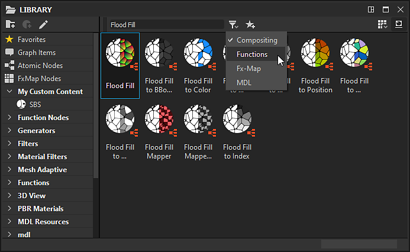

# The Library

This page presents the **Library** panel of Substance 3D Designer, its layout as well as the tools it offers for searching and filtering content.

## Overview

The <b>Library</b> panel is a split-view *resource manager*, where you can find and gather all your *assets* you need to work with in your graph.

It monitors *folders* on your hard drive or over a network which are added to the list of [Library watched paths](https://docs.substance3d.com/display/SDDOC/Project+Settings#ProjectSettings-proj-libraryLibrary) in the [Project Settings](../../interface/preferences-window/project-settings/project-settings.md). Any changes happening in those folders – addition, removal and update of content – are *carried over* to the <b>Library</b>.

>[!WARNING]
>
> **About custom content**
> 
> While your custom resources will be added to the **Library**, it might not be visible because of the filtering rules set for the existing categories. We recommend creating your own filters organised in folders, to ensure your content can be reliably found while working on your projects.  
> See the [Managing custom content and filters](https://helpx.adobe.com/substance-3d/unlisted/documentation/sddoc/creating-library-filters-for-projects-170459772.html) section of the documentation for more information.

The **Library** can monitor all assets which are supported [Resources](../../resources/resources.md):

* Graphs from [Substance Packages](../../getting-started/overview/overview.md) (SBS) and [Substance Archives](../../getting-started/overview/overview.md) (SBSAR)
* [Bitmap images](../../resources/bitmap-resource/bitmap-resource.md)
* [Vector images](../../resources/vector-graphics-svg-res/vector-graphics-svg-resource.md)
* [Function graphs](../../function-graphs/function-graphs.md)
* [MDL graphs](../../mdl-graphs/mdl-graphs.md)
* [AxF files](../../resources/axf-appearance-exchange/axf-appearance-exchange-format.md)
* [Fonts](../../resources/font-resource/font-resource.md)
* [Meshes](https://helpx.adobe.com/substance-3d/unlisted/documentation/sddoc/3d-mesh-resource-200574577.html)

The panel is split in 2 main parts :

* The  **Categories** section on the left
* The  **Content**  section on the right

## Categories

Located on the left of the <b>Library </b>panel, the <b>Category</b> section contains all the assets *categories* (i.e. folders) and *filters*, as a tree view.  
You may click on any item in this tree view to display its content, along with the content of *all its child items*.

### The categories

Default categories and filters contain all the assets shipped with Designer. They cannot be edited or removed.  
The default categories include:

* Favorites: gathers all the assets you have flagged as 'Favorite'
* [Graph Items](../../interface/the-graph-view/graph-items/graph-items.md): lists special objects for organising graphs
* [Atomic Nodes](../../compositing-graphs/nodes-reference-for-com/atomic-nodes/atomic-nodes.md): lists atomic nodes for [Substance graphs](../../compositing-graphs/substance-compositing-graphs.md)
* [FxMap Nodes](../../function-graphs/fxmaps/fxmaps.md): includes nodes specific to graphs computed by [FX-Map](../../compositing-graphs/nodes-reference-for-com/atomic-nodes/fx-map/fx-map.md) nodes
* [Function Nodes](https://helpx.adobe.com/substance-3d/unlisted/documentation/sddoc/function-nodes-reference-129368124.html): lists atomic nodes for [function graphs](../../function-graphs/function-graphs.md)
* [Texture Generators](https://helpx.adobe.com/substance-3d/unlisted/documentation/sddoc/generators-159449101.html): contains nodes representing [Substance graphs](../../compositing-graphs/substance-compositing-graphs.md) that generate content autonomously
* [Filters](../../compositing-graphs/nodes-reference-for-com/node-library/filters/filters.md): contains nodes representing [Substance graphs](../../compositing-graphs/substance-compositing-graphs.md) that modify an input
* [Functions](https://helpx.adobe.com/substance-3d/unlisted/documentation/sddoc/function-nodes-reference-129368124.html): includes nodes representing [function graphs](../../function-graphs/the-function-graph/the-function-graph.md)
* [3D View](https://substance3d.adobe.com/documentation/display/draftdesigner/.3d%20view%20vdraftversion): offers content related to maps used for image-based lighting in a 3D scene – such as in the [3D View](../../interface/3d-view/3d-view.md), such as environment maps and nodes for authoring environment maps
* PBR Materials:
* [MDL Resources](../../mdl-graphs/mdl-graphs.md): includes custom content for [MDL graphs](../../mdl-graphs/mdl-graphs.md)
* [mdl](../../mdl-graphs/mdl-library/mdl-library.md): lists the content of all MDL librairies available on the system which can be used as nodes in [MDL graphs](../../mdl-graphs/mdl-graphs.md)

## Content

The content of the <b>Library</b> is displayed as *labelled thumbnails*. These thumbnails will have a different aspect depending on the following factors:

* [Substance graphs](../../compositing-graphs/substance-compositing-graphs.md) in [SBS](../../getting-started/overview/overview.md) and [SBSAR](../../getting-started/overview/overview.md) files are represented by their *first output*, or by their *custom icon* if one was set by the graph's author
* [Bitmaps](../../resources/bitmap-resource/bitmap-resource.md) and [vector graphics (SVG)](../../resources/vector-graphics-svg-res/vector-graphics-svg-resource.md) are represented by a *miniature render* of the bitmap itself
* [3D meshes](https://helpx.adobe.com/substance-3d/unlisted/documentation/sddoc/3d-mesh-resource-200574577.html), [Function graphs](../../function-graphs/the-function-graph/the-function-graph.md), [MDL graphs](../../mdl-graphs/creating-an-mdl-graph/creating-an-mdl-graph.md), [fonts](../../resources/font-resource/font-resource.md) and [AxF](../../resources/axf-appearance-exchange/axf-appearance-exchange-format.md) files are represented by *generic icons* for each type

>[!WARNING]
>
> **In case of thumbnails issues**
> 
> Our recommended troubleshooting step for any issues related to Library thumbnails (incorrect image, rendering stuck on the refresh icon, etc.) is to manually trigger a *thumbnails refresh*.  
> To do this, use the **Rebuild thumbnails** button in the [Library](../../interface/preferences-window/preferences-window.md) section of the [Preferences window](../../interface/preferences-window/preferences-window.md).

<table>
<tr style="border: 0;">
<td width="100.00%" style="border: 0;" valign="top">

### Using an asset from the Library

To use an asset from the library, *drag and drop* it to the desired location.  
You may select *multiple* items in the <b>Content</b> section by holding the <b>Ctrl</b> key while clicking on items. In this case, the drag and drop operation will place nodes in the graph for the *entire selection*.

</td>
<td width="41.67%" style="border: 0;" valign="top">

</td>
</tr>
</table>

### Searching an asset by name

The <b>Search</b> bar, located at the top left of the <b>Content</b> section, lets you search *any asset by name*. When searching for content in this manner, the current selection in the <b>Categories</b> section is ignored, and the *entire content* in the <b>Library</b> is searched.  
You can filter the search results by *graph type*, using the  <b>Filter by...</b> icon next to the <b>Search</b> bar.

>[!NOTE]
>
> The search bar will take into account the name of the asset you are looking for, but also *tags* that the asset can contain, or the *category* it belongs to.  
> For example, typing '*Normal*' will list all the assets that can be used to generate or modify a normal map. This is a good way to discover new nodes, and thus new possibilities!

<table>
<tr style="border: 0;">
<td width="100.00%" style="border: 0;" valign="top">

### Visualising Library assets

Using the  <b>Display Mode</b> drop-down button, you can select the display size for content items.

</td>
<td width="25.00%" style="border: 0;" valign="top">

</td>
</tr>
</table>

<table>
<tr style="border: 0;">
<td style="border: 0;" valign="top">

The  **Toggle Labels** button lets you display or hide the labels of the nodes.

</td>
<td style="border: 0;" valign="top">

</td>
</tr>
</table>

<table>
<tr style="border: 0;">
<td style="border: 0;" valign="top">

When placing the cursor on a content item, a tooltip will appear after a short time displaying a *description* of the item if its author has provided one.  
*Right click* on the item to display additional information, including a path to the source file for that item.

</td>
<td style="border: 0;" valign="top">

</td>
</tr>
</table>

>[!NOTE]
>
> For [instance nodes](../../compositing-graphs/creating-compositing-gra/graph-instances-sub-gra/graph-instances-sub-graphs.md) – i.e. non-atomic nodes, this path is a *hyperlink* which will display the file in the system's file browser.  
> Atomic nodes use a special aliased path (e.g., `graphatomic://`, `structure://`, ...) which cannot be clicked as it points to an internal library.

<table>
<tr style="border: 0;">
<td style="border: 0;" valign="top">

### Favorites

You can add any item in the <b>Content</b> section to your <b>Favorites</b> list, using the  <b>Add to Favorites</b> button. The button also lets you *remove* content from this list if it is already added.  
When content is added to this list, it is available in the <b>Favorites</b> category of the <b>Library</b>, and will be displayed at the *top* of the <b>Node</b> menu list when searching for a node in the graph, provided the search terms match it.

</td>
<td style="border: 0;" valign="top">

</td>
</tr>
</table>
