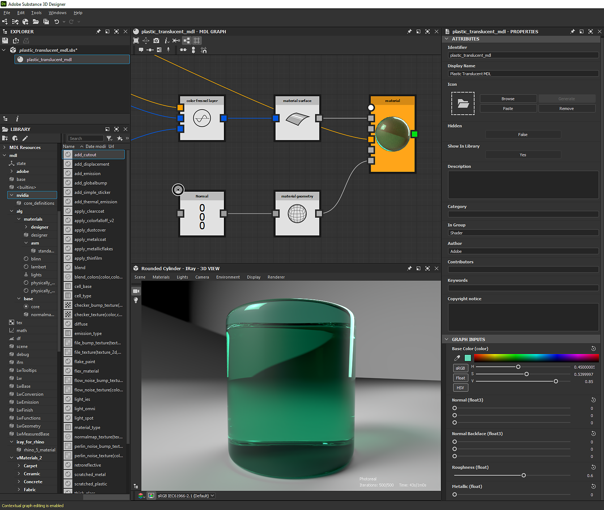

# MDL graphs

This page presents MDL graphs in Substance 3D Designer, which let you author MDL materials and preview their behavior in real time.

*Malachite with Chrysocolla, MDL material by [Mark Foreman](https://www.artstation.com/oggyart)* *available on our [Legacy Substance Share](https://share-legacy.substance3d.com/libraries/4043)* *platform*

## Overview

MDL stands for [Materials Definition Language](http://www.nvidia.com/object/material-definition-language.html): "a technology developed by [NVIDIA](https://www.nvidia.com/) to define physically-based materials for physically-based rendering solutions." (Source: [NVIDIA MDL Documentation](https://raytracing-docs.nvidia.com/mdl/index.html))

Using this language, a full material definition is portable and thus can be used across applications and renderers for a consistent output. Substance 3D Designer is currently the *only* application offering graph-based nodal authoring of MDL materials, by exposing the MDL functions and value types as nodes in an MDL graph.

While authoring materials, you can use NVIDIA's own [Iray](../interface/3d-view/iray/iray.md) renderer, embedded in Designer and available in the [3D view](../interface/3d-view/3d-view.md) panel, to preview the behavior of the material *interactively*.

MDL graphs are complementary with [Substance graphs](../compositing-graphs/substance-compositing-graphs.md) in that the latter output *textures* which can be *sampled* by the MDL material to affect its behavior and appearance.

We suggest going through the sections of this documentation *in order* for a guided learning path, starting with the properties of an MDL graph resource, just below.  
Eager to jump in? Get started with MDL graphs in the [MDL learning resources](https://helpx.adobe.com/substance-3d/unlisted/documentation/sddoc/first-steps-with-mdl-145654095.html) section!

>[!NOTE]
>
> You can learn more about the technical implementation of the Material Definition Language in the [NVIDIA MDL Documentation](https://raytracing-docs.nvidia.com/mdl/index.html), which includes links to the MDL Specification and [MDL Handbook](http://mdlhandbook.com/), all authored and maintained by NVIDIA.

*MDL graph properties in the [Properties](https://helpx.adobe.com/substance-3d/unlisted/documentation/sddoc/parameters-ui-129368153.html) panel*

## MDL graph properties

### Attributes

This section includes information regarding the MDL material for the purposes of identification, classification and establishing authorship.

* <b>Identifier</b>: The name of this resource, which should be unique under its parent in the package
* <b>Display name</b>: The MDL material name displayed in the interface
* <b>Icon</b>: The image used as a thumbnail for this graph in Designer’s Library
* <b>Hidden\*</b>: When set to *True*, the MDL material is not visible in an MDL library but still exists internally and may be referenced
* <b>Show in Library</b>: When set to *True*, the MDL graph is displayed in Designer’s Library
* <b>Description</b>: The description of the MDL material, which can be displayed in the tooltip of instance nodes referencing this graph
* <b>Category\*</b>: The category the MDL graph belongs to – this currently has no impact on how the graph is sorted in Designer's [Library](../interface/the-library/the-library.md)
* <b>In group\*</b>: The library group the MDL material belongs to
* <b>Author\*</b>: The author of the MDL material
* <b>Contributors\*</b>: The contributors to the MDL material other than the author
* <b>Keywords\*</b>: The keywords that may be used to find the MDL material in a library search
* <b>Copyright notice\*</b>: The copyright notice relevant to the authorship and usage of the MDL material

Note: Properties marked with an asterisk (\*) are MDL annotations to be used by MDL library integrations and have *no impact* in Designer.

### Graph inputs

This section lists the interactive parameters connected to [exposed parameters](https://helpx.adobe.com/substance-3d/unlisted/documentation/sddoc/exposing-a-parameter-145654033.html) of the MDL graph and define their *default values*. They may be *tweaked* and *reordered* at any time.

The interface and behavior of these inputs is defined by the *value type* and *ranges* of the exposed parameters they are connected to. For instance:

* An exposed value of type <b>Float</b> set to a soft range of &#91;0.0,4.0&#93; will be displayed as a *single slider* ranging from 0.0 to 4.0
* An exposed value of type <b>Color</b> will be displayed as a *color widget*, which includes a picking gradient and color thumbnail

To reorder graph inputs, place the cursor on the *dark handle* to the left of the parameter, click and *hold* <b>LMB</b> and drag the cursor up or down. This custom order will be used to display the properties of the MDL material in the following contexts:

* Instance nodes referencing the MDL graph for this material
* The material properties in the [3D View](../interface/3d-view/3d-view.md)
* Third party MDL integrations
