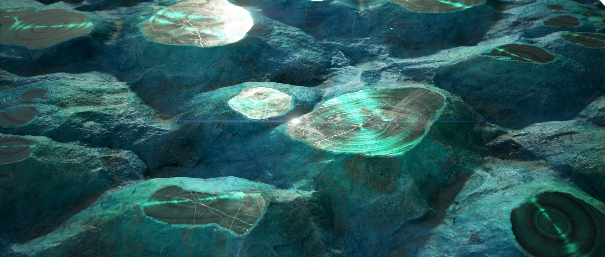

# MDL learning resources

This pages presents learning resources for working with [MDL graphs](../../mdl-graphs/mdl-graphs.md) in Substance 3D Designer.

## Reference

Here is a list of helpful documentation and reference for furthering your understanding of MDL materials, and their usage in a rendering engine such as NVIDIA's own Iray path tracer.

* [NVIDIA - Material Definition Language](http://www.nvidia.com/object/material-definition-language.html)
* [NVIDIA - MDL Documentation](https://raytracing-docs.nvidia.com/mdl/index.html)
* [NVIDIA - MDL Handbook](http://mdlhandbook.com/)
* [NVIDIA - MDL Specification v1.6](https://developer.download.nvidia.com/designworks/mdl-sdk/secure/MDL_spec_1.6.1_16Dec2019.pdf?64rCx3GvjlE_DON913xZ8laZnUvEwieF7lzT9hPfU_Ivc7OMaXBC86ZT3P8vK2f-lYWvlLhdy9-fAoC0NBMf5MI51qJNLGoXjzVK2aRGchsI8AlGG3570NmvOrhNDkYRTKq1zku-XVPFA_hXxQ_KTZG9CivkXA&amp;t=eyJscyI6ImdzZW8iLCJsc2QiOiJodHRwczpcL1wvd3d3Lmdvb2dsZS5jb21cLyJ9)
* [NVIDIA - Iray](https://www.nvidia.com/en-us/design-visualization/iray/)

## Tutorials

Our [Substance 3D Tutorials](https://helpx.adobe.com/substance-3d/unlisted/tutorials.html) website offers the following content related to MDL graphs.

<table>
<tr style="border: 0;">
<td style="border: 0;" valign="top">

### Creating an MDL in Substance 3D Designer

[This series](https://helpx.adobe.com/substance-3d/unlisted/tutorials/courses/creating-an-mdl-in-substance-3d-designer/youtube-2-0-nyuri6w.html) is a *great starting point* for discovering MDL graphs and working with MDL materials in Designer.

The metallic clearcoat material covered in this tutorial is impossible to define only through textures: it features *two separate specular highlights* that behave differently: one rougher metallic coat with speckles, and one very smooth clear topcoat.

"In this course we cover the basics of creating an MDL in Substance 3D Designer. We will be recreating a physically-based metallic/roughness shader as an MDL to illustrate the core concepts of the MDL nodes and graph. In the second video we will look at creating a car paint MDL."

</td>
<td style="border: 0;" valign="top">

</td>
</tr>
</table>

<table>
<tr style="border: 0;">
<td style="border: 0;" valign="top">

### MDL malachite material breakdown

[This article](https://helpx.adobe.com/substance-3d/unlisted/tutorials/courses/mdl-malachite-material-breakdown.html) walks you through the production of *more elaborate* material which cannot be achieved solely through textures either. Here, the synergy between MDL graphs and [Substance graphs](../../compositing-graphs/substance-compositing-graphs.md) is leveraged to achieve great results very efficiently.

"In this epic tutorial, [Mark Foreman](https://www.artstation.com/oggyart), Senior Environment Artist at CD PROJEKT RED, breaks down his winning MDL material for the Materialize Contest! You can download Mark's material on [Substance Share](https://share-legacy.substance3d.com/libraries/4043)."

</td>
<td style="border: 0;" valign="top">

*Click the image to access the tutorial*

</td>
</tr>
</table>
