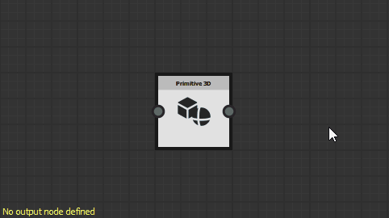
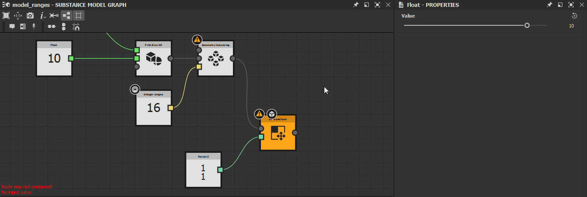
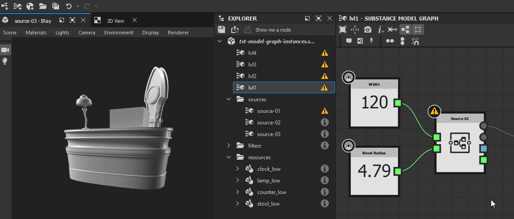
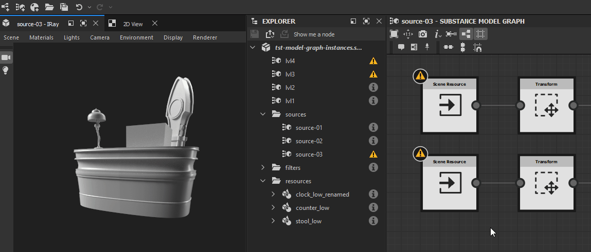

# Warnings in MDL graphs

This page lists warnings and errors messages which may be triggered by MDL graphs in [Substance 3D Designer](https://www.adobe.com/products/substance3d-designer.html), and offers common troubleshooting steps for each.

Warnings are displayed in the warning icon's tooltip for the graph resource in the [Explorer](https://helpx.adobe.com/substance-3d/unlisted/documentation/sddoc/the-explorer-129368147.html) panel, as well as in the bottom left corner of the [Graph view](../../interface/the-graph-view/the-graph-view.md) if the graph is loaded.

>[!NOTE]
>
> The illustrations in this section were recorded in <b>Substance model graphs</b>, which were *retired* in version <b>13.0.0</b> of Substance 3D Designer. However, they also apply to MDL graphs.

##  No output node defined

The graph has no output node defined.

<b>!&#91;(tick)&#93;(check.svg) Solution</b>

Select any node in the graph which outputs a value which type matches the expected type for this function if any, then click RMB and select the <b>Set as root</b> option in the contextual menu or double-click LMB on the node.  
A Substance model graph's output node is colored *orange*.

###  At least one input value has been rejected

The value provided for a parameter does not result in a valid computation of the node.

<b>!&#91;(tick)&#93;(check.svg) Solution</b>

Adjust the value so they make sense for the target parameter.

###  No input value

An input value expected by a node to perform its computation is not provided.

<b>!&#91;(tick)&#93;(check.svg) Solution</b>

Some node parameters cannot fall back to a default value when no data is provided to their input connector. This is often the cases for Scene inputs.

Connect the node inputs to another node's output connector of matching type.

###  Node was not computed

The information provided to the node is incomplete or not valid, thus the node was not able to perform its computations.

<b>!&#91;(tick)&#93;(check.svg) Solution</b>

Go upstream in the graph and check for warnings triggered by issues which prevent nodes from providing a valid output.

###  The referenced data has some warnings

The resource referenced by a node has one or more warnings. Here are some nodes referencing a resource:

* A graph instance node references a graph
* A Scene resource node references a Bitmap 3D scene resource

<b>!&#91;(tick)&#93;(check.svg) Solution</b>

In the Explorer panel, find the referenced resource and troubleshoot all warnings raised by the resource:

* For graphs, refer to other items in this page
* For any other type of resource, refer to the Warnings from dependencies page

###  Referenced resource not found

The resource referenced by a node was not found at the path saved in the Substance 3D file (SBS). Here are some nodes referencing a resource:

* A graph instance node references a graph
* A Scene resource node references a Bitmap 3D scene resource

<b>!&#91;(tick)&#93;(check.svg) Solution</b>

For graph instance nodes

Check that the source graph exists in the package located at the path saved in their <b>Package</b> attribute.  
If it does not, delete the instance node and replace it with an instance node referencing a valid package. Alternatively, you may recreate the package and graph referenced by the instance node, then reload the host package by clicking *RMB* on it in the [Explorer](https://substance3d.adobe.com/documentation/display/DRAFTDESIGNER/.The+Explorer+window+vDraftVersion) panel and selecting the <b>Reload</b> option in the contextual menu.

For Scene resource nodes

Find the referenced resources in the [Explorer](https://substance3d.adobe.com/documentation/display/DRAFTDESIGNER/.The+Explorer+window+vDraftVersion) panel and check they exist at the location saved in their <b>File Path</b> attribute.  
If they do not, click *RMB* on the resource item in the Explorer and select the <b>Relocate...</b> option in the contextual menu to set a new valid target file for that resource.

###  Soft range does not contain the value

The default value of an exposed parameter is not included in the soft range defined for that parameter.

<b>!&#91;(tick)&#93;(check.svg) Solution</b>

Adjust the default value or soft range so the former is included in the latter.

>[!NOTE]
>
> This warning cannot be triggered through the user interface, since it *automatically adjusts* the soft range to include the default value. Only modifying the data in the Substance 3D file (SBS) *directly* can result in this warning being triggered.

###  Soft range is out of the hard range

The soft range of and exposed parameter is not entirely included in the hard range defined for that parameter.

<b>!&#91;(tick)&#93;(check.svg) Solution</b>

Adjust the soft range or hard range so the former is fully included in the latter.

>[!NOTE]
>
> This warning cannot be triggered through the user interface, since it *automatically adjusts* the soft range to be fully included in the hard range. Only modifying the data in the Substance 3D file (SBS) *directly* can result in this warning being triggered.

###  Value is out of the hard range

The default value of an exposed parameter is not included in the hard range defined for that parameter.

<b>!&#91;(tick)&#93;(check.svg) Solution</b>

Adjust the default value or hard range so the former is included in the latter.

>[!NOTE]
>
> This warning cannot be triggered through the user interface, since it *automatically adjusts* the default value to be included in the hard range. Only modifying the data in the Substance 3D file (SBS) *directly* can result in this warning being triggered.

