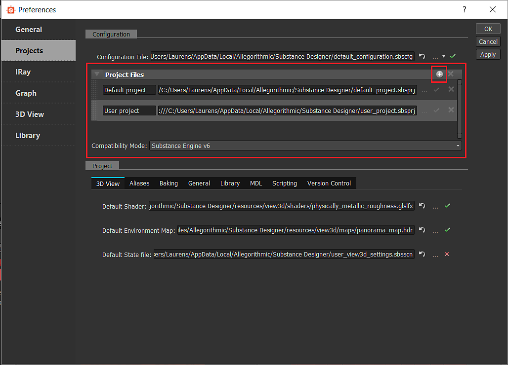

# Configuration List - SBSCFG

<table>
<tr style="border: 0;">
<td width="100.00%" style="border: 0;" valign="top">

The Configuration file is much simpler than the [Project Configuration files](../../pipeline-and-project-con/project-configuration-fil/project-configuration-files-sbsprj.md), as it contains only a list of projects, as well an engine Compatibility mode. They serve as a higher-level project/environment configuration list than the single Project files.

You can have multiple configurations for different environments, these files can be kept under version control along with the SBSPRJ files.

</td>
<td width="25.00%" style="border: 0;" valign="top">


</td>
</tr>
</table>

## Modifying Configuration Files

These files are simple, yet they can still be modified in two different ways, just like the SBSPRJ files.

### In the Project settings

The highlighted section is the part that relates to the Configuration Files, you simply add more Projects to the list which are stored in the above defined SBSCFG file.



### External editing as XML

For Windows <b>Notepad++</b> is a good free option, for macOS <b>Sublime Text</b> is an alternative. However, any editor with proper indentation, section collapsing and some form of syntax highlighting will make your life much easier.

Once you open the SBSCFG file in an editor, you should see a fairly straightforward structured layout, with sections corresponding to the UI.

```

<?xml version="1.0" encoding="UTF-8"?> 

<root> 

 <projects> 

  <projectfiles> 

   <size>1</size> 

   <_1 prefix="_"> 

    <path>custom_project.sbsprj</path> 

   </_1> 

  </projectfiles> 

 </projects> 

 <preferences> 

  <configuration> 

   <compatibilitymode>sbs_engine_v6</compatibilitymode> 

  </configuration> 

 </preferences> 

</root>
```


Note that the default and user projects are not explicitely listed, and that any additional projects are defined after these.

The example above also makes use of [relative paths](../../pipeline-and-project-con/project-configuration-fil/project-configuration-files-sbsprj.md). Note that the logic for relative paths is slightly different between CFG and PRJ files: for CFG files, as above, **you should not type "file:/" before the path**. Instead the path is just appended to the location of the CFG file in which it is defined.

## Removing the default library

For now, the default library can not be removed. It's probably not a good idea to do so anyway, as you would lose a lot of Designer's functionality.
