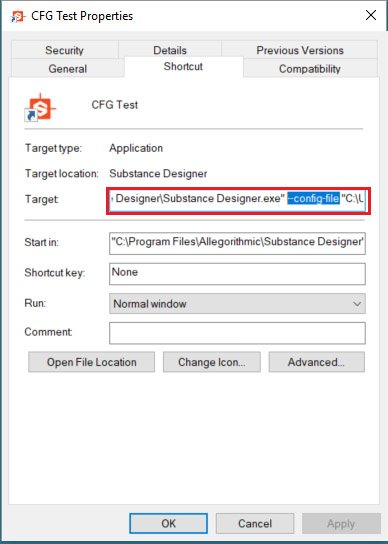

# User Preferences - Automating Setup

<table>
<tr style="border: 0;">
<td width="100.00%" style="border: 0;" valign="top">

The user\_preferences.xml file contains all user-specific settings outside of the ones defined in a [Project Configuration](../../help/pipeline-and-project-con/project-configuration-fil/project-configuration-files-sbsprj.md). These mainly relate to specific UI and performance settings.

The only relevant setting to change is the [Configuration File](../../help/pipeline-and-project-con/configuration-list-sbscfg/configuration-list-sbscfg.md) that contains a list of projects. This can be done in a few ways, as listed below.

Alternatively, you can completely bypass modifying the User Preferences, and do a session-based override of the SBSCFG file by using a command-line argument on the Designer shortcut, see below.

</td>
<td width="25.00%" style="border: 0;" valign="top">


</td>
</tr>
</table>

## Permanent or session-based

There are two different ways to configure Designer to use another [configuration file](../../help/pipeline-and-project-con/configuration-list-sbscfg/configuration-list-sbscfg.md) than the default, both with advantages and disadvantages:

* <b>Permanently modifying user\_preferences.xml  
  </b>This file is located in *~User\AppData\Local\Adobe\Adobe Substance 3D Designer*for Windows. If you modify it, Designer will always use what is defined there, regardless of how, when or where you start it. Making changes requires modifying the XML again, both of which are described below, and tend to be a bit involved.
* <b>Temporarily setting the session through a command-line argument  
  </b>Designer can take a command-line argument on startup to override the SBSCFG file for that session (see below for how). It's a simple, elegant solution, and allows for switching projects in a much quicker way than through modifying an XML. The danger is that if you open through multiple shortcuts (for example Start Menu and Desktop on Windows), you can have different results without it being entirely obvious. On top of that, it's not as tamper-proof, as users can delete, move or modify their shortcuts much easier than their user\_preferences.xml.

## XML modification

### Manually modifying preferences

If there is no automated setup, or for testing purposes, one can manually go to <b>Edit &gt; Preferences...</b> and then click the "<b>Projects</b>" section on the left.


The button marked in red allows the user to choose a different[ SBSCFG file](../../help/pipeline-and-project-con/configuration-list-sbscfg/configuration-list-sbscfg.md).

### Modifying through script

Just like the Project and Configuration files, the user preferences is a structured XML, with the relevant setting clearly identifiable. Rather than modifying through a text editor like Notepad++ or Sublime Text, it is very well suited for modification through an external scripted setup.

The advantage of scripting is user don't have to do anything else than clicking a button, and if a sufficiently complicated system is created it's possible to manage and swap project easily without any need to manage files and settings manually.

The relevant line looks like this:

```

  <configuration> 

   <configurationfile>file:///C:/Users/John/AppData/Local/Adobe/Adobe Substance 3D Designer/default_configuration.sbscfg</configurationfile> 

  </configuration>
```


#### Python example

The following is a simple Python 2.7 example function for Windows that modifies the user\_preferences.xml for another configuration file. This permanently alters the value until changed back. The function SetConfigurationFile can then be called with the path of your custom sbscfg file as a parameter.

A python script allows for powerful, clean code, and can be easily integrated elsewhere, but the downside is that for a user to run it, it needs to be compiled to an executable, or the user needs a Python deployment.

```

import xml.etree.ElementTree as ElementTree 

import os 

 

##Example Python script for changing Substance 3D Designer user preference file## 

 

def SetConfigurationFile(p_ConfigPath): 

## Check is the path passed as parameter exists.

    if(os.path.isfile(p_ConfigPath)): 

## replace backslashes by forwardslahes to ensure consistency

        p_ConfigPath = p_ConfigPath.replace("\", "/") 

## get Local Appadata path from Environment variables, construct full path to user_preferences.xml and check if it exists.

        m_AppDataPath = os.environ.get('LOCALAPPDATA') 

        if m_AppDataPath != None: 

            m_UserPrefsPath = os.path.join(m_AppDataPath, str("Adobe/Adobe Substance 3D Designer/user_preferences.xml")) 

            if(os.path.isfile(m_UserPrefsPath)): 

## read XML elementtree from file, find correct element until we get to the actual line that defines the configurationfile path

                m_PrefsTree = ElementTree.parse(m_UserPrefsPath) 

                m_PrefsRoot = m_PrefsTree.getroot() 

                m_PrefsElement = m_PrefsRoot.find("preferences") 

                m_XMLError = True 

                if(m_PrefsElement != None): 

                    m_ConfigElement = m_PrefsElement.find("configuration") 

                    if(m_ConfigElement != None): 

                        m_ConfigFileElement = m_ConfigElement.find("configurationfile") 

                        if(m_ConfigFileElement != None): 

                            m_XMLError = False 

## Check if path is already set, to avoid double work

                            if m_ConfigFileElement.text.replace("file:///","") == p_ConfigPath: 

                                print "configurationfile is already set to desired path. Aborting." 

                                return True 

                            else: 

## construct correctly formatted path, insert into elementtree

                                m_ConfigPath = str("file:///" + p_ConfigPath) 

                                m_ConfigFileElement.text = m_ConfigPath 

 

## Write to file

                                m_XMLString = str("<?xml version="1.0" encoding="UTF-8"?>n") + ElementTree.tostring(m_PrefsRoot, 'utf-8') 

                                m_File = open(m_UserPrefsPath,'w') 

                                m_File.write(m_XMLString) 

                                m_File.close() 

                                print "configuration file path succesfully changed!" 

                                return True 

                if m_XMLError: 

## if this flag was not set to false, we can assume something was missing or went wrong when walking through the XML

                    print("Error: malformed content in user_preferences.xml!") 

                    return False 

            else: 

                print "Error: user_preferences.xml does not exist, try starting Substance 3D Designer first!" 

                return False 

        else: 

            print "Error: LocalAppData path returned None" 

            return False 

    else: 

        print "Error: Invalid Configuration File path!" 

        return False
```


## Command-line argument shortcut

In a much simpler way, Designer can be told to use a specific SBSCFG on startup through the "--config-file" (optional) argument.

### Manual setup

While not recommended to use a manual method in a production environment, for testing purposes this can be done fairly quickly if you have setup your SBSCFG file already.

1. Add a space
1. Add --config-file after the path to designer in the Target section.
1. Add another space
1. Add your path, *wrapped in quotation marks* to avoid issues with spaces in your path
1. The result should be like this:

   *"C:\Program Files\Adobe\Adobe Substance 3D Designer\Adobe Substance 3D Designer.exe" --config-file "C:\Dev\Substance\custom\_configuration.sbscfg"*


