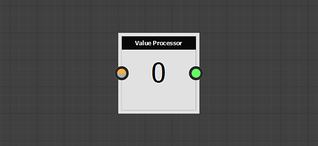
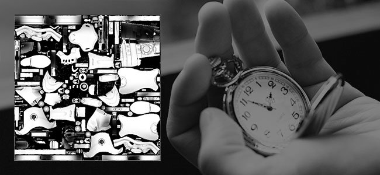

# Version 2019.1 (9.1)

**Substance Designer 2019.1** brings a new update to the Substance Engine to expand further its capabilities as well as additional new filters.

## Major Features

### New Value Processor Node

The Substance Engine is now in version 7 and with it brings the new concept of "Values" inside the compositing graph. Values are numbers and not textures and as such can be used to perform various computations that can be shared across nodes via the function graphs and compositing graphs. The Value Processor node can read an input image and compute a single output value.

The Value Processor node is not alone, to be able transit information across graph some changes and additions have been made :

* Output nodes can be directly fed with a value and not necessarily an image anymore.

  
* A new **Input node** named "Input Value" has been added so that graph can query Values.

  
* Nodes now have a new category below their parameters named "Input Values" which can be used to create input values for the node itself.  
  The input values can then be referenced inside the function graph via the "Get" nodes.

  

>[!NOTE]
>
> As with every major Substance Engine change, the compatibility mode is set to the previous version (new version 6 by default). Which means incompatible nodes will have a yellow border in the graph. To disable/hide the yellow border simply change the engine version in the main settings to the latest version (via the Project settings) :
> 
> 

### Support of Optix in Bakers

The last update of Substance Designer introduced DXR which allows to perform GPU raytracing on compatible RTX compatible hardware. We now added support for [Optix](https://developer.nvidia.com/optix) which allows to raytrace on other Nvidia's GPUs even under Linux. You can expect baking at least **5 times faster** when using Optix than with regular CPU raytracing.

Here is the list of Bakers affected by this change :

* Ambient Occlusion From Mesh
* Bent Normals From Mesh
* Thickness From Mesh

If you wish to disable one of the two backends, head over to the main preferences (**Edit &gt; Preferences**) and to the Bakers settings :

>[!NOTE]
>
> To access the feature, make sure to **update to the following drivers** :
> 
> * Nvidia 10XX and 20XX GPUs : **drivers 430.39** (compatible with both DXR and Optix)
> * Nvidia 9XX and older : **d** **rivers 419.67 or 430.39** (drivers 425.31 have an issue with Optix)
> 
> Note that DXR is also available on [GeForce GTX 10xx GPUs](https://www.nvidia.com/en-us/geforce/news/geforce-gtx-dxr-ray-tracing-available-now/) (with up to date drivers). DXR also requires Windows to be up to date for working, see [this page](../../../best-practices/performance-optimization/performance-optimization-guidelines.md) for more information.

### Improved Loading Times for OBJ Meshes

In this release we improved our **obj** file reader to reduce the loading time of 3D Meshes. Loading times have been speed up to 3 times, especially for meshes that don't have UVs and Normals defined.

This performance improvement will affect both the Bakers and the 3D View.

### Improved Python Plugin System

With this update we added a lot of new feature to the scripting system :

* **Support of Qt** : Allows to build custom UI that follows the same style of the rest of the Application. Custom UI can also be integrated much more easily with this new system. (Tkinter is now deprecated.)
* **Callback functions** : It is now possible to register callback functions. At the moment it only includes opening and saving files as well as the creation of UI elements. Additional callbacks will be added in the future.
* **Threading** : Plugins can now create threads to do background processing or wait for OS events (such as network connections).

For further details, take a look at the changelog of the API which can be accessed via the **Help &gt; Python API Documentation** menu entry inside Substance Designer.

### New Content

We also have a few new nodes available in the default library, some of which are now powered with the new Value processor node :

* **Flood Fill To Index**   
  Assigns a unique index to shapes from a Flood Fill node.  
  In the example below the Pixel Processor node matches the Value Input to the shape and output a mask as a result.

  
* **Non Uniform Directional Warp**   
  Applies a Directional Warp where the intensity and angle are sampled from image inputs.

  
* **Multi Directional Warp**   
  Warps the input image multiple times into various directions.

  
* **Height Extrude**   
  Generates an orthographic 3D rendering of the given Height. The camera view can be controlled with the position gizmo.

  
* **Min / Max Value**   
  Returns the minimum and maximum pixel value from the input image.

  

>[!WARNING]
>
> This release doesn't support CentOS 6.x anymore. To use the latest version of Substance Designer please upgrade to CentOS 7.x.

## Release Notes

### 2019.1.3

*(Released August 19, 2019)*

**Fixed:**

* &#91;Bakers&#93; Crash in DXR when aspect ratios of bake output and skew map are mismatched
* &#91;Bakers&#93; 'Ambient Occlusion From Mesh' baker outputs wrong results with Optix or DXR when using a Normal map
* &#91;Bakers&#93; 'Curvature' baker outputs wrong results when using 'Per Vertex' setting
* &#91;Bakers&#93; Error messages state the backend which failed instead of the cause of the error
* &#91;Bakers&#93; Crash when processing a detail map baker without a high poly mesh
* &#91;Bakers&#93; Skew map does not appear to affect all the output with DXR enabled
* &#91;Content&#93; mg\_leaks: typo in parameters name
* &#91;Content&#93; "Shape" returns a cooking warning
* &#91;Content&#93; Polygon 1 and 2 don't support random functions
* &#91;Content&#93; Polygon 1 and 2 can have less than 3 sides
* &#91;Content&#93; Normal to Height HQ does not work correctly in non square
* &#91;Parameters&#93; Integer input parameters: the drop down list does not show the values

### 2019.1.2

*(Released July 02, 2019)*

**Fixed:**

* &#91;3D View&#93; 3D View export with depth of field enabled looks incorrect
* &#91;3D View&#93; Alpha channel of PSD images is wrong when using save render
* &#91;3D View&#93; PNG and PSD are broken when using save render option with Iray
* &#91;3D view&#93; dds format doesn't work when saving render
* &#91;Graph&#93; Nodes get offset when combining right and left click drag in specific ways
* &#91;Graph&#93; Modifying a Function instances no longer updates the node result
* &#91;Graph&#93; Crash when displaying the Space Bar menu
* &#91;Content&#93; Shape Extrude: quality issue when shape has no rotation
* &#91;Content&#93; Shape Drop Shadow (and Grayscale) does not produce shadow without H and V tiling
* &#91;Content&#93; Material Crop normal issue
* &#91;Bakers&#93; JSON bakers presets are not loaded correctly
* &#91;Bakers&#93; Crash when baking heavy meshes using Optix or DXR (now it may fail because of insufficient Vram but it won't crash)
* &#91;Bitmap Editor&#93; Bitmap painting tools offset strokes and redraws in the stroke bounding box
* &#91;Bitmap Editor&#93; Bitmap painting tools broken in OSX
* &#91;UI&#93; Some button's menu are barely reachable
* &#91;UI&#93; Crash while drag and dropping a baker instance
* &#91;SVG&#93; Embedded SVG edit tools are unreliable
* &#91;Parameters&#93; Crash when applying a preset with boolean parameters in a SBSAR instance
* &#91;Network&#93; Crash sometimes when an error occurred in an SSL encrypted connection

### 2019.1.1

*(Released May 28, 2019)*

**Added:**

* &#91;PythonIntegration&#93; Save and restore plugin manager state
* &#91;Preferencies&#93;&#91;Dependencies&#93; Add an option to determine how dependencies file path are stored
* &#91;Content&#93; Flood Fill Mapper: Add a "Fit Shape BBox" option

**Fixed:**

* &#91;Content&#93; Flood Fill Mapper: "Rotation Auto Scale" does the opposite effect
* &#91;Content&#93; "luminance\_offset\_map" input is not used by "Flood Fill Mapper Color"
* &#91;Content&#93; 'Flood Fill Mapper Grayscale' node generates stepping artifacts
* &#91;Content&#93; Cannot publish Height Extrude
* &#91;Parameters&#93; Embedded presets in sbsar are not loaded in Designer
* &#91;Bakers&#93; Baker name is not correctly displayed in the baker list
* &#91;3D View&#93; "View outputs in 3d View" does not work for values
* &#91;Cooker&#93; Crash when correcting a wrong parameter type
* &#91;API&#93; SDResource.setInputPropertyFromId function don't work on SDSBSCompGraph input parameters
* &#91;Updater&#93; some sbs can't be updated in 2019
* &#91;Explorer&#93; Crash when importing a specific .obj file
* &#91;PythonIntegration&#93; Backslashes not properly escaped on windows when initializing PYTHONPATH
* &#91;UI&#93; value issue with some sliders in bakers
* &#91;Linux&#93; Designer cannot be run on CentOS &lt; 7.6

### 2019.1

*(Released May 09, 2019)*

**Added:**

* &#91;API&#93; Add 'updatePackages' parameter to the SDPackageMGR.loadUserPackage() method to control if the updaters should be applied or not on load
* &#91;API&#93; Add the ability to disconnect a SDConnection
* &#91;API&#93; Add class SDSBSARExporter to publish a SDPackage
* &#91;API&#93; Add SDHistoryUtils class to manage undoable commands
* &#91;API&#93; Add grayscale input node definition in Substance Compositing Graph (sbs::compositing::input\_grayscale)
* &#91;API&#93; Add value input node definition in Substance Compositing Graph (sbs::compositing::input\_value)
* &#91;API&#93; Add SDProperty.isFunctionOnly() method
* &#91;API&#93; Add support of custom input parameter on SDSBSCompNode
* &#91;API&#93; Add 'reloadIfModified' parameter to the SDPackageMGR.loadUserPackage() method to control if a package has be reloaded if modified
* &#91;API&#93; Add SDPackageMgr.getPackages() method
* &#91;API&#93; Add possibility to get/add/remove root paths from SDModuleMgr
* &#91;API&#93; Allow getting the pointer of the pixels buffer and the pitch of a SDTexture
* &#91;API&#93; Allow to retrieve the pointer of the MainWindow
* &#91;API&#93; Allow to create custom menus in the main menu
* &#91;API&#93; Allow to create custom DockWidgets in the main window
* &#91;API&#93; Use object names to find menus in toolbars
* &#91;API&#93; Provide system to manage application notifications to the API
* &#91;PythonIntegration&#93; Add default environment variable to look for python plugins
* &#91;PythonIntegration&#93; Add text search and replace to the Python editor
* &#91;PythonIntegration&#93; Instanciate Python plugins at startup
* &#91;PythonIntegration&#93; Take in account PYTHONPATH environment variable
* &#91;PythonIntegration&#93; Allow creating toolbars in graph widgets
* &#91;PythonIntegration&#93; Support Python threads
* &#91;PythonIntegration&#93; Add a Plugin Manager (in the 'Tools' menu)
* &#91;Content&#93; Normal Vector Rotation: add an optional image input to drive the angle
* &#91;Content&#93; New Min/Max filter
* &#91;Content&#93; New "Flood Fill to Index" filter
* &#91;Content&#93; New "Flood Fill Mapper" filter
* &#91;Content&#93; New Atlas Splitter filter
* &#91;Content&#93; Improve Tri Planar filter
* &#91;Content&#93; New Non Uniform Directional Warp filter
* &#91;Content&#93; New Multi Directional Warp
* &#91;Content&#93; New Height Extrude filter
* &#91;Engine&#93; Fxmap: new "Gradation with offset" pattern
* &#91;Engine&#93; Support For Uniform value processing (New Value Processor node)
* &#91;3D View&#93;&#91;Bakers&#93; Improve OBJ loader performances
* &#91;3D View&#93; Increase the camera clip plane distances
* &#91;Preferences&#93; Add settings for Bakers
* &#91;Graph&#93; Make invalidation faster by avoiding string comparisons
* &#91;MDL&#93; Support MDL Arrays
* &#91;UI&#93; Engine selection UI improvements
* &#91;IRay&#93; Upgrade to IRay SDK 2018.1.4
* &#91;Dependency Manager&#93; Use "last path" when relocating a resource
* &#91;Cooking&#93; Add support of Boolean Labels in the sbsar
* Integrate Qt 5.12.2

**Fixed:**

* &#91;Graph&#93; Connections are broken when changing the name of the input
* &#91;Graph&#93; Too many invalidations are triggered when tweaking parameters
* &#91;Graph&#93; "Copy to Clipboard" action don't work if we do the right click on a badge
* &#91;Graph&#93; Moving a frame using Alt is not stored in the .sbs
* &#91;MDL&#93; Color profile is not automatically updated in MDL editor
* &#91;MDL&#93; crash when exporting module that contains a specific setup
* &#91;MDL&#93; Fail to export a MDL Graph that contains a LightProfile or a MBSDF resource
* &#91;UI&#93; Shortcuts are no longer displayed in context menus
* &#91;UI&#93; Floating window becomes dockable after restart
* &#91;Scripting&#93; Cancel option doesn't work in python editor
* &#91;Scripting&#93; "yes to all" option in save menu doesn't work
* &#91;Parameters&#93; drop down list are not displayed correctly after copy
* &#91;Explorer&#93; Relocating resources should open the last relocated path by default
* &#91;Library&#93; The content of the library is always rebuilt when switching from one version to another
* &#91;Library&#93; Imported Bitmaps are invalidated on save
* &#91;IRay&#93; Tangent space is not computed correctly / incorrect normal mapping
* &#91;Function&#93; Crash or fail when creating new graph from selection
* &#91;API&#93; default value of properties is not defined
