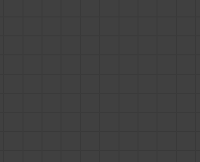
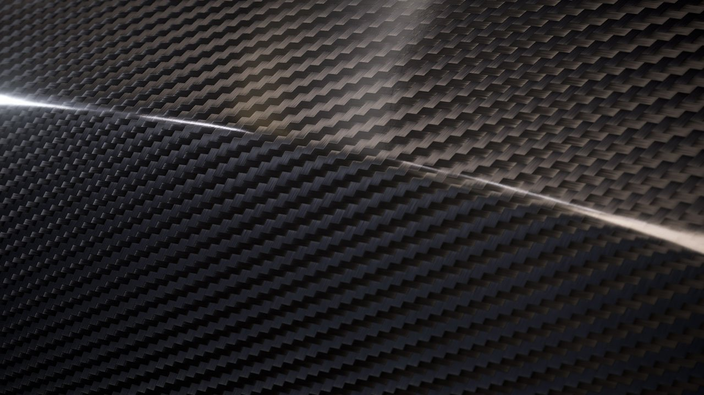
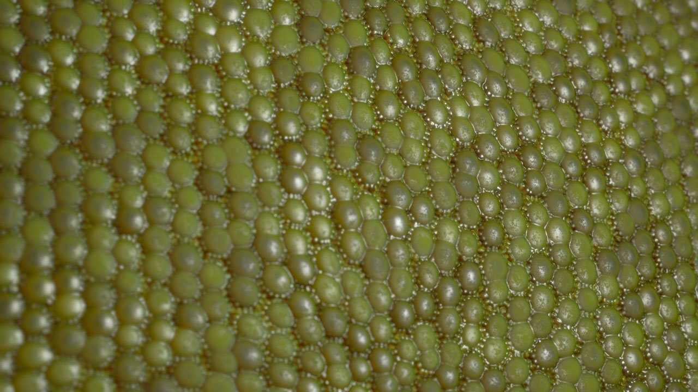

# Version 2019.2 (9.2)

**Substance Designer 2019.2** delivers the new Dot node, HDR filters and strong optimizations.

## Major Features

### New Dot Node

The Dot node is a long awaited request. Its purpose it to redirect connections between nodes to reorganize your graph. Contrary to our previous redirection dot, this one can accumulate links and doesn't disappear when its connections are broken.

To read more about the Dot Node, see the [Graph items](../../../help/interface/the-graph-view/graph-items/graph-items.md) page.

### Improved Node Creation Menu

The Node Creation menu which appears when pressing "spacebar" can now define and list in priority your favorites. Some new behaviors around the menu have been added as well to make it easier to use.

* **Display favorites first**   
  When clicking on the icon next to the text field, you can enable or disable the listing of favorites first.

  
* **Add or Remove favorites**   
  When favorites are displayed, you can add or remove nodes in the list by clicking on the icon next to the node name.  
  (Favorites can also be managed directly in the Library window.)

  
* **Open the menu when click and dragging a link from a node**   
  When click and dragging the connection of a node and releasing the mouse it will now open the Node Creation menu. The node created will then be connected to the link. The nodes available in the list will be dependent of the incoming connection. 

### New Techniques for Realtime Renderer

The realtime viewport of Substance Designer has been improved to support new rendering features: **Anisotropy**, **Coating** and **Subsurface Scattering**. All the new channels and usages introduced by these features are compatible with Iray as well.

* **Anisotropy**   
  Anisotropy is a property that defines how a reflection should behave in a given direction. It is often used for specific material types such as hair and brushed metals.  
  To create an Anisotropic material you need two outputs in your graph with the following usages:

  * **AnisotropyAngle**: Defines the anisotropy direction. Goes from black to white to loop.
  * **AnisotropyLevel**: Defines the anisotropy intensity. Recommended values are 0.9 to 0.98 (grayscale).

  Note: Anisotropy is supported by all our default PBR shaders.

  {width="400px"}
* **Coating**   
  Coating allow to define a second layer of material above the base material. It can be used to simulate car paint or films on metallic surfaces.  
  To create a Coated material you can use the new Substance template "PBR Coated (Metallic/Roughness)" or add the following outputs in your graph:

  * **coatWeight**: Opacity of the coating layer.
  * **coatSpecularLevel**: Specular Level for the coating layer.
  * **coatColor**: Color of the coating layer.
  * **coatNormal**: Normal for the coating layer.
  * **coatRoughness**: Roughness for the coating layer.

  Note: Coating requires the new shader "physically\_metallic\_roughness\_coated".

  {width="400px"}
* **Subsurface Scattering**   
  Subsurface scattering simulate the absorption and diffusion of light inside a material. It is very useful for simulating skin and other organic surfaces.  
  To create a Subsurface material you can use the new Substance template "PBR Sub-Surface Scattering (Metallic/Roughness)" or add the following output to your graph :

  * **scattering**: Controls the intensity of the diffusion of light inside the material.

  Note: Subsurface requires the new shader "physically\_metallic\_roughness\_sss" . The scattering color can be controlled in the shader parameters.

  {width="400px"}

>[!NOTE]
>
> All these new rendering features are possible thanks to a rework of the shader system of Substance Designer. Our **GLSLFX** format now supports the definition of "**Techniques**" which allows multiple pass of rendering. For some examples take a look at our default shaders available in : **Substance Designer/resources/view3d/shaders**

### Improved Performances

Several improvements to the Substance engine (which jumps to version 7.2.0) have been made which are beneficial in several situations:

* **Caching of graph computations for faster tweaking**  
  Graph rendering has been improved with the addition of a new caching system. This make tweaking a graph much faster than before because we now skip unchanged nodes.
* **Improved Library loading time**  
  The loading of the library has been greatly improved thanks to the new cooking optimizations and decoding speed improvements. The library is now 2 to 8 times faster to generate.

### New Content with HDR Filters

With this new release we introduce a lot of new filters dedicated to the manipulation of HDR environment maps.

* **HDR Merge**:Bring together several LDR (Low Dynamic Range) photos to create one HDR image.
* **Nadir Patch**:This node allows you to clone/patch the ground part of an HDRI while taking the spherical deformation into account.
* **Nadir Extract**: This node is can extracting a texture out of an HDRI. It can be used to map a ground texture in a 3D scene.
* **Color Temperature Adjustment**: Adjust the color temperature of an input image, including the support of HDR values.
* **Straighten Horizon**: Rotate the latitude/longitude of an environment map. Depending on the shooting conditions, the resulting 360° panorama might not be straight.
* **Physical Sun&amp;Sky**: This node is an implementation of the Hosek-Wilkie Skylight model. Specify the sun position and it will generate a physically accurate sky panorama.
* **Plane Light**: Generate a rectangular light as if it was a 3D shape. You can change its position in the 2D view, apply a texture and set the color using a temperature or RGB value.
* **Line Light**: Generate a line-shaped light, and change its position in the 2D view. It has similar options to the Plane light except that it is designed for thin long shapes like neon lights.
* **Sphere Light**: Generate a sphere-shaped light, and change its position using the 2D View gizmo. You can also apply a spherical texture to create distant planets.

All new [HDRI Tools](../../../help/compositing-graphs/nodes-reference-for-com/node-library/3d-view-library/hdri-tools/hdri-tools.md) are documented in the [Node Library section](../../../help/compositing-graphs/nodes-reference-for-com/node-library/node-library.md).

## Release Notes

### 2019.2.3

*(Released November 26, 2019)*

**Fixed:**

* &#91;Bakers&#93; Crash when baking using a skew map resource with an invalid link
* &#91;Bakers&#93; UV sets other than 0 are not taken into account on Embree
* &#91;Bakers&#93; 'Bent Normals from Mesh' outputs incorrect results with UV sets other than 0 on DXR
* &#91;Bakers&#93; 'UV Set' parameters are reset to '0' value when reopening baking window
* &#91;Bakers&#93; 'Position' outputs a black image with UV sets other than 0
* &#91;Content&#93; Smart Auto Tile: sampling issue in 8k
* &#91;Content&#93; Atlas Splitter: Shape Detection fails in some cases, precision parameter should be exposed
* &#91;Content&#93; Pow does not return the right value in some cases
* &#91;Content&#93; Flood Fill to index: incorrect result when published to sbsar
* &#91;Library&#93; Crash while loading the session's first SBS package
* &#91;Library&#93; 'Show Resources in the Library by Default' setting is ignored for resources imported directly into the Explorer panel
* &#91;Console&#93; Unexpected message in the console when using the node menu
* &#91;Parameters&#93; Cannot remove single entry in Output usage list
* &#91;3DView&#93; the scene is not reloaded correctly when the scene file is modified on disk&#91;Graph&#93; Node menu filtering is incorrect when using Value outputs

**Added:**

* &#91;MacOS&#93; Notarize the software to follow new MacOS Catalina distribution requirements

### 2019.2.2

*(Released October 23, 2019)*

**Fixed:**

* &#91;Graph&#93; Node menu filtering is incorrect when using Value outputs
* &#91;Graph&#93; Crash when displaying the node menu
* &#91;Graph&#93; Search tool appears when using shift shortcut
* &#91;Graph&#93; Crash when consecutively spawning node menus from value input connector
* &#91;Graph&#93; Comments containing long strings are cropped
* &#91;Graph&#93; Flow highlight is incorrect when creating a node using the drag from connector menu
* &#91;Graph&#93; Crash when removing all graph items from scene while loading a different graph
* &#91;Graph&#93; Crash when using to create node while using click and drag from connector
* &#91;Graph&#93; Crash while using the 'Node Finder' tool
* &#91;Graph&#93; Output pin color is incorrect in 'Material Compact' mode
* &#91;Cooker&#93; Nodes downstream of multi-outputs nodes do not update correctly
* &#91;Cooker&#93; Issue with Value outputs and passthrough nodes
* &#91;Cooker&#93; Value Processor outputs wrong results when only a 'Get' node is used
* &#91;Content&#93; 'Contrast/Luminosity' node outputs an Alpha value of 1.0
* &#91;Content&#93; 'Studio Panorama' template has no description
* &#91;Content&#93; Flood Fill to index: incorrect result when the input contains a wrapping shape
* &#91;Content&#93; 'HDR Merge': internal exposure computation is incorrect
* &#91;Dot Node&#93; Crash when using a level and a dot node
* &#91;Dependency Manager&#93; 'Go to' action does not work anymore
* &#91;PSD&#93; Crash when undoing deletion of multiple nodes which were included in the PSD Exporter
* &#91;UI&#93; Crash when closing graph using the 'Window' menu and opening one again while one is pinned
* &#91;Gradient Editor&#93; The 'Remove Key' button is too large
* &#91;Engine&#93; Precision issue with sqrt() acos() and asin()
* &#91;Bakers&#93; AO From Mesh: 'Spread Angle' slider has an incorrect value range when tweaked

### 2019.2.1

*(Released September 20, 2019)*

**Added:**

* &#91;Templates&#93; Add default input nodes to Specular/Glossiness and to other templates
* &#91;Templates&#93; Add PBR Anisotropy template
* &#91;3D View&#93; Increase the Automatic Clip Plane Far distances
* &#91;3D View&#93; PBR Coated: change default value for Coat normal inheritance
* &#91;Content&#93; Atlas Splitter: add option for the "Auto Crop" feature
* &#91;Node Menu&#93; Don't filter nodes without input

**Fixed:**

* &#91;Content&#93; Atlas Splitter: some outputs are not cropped correctly when using the "Auto Crop" option
* &#91;Content&#93; Material Height Blend: cooking error related to inexistent parameter
* &#91;Content&#93; "Plane Light": pattern UV Mode does not work correctly
* &#91;Content&#93; "Height to Normal World Unit": input is forced to 16bit
* &#91;Content&#93; Unexpected shapes when using angular 'Bevel' node with no tiling on small shapes
* &#91;Library&#93; Icons for sbsar are not visible in library
* &#91;Library&#93; Using "\" for filtering Url no longer works
* &#91;Library&#93; Filter values are case sensitive
* &#91;Library&#93; Search filter does not work when "Compositing" is checked
* &#91;Bakers&#93; Double-clicking specific cells and dismissing the change reverts them to incorrect values
* &#91;Bakers&#93; The backend state text in the bakers window always shows 'GPU acceleration : enable'
* &#91;Cooker&#93; Crash when processing an 'impostor' dependency in a graph
* &#91;Cooker&#93; grayscale conversion has wrong output size when using value
* &#91;Explorer&#93; Crash when processing "Publish on Share"
* &#91;Graph&#93; Crash when opening a specific package
* &#91;MDL&#93; Crash when using cast operator
* &#91;Templates&#93; Output identifiers are not correct in the PBR coated template

### 2019.2

*(Released August 29, 2019)*

**Added:**

* &#91;Content&#93; New ‘Panorama Light’ shapes
* &#91;Content&#93; New ‘Panorama Nadir Patch’ filter
* &#91;Content&#93; New ‘Panorama Nadir Extract’ filter
* &#91;Content&#93; New ‘Panorama Straighten Horizon’ filter
* &#91;Content&#93; New ‘Panorama Rotation’ filter
* &#91;Content&#93; New ‘Panorama Position’ node
* &#91;Content&#93; New ‘Panorama Physical Sun and Sky’ node
* &#91;Content&#93; New ‘Panorama Gradients’ nodes
* &#91;Content&#93; New ‘HDR Merge’ filter
* &#91;Content&#93; New ‘HDR Preview’ filter
* &#91;Content&#93; New ‘Color Temperature Adjustment’ filter
* &#91;Content&#93; New ‘Blackbody’ node
* &#91;Content&#93; New ‘Exposure’ filter
* &#91;UI&#93; Node Creation Menu: display and manage Favorites in the menu
* &#91;UI&#93; Add/Remove a node from the favorites from the Node Creation Menu
* &#91;UI&#93; Node Creation Menu: spawn the menu when clicking/dragging a link from an output
* &#91;UI&#93; Node Creation Menu: filter the content according to the current selection type
* &#91;3D View&#93; Support Anisotropy
* &#91;3D View&#93; Support Coating effect
* &#91;3D View&#93; Support Subsurface Scattering
* &#91;Graph&#93; Dot node
* &#91;Graph&#93; Optimize graph rendering by caching cooking results
* &#91;Preferences&#93; Change the ‘Cooking Size Limit’ default value to 8192
* &#91;Preferences&#93; Add a toggle to turn the new ‘Tab’ key functionality on/off
* &#91;API&#93; Add SDResource.getPackage() method
* &#91;Iray&#93; Update to NVIDIA Iray RTX 2019.1.3 SDK (317500.3714)
* &#91;Explorer&#93; Allow to link any type of file as a resource in the Package
* &#91;GradientNode&#93; Press ESC to cancel the gradient picking
* &#91;Parameters&#93; Remove automatic Upper case on identifiers
* &#91;Project&#93; Add an option to specify if graphs and resources are ‘Visible in Library’ by default
* &#91;Presets&#93; Automatically pin modified parameters

**Fixed:**

* &#91;MDL&#93; Can't export module due to parameter type issue
* &#91;MDL&#93; Exposed int is not visible when loading
* &#91;MDL&#93; Crash occurring during MDL export
* &#91;MDL&#93; Crash when modifying color of a material surface node
* &#91;MDL&#93; void MDLGraphNodeControllerSelector::updateSelectorCurrentMember(const DataMessage&amp; msg) is broken
* &#91;Graph&#93; Incorrect link thickness in graph display
* &#91;Graph&#93; Too many invalidations are triggered when tweaking parameters
* &#91;Graph&#93; Crash when closing a package while two windows of it are open, and using in-context editing
* &#91;Function Graph&#93; Warning doesn’t appear when closing function view
* &#91;3D View&#93; Crash on 3D View initialization when camera projection is set as ‘orthographic’ as a default scene state
* &#91;3D View&#93; Post-FX DOF stays enabled in Iray
* &#91;2D view&#93; Brush selection window disappears when changing brush size
* &#91;2D View&#93; Information panel: values are cropped with a specific layout
* &#91;2D View&#93; The image is offset when minimizing and restoring the main window
* &#91;Bakers&#93; ‘From Resource’ selection list is not filtered correctly
* &#91;Bakers&#93; Crash when chaining ‘Color Map from Mesh’ and ‘Normal Map from Mesh’ bakers on Embree
* &#91;Bakers&#93; Curvature Per Vertex baking results in severe artefacts
* &#91;Explorer&#93; Can’t import UDIM resources drag and dropping it in explorer
* &#91;Explorer&#93; Explorer window is not filtered correctly when linking meshes and fonts after linking unusual file formats
* &#91;Explorer&#93; Resources are visible when graph has ‘show in Library’ set to ‘no’
* &#91;Content&#93; ‘Pow’ and ‘clamp’ inputs are not in the correct order
* &#91;Content&#93; ‘RGBA Merge’ node inputs are not labelled
* &#91;Cooker&#93; Invalid connections of numeric values evaluate anyway
* &#91;Cooker&#93; Assert when connecting an image input to an input value
* &#91;UI&#93; Mouse cursor gets stuck in the ‘resize’ state in some particular cases
* &#91;UI&#93; Right click in package view doesn’t display the correct menu on Linux
* &#91;Dependencies&#93; File path of temporary resources is not correct
* &#91;Dependencies&#93; Missing bitmap resource warning stays active after relocation
* &#91;Library&#93; Some thumbnails are not generated
* &#91;Library&#93; MDL files are displayed in the library
* &#91;Parameters&#93; Crash when exposing parameters
* &#91;Parameters&#93; Crash after recreating a new element in drop down list
* &#91;Export&#93; 8K batch export fails
* &#91;Presets&#93; Crash when applying a preset involving booleans in SBS instances
* &#91;Scripting&#93; ‘Welcome’ screen still appears when using '--quit’ command line argument
