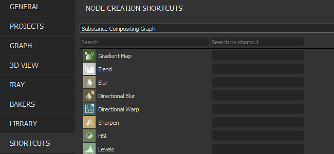

# Version 2020.1 (10.1)

**Substance Designer 2020.1** includes a new shortcut editor, a MaterialX plugin and lots of new improvements for color management with Adobe Color Engine and new bakers functionalities.

Release date: *April 10, 2020*

>[!NOTE]
>
> Starting with this release, the application version number will change its format. What should have been **2020.1** now becomes **10.1.0**.

## Major Features

### New Shortcut Editor for Node Creation

In this version we introduce a new shortcut editor which allows to define keyboard shortcuts to speed up the creation of nodes in the different graph modes.

The new shortcut editor is accessible in the main preferences via **Edit &gt; Preferences &gt; Shortcuts**. By default every shortcut fields is empty.

* **Shortcuts for each type of graph**   
  It is possible to define a shortcut for each type of graph available in Substance Designer, from regular compositing graph to more advanced such as functions and MDL.

  
* **Assign shortcuts both for atomic nodes and custom filters**   
  By default the interface shows the atomic nodes for each type of graph. Using the search field allows to refine the list but also make custom library filters and nodes accessible:

  
* **Creating a new shortcut**   
  To create a new shortcut for a specific node simply click in the text field next to its name and type the requested keys on the keyboard. To clear a shortcut use the cross button.

  
* **Managing shortcuts conflicts**   
  Use the tooltip on the warning icon to learn more about a conflict. It mentions if a key conflicts with an existing one or if it is already used by the application for an other purpose.

  

  
* **Search for shortcuts**   
  In case there are too many shortcuts to track or if a node is not visible by default, use the search system to isolate them:

  

### New MaterialX Plugin (Beta)

During SIGGRAPH 2019 we demonstrated a MaterialX plugin for Substance Designer. [MaterialX](http://www.materialx.org/) is a format developed by [Industrial Light &amp; Magic (ILM)](https://www.ilm.com/) that allows artists to create materials that can then be used in a wide variety of platforms and many usages (such as movies, TV shows, games, VR experiences, and manufacturing). This new plugin, which is now available in beta, allows to create MaterialX materials to be used in other compatible DCC application. Take a look at our recent [article about MaterialX](https://magazine.substance3d.com/research-a-portable-shader-graph/) to know more about the process and goals behind this new plugin.

This new plugin allows to:

* Develop procedural shaders and textures in parallel.
* Create advanced shaders for Substance Painter with features such as detail maps and procedural masks changeable at runtime.
* Match shader features from a game engine or VFX pipeline in the Substance Designer and Substance Painter viewport.

To get the plugin, simply head over [Substance Share](https://share.substance3d.com/libraries/6111) to download it.

### New Integration of Adobe Color Engine (ACE)

In addition to OpenColorIO it is now possible to use Adobe Color Engine (ACE) to support ICC profiles for color management. This means you can now import and export calibrated images to match other software such as Photoshop and Illustrator.

* **Enabling Adobe Color Engine**  
  Use the project settings to define which color management system to use:

  
* **Changing screen profile**  
  When previewing images via the 2D or 3D view, use the dropdown to specify which profile to use:

  
* **ACES for Legacy Color Management**  
  The ACES tonemapped output transform is now available with the Legacy color management mode.

### Improved Bakers

We refined some of our bakers with two main changes:

* **Improved sampling**  
  The Ambient Occlusion, Thickness and Curvature baker now use a new sampling method which greatly improves the quality of the baked results. It produces a more appealing noise and more stable results, without the need to increase the sample count. The image below shows the previous sampling method at the top and the new method at the bottom with from left to right 4, 8 and 16 samples (all renders were done with anti-aliasing set to 4x4 subsampling).

  {width="600px"}
* **New normalization setting**  
  The Thickness and Heightmap bakers have a new normalization parameter which lets you bake raw values to texture instead of clamped values in the range 0-1. This is useful with a height map to know the raw distances between a low-poly and high-poly mesh for example. The divisor value will correspond exactly to the displacement intensity to setup on the low-poly mesh to match the high-poly mesh silhouette. In order to correctly interpret the height map we have also exposed a new “Scalar Zero Value” parameter to define the pixel value corresponding to 0. Additionally, the manual factor allows to fix potential seam issues on UDIM meshes caused by a per UV-Tile normalization.

  

### Improved 3D View

The 3D view received various quality of life improvements which should make daily work more pleasant:

* **Parameters synchronization between renderers**  
  Shader parameters are now synchronized between OpenGl and Iray which make jumping between them much easier.
* **Display texture input preview and add disable parameter**  
  Shader input parameters now display a preview of their input: it can be a uniform color parameter, a graph node or a bitmap. It is also possible to uncheck a parameter to temporarily disable it.

  

  
* **Environment map preview in settings**  
  When going to **3D View &gt; Environment &gt; Edit** there is now a preview of the environment map used to light the scene.

  
* **New Unlit shader**  
  A new shader named "unlit" has been included by default. It doesn't react to any lighting and instead can be used to display a single texture in the viewport over a mesh. This is useful to look at baked textures for example.

  {width="500px"}
* **Improved performances on High DPI screens with viewport downscaling**  
  Similar to Substance Painter, there is now a new parameter named **Viewport Scaling** in the main preferences that detects that a screen uses HDPI scaling (such as Retina screens on MacOS) and will automatically divide the viewport resolution by 2. This behavior avoids drawing the viewport at too high resolutions and improves general performances.   
  The current setting value are:

  * **None**: no viewport scaling.
  * **Auto** (default): if the application is on a HDPI screen the viewport resolution will be divided by two.

  

### New Content

This release also includes some new or improved nodes:

* **Improved PBR Render node**  
  Already introduced in a previous version, this node has been greatly improved. It now offers camera controls, new shapes (such as a plane and a cylinder), post-effects (Depth of Field, Bloom/Glare, Vignette, etc) and new material types (like Clear-Coat and Anisotropy) as well as support for materials with opacity.   
  For more information, see the dedicated [documentation page](../../../compositing-graphs/nodes-reference-for-com/node-library/material-filters/pbr-utilities/pbr-render/pbr-render.md).

  {width="250px"}

  {width="250px"}

  {width="250px"}
* **New PBR Render Mapping Node**  
  As an extension for PBR Render, you can use this new node to build composite map-channel previews.  
  For more information, see the dedicated [documentation page](../../../compositing-graphs/nodes-reference-for-com/node-library/material-filters/pbr-utilities/pbr-render-mapping/pbr-render-mapping.md).

  {width="250px"}

  {width="250px"}
* **New FXAA filter**  
  The new filter implement the Fast approximate anti-aliasing (FXAA) algorithm which is an anti-aliasing method. It can be used on regular texture to smooth out jagged lines or edges.  
  For more information, see the dedicated [documentation page](../../../compositing-graphs/nodes-reference-for-com/node-library/filters/effects/fxaa/fxaa.md).

  {width="600px"}
* **New Hald CLUT filter**  
  This filter allows to adjust the tone and color of an image with an input Look Up Table (LUT). It uses the Hald CLUT format, to create one simply start off from an identity LUT [available here](http://www.quelsolaar.com/technology/clut.html).  
  For more information, see the dedicated [documentation page](../../../compositing-graphs/nodes-reference-for-com/node-library/filters/adjustments/hald-clut/hald-clut.md).

  {width="600px"}

## Release Notes

### 2020.1.3

*(Released June 11, 2020)*

**Added:**

* &#91;Content&#93; Expose 'Matte Color' parameter in Safe Transform Grayscale node
* &#91;Content&#93; PBR Render: Add a custom Background Input option
* &#91;Content&#93; Panorama Light nodes: new option to sample the color from the background image
* &#91;Parameters&#93; Hide parameters with 'not-supported' flag from the Expose Parameters window list

**Fixed:**

* &#91;3D View&#93; Crash when switching custom meshes in a specific case
* &#91;3D View&#93; Normal format is always DirectX on startup
* &#91;Content&#93; 3D Worley noise: render artefact when using a high grid size value
* &#91;Content&#93; Dissolve node blending is incorrect
* &#91;Content&#93; PBR Render: remove Cooker warning
* &#91;Content&#93; PBR Render: result contains negative colors in some cases
* &#91;Cooker&#93; Cache injection issue for multi-output instance nodes
* &#91;Explorer&#93; Crash when closing a Package that contains a displayed MDL Graph
* &#91;Graph&#93; 2 pass cooking: node type change does not trigger a recook
* &#91;Graph&#93; Crash when deleting inputs while using its connection
* &#91;Graph&#93; Link endpoints can be moved to empty space
* &#91;MDL&#93; Crash when cancelling MDL export from MaterialX graph
* &#91;MDL&#93; Error when cancelling export to MDLE
* &#91;Presets&#93; Crash in Presets tab after changing type of parameter included in preset
* &#91;Resources&#93; Material list is empty in graph contextual menu for meshes linked as non-UDIM

### 2020.1.2

*(Released April 27, 2020)*

**Added:**

* &#91;Content&#93; Add Alchemist Filter template
* &#91;Content&#93; PBR Render: add parameters to control the diffuse/specular shadows intensities
* &#91;Content&#93; Shape Light nodes: add camera position parameter
* &#91;News&#93; Group 'Arrow' style is broken the first time the window is displayed
* &#91;Bakers&#93; Add the Z shortcut to the 2D View to see the image at 1:1
* &#91;Project&#93; Hide $(PROJECT\_DIR) alias from the list
* &#91;Explorer&#93; Do not create Custom Resource for resources that are not a file on disk

**Fixed:**

* &#91;Player&#93; Report missing aliases when loading SBS packages
* &#91;Player&#93; Display the Random Seed value in decimal base
* &#91;Player&#93; Bundle all environment maps included with Substance Designer
* &#91;Player&#93; Crash on exit in macOS High Sierra
* &#91;Player&#93; Packages using the sbs:// cannot be loaded
* &#91;Content&#93; 3D Worley noise: render artefact when using a high grid size value
* &#91;Content&#93; 'greaterThanZero' input in 'Wave' node is not used
* &#91;Content&#93; Plane Light: World space position mode does not work
* &#91;Content&#93; Sphere Light: internal light position does not work correctly
* &#91;Bakers&#93; Crash when baking with the baking window while a 'Refresh all baked maps' is running
* &#91;Bakers&#93; Baking fail on Optix for AO from Mesh using Low as High with a Normal map
* &#91;Bakers&#93; The resolution of the preview of the UVTiles does not match the size of screen
* &#91;3D View&#93; Assigned bitmap is overridden when loading a MDL if default value is not a texture2d
* &#91;3D View&#93; Materials Properties widgets change after a property is reset
* &#91;3D View&#93; Normal Format global preference no longer works
* &#91;MatX&#93; Library: MaterialX Graph category does not display all the available nodes
* &#91;MatX&#93; The contextual menu of a Custom Graph can contain empty subfolders in the 'Add Node' folder
* &#91;SBSAR&#93; Primary Input is reverted to the first input in the list
* &#91;Library&#93; Only first graph is included from SBSAR with multiple graphs
* &#91;CustomGraph&#93; Nodes, that are not part of the current graph type, are created automatically in some cases
* &#91;Iray&#93; Box projection 'Depth' parameter does not work correctly
* &#91;Preferences&#93; Improve layout in the project settings
* &#91;Parameters&#93; Crash when moving a position widget after having deleted a parameter
* &#91;UI&#93; Crash when changing usages hierarchy in outputs node
* &#91;Graph&#93; Crash while using a Selection Box on comment and a badged node

### 2020.1.1

*(Released April 10, 2020)*

**Fixed:**

* &#91;3D View&#93; Memory usage is too high when working on compositing graph
* &#91;Content&#93; Unexpected shapes in non-square output of 'Polygon' nodes
* &#91;Content&#93; PBR Render: Orthographic camera doesn't work correctly when using non square resolution
* &#91;Content&#93; PBR Render: Swirly bokeh increases the image border brightness
* &#91;Color Management&#93; Color picker in New Bitmap dialog is not color managed.
* &#91;Color Management&#93; Color pickers in paint and vector tools in the 2d view are not color managed.

### 2020.1.0

*(Released April 09, 2020)*

**Added:**

* &#91;Shortcuts&#93; Shortcuts manager for node creation
* &#91;Content&#93; New PBR Render Node
* &#91;Content&#93; New FXAA filter
* &#91;Content&#93; New Hald CLUT filter
* &#91;Content&#93; Expose filtering in 'Crop' nodes
* &#91;3D View&#93; Improve Shader parameters / texture assignment workflow
* &#91;3D View&#93; New Unlit shader
* &#91;3D View&#93; Add a "Scalar Zero Value" to the displacement shaders
* &#91;3D View&#93; Add an option to downscale viewport resolution when High DPI is enabled
* &#91;3D View&#93; GLSLFX: Allow to set gui information on sampler (default, min, max, guiMin, guiMax, guiStep, guiWidget, guiName, guiGroup)
* &#91;3D View&#93; Add 'Load State With Mesh...' option in the Scene menu
* &#91;3D View&#93; Add the ACES tonemapped output transform in Legacy color management mode
* &#91;Bakers&#93; New Sampling method in AO, Curvature, Bent Normal, Thickness bakers
* &#91;Bakers&#93; New Normalization options in Height and Thickness bakers
* &#91;Color Management&#93; Integrate Adobe ACE (Adobe Color Engine)
* &#91;Color Management&#93; Add options to set default behavior when ICC profile is missing
* &#91;Parameters&#93; Make sliders incrementing consistent with Substance Painter
* &#91;Packaging&#93; Bundle as many Qt dlls as we can for Python scripts
* &#91;Project&#93; Disable settings for read-only project files and communicate that state clearly
* &#91;Preferences&#93; Hide specific unclear settings related to responsiveness and computation periods
* &#91;UI&#93; Rename Pow2 -&gt; 2Pow
* &#91;Properties&#93; Optimize compositing graph properties display
* &#91;AXF&#93; Update to AXF SDK 1.7.1

**Fixed:**

* &#91;3D View&#93; Ambient Light parameters are not visible eventhough it is enabled
* &#91;3D View&#93; glslfx: Color widget is always a vec3 without alpha
* &#91;3D View&#93; Environment map set from a resource is not saved in the scene resource
* &#91;3D View&#93; Iray: Ambient light is converted to a point light at scene origin
* &#91;3D View&#93; glslfx: Color widget is always a vec3 without alpha
* &#91;Parameters&#93; Instance Package URL is not correct in the attribute group
* &#91;Parameters&#93; Crash when exposing parameters
* &#91;Parameters&#93; Icons are not correctly aligned in parameters of Curve nodes
* &#91;Parameters&#93; 'Text' node string is only displayed in 'Preview' mode when exposed
* &#91;Parameters&#93; Crash when renaming an input parameter used in 'Visible If' statement
* &#91;Parameters&#93; Crash when deleting a Levels node which has a function set in any of its parameters
* &#91;UI&#93; Warning icon in input parameters list is placed on top on an existing button
* &#91;UI&#93; Warnings are not cleared on correct input parameter item in a specific case
* &#91;UI&#93; Prevent the "Is mesh UDIM ?" popup to appear when the mesh UVs are strictly in the &#91;0,1&#93; tile
* &#91;UI&#93; Presets drop down lists can be scrolled with mouse wheel with a simple mouse hover
* &#91;UI&#93; 'Output(s) computation' option in graph attributes is incorrectly named
* &#91;MDL&#93; Crash when placing a SBS graph resource into a MDL graph
* &#91;MDL&#93; SBS node with image input does not work correctly
* &#91;MDL&#93; Incorrect texture bindings &amp; usage names
* &#91;Graph&#93; Input value group and usage are ignored in 'Material' Link Creation Mode
* &#91;Graph&#93; Input Values use the default value instead of input data for Booleans
* &#91;Bakers&#93; Incorrect normals in World Space Normals baker using a tangent Normal map in specific cases
* &#91;Bakers&#93; Excessive memory usage when baking with the Preview window opened
* &#91;Presets&#93; corrupted preset make rendering crash
* &#91;Presets&#93; Boolean parameter from old SBS is not impacted by preset
* &#91;Library&#93; Resources from the first open package are listed in the node creation floating menu
* &#91;Publish&#93; Publishing to SBSAR returns Error code 13 in SBSCooker on macOS
* &#91;Publish&#93; Deprecated argument warning in SBSCooker when publishing to SBSAR
* &#91;API&#93; Can't get the Metadata from a package that comes from a .sbsar file
* &#91;Export&#93; In Legacy mode, colorspace option reverts back to defaults for specific outputs
* &#91;2D View&#93; Copy to clipboard does not take the Color Management state into account
* &#91;Unix&#93; Designer ignores system signals
* &#91;Library&#93; Some filters in the library don't work properly because of translated tags
* &#91;Cooker&#93; Square Root of negative numbers should return 0 instead of NaN
* &#91;2D View&#93; Red and blue channels are swapped after undoing the first paint stroke
* &#91;Console&#93; Too many warning message in the console "QPixmap::scaled: Pixmap is a null pixmap"
* &#91;Content&#93; "Shape Glow": cooking warning
* &#91;Dependencies&#93; Assigning a graph located in a different package to a mesh does not create dependencies
* &#91;Iray&#93; Material properties becomes inactive after switching geometry

**Added:**

* &#91;Shortcuts&#93; Shortcuts manager for node creation
* &#91;Content&#93; New PBR Render Node
* &#91;Content&#93; New FXAA filter
* &#91;Content&#93; New Hald CLUT filter
* &#91;Content&#93; Expose filtering in 'Crop' nodes
* &#91;3D View&#93; Improve Shader parameters / texture assignment workflow
* &#91;3D View&#93; New Unlit shader
* &#91;3D View&#93; Add a "Scalar Zero Value" to the displacement shaders
* &#91;3D View&#93; Add an option to downscale viewport resolution when High DPI is enabled
* &#91;3D View&#93; GLSLFX: Allow to set gui information on sampler (default, min, max, guiMin, guiMax, guiStep, guiWidget, guiName, guiGroup)
* &#91;3D View&#93; Add 'Load State With Mesh...' option in the Scene menu
* &#91;3D View&#93; Add the ACES tonemapped output transform in Legacy color management mode
* &#91;Bakers&#93; New Sampling method in AO, Curvature, Bent Normal, Thickness bakers
* &#91;Bakers&#93; New Normalization options in Height and Thickness bakers
* &#91;Color Management&#93; Integrate Adobe ACE (Adobe Color Engine)
* &#91;Color Management&#93; Add options to set default behavior when ICC profile is missing
* &#91;Parameters&#93; Make sliders incrementing consistent with Substance Painter
* &#91;Packaging&#93; Bundle as many Qt dlls as we can for Python scripts
* &#91;Project&#93; Disable settings for read-only project files and communicate that state clearly
* &#91;Preferences&#93; Hide specific unclear settings related to responsiveness and computation periods
* &#91;UI&#93; Rename Pow2 -&gt; 2Pow
* &#91;Properties&#93; Optimize compositing graph properties display
* &#91;AXF&#93; Update to AXF SDK 1.7.1
