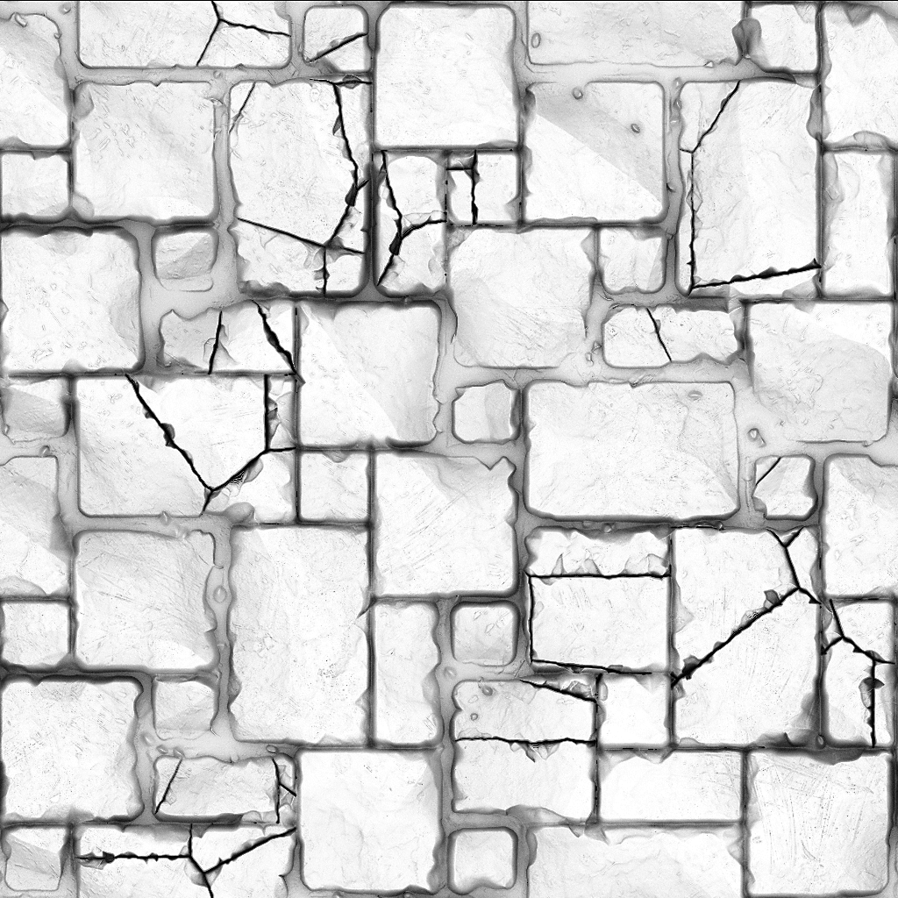
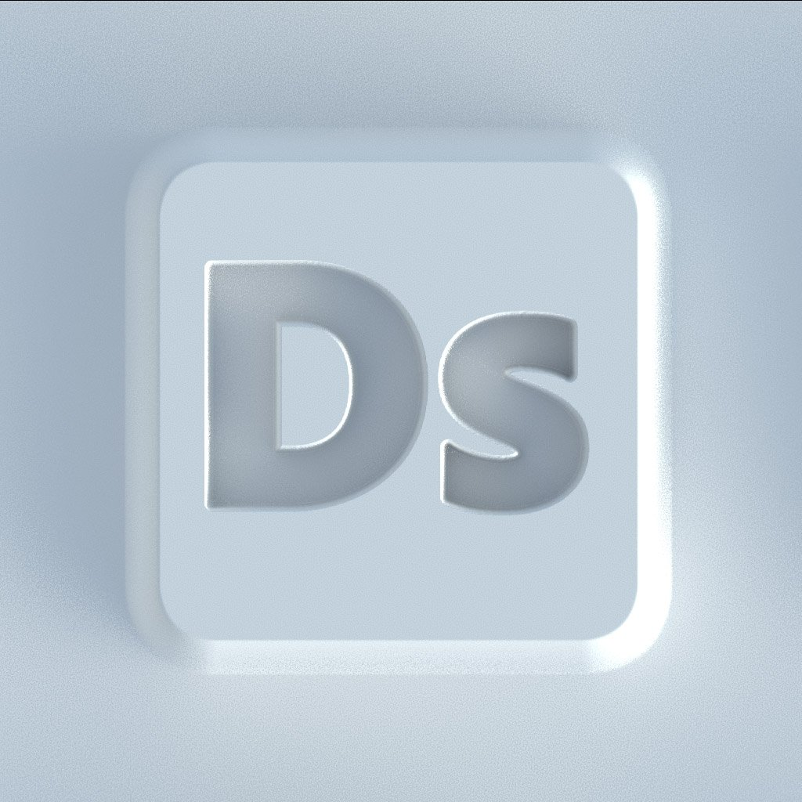

# Version 11.2

**Substance 3D Designer 11.2** has changed name slightly and is now connected to Adobe Creative Cloud. It brings the very first release of Substance Model Graphs, Send To functionality, a number of Raytrace-based nodes and some UI changes.

Release date: *23 June 2021*

## Major features

### New Substance model Graphs

An entirely new Graph type, the Substance model Graph, is available, letting you create procedural 3D models using a familiar node interface.

<table>
<tr style="border: 0;">
<td style="border: 0;" valign="top">

{width="300px"}

</td>
<td style="border: 0;" valign="top">

{width="300px"}

</td>
</tr>
</table>

Make sure to dive into the new, dedicated documentation section to find out more.

This is a first release, so expect some limitations.

### Send To functionality

Adobe versions of Substance 3D Designer have new Send To functionality, letting you send assets to other Substance 3D applications quickly. No more need to publish as SBSAR and load up individual files, Send To solves this in one click.

>[!NOTE]
>
> Steam versions of Substance 3D Designer do not feature the Send To functionality.

### New Raytrace nodes

No Designer release is complete without some new nodes. Building on the phenomenal strength of PBR Render, 5 new RT-based nodes join us in this release.

<table>
<tr style="border: 0;">
<td style="border: 0;" valign="top">

{width="300px"}

</td>
<td style="border: 0;" valign="top">

{width="300px"}

</td>
</tr>
</table>

RTAO does an even better job at crisp, correct AO than the previous HBAO node.

{width="300px"}

Caustics generates physically-correct, raytraced caustics based on a heightmap, such as a simple Perlin noise. Good for creating realistic animated flipbook textures for realtime caustics.

{width="300px"}

RT Shadow gemerates accurate, raytraced shadows, with a few easy controls.

<table>
<tr style="border: 0;">
<td style="border: 0;" valign="top">

{width="200px"}

</td>
<td style="border: 0;" valign="top">

{width="200px"}

</td>
<td style="border: 0;" valign="top">

{width="200px"}

</td>
</tr>
</table>

RT Irradiance is the most advanced out of the new nodes. It does raytraced irradiance based on a material with height map, and a Environment map and/or an Emissive map.

{width="600px"}

That means you can do textures with pre-baked lighting, like for stylized projects, or you can bake in raytraced glow bouncing off your heightmap.

{width="300px"}

And last there's the Bent Normal node. Compared to a regular normal conversion, this node uses AO to modify your normalmap to use that AO information. Before you'd need mesh bakers to create the effect, this node does it in texturespace for you.

### Adobe Standard Material Shader

In our efforts to unify materials and rendering across our applications, the new default shader in the 3D view is the Adobe Standard Material Shader. At first glance it's no different from the old PBR Metallic Roughness shader (it's based on it anyway), but it supports many more exotic channels, letting you preview these without needing an external renderer.

### UI Changes

Small modifications have been made to the UI, but the most obvious ones are an improved File &gt; New Package menu, letting you choose the graph type, and improved and updated buttons on the Main Toolbar, providing shortcuts for new Graph types and sending to other applications.

## Tutorials

Below are our video tutorials covering the new features:

## Release notes

### 11.2.0

*(Released June 23, 2021)*

**Added:**

* &#91;Branding&#93; Substance Designer becomes Adobe Substance 3D Designer
* &#91;Substance Models&#93; New Substance model graphs to create procedural 3D models
* &#91;Content&#93; Add new HDR environment maps
* &#91;Content&#93; New Bent Normal node
* &#91;Content&#93; New RT Ambient Occlusion node
* &#91;Content&#93; New RT Caustics node
* &#91;Content&#93; New RT Caustics node
* &#91;Content&#93; New RT Irradiance node
* &#91;Content&#93; New RT Shadows node
* &#91;Interoperability&#93; Send asset to Painter, will launch Painter and add or update your asset in the library (requires a Adobe Substance 3D plan)
* &#91;Interoperability&#93; Send asset to Sampler, will launch Sampler and add or update your asset in the library (requires a Adobe Substance 3D plan)
* &#91;Interoperability&#93; Browse your asset in Adobe Bridge, will launch Bridge at the location of the asset (requires a Adobe Substance 3D plan)
* &#91;ASM&#93; Support of the new Adobe Standard Material (ASM) in Substance Graph and MDL Graph
* &#91;ASM&#93; Add ASM templates
* &#91;ASM&#93; Add OpenGL Shader for ASM
* &#91;ASM&#93; Set ASM shader as the default Shader
* &#91;General&#93; Aggregate all temporary files to the user-set temporary directory
* &#91;General&#93; New 'Save a Copy as' command
* &#91;General&#93; Update File Menu
* &#91;General&#93; Update Help Menu
* &#91;Publish&#93; New publish window
* &#91;Publish&#93; Add option in the preferences in order to not save the SBS file while publishing a SBSAR file
* &#91;Properties&#93; Add graph type field to the graph properties
* &#91;Properties&#93; Reorder properties of graphs in a more relevant way
* &#91;Branding&#93; New About window
* &#91;Branding&#93; Update application Style
* &#91;GLSLFX&#93; Add a label to techniques
* &#91;GLSLFX&#93; Add the possibility to set the label of a GLSLFX shader
* &#91;Metadata&#93; Add Metadata on the package resources
* &#91;Metadata&#93; Allow Metadata edition for graphs, inputs, outputs and resources
* &#91;Localization&#93; New translations in German, French and Simplified Chinese
* &#91;UX&#93; Reverse zoom in the 3D view in the case of a Mouse Drag
* &#91;AXF&#93; Update to version 1.8.0
* &#91;Logs&#93; Add installed plugins to the logs
* &#91;VFX&#93; Add ACES 1.2 OpenColorIO config
* &#91;Python API&#93; Add a method to query the tmp dir specified in the settings
* &#91;Python API&#93; Add an isModified method to SDPackage to check if a pkg is saved
* &#91;Python API&#93; Add some color conversion methods to SDColorManagementEngine
* &#91;Python API&#93; Delete graph objects (Comments, pins, frames, ...)
* &#91;Python API&#93; Expose Physical Size property for graph instance nodes
* &#91;Python API&#93; Expose save a copy as
* &#91;Python API&#93; Fix SDPackageMgr.savePackage method
* &#91;Python API&#93; Get a list of selected graph objects
* &#91;Python API&#93; Introduce new method names to work with graph selections
* &#91;Python API&#93; Plugins cannot add actions to the first created explorer panel

**Fixed:**

* &#91;Parameters&#93; Negative values on drop down Integer1 parameters result in incongruous behaviour in instance
* &#91;Parameters&#93; Problem when incrementing a value on an angle widget
* &#91;Graph&#93; Timing problems when output are displayed in the 2D or 3D view.
* &#91;Internationalisation&#93; Some specific characters are changed into spaces in file identifiers
* &#91;Preferences&#93; 'User project' file label is not translated back from Japanese
* &#91;Python API&#93; RecursionError when running SDUIMgr.getCurrentGraphSelectedNodes() method
* &#91;Python API&#93; SDApplication.getPath(SDApplicationPath.InstallationDir) returns nothing
* &#91;Python API&#93; SDSBSARExporter does not send file save notifications
