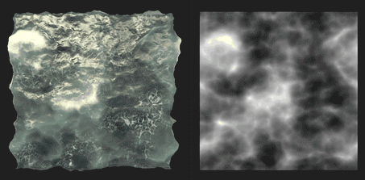

# Version 12.1

**Substance 3D Designer 12.1** brings a lot of new nodes for Substance material graphs, USD file format support and add more interoperability with Stager.

Release date: *April 26th, 2022*

## Major feature

### New content for Substance material graphs

A lot of nodes have been added in this version, you will find some new patterns, new noises, new filters, ...

Take a look at the node pages linked below to for examples of the breadth of output that is achieved by these powerful new nodes!

* **New Patterns**

  * We have added a new <b>Tile Random 2</b> node to generate adjacent tiles of random sizes and ratios, which is very useful to quickly create fully irregular grids with slanting, rounded corners and bevelling.

    {width="640px"}
  * New <b>Triangle Grid</b> pattern to generate a grid made of triangles. We are using it in the material below to easily and perfectly simulate the leather grain. This generator represents a surface of vertices in 3D space and may be used to create a variety of polygonal styles.

    {width="640px"}
* **New Noises**

  * In order to give you more variety, a set of <b>15 new Grunge Maps</b> (Concrete, Leaks, Splashes Dirty, ...) has been added to the library.

    {width="640px"}
  * You will also find a lot of <b>new 2D and 3D Noises</b>, like Voronoi (2D and 3D), Voronoi Fractal (2D and 3D), 3D Ridged Fractal and an update of the current 3D Perlin Noise (adding tiling and absolute options).  
    These noises are all mapped in 3D space and offer multiple styles, allowing for increased variety and control which will give you plenty of choice for creating the perfect map for your material, like the sea and the science fiction panels materials below.

    {width="640px"}

    {width="640px"}
  * A collection of <b>3D Texture nodes</b> (Position, SDF, Offset) and <b>3D Render nodes </b>(Surface or Volume) to create and render 3D textures, which are an atlas of a 3D model's slices.

    {width="640px"}

* **New Filters**

  * With the <b>Auto Crop</b> node, you can place a shape at the *center* of the image without being resized, or resize it to fit the space. So for example your shape may be freely tweaked while keeping a consistent position and size when scattered.

    {width="640px"}
  * With the<b> Extend Shape</b> node you will be able to stretch a section of a shape over a custom direction and distance.

    {width="640px"}
  * And with the <b>Non-Uniform Rotation</b> node you can rotate an input according to a given map.

    {width="640px"}
* **And also...**

  * Easing functions (function graph) which are very useful to drive a value in a non linear way.
  * And finally this version brings also a new, more accurate version of the <b>Quantize</b> node, as well as a brand new <b>Summed Area Table</b> utility filter.

### Improve interoperability

* **USD Support**In addition to the

  and

  file formats, you can now import and export USD files (

  ,

  ,

  ) in order to use them as resources of your Substance model graphs, for baking or in the 3D view to showcase your Substance material. You can also use this format to export your Substance model graph or the content of the 3D view.
* <b>Send to Stager  
  </b>You can now send your Substance material to Stager in one click, as it was already possible with Sampler and Painter. Thanks to this feature, no more need to publish as SBSAR and load up individual files (requires Stager version 1.2.0 with the new material manager)

  

### Miscellaneous

* If you are working on fabrics, you can now display a dedicated mesh in the 3D view in order to better see how your material is rendered on a draped shape. Open the <b>Scene</b> menu in the 3D view panel and select the <b>Cloth</b> option to display this model.

  {width="640px"}

* We have also added some new scene management nodes for Substance model graphs. These nodes allow you to rename, reparent, fuse or expand your scene elements in order to organize your scene hierarchy. There is also a new node to set the pivot of one or more elements of a scene.

* While working on projects in Designer, you may encounter warnings and error messages, which notify you of an issue in the project. In this version, we <b>improve the error management system</b> in order to surface all the errors and warnings in the Explorer: everything is listed in one place and so it's easier to check if your project contains any problems.

  {width="640px"}

## Release notes

### 12.1.0

*(Released April 19, 2022)*

<b>Added:</b>

* &#91;Main&#93; New Content for material graphs
* &#91;Main&#93; Send Materials to Stager
* &#91;Main&#93; Support of USD files
* &#91;Main&#93; Improve the error reporting in the UI
* &#91;Main&#93; Scene Management nodes for model graphs
* &#91;Content&#93; Add more options to 3D Perlin Noises (tiling, absolute...)
* &#91;Content&#93; New 3D Ridged Noise Fractal node
* &#91;Content&#93; New 3D Texture Offset node
* &#91;Content&#93; New 3D Texture Position node
* &#91;Content&#93; New 3D Texture Render Surface node
* &#91;Content&#93; New 3D Texture Render Volume node
* &#91;Content&#93; New 3D Texture Signed Distance Field node
* &#91;Content&#93; New Auto Crop node
* &#91;Content&#93; New Easing functions
* &#91;Content&#93; New Extend Shape nodes
* &#91;Content&#93; New Grunge Maps
* &#91;Content&#93; New Non-Uniform Rotation node
* &#91;Content&#93; New Summed Area Table filter
* &#91;Content&#93; New Tile Random 2 generator
* &#91;Content&#93; New Triangle Grid pattern generator
* &#91;Content&#93; New version of the Quantize Grayscale node
* &#91;Content&#93; New Voronoi and Voronoi Fractal Noises (2D/3D)
* &#91;Content&#93; Threshold: add 'Lower' and 'Lower and equal' comparison mode
* &#91;Content&#93;&#91;3D View&#93; Add a mesh fit for displaying fabrics to the shipped resources
* &#91;Substance models&#93; New Expand Group Instances node
* &#91;Substance models&#93; New Fuse node
* &#91;Substance models&#93; New Rename node
* &#91;Substance models&#93; New Reparent node
* &#91;Substance models&#93; New Set Pivot node
* &#91;Substance models&#93; Update to SDK 1.6.0
* &#91;ThirdParty&#93; Upgrade Qt (and QtForPython) to 5.15.8
* &#91;ThirdParty&#93; Upgrade Python to 3.9.9
* &#91;ThirdParty&#93; Upgrade OpenSSL to 1.1.1m
* &#91;UI&#93; Improve Node menu behavior when misclicking
* &#91;UI&#93; Open subgraphs in the same tab even if pinned
* &#91;UI&#93; Remove Pin button from Explorer panel's title bar
* &#91;UI&#93; Save "Do not display again" option on Welcome screen across versions
* &#91;3D View&#93; Display the Grid unit in the viewport when the "Axis" helper is enabled
* &#91;Automation&#93; Provide sbsbaker command line tool with Designer
* &#91;Color Management&#93; Implement new GPU backend for Adobe ACE
* &#91;Cooker&#93; Add an option to cook a package without a timestamp
* &#91;Graph&#93; Add badges in the FxMap graph
* &#91;Library&#93; Add new filter for Easings functions
* &#91;Player&#93; USD support
* &#91;Properties&#93; Add a warning error on the "PKG Resource Path" parameter of a Bitmap node when the resource is not found
* &#91;Substance Engine&#93; Upgrade to 8.4.1
* &#91;Yebis&#93; Warn the user that Yebis post effects will be removed in the next version
* &#91;Documentation&#93; New "Warnings and errors" page
* &#91;Documentation&#93; New page describing inheritance in Substance graphs
* &#91;Documentation&#93; Update 'Iray' section
* &#91;Documentation&#93; Update 'MDL graphs' section

<b>Fixed:</b>

* &#91;UI&#93; Clipping issues in templates tooltips in the new graph window
* &#91;UI&#93; Hard to read white text in nodes when using Dark Mode in macOS
* &#91;UI&#93; Layout issue in some dialog boxes
* &#91;UI&#93; Warning message is appearing truncated while creating Substance function graph in Explorer.
* &#91;UX&#93; Color picker is moving downward on each new opening
* &#91;UX&#93; Gradient editor window moves up each time it is spawned
* &#91;UX&#93; Graph properties are not automatically displayed for loaded packages
* &#91;Content&#93; Flood Fill Mapper: Incorrect input selection in a specific case
* &#91;Content&#93; Flood Fill: Text bleed in boolean parameters' buttons
* &#91;Content&#93; Incorrect range for Multi-Angle to Normal node's First Sample Light Angle parameter
* &#91;Substance models&#93; Properties of node shows identifier instead of label
* &#91;Substance models&#93;&#91;3D view&#93; Refresh problem when reopening a project
* &#91;Substance models&#93;&#91;3Dview&#93; Refresh issue when using wireframe preview
* &#91;Parameters&#93; Crash when deleting graph inputs in quick succession in a specific case
* &#91;Parameters&#93; Crash when resetting an instance parameter while editing its reference description
* &#91;Bitmap&#93; UDIM detection is not triggered for bitmap files dropped in graph
* &#91;Graph&#93; Bitmap/SVG nodes are not invalidated when resource is modified on disk after loading the package
* &#91;GraphRender&#93; Memory leak when Substance graph evaluation get cancelled
* &#91;Localization&#93; String "Rebake all maps for this resource" is appearing unlocalised
* &#91;MDL&#93; Exposed parameter initialised to 0 if input is connected to unconnected Dot node
* &#91;Preferences&#93; Tooltips are displayed even when the cursor is in an empty space
* &#91;Properties&#93; Undoing a color space value change sets the default value instead in a specific case
* &#91;Text&#93; Cannot Undo font switch to missing font resource
