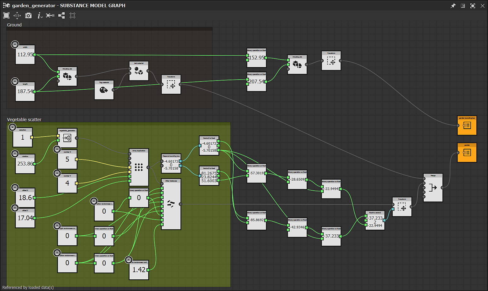

# Version 12.3

<b>Substance 3D Designer 12.3</b> brings Substance model graphs to a new level with the <b>support of subgraphs</b> (or graph instances), plus the<b> &#39;Visible if&#39; </b>control for exposed parameters and some<b> new nodes</b> dedicated to curves edition. This version also introduces two new panels (<b>Welcome </b>and <b>What&#39;s New</b>) to improve user onboarding, and some other minor features or bug fixes described below.

Release date: *October 6th, 2022*

{width="1111px"}

## Major features

### Support of Graph Instances in Substance model graphs

If you are used to creating graphs, you want to be able to make subgraphs (or graph instances) in order to reuse your work, make graphs less cluttered and be more efficient.  
This is now possible also for Substance model graphs: just drag &amp; drop your subgraph from the Explorer to your main graph to use it as an instance node.

{width="600px"}

We have also introduced the concept of output nodes for Substance model graphs, such as Output scene. You now have the possibility to have one or more outputs in your graph.  
Each output will correspond to an output pin when your graph will be instantiated in another graph.

{width="600px"}

When you right click on an instance node, you can of course access its referenced subgraph in order to view or edit it.

{width="600px"}

Thanks to subgraphs and exposed parameters, you can create complexe assets and apply infinite variations as demonstrated in the illustration below.

{width="600px"}

### Other improvements for Substance model graphs

* <b>Visible if for exposed parameters</b>  
  When exposing parameters, you may want to hide or show parameters based on the status of other parameters. For example a slider only showing when a button is turned on.  
  With <b>Visible If</b>, you can add conditions to parameter visibility, keeping a clean and functional UI. This mechanism already available for Substance graphs is now extended to Substance model graphs, using, of course, the same syntax. <b>  
  </b>

  {width="600px"}

* <b>New nodes dedicated to curve edition  
  </b>This version brings some new nodes dedicated to curve edition: <b>Reverse curve</b> swaps the two extremities of a curve, <b>Curve subdivide</b> adds more vertices on segments according to two methods, <b>Smoothing curve </b>smooths out all angles on a 2D curve and finally <b>Offset curve</b> inflates or deflates a 2D curve, as shown below.<b>  
    
  </b>

  {width="600px"}
* <b>New graph window </b>  
  The <b>New Substance model graph</b> window is now also available for Substance model graphs. You can add your own templates or select a default one, then directly enter the name of your graph and select the package which the graph will be added to.

  {width="600px"}

### Welcome and What's New panels

We have introduced two new panels to help you to get started with Designer:

First, the <b>Welcome </b>panel – displayed the first time you *launch* Designer – offers a global overview of the software and its role in the Substance 3D ecosystem. Then, the <b>What&#39;s new </b>panel – displayed the first time you run a *new version* of Designer – quickly presents the main features introduced in this version.

These two panels are also accessible from the Help menu.

### Miscellaneous

* <b>Two buttons widget for exposed boolean parameters</b>  
  You now have a new way to expose boolean parameters in a Substance graph. In addition to the switch button, you can use <b>Side by side buttons</b> with custom texts in order to make more visible the two differents modes driven by the boolean parameter.
* <b>Resolve scaling issues for high-DPI screens </b>  
  In previous versions, Designer was not able to correctly handle the scaling factor set in the operating system. As you can see in the illustration below, everything is perfectly managed on a 4K display with 125% scaling with all fonts and buttons displayed at a coherent size.  
  Note that the option 'Disable High DPI' in the Preferences have been reset to *False* in this new version as this option is not required anymore to have a usable interface.

  {width="600px"}

* **Apple Silicon native support (M1 / M2) for Steam version**  
  The 12.2 version of Designer was the first one to bring full support of new Apple machines based on M1 or M2 chips, yet that support was absent from the Steam edition. From now on, all Designer users can benefit from a faster and more efficient experience on these machines.

## Release notes

### 12.3.0

*(Released October 06, 2022)*

**Added:**

* &#91;General&#93; Onboarding panel to welcome new users
* &#91;General&#93; What's new panel to improve new features discoverability
* &#91;Substance model&#93; Support of sub graphs and instances
* &#91;Substance model&#93; Support Visible If for exposed parameters
* &#91;Substance model&#93; Add support of Output nodes
* &#91;Substance model&#93; Curve offset node
* &#91;Substance model&#93; Curve revert node
* &#91;Substance model&#93; Curve smoothing node
* &#91;Substance model&#93; Curve subdivide node
* &#91;Substance model&#93; Graft node
* &#91;Substance model&#93; Update "Filter Scene" node
* &#91;Substance model&#93; Make non-atomic nodes discoverable in Node menu
* &#91;Substance model&#93; Add the action "Open Reference" in the contextual menu of an instance node
* &#91;Substance model&#93; Add a "View in 3DView" action in the contextual menu of nodes that can be sent to the 3DView
* &#91;Substance model&#93; Automatically display a node's properties after exposing it
* &#91;Substance model&#93; Create 'New Substance model graph' window with templates list
* &#91;UI&#93; Improve consistency of image saving options in 2D View and 3D View
* &#91;UI&#93; Rename 'Link &gt; 3D Mesh' to 'Link &gt; 3D Scene' in Explorer's contextual menu
* &#91;UI&#93; Reset layout now apply to all floating windows
* &#91;UI&#93; Use 'View outputs in 3D View' label in contextual menus for graphs
* &#91;Library&#93; Support non-atomic Substance model graphs
* &#91;SBSAR&#93; Support graph outputs' description in the SBSAR
* &#91;Shader&#93; Set the default Tessellation Factor value to 1 for all shaders
* &#91;UI&#93; Expose 2-buttons widget for boolean parameters
* &#91;Engine&#93; Update to Version 8.6.4
* &#91;Steam&#93; Optimized build for Apple Silicon chipset (Apple M1 / M2)

**Fixed:**

* &#91;UI&#93; Resolve scaling issues for high-DPI screens
* &#91;UI&#93; '$(udim)' template missing from list in baking window
* &#91;UI&#93; Crash when displaying the Node menu on the screen's right border (macOS only)
* &#91;UI&#93; Extension button in 3D view menu is not visible
* &#91;UI&#93; Graph toolbar's extension menu is incomplete
* &#91;UI&#93; Incorrect parameter widget value after undoing hard range activation
* &#91;3D view&#93; Non default shader setting is lost on Iray from a session to another
* &#91;Bakers&#93; Crash when loading baking window with a scene without meshes
* &#91;Function&#93; Crash when copying an instance into its referenced graph
* &#91;Function&#93; Fix possible crash when manipulating nodes
* &#91;Globalization&#93; Italic is not always correctly disabled in japanese/korean/chinese
* &#91;Graph&#93; Incorrect fallback identifier for new MDL and Substance model graphs
* &#91;Graph&#93; Inherited parameters driven by values are sometimes computed incorrectly
* &#91;GraphRender&#93; Crash when switching engines while computing high resolution graph (macOS only)
