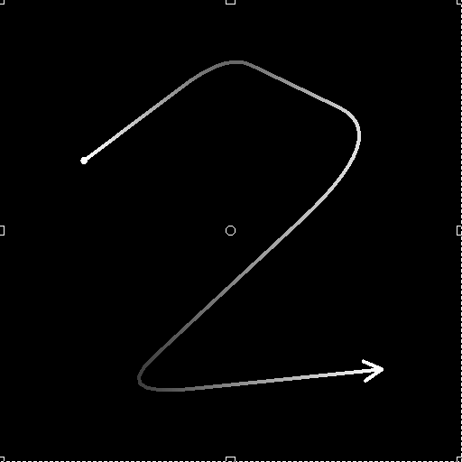
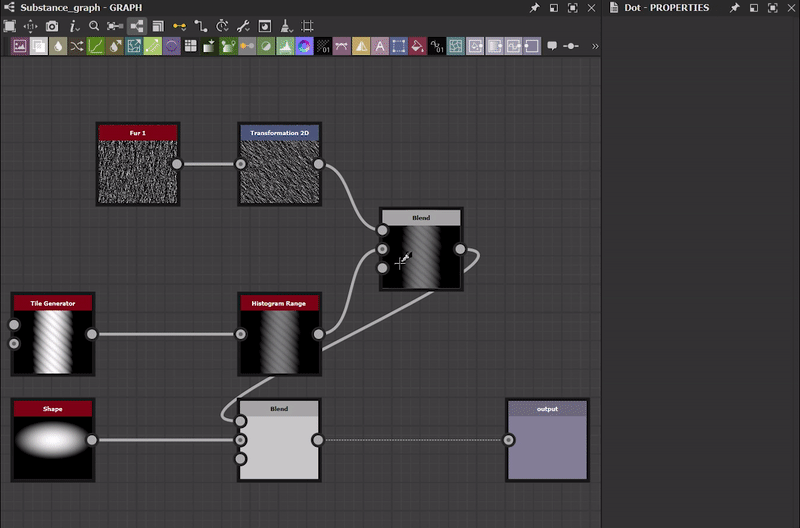

# Version 13.0

This 13.0.0 release of Substance 3D Designer brings a lot of love to material artists, with a huge quantity of new nodes, the Substance Engine 9.0 introducing loops for the first time and with a great addition to the graph: the portal node. And in order to please more users, we introduce a brand new Home Screen and provide additional languages.

As mentioned in the previous version, this version does not support Substance model graphs anymore: it means that you can no longer open, edit or export such graphs in Designer. You can find all the reasons why we took this decision in this [post](https://community.adobe.com/t5/substance-3d-designer-discussions/substance-model-graphs-end-of-life/td-p/13693731)on our community forum.

*Release date: June 6th, 2023*

*Artwork by [Celine Dameron](https://www.artstation.com/cline)*

## New content

This 13.0 version brings a lot of new content. You will mainly find two new collections of nodes: Spline tools and Path tools.

* [Spline tools](../../compositing-graphs/nodes-reference-for-com/node-library/spline-paths-tools/spline-tools/spline-tools.md) are a collection of nodes for generating and ajusting splines, as well as using them for mapping, scattering or warping images.
* [Path tools](../../compositing-graphs/nodes-reference-for-com/node-library/spline-paths-tools/path-tools/path-tools.md) are another set of nodes to extract, in the form of a list of segments, contours from a mask and then edit and improve them.

All these nodes will offer a lot of possibilities and they will have for sure a lot of creative applications. Check out the section about [working with Paths and Spline tools](../../compositing-graphs/nodes-reference-for-com/node-library/spline-paths-tools/working-with-path-and-spl/working-with-path-and-spline-tools.md) for a tour of the important concepts to understand in order to get comfortable with this toolset.

*Artwork by [Louise Melin](https://www.artstation.com/troglodette)*

### Spline tools

New nodes dedicated to splines can be divided into four categories:

#### Create

The first category is of course the one to generate splines:

* [Spline Cubic](../../compositing-graphs/nodes-reference-for-com/node-library/spline-paths-tools/spline-tools/spline-cubic/spline-cubic.md): From two points and two tangents;
* [Spline Poly Quadratic](../../compositing-graphs/nodes-reference-for-com/node-library/spline-paths-tools/spline-tools/spline-poly-quadratic/spline-poly-quadratic.md): From a set of points;
* [Spline Circle](../../compositing-graphs/nodes-reference-for-com/node-library/spline-paths-tools/spline-tools/spline-circle/spline-circle.md): Following a circulare shape.

You can also create <b>bridges </b>between splines in order to have a full set of splines bewteen [2 splines](../../compositing-graphs/nodes-reference-for-com/node-library/spline-paths-tools/spline-tools/spline-bridge-2-splines/spline-bridge-2-splines.md) or [N splines](../../compositing-graphs/nodes-reference-for-com/node-library/spline-paths-tools/spline-tools/spline-bridge-list/spline-bridge-list.md).

<table>
<tr style="border: 0;">
<td style="border: 0;" valign="top">

</td>
<td style="border: 0;" valign="top">

</td>
<td style="border: 0;" valign="top">

</td>
<td style="border: 0;" valign="top">

</td>
</tr>
</table>

#### Assemble

In some cases, you will have to treat several splines as a single entity, so you need tools to manage a set of splines. The [Spline Merge List](../../compositing-graphs/nodes-reference-for-com/node-library/spline-paths-tools/spline-tools/spline-merge-list/spline-merge-list.md) allows you to merge all your splines into a single one by connecting the extremities in order, the [Spline Append](../../compositing-graphs/nodes-reference-for-com/node-library/spline-paths-tools/spline-tools/spline-append/spline-append.md) node lets you append a list of splines onto another list and thanks to the [Spline Select](../../compositing-graphs/nodes-reference-for-com/node-library/spline-paths-tools/spline-tools/spline-select/spline-select.md) node you can filter and select specific splines from a given list.

#### Modify

We also provide tools to rework and tweak your splines. You will find a node to apply a [2D transformation](../../compositing-graphs/nodes-reference-for-com/node-library/spline-paths-tools/spline-tools/spline-2d-transform/spline-2d-transform.md), like a rotation, translation, scale, and another one to [warp](../../compositing-graphs/nodes-reference-for-com/node-library/spline-paths-tools/spline-tools/spline-warp/spline-warp.md)<b> </b>the shape and two other nodes to modify the [thickness](../../compositing-graphs/nodes-reference-for-com/node-library/spline-paths-tools/spline-tools/spline-sample-thickness/spline-sample-thickness.md)<b> </b>or the [height](../../compositing-graphs/nodes-reference-for-com/node-library/spline-paths-tools/spline-tools/spline-sample-height/spline-sample-height.md) of the splines.

<table>
<tr style="border: 0;">
<td style="border: 0;" valign="top">

</td>
<td style="border: 0;" valign="top">

</td>
<td style="border: 0;" valign="top">

</td>
<td style="border: 0;" valign="top">

</td>
</tr>
</table>

#### Render

The last category is the one to create the final shape or pattern based on your splines. The first idea that will come to your mind will be to repeat a given shape along the spline: the [Scatter on Spline](../../compositing-graphs/nodes-reference-for-com/node-library/spline-paths-tools/spline-tools/scatter-on-spline-color/scatter-on-spline-color.md) node allows you to do that, with a lot of parameters to perfectly control the distribution (rotation, scaling, offset, colors, masks, etc.).

Thanks to the [Spline Fill](../../compositing-graphs/nodes-reference-for-com/node-library/spline-paths-tools/spline-tools/spline-fill/spline-fill.md)<b> </b>node, you can easily create a pattern from a closed spline. And if you want to map any texture onto your splines, with a high degree of control and precision, the [Spline Mapper](../../compositing-graphs/nodes-reference-for-com/node-library/spline-paths-tools/spline-tools/spline-mapper-color/spline-mapper-color.md) node is made for you!

<table>
<tr style="border: 0;">
<td style="border: 0;" valign="top">

</td>
<td style="border: 0;" valign="top">

</td>
<td style="border: 0;" valign="top">

</td>
<td style="border: 0;" valign="top">

</td>
</tr>
</table>

### Path tools

The [Mask to Paths](../../compositing-graphs/nodes-reference-for-com/node-library/spline-paths-tools/path-tools/mask-to-paths/mask-to-paths.md) node lets you extract the border of a grayscale pattern, in the form of a list of segments.

You can then process these paths with the [Path 2D Transform](../../compositing-graphs/nodes-reference-for-com/node-library/spline-paths-tools/path-tools/path-2d-transform/path-2d-transform.md) or [Paths Warp](../../compositing-graphs/nodes-reference-for-com/node-library/spline-paths-tools/path-tools/paths-warp/paths-warp.md) nodes in order to tweak according to your needs.  And thanks to the [Paths to Spline](../../compositing-graphs/nodes-reference-for-com/node-library/spline-paths-tools/path-tools/paths-to-spline/paths-to-spline.md) node, you can convert your Path into a Spline, and so take advantage of all the nodes dedicated to splines previously mentionned, like scattering.

<table>
<tr style="border: 0;">
<td style="border: 0;" valign="top">

</td>
<td style="border: 0;" valign="top">

</td>
<td style="border: 0;" valign="top">

</td>
<td style="border: 0;" valign="top">

</td>
</tr>
</table>

And to help you to learn all these new nodes, we published two new tutorials:

* [Introduction to Spline nodes](https://www.adobe.com/go/designer-tutorial-splines)
* [Introduction to Path nodes](https://www.adobe.com/go/designer-tutorial-paths)

## New Substance Engine v9

All the new nodes listed above are based on new Substance Engine version, and they are taking full advantage of its main new feature: <b>loops</b>.

Loops are only meant to be use inside [Substance function graphs](../../function-graphs/function-graphs.md) and you're most likely to implement them in a [Pixel Processor](../../compositing-graphs/nodes-reference-for-com/atomic-nodes/pixel-processor/pixel-processor.md), a [Fx-Map](../../compositing-graphs/nodes-reference-for-com/atomic-nodes/fx-map/fx-map.md) or a [Value Processor](../../compositing-graphs/nodes-reference-for-com/atomic-nodes/value-processor/value-processor.md). Loops will of course allows you to easily repeat a function many times, until a condition is respected. It will help you to lighten a lot your graphs, and gain in accuracy.

This dedicated [tutorial](https://www.youtube.com/watch?v=Ggoy8G90oDI)will help you to start to work with loops.

Substance Engine v9 also brings the following improvements:

* New Solid mode in the [Gradient Map](../../compositing-graphs/nodes-reference-for-com/atomic-nodes/gradient-map/gradient-map.md) node's gradient editor (i.e no interpolation at all)
* Atomic pow() node in Substance function graphs
* Add border wrapping options (clamp to edge, repeat) in Sampler nodes
* Nearest sampling in [Warp](../../compositing-graphs/nodes-reference-for-com/atomic-nodes/warp/warp.md) and [Directional Warp](../../compositing-graphs/nodes-reference-for-com/atomic-nodes/directional-warp/directional-warp.md) nodes

## Portal node

The [Portal](../../interface/the-graph-view/graph-items/graph-items.md) node is a new extension of the [Dot](../../interface/the-graph-view/graph-items/graph-items.md) node with the possibility to hide connections in your graph.

Thanks to this feature, you can improve the graph readability by hidding very long connections, and also have a quick access to key nodes from anywhere in the graph.

This new feature is fully explained in this dedicated [tutorial](https://www.adobe.com/go/designer-tutorial-portals).

## Home screen

When you start Designer, you know have access to a brand new [Home Screen](../../interface/home-screen/home-screen.md) like the one you have in others Adobe products. From this screen, you can:

* Quickly create a new graph;
* See the list of all the files recently opened in Designer, with some details like the size, the date when it has been modified for the last time or the complete filepath;
* A learn page where you can find link to learning resources, like tutorials to introduce you to new features or to discover quick tips;
* Direct links to the What's New screen, the About screen, the Substance 3D website, the Support Community forum, etc.

## New languages

This version comes with three additional languages:

* Spanish (Spain);
* Italian (Italy);
* Portugese (Brazil).

As a reminder, if you want to change the language in Designer, just go to the [Preferences](../../interface/preferences-window/preferences-window.md) and you will find the list of all available languages in the General section.

## Release notes

### 13.0.0

*(Released June 6th, 2023)*

### <b>Added</b>

* &#91;Graph&#93; Portal node
* &#91;Onboarding&#93; New Home Screen
* &#91;Content&#93; Spline (Cubic) node
* &#91;Content&#93; Spline (Poly Quadratic) node
* &#91;Content&#93; Spline Circle node
* &#91;Content&#93; Point List node
* &#91;Content&#93; Spline Bridge (2 splines) node
* &#91;Content&#93; Spline Bridge (List) node
* &#91;Content&#93; Spline Append node
* &#91;Content&#93; Spline Select node
* &#91;Content&#93; Spline Merge List node
* &#91;Content&#93; Spline 2D Transform node
* &#91;Content&#93; Spline Warp node
* &#91;Content&#93; Spline Sample Height node
* &#91;Content&#93; Spline Sample Thickness node
* &#91;Content&#93; Spline Render node
* &#91;Content&#93; Scatter on Spline Color node
* &#91;Content&#93; Scatter on Spline Grayscale node
* &#91;Content&#93; Spline Mapper Color node
* &#91;Content&#93; Spline Mapper Grayscale node
* &#91;Content&#93; Spline Bridge Mapper Color node
* &#91;Content&#93; Spline Bridge Mapper Grayscale node
* &#91;Content&#93; Spline Flow Mapper node
* &#91;Content&#93; UV Mapper Color node
* &#91;Content&#93; UV Mapper Grayscale node
* &#91;Content&#93; Paths to Splines node
* &#91;Content&#93; Masks to Paths node
* &#91;Content&#93; Paths 2D Transform nodenode
* &#91;Content&#93; Paths Polygon node
* &#91;Content&#93; Preview Paths node
* &#91;Content&#93; Paths Warp node
* &#91;Content&#93; Paths Select node
* &#91;Content&#93; Paths Vertex Processor node
* &#91;Content&#93; Paths Vertex Processor Simple node
* &#91;Content&#93; Quad Transform on Path node
* &#91;Content&#93; Raytraced Ambient Occlusion v2
* &#91;Content&#93; Raytraced Bent Normal v2
* &#91;Content&#93; Raytraced Shadows v2
* &#91;Engine&#93; Update to version 9
* &#91;Engine&#93; Loop node in function graphs
* &#91;Engine&#93; Add solid mode to Gradient
* &#91;Engine&#93; Atomic pow() node in Function Graph
* &#91;Engine&#93; Add border wrapping options (clamp to edge / repeat) in Sampler node
* &#91;Engine&#93; Nearest sampling in Warp and Directional Warp node
* &#91;Engine&#93; Add a "punchthrough alpha" mode to the Sharpen filter for color inputs
* &#91;Engine&#93; FxMap: Hemisphere morphlet
* &#91;Engine&#93; Atomic Get/Set operations in function graphs
* &#91;Engine&#93; Functions: use precise function of log/log2/exp, 2pow - Unify functions between cooker and engine
* &#91;Engine&#93; Add an "intensity offset" parameter to the Directional Warp filter
* &#91;API&#93; Support preset management for compositing graphs
* &#91;Functions&#93; Change input name for functions atomic nodes
* &#91;Localization&#93; Add Portuguese (Brazil), Italian (Italy) and Spanish (Spain) languages
* &#91;Localization&#93; Respect rule "Language (Country)" in the list of languages
* &#91;Presets&#93; Disable 'Preview' and 'Presets' panels in graph properties when using in-context editing
* &#91;Substance models graph&#93; End of support of Substance models graphs

### <b>Fixes</b>

* &#91;3D View&#93; Display of long strings in scene statistics is cut off (macOS only)
* &#91;API&#93; 'structure::Structure' module is still included in the API reference
* &#91;API&#93; Dot nodes in MDL graphs have no definition nor properties
* &#91;API&#93; Incorrect behavior when setting the parameter of function nodes
* &#91;Content&#93; 3D Voronoi and 3D Voronoi Fractal nodes generate a cooking warning
* &#91;Engine&#93; 'Intensity Map Offset' parameter has no effect on grayscale data in SSE2 engine
* &#91;Explorer&#93; Graph i/o can be deleted
* &#91;Graph&#93; Bitmap is ignored when used in instances
* &#91;Graph&#93; Incorrect dot node position when created node from a node
* &#91;Graph&#93; Incorrect focus in 'Expose parameter' dialog when using 'Enter' key
* &#91;Graph&#93; Wrong result in histogram scan with bitmap in context editing
* &#91;Localization&#93; Fix various clipping issues
* &#91;Parameters&#93; Crash when deleting an input parameter
* &#91;Publish&#93; Graphs in folders are moved to root in published package
* &#91;Resources&#93; Crash when updating a loaded resource on disk
* &#91;VisibleIf&#93; Fix regression in conditional visibility evaluation
