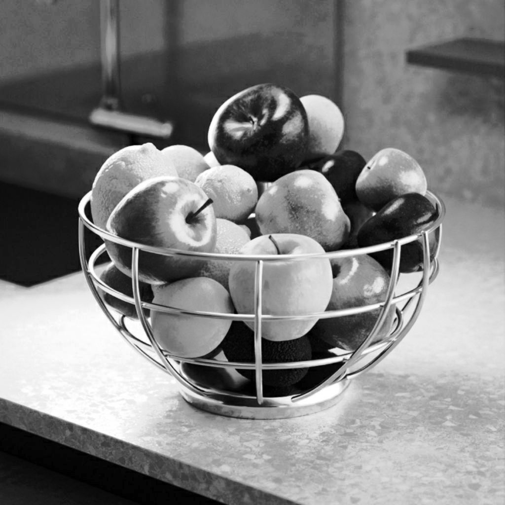
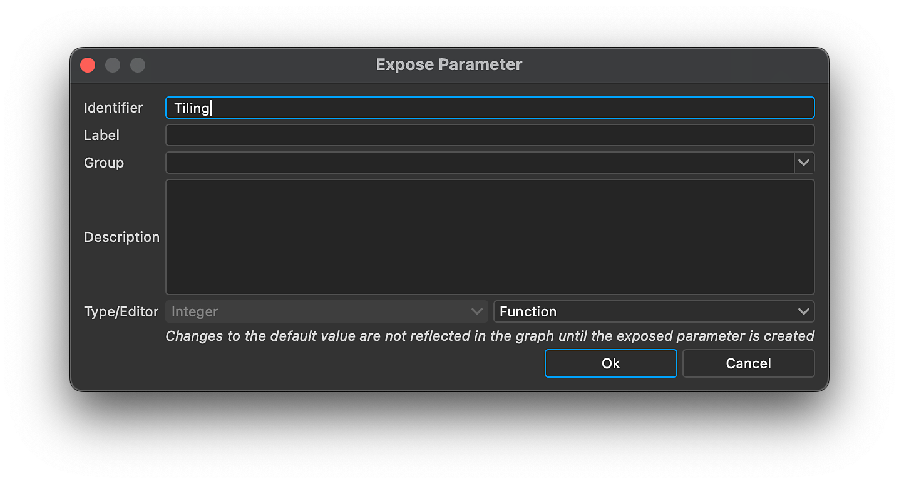

# Version 14.0

<b>Substance 3D Designer 14.0 </b>brings several quality of life improvements (graph navigation, performances, ...) but above all it includes a lot of new nodes (color manipulation, Kuwahara filter, histogram tools, bevel smooth, directional distance, ...). See below for more details about all these changes. 

*Release date: July 30th, 2024*

## New content

This 14.0 version brings a lot of new content with the new nodes listed below:

* <b>Nodes dedicated to color manipulation: </b>one node <b>(</b>[Quantize color](../../compositing-graphs/nodes-reference-for-com/node-library/filters/adjustments/quantize-color/quantize-color.md)<b>) </b>to<b> </b>reduce the number of colors in an image and extract a palette from it, a family of tool nodes to build your own color palette ([View](../../compositing-graphs/nodes-reference-for-com/node-library/filters/adjustments/view-color-palette/view-color-palette.md) / [Create](../../compositing-graphs/nodes-reference-for-com/node-library/filters/adjustments/create-color-palette-16/create-color-palette-16.md) / [Modify](../../compositing-graphs/nodes-reference-for-com/node-library/filters/adjustments/modify-color-palette/modify-color-palette.md)<b> </b>color palette) and one to apply it to another image using an ID map ([Apply color palette](../../compositing-graphs/nodes-reference-for-com/node-library/filters/adjustments/apply-color-palette/apply-color-palette.md)). You will also find the [ID to mask grayscale](../../compositing-graphs/nodes-reference-for-com/node-library/filters/adjustments/id-to-mask/id-to-mask.md) node to convert your ID map — computed by Quantize color — to a grayscale mask. With this full set of nodes, you have all you need to create stylization effects using colors.

{zoomable="yes"}

{zoomable="yes"}

* <b>Kuwahara filter</b>: if you want to go even further with stylization, you can generate some painterly effects thanks to the [Anisotropic Kuwahara color](../../compositing-graphs/nodes-reference-for-com/node-library/filters/effects/anisotropic-kuwahara/anisotropic-kuwahara.md) / [grayscale](../../compositing-graphs/nodes-reference-for-com/node-library/filters/effects/anisotropic-kuwahara-gra/anisotropic-kuwahara-grayscale.md) filters. In details, it applies an anisotropic directional blur which conforms to the details of the image. The result is an image which appears to flow in the direction of the shapes within.

These nodes (Quantize color and Anisotropic Kuwahara) are explained in [this tutorial](https://www.adobe.com/go/designer-tutorial-quantize). It shows how to use them to stylize materials as well as handle colors more efficiently and intuitively!

Other powerful nodes join the party:

* [<b>Curvature smooth</b>](../../compositing-graphs/nodes-reference-for-com/node-library/filters/effects/curvature-smooth/curvature-smooth.md): this new version now correctly supports all tiling modes, adds two new outputs (convexity and concavity) and improves both in accuracy and performance.
* <b>&#91;Histogram equalize&#93;(../../compositing-graphs/nodes-reference-for-com/node-library/filters/adjustments/histogram-equalize/histogram-equalize.md):</b> this node equalizes the histogram for a grayscale image by adjusting values to get an equal distribution. This nodes comes with two companion nodes: [Histogram render](../../compositing-graphs/nodes-reference-for-com/node-library/filters/adjustments/histogram-render/histogram-render.md) to output the image's histogram and [Histogram compute](../../compositing-graphs/nodes-reference-for-com/node-library/filters/adjustments/histogram-compute/histogram-compute.md)<b> </b>to encode an histogram as a row of pixels.
* <b>&#91;Bevel smooth&#93;(../../compositing-graphs/nodes-reference-for-com/node-library/filters/effects/bevel-smooth/bevel-smooth.md):</b> thanks to his one, you can draw a gradient or a flat color from the borders of a mask (outward, inward or both). The node [Directional distance](../../compositing-graphs/nodes-reference-for-com/node-library/filters/effects/directional-distance/directional-distance.md)<b> </b>draws gradient too but in a specific direction.
* <b>&#91;Normal uncombine&#93;(../../compositing-graphs/nodes-reference-for-com/node-library/filters/normal-map/normal-uncombine/normal-uncombine.md):</b> this node is the opposite of the [Normal combine](../../compositing-graphs/nodes-reference-for-com/node-library/filters/normal-map/normal-combine/normal-combine.md) node, it removes from a normal map the surface details described by a height map.

<table>
<tr style="border: 0;">
<td style="border: 0;" valign="top">

Curvature smooth

<table>
  <tr>
    <td>
      
       <i>Before</i>
    </td>
    <td>
      
       <i>After</i>
    </td>
  </tr>
</table>

</td>
<td style="border: 0;" valign="top">

Histogram equalize

<table>
  <tr>
    <td>
      
       <i>Before</i>
    </td>
    <td>
      
       <i>After</i>
    </td>
  </tr>
</table>

</td>
</tr>
</table>

<table>
<tr style="border: 0;">
<td style="border: 0;" valign="top">

Bevel smooth

<table>
  <tr>
    <td>
      
       <i>Before</i>
    </td>
    <td>
      
       <i>After</i>
    </td>
  </tr>
</table>

</td>
<td style="border: 0;" valign="top">

Normal uncombine

<table>
  <tr>
    <td>
      
       <i>Before</i>
    </td>
    <td>
      
       <i>After</i>
    </td>
  </tr>
</table>

</td>
</tr>
</table>

## Quality of life improvements

* <b>Performances </b>and <b>responsiveness</b> when working on big projects have been improved. For example removing nodes can be up to 75 times faster. [Cooking](../../glossary/glossary.md) time has also been reduced for graphs referencing several times the same bitmap.
* <b>Inherited parameters</b>: when a parameter is [inherited](../../glossary/glossary.md), instead of showing the default value, we now display the inherited one so you know the currently used value. Learn more about inheritance in [this dedicated page of our documentation](../../compositing-graphs/inheritance-compositing/inheritance-in-substance-compositing-graphs.md).
* <b>Trackpad support</b> on MacOS has been completely reworked to be more natural and in line with other software. Moving nodes beyond the borders of the [Graph View](../../interface/the-graph-view/the-graph-view.md) has also been rethinked in order to be smoother and more consistent across all the operating systems.

* <b>2D View: </b>when tiled display is enabled in the [2D View](../../interface/2d-view/2d-view.md), you can now get values even for pixels that are not on the original tile: it helps a lot to check [sampling](../../glossary/glossary.md) and value transitions across tiles.

{width="320px" zoomable="yes"}

* <b>Gradient map</b>: use the mouse middle click to shift all the [gradient keys](../../compositing-graphs/nodes-reference-for-com/atomic-nodes/gradient-map/gradient-map.md) to the left or to the right (and so preserve all the gaps between all the keys).
* <b>Parameters</b>: in order to inject custom functions through parameters, you can now use the Edit function widget. It's a powerful solution to create custom tools where you want to drive parameters using a [Substance function graph](../../function-graphs/the-function-graph/the-function-graph.md).

<table>
<tr style="border: 0;">
<td style="border: 0;" valign="top">

{zoomable="yes"}

</td>
<td style="border: 0;" valign="top">

{zoomable="yes"}

</td>
</tr>
</table>

## API Improvements

The scripting API includes four new methods:

* Methods to get and set the graph type of a Substance compositing graph: myGraph.setGraphType("newType") ; myGraph.getGraphType()
* Method to open a package resource in its editor (E.g., a Substance graph in the Graph View): myUIManager.openResourceInEditor(myResource)
* Method to select a package resource in the Explorer (E.g., a Substance graph): myUIManager.setExplorerSelection(myResource)
* Method to frame a specific node in the graph view: myUIManager.focusGraphNode(myGraphViewID, myNode)

## VFX platform requirements

Every year, the [VFX Reference Platform](https://vfxplatform.com/) publishes a list of tools and libraries versions to be used in every software for the VFX industry to minimise incompatibilities between software. As usual, we *update all our dependencies* in order to respect all these recommendations.

Note that these updates have two majors consequences:

* <b>Linux requirements</b> have changed, and Designer is now requiring RHEL version 8 or 9 (CentOS is no longer supported). All details can be found in the [System requirements](../../getting-started/system-requirements/system-requirements.md) page.
* <b>Plugins for Designer have to be updated </b>as some functions have been deprecated in Qt6. You will find all required information to update your plugins in the [community forum](https://community.adobe.com/t5/substance-3d-designer-discussions/plugins-required-updates-in-designer-14-0/td-p/14768559).

## Release notes

### 14.0.0

*(Released July 30th, 2024)*

### Added

* &#91;Content&#93; New Anisotropic Kuwahara filter
* &#91;Content&#93; New Bevel Smooth Node
* &#91;Content&#93; New Curvature Smooth v2 node
* &#91;Content&#93; New Directional Distance node
* &#91;Content&#93; New Histogram Tools: Compute, Equalize, Render
* &#91;Content&#93; New ID to Mask node
* &#91;Content&#93; New Normal Uncombine node
* &#91;Content&#93; New Palette nodes: Create, Apply, Modify, View
* &#91;Content&#93; New Quantize Color node
* &#91;Content&#93; Non-Uniform Directional Warp: Set default Intensity Map Value to 1
* &#91;Content&#93; Add 'Color' or 'Grayscale' suffix to all node labels which have these versions
* &#91;Content&#93; Deprecate "White Noise" only keep "White Noise Fast"
* &#91;Content&#93; Deprecate 'Negate Float1' node in Substance function graph
* &#91;Content&#93; Rename "Quantize Color" to "Quantize Color (Simple)"
* &#91;2D View&#93; Display values in Information panel for pixels outside of 0-1 range
* &#91;Engine&#93;&#91;Text&#93; New kerning for some fonts
* &#91;Graph&#93; Improve invalidation time when editing deep subgraphs while using in-context edition
* &#91;Linker&#93; Do not duplicate bitmaps in SBSASM
* &#91;Parameters&#93; Add a new "function" widget for all input parameter types
* &#91;Properties&#93; Improve display of inherited parameters
* &#91;UX&#93; Improve Trackpad support (Mac only)
* &#91;UX&#93; Modernize panning when reaching border of graph while selecting
* &#91;UX&#93; Remove 'Disable High DPI' functionality
* &#91;Branding&#93; New branding for Splash Screen and About window
* &#91;Gradient Map&#93; Add a way to shift all keys and loop
* &#91;Library&#93; Switch all default filters to sentence case
* &#91;API&#93; Add method to frame a specific node in the Graph View viewport
* &#91;API&#93; Add method to open a package resource in its editor (E.g., a Substance graph in the Graph View)
* &#91;API&#93; Add method to select a package resource in the Explorer (E.g., a Substance graph)
* &#91;API&#93; Add methods to get and set the graph type of a Substance compositing graph
* &#91;ThirdParty&#93; Follow 2023 VFX platforms recommendations
* &#91;ThirdParty&#93; Follow 2024 VFX platforms recommendations
* &#91;ThirdParty&#93; Update Boost to 1.82.0 + USD to 23.08
* &#91;ThirdParty&#93; Update NGL to 1.38
* &#91;ThirdParty&#93; Update OpenColorIO to 2.3.x
* &#91;ThirdParty&#93; Update OpenExr to 3.2.x
* &#91;ThirdParty&#93; Update OpenSubdiv to 3.6.x
* &#91;ThirdParty&#93; Update Python to 3.11.x
* &#91;ThirdParty&#93; Update Qt to 6.5.x
* &#91;ThirdParty&#93; Update gcc to 11.2.1
* &#91;ThirdParty&#93; Update glibc to 2.28
* &#91;ThirdParty&#93; Update libstdc++ ABI to C++11 one
* &#91;Documentation&#93; New 'Glossary' page

### Fixes

* &#91;Bakers&#93; Crash when rebaking a scene which filename was changed
* &#91;Bakers&#93; Crash when saving bakers preset to JSON file
* &#91;Content&#93; 'Scatter on spline': Expose Input image alpha parameter
* &#91;Content&#93; 'Tile Sampler Color': missing visibleif expression
* &#91;Content&#93; Anisotropic Noise: negative value for X/Y amount produces wrong result
* &#91;Content&#93; Anisotropic Noise: tiling issue when using odd value as X amount and no smoothness
* &#91;Content&#93; Normal Distrib function: incorrectly placed max() can lead to NaN
* &#91;Content&#93; RTAO, Bent Normal and RT Shadows do not work correctly on some platforms
* &#91;Content&#93; Shape Splatter Blend Color: OpenGL normal maps are not blended correctly
* &#91;Content&#93; Unwarranted space after 'Multi' prefix in node labels
* &#91;Dependencies&#93; Crash when moving graph within or across packages
* &#91;Engine&#93; Precision error in Warp nodes impacting the Slope Blur nodes
* &#91;Engine&#93; SBSAR layer in SD is unable to read SBSAR with SBSASM content &gt; 2GB
* &#91;Function graph&#93; Incorrect result for 0^n
* &#91;Graph&#93; 'Display node size' option is mislabelled
* &#91;Graph&#93; Crash when copying a parented comment to another graph
* &#91;Graph&#93; Freeze when alt-dragging a Dot node
* &#91;Graph&#93; Node search can miss obvious matches in some cases
* &#91;Graph&#93; Performance issue when editing a function graph instanciated multiple times with supergraph opened
* &#91;Graph&#93; Too many invalidations when creating an output
* &#91;Security&#93; ICO Parsing Out-Of-Bounds Write Vulnerability
* &#91;Security&#93; Deprecate some unused image format
* &#91;Parameters&#93; Bitmap PKG Resource Path should not be editable
* &#91;Parameters&#93; Fix issues related to exposing/batch exposing the parameter of a value processor
* &#91;Parameters&#93; String parameters are ignored when batch exposing
* &#91;Properties&#93; Performance issue when editing a function graph instanciated multiple times with properties opened
* &#91;SVG&#93; Edits to shapes are not applied in rasterised image
* &#91;UI&#93; Fix some bugs/inconsistencies with scrollable widgets (Windowss only)
* &#91;UI&#93; Inconsistent order of 3D scene file formats in import/export lists
* &#91;UI&#93; Window's actions are duplicated in the UI
* &#91;Version Control&#93; 'perforce.py' script does not work on Python 3
