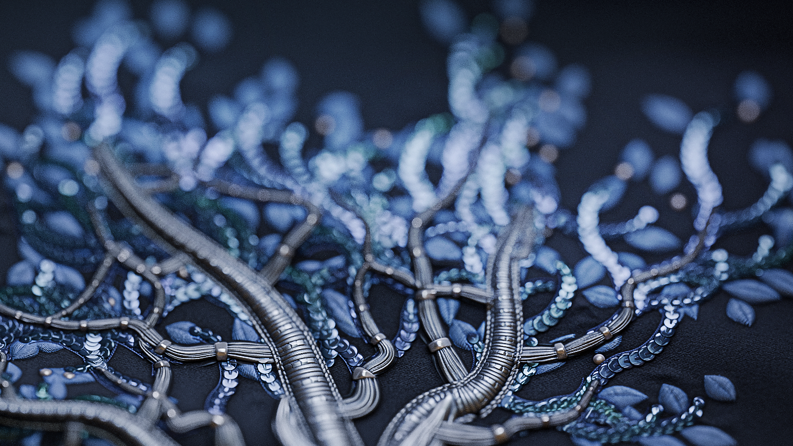
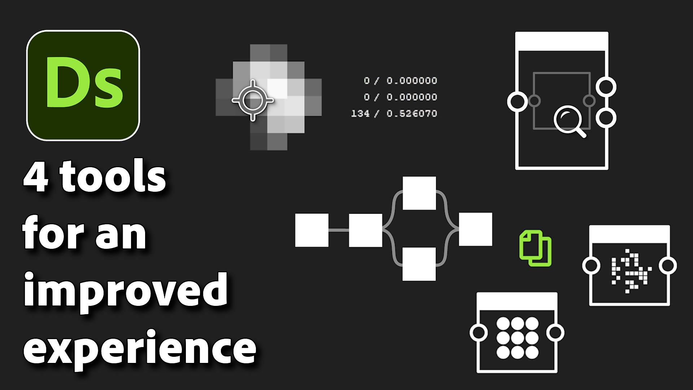

# Version 14.1

This update introduces new features to enhance your daily use of Substance 3D Designer: node arrangement tools to quickly improve your graph layout, copy/paste parameters to apply a set of parameters to another node, and a pixel pin in the 2D view to track a specific pixel while debugging your graph. It also adds new content, mainly to complete the Spline and Path node sets.

*Release date: January 14th, 2025*

## Splines and Paths updates

Splines and path nodes were introduced in version 13.0, and thanks to your feedback, we've made an initial set of improvements. First, we added the [Scatter Splines on Splines](../../compositing-graphs/nodes-reference-for-com/node-library/spline-paths-tools/spline-tools/scatter-splines-splines/scatter-splines-on-splines.md) node, which distributes splines along a parent spline, offering options similar to those of a regular scatter node. Additionally, the [Mask to Paths](../../compositing-graphs/nodes-reference-for-com/node-library/spline-paths-tools/path-tools/mask-to-paths/mask-to-paths.md) node has been enhanced to give more control over the position of the first vertex on the path. We also made it possible to introduce randomness in the [Spline Bridge List](../../compositing-graphs/nodes-reference-for-com/node-library/spline-paths-tools/spline-tools/spline-bridge-list/spline-bridge-list.md) node.

<table>
<tr style="border: 0;">
<td style="border: 0;" valign="top">

{zoomable="yes"}

</td>
<td style="border: 0;" valign="top">

{zoomable="yes"}

</td>
</tr>
</table>

## Nodes alignment tools

If you are keen on keeping a clean and readable graph, the [node alignment tools](../../interface/the-graph-view/node-alignment-tools/node-alignment-tools.md) are made for you and have been completely revamped! It is now possible to evenly space the nodes (horizontally or vertically), and aligning nodes avoids any overlaps by neatly stacking them. Cherry on top: both features take the actual size of the nodes into account!

{zoomable="yes"}

## Copy / paste parameters

It is now possible to [copy the parameters of one node and paste them onto another](../../compositing-graphs/manage-parameters/manage-parameters.md), so all matching parameters in the target node will be updated to the values of the source node. This is very useful if, for example, you want to carry over the parameters of a color node to its grayscale version, or vice versa. (e.g., the Tile Sampler node)

## Pin pixel in the 2D view

The new [Color Sampler tool](../../interface/2d-view/color-sampler/color-sampler.md) in the 2D view lets you track the value of a selected pixel by dropping a pin on it. This is very useful to ensure that you are always viewing the information of the same pixel across multiple nodes in a graph. Open the Information panel to access the tool and give it a try!

{width="640px" zoomable="yes"}

## Search improvements

The [node finder](../../interface/the-graph-view/node-finder/node-finder.md) tool has been slightly improved:

* You can now enable a recursive mode for a deeper search;
* The fuzzy mode can be disabled if you want to search for an exact term;
* The focus is automatically set on the search field when enabling the node finder tool;
* The layout of the toolbar has been rethought to save space.

{width="640px"}

## Videos

<table>
<tr style="border: 0;">
<td style="border: 0;" valign="top">

</td>
<td style="border: 0;" valign="top">

</td>
</tr>
</table>

## Release notes

### 14.1.0

*(Released January 14th, 2025)*

### <b>Added</b>

* &#91;2D View&#93; Add pinned pixel display in Information panel
* &#91;API&#93; Expose the nodes BBox size in the Graph View scene
* &#91;Content&#93; 'Material Height Blend': Add 'Height Mask' output
* &#91;Content&#93; 'Path Vertex Processor': Use 'Edit function' button for 'Per Vertex Function' parameter
* &#91;Content&#93; Auto Levels: Clean unused parameter, adjust labels and tooltip
* &#91;Content&#93; Mask to paths v2
* &#91;Content&#93; New Mean of Least Variance node (MLV)
* &#91;Content&#93; New Median Filter node
* &#91;Content&#93; Quantize Color: add a 'Nearest' filtering option
* &#91;Content&#93; Spline Bridge List: Add random spline offset parameters
* &#91;Content&#93; Spline Tools: New Spline (Quadratic) node
* &#91;Content&#93; Triangle grid: change triangulation method and use loops
* &#91;Content&#93; New Scatter Splines on Splines node
* &#91;Cooker&#93; Expose 'Pixel ratio' base parameter as '$pixelratio' static variable
* &#91;CrashReport&#93; Integrate new crash report window
* &#91;Engine&#93; Add the Vulkan/Metal version of the blend engine
* &#91;Graph&#93; Material Mode: allow connection to input without usage when a single link is selected
* &#91;Graph&#93; Material link: allow standard connections when connection is not ambiguous
* &#91;Graph&#93; Node alignment tools: add horizontal/vertical distributions, left/right/top/bottom alignments, and support stacked nodes
* &#91;Library&#93; Fix text color in contextual menus
* &#91;Parameters&#93; Copy parameters from a node to another
* &#91;Properties&#93; "Reset all": Remove the confirmation pop up window
* &#91;Resources&#93; Set the format to "All format" in the "Link Bitmap" dialog
* &#91;Search&#93; Add a way to enable/disable a recursive mode
* &#91;Search&#93; Add a way to enable/disable the fuzzy search
* &#91;Search&#93; Always show and set focus on search term field when enabling Node Finder using its keyboard shortcut
* &#91;Search&#93; Rework the filter option
* &#91;Shortcuts&#93; Allow 'V', 'H' and 'S' keys to be assigned
* &#91;ThirdParty&#93; Upgrade to Qt 6.5.7
* &#91;UX&#93; Modal dialogs should not be minimisable
* &#91;UX&#93; Remove horizontal scroll on alert dialog

### <b>Fixes</b>

* &#91;Content&#93; Bevel: Normal Format is not affected by the global preference
* &#91;Content&#93; Color to Mask node does not ignore alpha
* &#91;Content&#93; Directional distance: Incorrect result when input has vertical image ratio
* &#91;Content&#93; Flood Fill Mapper: Warning raised for absent variable
* &#91;Content&#93; Histogram Compute: result is 16 times what it should be
* &#91;Content&#93; RT caustics doesn't work in non square resolution
* &#91;Content&#93; Spline Bridge List: Incorrect result when using Start/End offsets
* &#91;Content&#93; Spline Select: output spline amount can be greater than the input spline amount
* &#91;Content&#93; Spline Warp produces a black result with SSE engine
* &#91;Content&#93; Triangle Grid: pattern is not tiling properly
* &#91;Content&#93; Triangle grid: Tiling is broken in a specific case
* &#91;Data&#93; Crash when changing graph input identifier in a specific case
* &#91;Function Graph&#93; Long values appear overlapped on 'Float' nodes
* &#91;Fx-Map&#93; Crash when displaying Quadrant node properties
* &#91;Graph&#93; &#91;UDIM&#93; Having a scrollbar in the UDIM list results in 1..1 1..2 entries
* &#91;Graph&#93;&#91;Shortcuts&#93; Node created using a shortcut is not placed on existing link after node duplication
* &#91;Properties&#93; Incorrect parameter display when value is invalid
* &#91;Publish&#93; Reciprocal dependencies result in an infinite loop when publishing a package
* &#91;Publish&#93; Silent failure when using 'Publish' action on package with unloaded dependency
* &#91;UI&#93; 'Parent size' widget is not displayed correctly when expanded and may block the interface (macOS only)
* &#91;UI&#93; Main window falls behind other applications in some cases (Windows only)
