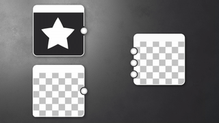

# Version 15.0

This update brings a brand new 3d renderer, with rasterizer and pathtracer modes, plus a native support of [USD](https://openusd.org/release/index.html) to allow you to edit and export scenes without any loss of data.

*Release date: July 15th, 2025*

## New 3D renderer

### New rasterizer and pathtracer

This new release gives you access to an advanced [3D renderer](../../interface/3d-view/3d-renderers/3d-renderers.md), featuring a rasterizer mode (to have a real time preview while working on your material) and a path tracer mode (a ray traced mode to get a perfect and accurate render). This new renderer enhances functionality with features such as shadows in rasterizer mode, improves quality and performance, and is engineered to support future technologies like [MaterialX](https://materialx.org/). It complements the existing OpenGL and Iray renderers in Designer and aligns with the renderers available in Substance 3D Viewer and Substance 3D Sampler, ensuring a uniform experience across the ecosystem.

The [3d view toolbar](../../interface/3d-view/3d-view.md) has been updated to have a quick access to some of the new features available in this renderer:

* <b>Selection tool:</b> to select a submesh in the scene. Once a submesh is selected you can focus on it (F) or access to its material properties (right click).
* <b>Enable pathtracer:</b> to quickly switch between pathtracer and rasterizer modes.
* <b>Enable shadows:</b> to enable shadows in the scene, useful to see how your materials behave according to light.
* <b>Enable ground plane:</b> to enable or not the ground plane in the scene.

In addition, the hotkey to rotate the environment light has changed to match the other Substance apps, so it’s now *<b>shift-right click</b>* instead of *<b>ctrl-shift-right click</b>*.

### Post effects

[Post effects are back](../../interface/3d-view/camera/post-effects/post-effects.md)! They are now available through the Camera menu and they are now developed in house.

* <b>Bloom:</b> simulate glare around bright spots like lights and reflections, allowing to better visualize emissive surfaces.
* <b>Tone mapping: </b>the color range with profiles to get a high-dynamic-range (HDR) effect.
* <b>Depth of field:</b> simulates the focus properties of a camera lens (rasterizer only).

## Asset edition in context

When you work on your materials, you may want to [preview it in the context of a specific 3D scene](../../working-with-3d-scenes/working-with-3d-scenes.md). That's why we added the possibility to import and render a full scene, with all its textures, cameras and lights. And cherry on top, if this scene references MaterialX shaders, they will be correctly rendered with the rasterizer!

Once imported, you can work on your scene by selecting a mesh (with a SHIFT + Click or thanks to the scene browser) and [overriding any of its materials](../../working-with-3d-scenes/overriding-scene-mat/overriding-scene-materials.md). You may then:

* Create or load a graph and apply it on a scene material.
* Make adjustments to an existing material by [extracting its textures](../../working-with-3d-scenes/extracting-materials-val/extracting-materials-values-and-textures.md) into a new graph.

Finally, once your 3d scene is edited, you can [export it](../../working-with-3d-scenes/exporting-scenes/exporting-scenes.md) as a new file, or as a new layer of the original file, preventing you to any loss of data (for USD format only).

Last but not least, more 3d formats are now supported for both import and export: USD (+ usda, usdc, usdz), STL, PLY and GLTF, in addition to already available formats FBX and OBJ.

## Rich tooltips

Rich tooltips have been introduced to better demonstrate the purpose of each node. These tooltips, currently available only for [atomic nodes](../../compositing-graphs/nodes-reference-for-com/atomic-nodes/atomic-nodes.md), include visuals to demonstrate the node's effect and provide a direct link to the documentation for detailed information, including the list of parameters, tips, and tricks.

<table>
<tr style="border: 0;">
<td style="border: 0;" valign="top">

</td>
<td style="border: 0;" valign="top">

</td>
<td style="border: 0;" valign="top">

</td>
</tr>
</table>

## Improve non square support

If you need to work with non square textures, this new option is made for you. In the [material properties](../../interface/3d-view/material-properties/material-properties.md) in the 3D view, in the UVs options to control the tiling, you can now set a different value for both axis.

{zoomable="yes"}

## Bakers

While the baking interface has seen only minor updates (refer to the detailed list below for more information), the baker library has been fully rebuilt to use GPU-based bakers, resulting in much better performance. Along with the new supported file formats mentioned above, this update represents a substantial advancement for users engaged in baking workflows.

Note: if you were using sbsbaker.exe to automate your process, the tool has been renamed to substance3d\_baker.exe (use substance3d-baker --help for more information).

## VFX platform requirements updates

Every year, the [VFX Reference Platform](https://vfxplatform.com/) publishes a list of tools and libraries versions to be used in every software for the VFX industry to minimise incompatibilities between software. As usual, we *update all our dependencies* in order to respect all these recommendations.

## Video

## Release notes

### 15.0.0

*(Released July 15th, 2025)*

### Added

* &#91;3D View&#93; Brand new renderer, with rasterizer and pathtracer modes
* &#91;3D View&#93; Add a selection tool to pick an object in the 3D scene
* &#91;3D View&#93; Add new "Export scene with layers..." action in the "Scene" menu
* &#91;3D View&#93; Add new toolbar buttons
* &#91;3D View&#93; Add the possibility to switch between multiple cameras contained in a USD scene
* &#91;3D View&#93; Allow to focus on the selected object when pressing 'F' in the viewport
* &#91;3D View&#93; Allow to generate a Substance Compositing Graph from an existing material
* &#91;3D View&#93; Allow to send a SBS Comp Graph in the 3D View and assign its unique output to the Environment/Panorama usage
* &#91;3D View&#93; Clear the current selection by pressing the Escape key
* &#91;3D View&#93; Display an imported 3D scene with textures
* &#91;3D View&#93; Distinguish X and Y texture repetition controls
* &#91;3D View&#93; Enable / Disable shadows
* &#91;3D View&#93; Enable / Disable ground plane
* &#91;3D View&#93; In the "Materials" menu, add the "Remove" only for the Material that have been added manually and are unused
* &#91;3D View&#93; In the "Materials" menu, remove the action "Remove All"
* &#91;3D View&#93; Make exported USDZ files self-contained
* &#91;3D View&#93; Make the renderer properties persistent when switching the renderer mode
* &#91;3D View&#93; Preserve the existing material inputs when overriding a Material
* &#91;3D View&#93; Rearrange Camera properties
* &#91;3D View&#93; Remove actions "Camera/Save screenshot..." and "Camera/Copy screenshot to clipboard"
* &#91;3D View&#93; Remove the Menu action "Material/Rebuild all"
* &#91;3D View&#93; Remove the prefix "Default" of the label of the default camera
* &#91;3D View&#93; Set the menu action "Reset to default value" as the last one in the material input property hamburger menu
* &#91;3D View&#93; Shortcut adjustments
* &#91;3D View&#93; Support shadows and translucency in real time mode
* &#91;3D View&#93; Support MaterialX shaders from an imported USD scene
* &#91;3D View / OpenGL&#93; Rename the "UV Scale Enabled" parameter to "Enable Physical Size from Graph"
* &#91;3D View / Post effects&#93; Bloom
* &#91;3D View / Post effects&#93; Depth of field
* &#91;3D View / Post effects&#93; Tone mapping
* &#91;3D View / Scene Browser&#93; Allow to display the Material properties when selecting it in the SceneBrowser
* &#91;3D View / Scene Browser&#93; Hide the column "Material"
* &#91;3D View / Scene Browser&#93; Put in bold the USD Primitives that are controlled by a Predefined entity
* &#91;Bakers&#93; Add a contextual menu in the treeview with "Select all"/"Deselect all" actions
* &#91;Bakers&#93; Add an option to control bitangent interpolation
* &#91;Bakers&#93; Add horizontal splitter in GUI
* &#91;Bakers&#93; Add UDIM macro by default in output name when the scene is udim
* &#91;Bakers&#93; Allow to recompute tangent
* &#91;Bakers&#93; Allow to rename a baker without breaking links
* &#91;Bakers&#93; Change the default size of the middle panel
* &#91;Bakers&#93; Input texture for UDIM workflow
* &#91;Bakers&#93; Make 2D View maps list order match Bakers render list order
* &#91;Bakers&#93; Make the baking window modal
* &#91;Bakers&#93; Manage tonemapping parameters
* &#91;Bakers&#93; Remove tangent space plugin selection
* &#91;Bakers&#93; Save status "enabled" or "disabled" for Bakers when saving a Preset
* &#91;Bakers&#93; Select material by default in select widget
* &#91;Bakers&#93; Set default orientation of Normal output texture relative to the preference
* &#91;Bakers&#93; Set UV tiles to All by default
* &#91;Bakers&#93; WordSpaceDirection add option FromTexture/FromValue
* &#91;Bakers&#93; World to tangent: set default input to "from texture"
* &#91;SBSBaker&#93; Create an option to control the backend order
* &#91;SBSBaker&#93; Improve use of StringList argument
* &#91;SBSBaker&#93; Rename "match\_source\_instance" to "match\_mesh\_name"
* &#91;SBSBaker&#93; Rename "Submesh" to "GeomSubset"
* &#91;SBSBaker&#93; Rename to substance3d\_baker
* &#91;Content&#93; Add 'Hemisphere' shape to generator nodes exposing Quadrant shapes
* &#91;Interop&#93; Support GLTF file format
* &#91;Interop&#93; Support PLY file format
* &#91;Interop&#93; Support STL file format
* &#91;Library&#93; Uniformize tooltips for atomic nodes
* &#91;Mac&#93; Stop supporting MacIntel platform
* &#91;Nodes&#93; Add richtooltips for atomic nodes
* &#91;Parameters&#93; Close 'Attributes' section by default
* &#91;Parameters&#93; Let the user specify base parameter default values for new instances
* &#91;Preferences&#93; Bakers: add a boolean option to compute the tangent space per fragment
* &#91;Preferences&#93; Remove the tangent space plugins
* &#91;Preferences&#93; Store the preferences per minor version of SD (XX.X)
* &#91;VFX&#93; Update Boost to 1.85.0
* &#91;VFX&#93; Update MacOS minimal version to 12.0
* &#91;VFX&#93; Update OpenColorIO to 2.4.2
* &#91;VFX&#93; Update OpenColorIO to 2.4.x
* &#91;VFX&#93; Update OpenExr to 3.3.x
* &#91;VFX&#93; Update Qt to 6.5.8

### Fixes

* &#91;3D View&#93; Textures in exported USD scene are not correctly applied
* &#91;3D View&#93; &#91;UDIM&#93; Cannot view UDIM graph outputs in 3D View when automatic viewing on graph opening is turned off in graph preferences
* &#91;Bakers&#93; 'Anti-alias.' and 'Avg. normals' cells for non-applicable bakers are blank and editable
* &#91;Bakers&#93; 'Refresh' action uses raytracing backend when it is disabled in preferences
* &#91;Bakers&#93; Bakers blocked as busy after failure during 'Refresh all baked maps' process
* &#91;Bakers&#93; Crash at 180+ UDIMs when baking OpenGL Position map on specific mesh
* &#91;Bakers&#93; Crash when opening 'Bake model information' dialog multiple times in a row (macOS only)
* &#91;Bakers&#93; In JSON preset export, 'udim' value is replaced by '1001' when it was set to 'All'
* &#91;Bakers&#93; Memory is not correctly detected on Linux
* &#91;Bakers&#93; Missing map input dependency does not trigger warning and/or block rendering
* &#91;Bakers&#93; No error label when output name is empty
* &#91;Bakers&#93; Switching high poly mesh from file has no effect
* &#91;Bakers&#93; Target baker is not selected by default when using 'Rebake' action
* &#91;Engine&#93; Distance: visible "cut" in some situations
* &#91;Engine&#93; Fx-Map: Negative colors are not supported when bitdepth is 8-bit (GPU engines only)
* &#91;Localization&#93; Character input switches back from Japanese to Latin in node menu
* &#91;Security&#93; USDC File Parsing Out Of Bound Write Vulnerability
* &#91;Security&#93; Out-of-Bound WRITE Vulnerability II, when parsing NEF file
* &#91;Security&#93; Out-of-Bound Read Vulnerability III, when parsing DNG file
* &#91;Preferences&#93; UX issues in project settings for read-only projects
* &#91;Resources&#93; Multiple UV sets are not displayed when opening FBX files
* &#91;UI&#93; Overlapping labels in status bar
* &#91;UI&#93; Tooltips of the 'Link creation mode' drop down menu are not displayed

### KNOWN ISSUES

* &#91;Bakers&#93; Crashes during baking with some specific NVidia drivers
* &#91;3D View&#93; OpenGL: some imported scenes may not be rendered
* &#91;3D View&#93; Rasterizer: shadow artefacts when using displacement on a flat Scene
* &#91;3D View&#93; Pathtracer: slow performances when updating textures with tesselation/displacement enabled
* &#91;3D View&#93; Some color material properties are not color-managed correctly when overridden
* &#91;3D View&#93; Scenes with animated primitives are not properly supported
* &#91;3D View&#93; Mesh with multiples UDims are not yet supported
* &#91;3D View&#93; Mesh with multiples UVs are not yes supported and may result in invalid material rendering
* &#91;3D View&#93; Pathtracer not supported on AMD graphic cards
