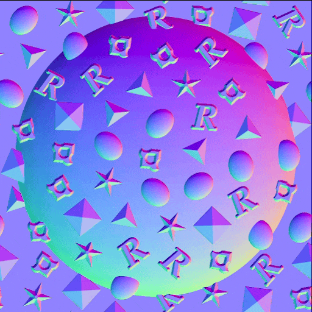

# Version 16.0

This 16.0 version introduces a more creative workflow for pattern scattering and manipulation thanks to new Shape Splatter and the SDF nodes. It also natively supports OpenPBR and improves displacement settings in the 3D view. 

*Release date: April 14th, 2026*

## Shape splatter v2 nodes

### New ways of scattering shapes

The new [Shape splatter v2](../../compositing-graphs/nodes-reference-for-com/node-library/texture-generators/patterns/shape-splatter-v2/shape-splatter-v2.md) nodes unlock complex scattering behaviors that have been challenging until now, with
**more shape distribution methods** (Poisson disc, uniform) that are *collisionless* by default, and control over
the *clean gathering* of shapes in specific areas with a **density map**. 
Advanced users can set up *custom distributions* defined by a function graph.

<table>
    <tr>
        <td>
             <i>Poisson distribution</i>
        </td>
        <td>
             <i>Uniform distribution</i>
        </td>
        <td>
             <i>Density map</i>
        </td>
    </tr>
</table>

### 3D shapes

Scattered shapes are now **3D objects** that can be moved, rotated and scaled on all XYZ axes.

Use **simple primitives** such a cubes, spheres and cylinders, or **complex custom shapes** formed by *extruding
a height map* or authoring *3D SDF shapes*. (More on that below)

This unlocks scatterings that are more dynamic, more varied and more believable across the board. And it is now possible
to repurpose 3D shapes for variations by flipping them. (We see you, environment artists!)

<table>
    <tr>
        <td>
             <i>Random 3D rotation</i>
        </td>
        <td>
             <i>Slope rotation</i>
        </td>
        <td>
             <i>Shape extrusion</i>
        </td>
    </tr>
</table>

[EXAMPLES: Primitives, extrude height map, 3D SDF]

### Companion nodes

Similarly to the Shape splatter v1 family of nodes, Shape splatter v2 comes with its own cohort of companion nodes.

[Shape splatter v2 mapper](../../compositing-graphs/nodes-reference-for-com/node-library/texture-generators/patterns/shape-splatter-v2-mapper-color/shape-splatter-v2-mapper-color.md) nodes enable projection of textures on the scattered 3D shapes, with support for
*triplanar projection* and *material IDs* for mapping multiple textures. Results can be adjusted globally or per shape
for texture offsets and color variations.
 Again, advanced users can set up *custom texture mappings* defined by a function graph.

[Shape splatter v2 to mask](../../compositing-graphs/nodes-reference-for-com/node-library/texture-generators/patterns/shape-splatter-v2-to-mask/shape-splatter-v2-to-mask.md) creates masks for specific selection of shapes and/or material IDs, enabling more
granular use of shapes downstream in the graph.

[EXAMPLES: Mapper standard, mapper triplanar, to mask]

### Grid atlas

Custom patterns can be provided separately to the Shape splatter v2 node, or packed into a grid atlas for leaner and
more efficient workflows. Packing patterns is simplified thanks to the new [Grid atlas](../../compositing-graphs/nodes-reference-for-com/node-library/texture-generators/patterns/grid-atlas-color/grid-atlas-color.md) nodes.

[EXAMPLES: Grid atlas, grid atlas interop with Shape splatter v2 nodes]

## 3D SDF nodes (signed distance field)

<table style="border: none;">
    <tr style="vertical-align: top;">
        <td>
            
Designer 16.0 adds a powerful method of generating 3D shapes in a function graph using a vast catalogue of nodes for
authoring SDF functions.

Signed distance fields are representations of space as a distance to surfaces defined mathematically. They can be used
to define shapes of increasing complexity as these surfaces are transformed and combined using various operators.

        </td>
        <td style="text-align: right; width: 25%">
            
        </td>
    </tr>
</table>

### Authoring 3D SDF functions

SDF functions involve a [new family of nodes](../../function-graphs/nodes-reference-for-fun/function-node-library/function-node-library.md#sdf-functions) which come in 4 categories:

* **Primitives** are the basic building blocks, they generate simple adjustable shapes with a few controls that let you
tailor them as needed.
* **Operators** combine or replicate shapes in straightforward or complex ways depending on the node: from simple
boolean operators to morphs, shell and symmetries, they dramatically expand the possibilities of what kind of 3D shape
can be achieved
* **Transforms** let you adjust the shapes' position, rotation and size as you might expect and beyond with bending, 
twisting and elongation.
* **Material** nodes let you set some basic material attributes — such as color and material ID — that can be used by [Shape splatter v2](../../compositing-graphs/nodes-reference-for-com/node-library/texture-generators/patterns/shape-splatter-v2/shape-splatter-v2.md) family of nodes for masking or coloring shapes.

  

Lightweight nodes with clear and readable icons make building 3D SDF functions easier than you might think, especially
with this next addition to the toolset...

### 3D viewer node

As you author 3D SDF functions, you will need to visualize the resulting shapes in 3D space. The [3D viewer node](../../compositing-graphs/nodes-reference-for-com/node-library/filters/effects/3d-viewer/3d-viewer.md)
renders 3D SDF or intersection functions as a 3D scene with adjustable camera controls, custom environment light
and support for rendering basic materials. (Color, roughness and metalness)

The node also includes features for checking the generated shapes in detail and debugging issues: separate rendering
passes (AOV), SDF isolines and visual helpers. (E.g. Bbox bleed coloration, grid and rotation arcs)

<table style="border: none;">
    <tr style="width: 50%;">
        <td style="text-align: center">
            
        </td>
        <td style="width: 50%;">
            <table style="border: none;">
                <tr style="vertical-align: top;">
                    <td style="text-align: center">
                        
                    </td>
                    <td style="text-align: center">
                        
                    </td>
                </tr>
                <tr style="vertical-align: top;">
                    <td style="text-align: center">
                        
                    </td>
                    <td style="text-align: center">
                        
                    </td>
                </tr>
            </table>
    </tr>
</table>

## OpenPBR support

[OpenPBR Surface](https://academysoftwarefoundation.github.io/OpenPBR/) is a specification of a surface shading model intended as a standard for computer graphics and is capable of accurately modeling the vast majority of materials. 

This [material model](../../interface/3d-view/material-properties/material-properties.md#openpbr) is now supported throughout the application, with dedicated shaders in both our new renderers (Rasterizer, GPU Pathtracer) and the OpenGL renderer.

Get started with this widely adopted industry standard with new graph templates, or go through the built-in material samples now based on OpenPBR.

<table style="border: none;">
    <tr style="vertical-align: top;">
        <td style="text-align: center">
            
        </td>
        <td style="text-align: center">
            
        </td>
    </tr>
</table>

The OpenPBR shader is now the default for the 3D View and natively supports graphs from previous versions by matching legacy PBR usages to OpenPBR's.

OpenPBR shaders support more effects than the existing shaders, such as thin film and thin wall. All effects are available in rasterization (Rasterizer, OpenGL), including refraction at long last!

<table style="border: none;">
    <tr style="vertical-align: top;">
        <td>
            It is also easier to keep workflows involving specific shaders in sync, with a new <a href="../../compositing-graphs/graph-parameters/graph-parameters.md#attributes">'Material model' attribute</a> for Substance graphs that ensures that graphs viewed in the 3D View use the appropriate shader for the graph's material model.
        </td>
        <td style="text-align: right">
            
        </td>
    </tr>
</table>

>[!NOTE]
> 
>The attribute is also included in published SBSAR files to integrate in your material workflow.

## Displacement controls in the 3D View

It is now faster and easier to adjust displacement and tessellation in the 3D View, with direct access
in a [new Displacement pop-up](../../interface/3d-view/displacement/displacement.md) available in the 3D View toolbar.

Adjust the **Height scale**, **Height level** and **Tessellation** values without repeated back and forth in material
properties and renderer settings.

These controls are available for both our new renderers (Rasterizer, GPU Pathtracer) and the OpenGL renderer.

If the scene includes multiple materials, select the object of the scene that you want to adjust beforehand by holding
<code>Shift</code> and clicking it (Rasterizer and GPU Pathtracer only) or select it in the Scene browser.

>[!NOTE]
> 
>Tessellation is *per object* in Rasterizer and GPU Pathtracer, and *per material* in OpenGL.

## Other changes

### Constant value nodes

<table style="border: 0;">
    <tr style="vertical-align: top;">
        <td>
            
For easier access to constant values in Substance graphs, <a href="../../compositing-graphs/nodes-reference-for-com/node-library/values/constant.md">new nodes</a> have been added for generating a simple value of each type.

You can find all of them in the <b>Values > Constants</b> section of the Library.

        </td>
        <td style="width: 60%">
            
        </td>
    </tr>
</table>

### MDL graphs and Iray end-of-life

As you have been notified in the 15.1 release, the MDL graph feature set and the Iray renderer are now removed from
Designer.

Our in-house GPU Pathtracer is the renderer of choice for high-quality photorealistic rendering in Designer.

Designer is moving away from MDL in favor of MaterialX as its shading language of choice for interchangeable,
widely-supported material definitions.

MaterialX has rapidly gained traction in the computer graphics industries, and can be carried by USD files for full
scene portability across DCCs and renderers.

>[!NOTE]
> 
>The documentation for MDL graphs and the Iray renderer is available through their [dedicated end-of-life page](../../technical-issues/mdl-graph-iray-eol/mdl-graph-iray-eol.md).

### VFX platform upgrades & macOS minimal version

The following libraries have been upgraded to meet the latest VFX platform standard:

* C++ 20
* Python 3.13
* Qt 6.8
* Boost 1.88
* OpenColorIO 2.5
* OpenSubDiv 3.7
* OpenEXR 3.4
* oneTBB 2022

The requirement for the minimal supported version of macOS has been updated to macOS 14 Sonoma.

## Release notes

### 16.0.0

*(Released April 14th, 2026)*

### Added

* &#91;Content&#93; Shape splatter v2 node
* &#91;Content&#93; Shape splatter v2 mapper color/grayscale nodes
* &#91;Content&#93; Shape splatter v2 to mask node
* &#91;Content&#93; Grid atlas nodes
* &#91;Content&#93; 3D viewer node
* &#91;Content&#93; 3D SDF operator nodes
* &#91;Content&#93; 3D SDF primitive nodes
* &#91;Content&#93; 3D SDF transform nodes
* &#91;Content&#93; 3D SDF material nodes
* &#91;Content&#93; Angle to vector node
* &#91;Content&#93; Constant value nodes
* &#91;3D View&#93; OpenPBR shader for OpenGL renderer
* &#91;3D View&#93; OpenPBR shader for Rasterizer and GPU Pathtracer renderers
* &#91;3D View&#93; Displacement window to set height scale, height level and tessellation
* &#91;3D View&#93; Reorganize the toolbar items
* &#91;3D View&#93; Set OpenPBR as the default material model in the 3D View
* &#91;3D View&#93; Have the 3D view take the 'Material model' graph attribute into account
* &#91;3D View&#93; Sync material models when switching between Rasterizer/GPU Pathtracer and OpenGL renderers
* &#91;3D View&#93; Ensure material model is persistent when switching 3D renderers and material definition changes
are synchronized
* &#91;3D View&#93; GPU Pathtracer: Enable blue noise pixel cycling
* &#91;3D View&#93; Expose Ambient occlusion opacity control
* &#91;3D View&#93; Set 'Tiling' parameter range to &#91;0, 10&#93; for all shaders
* &#91;3D View&#93; Rename 'Focus' action to 'Frame'
* &#91;3D View&#93; Handle the new refineLevel parameter that replaces tessellationFactor
* &#91;3D View&#93; Add FPS counter
* &#91;3D View&#93; Move the progress bar in the same horizontal toolbar as the color space at the bottom
* &#91;Bakers&#93; Display the UV of the selected baker in the preview
* &#91;Graph&#93; Add new 'Material model' attribute to Substance graphs
* &#91;NewGraph&#93; Add separators in the thumbnail view
* &#91;Parameters&#93; Define default constant value for input parameters with 'Function' editor
* &#91;Parameters&#93; Populate combobox of `Set` and `Is defined` node parameters with available variables
* &#91;Preferences&#93; Remove obsolete 'Descale factor' option in '3D View' tab
* &#91;Publish&#93; Publish dialog: Include material model in graph information
* &#91;Python&#93; Add new class SDMaterialModelDescription to get the information of a material model
* &#91;Python&#93; Allow to get/set the material model property of SDSBSCompGraph objects
* &#91;Python Editor&#93; Increase font size to 12
* &#91;Templates&#93; Add OpenPBR templates
* &#91;Templates&#93; Convert material samples to OpenPBR
* &#91;ThirdParty&#93; Update Boost to 1.88 version
* &#91;ThirdParty&#93; Update C++ API to C++20
* &#91;ThirdParty&#93; Update NGL to 1.42
* &#91;ThirdParty&#93; Update oneTBB to 2022.x version
* &#91;ThirdParty&#93; Update OpenColorIO to 2.5.x version
* &#91;ThirdParty&#93; Update OpenEXR to 3.4.x version
* &#91;ThirdParty&#93; Update Qt & QtForPython to 6.8.x and Python to 3.13.x
* &#91;ThirdParty&#93; Update TBB to oneTBB 2021.x
* &#91;Deprecation&#93; Remove Iray and the MDL Editor

### Fixes

* &#91;2D View&#93; The histogram selection range is not preserved when the width of the widget becomes small
* &#91;3D Export&#93; Meshes exported from Designer don't render the same in usdview
* &#91;3D View&#93; Assigning non-udim stuff to the 3D View leaves single-tile rendering mode
* &#91;3D View&#93; Clamped result when using OCIO
* &#91;3D View&#93; Crash when applying a graph texture on a non-overridden material for a specific scene
* &#91;3D View&#93; Crash when creating frame buffers
* &#91;3D View&#93; Eclair GPU Pathtracer: Broken geometry and low performance when rendering a specific model
* &#91;3D View&#93; Incorrect texture transformation for specific scene(s)
* &#91;3D View&#93; Inconsistent framing of scene/selection when using fixed render resolution
* &#91;3D View&#93; Incorrect diffuse color when rendering certain GLTF file
* &#91;3D View&#93; Invisible environment when switching renderers in a specific case
* &#91;3D View&#93; Materials are not detected correctly when imported some .fbx files
* &#91;3D View&#93; Overriding materials more than once resets tiling to 1
* &#91;3D View&#93; Properties in the 'UVs' category are not saved to SBSSCN files
* &#91;3D View&#93; 'Reset and view outputs in 3D view' from single-output graphs does not reset materials
* &#91;3D View&#93; 'Save render': Edited image format is not preserved
* &#91;3D View&#93; Selection not working on AMD GPUs
* &#91;3D View&#93; Self-contained 3D scene is not refreshed when modified on disk
* &#91;3D View&#93; Some color material properties are not color-managed correctly when overridden
* &#91;3D View&#93; UDIM textures are not applied correctly on a specific mesh
* &#91;3D View&#93; USD Scene with MaterialX material no longer render correctly
* &#91;Bakers&#93; Crashes with some meshes
* &#91;Bakers&#93; Texture transfer: Crash in bkBufferViewCopy
* &#91;Cooker&#93; Infinite loop in While Loop node in a case that could be prevented
* &#91;Engine&#93; Stop Substance engine when closing the application
* &#91;General&#93; Avoid random crash when exiting the application (Windows only)
* &#91;Graph&#93; Function graph: type propagation does not work properly in some situations
* &#91;Graph&#93; Graph links gets deleted when an image input node is renamed
* &#91;Graph&#93; Links and pins sometimes display artifacts
* &#91;Preferences&#93; 'Viewport scaling' is inverted
* &#91;Properties&#93; Crash when modifying graph input tweak while displaying its instance parameters
* &#91;Python&#93; Cannot import PySide6 modules (possible conflict with existing PySide6 installation)
* &#91;Python&#93; Existing PySide and Shiboken modules conflict with Designer's
* &#91;UI&#93; Hover style disappears on buttons in specific case (Windows only)
* &#91;UI&#93; Hover style is not visible on drop down buttons when clicked (macOS only)
* &#91;UI&#93; 'Learn more' button in '?' tooltip does not work when tooltip is out of dialog bounds (Windows only)

### KNOWN ISSUES

* &#91;Graph&#93; Generated icons for OpenPBR graphs are not accurate
* &#91;3D View&#93; Scenes with animated primitives are not properly supported
* &#91;3D View&#93; Pathtracer is not supported on all AMD graphic cards
