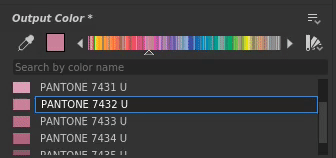

# Version 2021.1 (11.1)

**Substance Designer 2021.1** brings is set of new features with the support of Pantone colors, the ability to disable a node in a graph and the export of tessellated meshes plus several quality of life improvements.

Release date: *January 28, 2021*

## Major Features

### New Pantone Colors Support

This release adds the support of Pantone spot colors. Pantone is known for its large set of colors used in a large variety of industries such as graphic design, fashion design, manufacturing and much more. With this new functionality is it now much easier to match the color of a material with its real life value. For more details, check out the dedicated [documentation page](../../color-management/spot-colors-pantone/spot-colors-pantone.md).

>[!NOTE]
>
> To use these new Pantone colors the color management setting needs to be set to **Adobe ACE** in the application preferences.

* **Choose between RGB and Pantone colors**  
  The color picker has now an option to select in which mode a color can be edited. By default it is set to RGB, but it is possible as well to switch to a Pantone book (a library of colors). Several books are included by default.

  

  Once the color picker mode has changed, the available colors will be defined by the selected book.

  

* **Search for colors in the current book**  
  The text field at the top of the list allows to search for specific colors across the whole Pantone book. It won't look into the other books, so remember to switch between them when searching for something.

  

* **Pick and find the right colors**  
  The color picker can pick any color on the screen and find the closest match in the current book.

  

### New Disable Nodes in a Graph

This release adds the ability to disable a node, making it pass-through inside a graph. This is useful when wanting to compare and iterate on a material to see what effects a specific node add to the end result for example.

To disable a node, simply right-click on it and choose **Disable Selection** or press the keyboard shortcut **Shift+D**. Not all nodes can be disabled, it depends on several criteria. For more details see the dedicated section in the following [documentation page](../../interface/the-graph-view/the-graph-view.md).

### New Export Tessellated Mesh from the Viewport

The tessellated mesh in the 3D View can now be exported in several file format.

To do so, simply use the **File &gt; Export** scene action in the **3D View**. For more details see the dedicated [documentation page](../../interface/3d-view/3d-view.md).

{width="700px"}

### General Improvements

Several little but helpful improvements and new functionalities have been added in this release to help day to day work:

* **Automatic memory budget allocation for the engine**  
  The Ram and Vram management of the application has been improved and now better adjust to the available system memory. GPUs with a lot of Vram can now further leverage their onboard memory.

* **The 3D View now supports the new "physicalSize" semantic.**  
  Custom shaders can now take into account the physical size of a material to adjust their behavior. For more details check out the shaders provided with the application.

* **New settings to exclude content from the library**  
  The library can now exclude specific file extensions or specific name patterns (with the support of wildcards). This allows to ignore undesired content inside the [Library](../../interface/the-library/the-library.md) window.

* **Create folders when exporting bitmaps**  
  When exporting bitmaps from a graph it is now possible to specify slashes to create folders and sub-folders when they don't exists. This helps to organize the bitmaps per graph in their own folder for example by using: **project/$(graph)/$(identifier)**.

* **SBSRender now support Adobe ACE and ICC profiles**  
  The SBSRender process (part of the Automation Toolkit) can now render Substance outputs with proper color management when using the Adobe ACE engine.

> 

Image credits: &#91;dog with flower&#93;&#40;https://unsplash&#46;com/photos/2s6ORaJY6gI&#41; and &#91;dog with glasses&#93;&#40;https://unsplash&#46;com/photos/siNDDi9RpVY&#41; from &#42;&#42;Unsplash&#42;&#42;&#46;

## Tutorials

Below are our video tutorials covering the new features:

## Release Notes

### 2021.1.0

*(Released January 28, 2021)*

**Added:**

* &#91;Spot colors&#93; Support Pantone colors in Designer
* &#91;Graph&#93; Disable nodes
* &#91;3D View&#93; Export Tessellated Meshes from the Viewport
* &#91;Internationalisation&#93; Update Japanese version
* &#91;3D View&#93; Optimize memory consumption when not using Iray
* &#91;Python API&#93; Add method SDResource.delete() to delete a SDResource
* &#91;Python API&#93; Add support for Spot Colors to Python API
* &#91;Python API&#93; New callback to trigger when a package is closed
* &#91;2D View&#93; Convert brush database from SQLite to Json format
* &#91;2D View&#93; Improve rendering performances and reliability (CPU computation)
* &#91;Library&#93; Add 'Exclude pattern' option in project settings
* &#91;Library&#93; Rename 'Exclude pattern' to Exclude file extensions' in project settings
* &#91;UX&#93; Remove '?' button in window title bars on Windows
* &#91;UX&#93; Move the Ctrl+E shortcut to 'Open Reference' when in-context editing is disabled
* &#91;Bakers&#93; Delete Preview cache when deleting a baker in the bake list
* &#91;Performances&#93; Improve image cache budget on hardware with GPU with shared memory
* &#91;Preferences&#93; Adapt 'GPU cache limit' value to available memory pool
* &#91;Properties&#93; Display Physical Size attribute on node instance
* &#91;Scripting&#93; Mark external scripting system as deprecated
* &#91;Share&#93; Remove "Export to Substance Share" features

**Added:**

* &#91;Content&#93; Inconsistent I/O order on Material nodes
* &#91;Content&#93; Primary input on Warp nodes is inconsistent
* &#91;Content&#93; Solve Cooker warnings from Radial Blur node
* &#91;Export&#93; Batch export with CPU engine uses VRAM for determining memory budget
* &#91;Export&#93; Exporting to a path that does not exist will create the folders
* &#91;Export&#93; Memory budget is too low when using Batch export
* &#91;2D View&#93; Artifacts / banding when copying HDR images to the clipboard
* &#91;2D View&#93; Exporting images from resources always export 8 bits
* &#91;3D View&#93; Iray: changing the normal value using the editor gives a strange result
* &#91;3D View&#93; Iray: disabling the normal channel does not produce the right result
* &#91;Library&#93; Filtering by URL does not work correctly
* &#91;Library&#93; Resources matching a Library excluded pattern cannot be imported manually
* &#91;Bakers&#93; Renaming a baker does not impact its entry in the 2D View preview list
* &#91;Explorer&#93; Loss of synchronisation between Explorer and graph data
* &#91;Function graph&#93; Crash when setting function node with mismatching output type as output
* &#91;MDL&#93; SBS instance nodes have no preview, output 0 and do not trigger graph computation
* &#91;Python API&#93; Input parameter's 'editor' property cannot be modified
* &#91;Python&#93; Reset layout does not correctly reset Python created docks
* &#91;Resources&#93; Cannot link/import 32-bit PSD document
