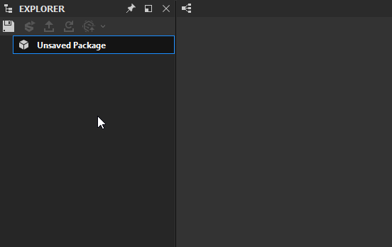

# 3D scene resource

This page describes the **3D scene** resource type in Substance 3D Designer, including its supported file formats and how it may be used.

## Overview

3D scene resources can be used in various workflows:

* [baking mesh maps](../../bakers/bakers.md)
* preview *textures* from [Substance graphs](../../compositing-graphs/substance-compositing-graphs.md) in the [3D View](../../interface/3d-view/3d-view.md)
* preview *shaders* from [MDL Graphs](../../mdl-graphs/mdl-graphs.md) in the [3D View](../../interface/3d-view/3d-view.md)

The following 3D scene file formats are supported:

* [USD](https://graphics.pixar.com/usd/release/index.html) (\*.usd)
* [USDA](https://graphics.pixar.com/usd/release/index.html) (\*.usda)
* [USDZ](https://graphics.pixar.com/usd/release/index.html) (\*.usdz)
* [Autodesk FBX](https://www.autodesk.com/products/fbx/overview) (\*.fbx)
* [Wavefront OBJ](https://www.fileformat.info/format/wavefrontobj/egff.htm) (\*.obj)
* [Autodesk 3D Studio Mesh](https://knowledge.autodesk.com/support/3ds-max/learn-explore/caas/CloudHelp/cloudhelp/2022/ENU/3DSMax-Data-Exchange/files/GUID-A16ECF7F-70E5-4F9F-8EAD-35F5CFB485A2-htm.html) (\*.3ds)
* [Collada](https://www.khronos.org/collada/) (\*.dae)
* [Autodesk AutoCAD Drawing](https://knowledge.autodesk.com/support/autocad/learn-explore/caas/CloudHelp/cloudhelp/2019/ENU/AutoCAD-Core/files/GUID-D4242737-58BB-47A5-9B0E-1E3DE7E7D647-htm.html) (\*.dxf)

## Mesh storage

3D scenes can *only* be linked, which means they stay at their location on disk, and are just referenced in the application.

When a package with a 3D scene resource is published as a [Substance 3D](https://www.adobe.com/products/substance3d/3d-augmented-reality.html) asset (SBSAR), the mesh is *not embedded*, but discarded.

## Baking mesh maps

Linking a 3D scene into your package is the only way to [bake mesh maps](../../bakers/bakers.md) out of that scene geometry. You may perform the following steps to get started:

* Click *RMB* on a package and select the <b>Link &gt; 3D Mesh</b> option in the contextual menu
* Choose any supported 3D scene file
* If the <b>Link as Udim mesh</b> dialog prompt appears, click *No* unless you want to bake UV tiles
* With the resource loaded in the [Explorer](https://helpx.adobe.com/substance-3d/unlisted/documentation/sddoc/the-explorer-129368147.html), click *RMB* on it and select the <b>Bake Model Information</b> option in the contextual menu
* The [Bake model information](../../bakers/bakers.md) dialog appears for you to set up and run any mesh maps bakes

{width="512px"}

## UDIM/UV-tile usage

When a mesh resource is linked and the application detects it has UVs outside of the 0-1 range, you'll be asked if this mesh should be treated as a UDIM mesh (also known as UV Tiles). This is a setting that can be changed afterwards, and unless you are sure you are using using UV-Tiles, should be answered as <b>No</b>.

If UV-Tile behavior is active, baking behaves differently and will bake textures for each detected UV-Tile.

## Resource/Scene vs state

The application separates what you see in the 3D view into two distinct files. The actual 3D model or mesh, is a resource visible in the Explorer. The setup of lights, cameras and other settings is called the "<b>State</b>". States can be saved to external .sbsscn files, to be loaded in again later. .sbsscn files are not resources, they are additional configuration files that can only be loaded through [the Scene menu in the 3D View.](../../interface/3d-view/3d-view.md)
