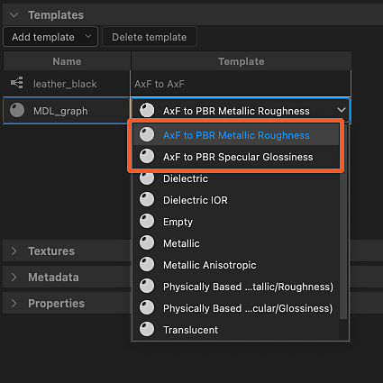
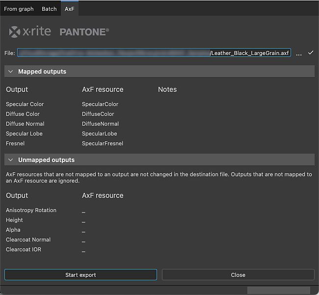

# AxF (Appearance eXchange Format)

<table>
<tr style="border: 0;">
<td width="25.00%" style="border: 0;" valign="top">

</td>
<td width="100.00%" style="border: 0;" valign="top">

Substance 3D Designer supports [X-Rite's Appearance eXchange Format.](https://www.xrite.com/axf) The creators of the format describe it as follows:

'AxF files are used to capture, store, edit, and communicate complex material characteristics throughout the digital design workflow. AxF provides a standard way to store and share all relevant appearance data – color, texture, gloss, refraction, translucency, special effects (sparkles) and reflection properties – across Product Lifecycle Management (PLM), Computer-Aided Design (CAD), and state-of-the art rendering applications.'

</td>
</tr>
</table>

In simple terms, AxF files host a number of textures extracted by X-Rite's TAC7 scanner hardware, coupled with metadata that describe additional properties of the material. That means an AxF is more than just texture data: it also carries shading properties.

AxF files are *not* imported as a package [resource](../resources.md). Rather, the involves extracting textures and metadata from the AxF file then using those to prepare graphs created from .

The available templates are aimed at two AxF workflows:

* <b>Converting</b> an SVBRDF material in an AxF file into a PBR material;
* <b>Editing</b> an SVBRDF material in place and to an existing AxF file as a new layer.

>[!NOTE]
>
> Supported material models
> 
> Only materials using an <b>SVBRDF</b> (Spatially Varying BRDF) model may be *fully* loaded and edited in Designer.
> 
> Materials using the <b>EP-SVBRDF</b> (Energy Preserving SVBRDF) model can be loaded but only features existing in the SVBRDF model can be edited and visualised. Features exclusive to EP-SVBRDF are not supported.
> 
> Other models are not supported.

## Importing AxF files

The AxF files import workflow may be started from on of the two methods below:

+++Home screen
Click on the <b>Import AxF...</b> button in the [Home screen](../../interface/home-screen/home-screen.md)'s left section.

+++

+++Explorer
Click RMB on a package in the [Explorer](https://helpx.adobe.com/substance-3d/unlisted/documentation/sddoc/the-explorer-129368147.html), and go to <b>Import &gt; AxF</b> in the package's contextual menu.

+++

### Import dialog

The <b>AxF import</b> dialog lets you review the data loaded from the selected AxF file, and setup the graph templates required for performing the intended edits or conversions.

It features four sections:

The <b>Header</b> displays the name of the material detected in the AxF file, as well as its representation (currently, always SVBRDF). The preview thumbnail embedded into the file is also displayed.

The <b>Templates</b> section lets you set up the [Substance graph](../../compositing-graphs/substance-compositing-graphs.md) and [MDL graph](../../mdl-graphs/mdl-graphs.md) templates to get started with working on the material. See the section below to learn more about these templates and setting them up.

<b>Textures</b> lists all textures extracted from the AxF file involved in the detected material. For each texture, their name, native resolution, data format and physical size are displayed.

<b>Metadata</b> and <b>Properties</b> list data extracted from the material in the AxF file. These have an impact on how some Substance graph templates properties are configured (see section below).

### Result

After clicking the <b>OK</b> button, a package is created in the [Explorer](../../interface/the-explorer-window/the-explorer-window.md). The package includes the following resources:

<table>
<tr style="border: 0;">
<td style="border: 0;" valign="top">

A <b>Resources</b> folder hosts a *subfolder* for each material imported from the AxF file.

Each subfolder includes another subfolder that contains the *textures* extracted from the AxF file for that material. This last subfolder is named after the material *representation* used by the textures (currently only <b>SVBRDF</b>).

A graph for each template set up in the <b>Templates</b> section of the import dialog.  
In the case of [Substance graphs](../../compositing-graphs/substance-compositing-graphs.md), these are preconfigured with the textures and data extracted from the AxF file, as well as your selected template settings (see section below).

</td>
<td style="border: 0;" valign="top">

</td>
</tr>
</table>

## Graph templates

<table>
<tr style="border: 0;">
<td style="border: 0;" valign="top">

There are graph templates dedicated to AxF workflows for [Substance graphs](../../compositing-graphs/substance-compositing-graphs.md) and [MDL graphs](../../mdl-graphs/mdl-graphs.md).

Click the <b>Add template</b> button and select the desired graph type in the drop down menu.

</td>
<td style="border: 0;" valign="top">

</td>
</tr>
</table>

<table>
<tr style="border: 0;">
<td style="border: 0;" valign="top">

### MDL graph templates

Generic conversion templates are available to map the outputs of <b>AxF to PBR</b> Substance graphs templates to an [MDL](../../mdl-graphs/mdl-graphs.md) material.

Thus, these templates are best used in combination with the 'AxF to Metallic Roughness' and 'AxF to Specular Glossiness' Substance graph templates.

</td>
<td style="border: 0;" valign="top">

</td>
</tr>
</table>

<table>
<tr style="border: 0;">
<td style="border: 0;" valign="top">

### Substance graph templates

Two types of Substance graph templates are available:

<b>AxF to Metallic Roughness</b> and <b>AxF to Specular Glossiness</b> are *conversion* templates let you map AxF materials to standard PBR models.  
These can then be used with the default 3D View shaders and combined with other PBR materials produced in Designer, [Sampler](https://www.adobe.com/products/substance3d-sampler.html) or acquired from our [3D Assets](https://substance3d.adobe.com/assets/) library.  
Conversion templates may be used in combination with MDL templates dedicated to AxF, see above.

<b>AxF to AxF</b> is a *passthrough* template that lets you edit AxF materials in place and export these changes as new layers in existing AxF files. See below to learn more.

</td>
<td style="border: 0;" valign="top">

</td>
</tr>
</table>

<table>
<tr style="border: 0;">
<td style="border: 0;" valign="top">

For all Substance graph templates added in the <b>Templates</b> list, the following additional operations are performed:

For any [<b>Input</b>](../../compositing-graphs/nodes-reference-for-com/atomic-nodes/input/input.md) node which *usage* matches the *identifier* of a texture extracted from the AxF file, that Input node is replaced by a [Bitmap](../../compositing-graphs/nodes-reference-for-com/atomic-nodes/bitmap/bitmap.md) node referencing that texture;

The graph's <b>Resolution</b> property (I.e., Output size) is automatically set to the power of two equal to or above the resolution of the *largest* extracted texture;

The [Bitmap](../../compositing-graphs/nodes-reference-for-com/atomic-nodes/bitmap/bitmap.md) nodes' <b>Resolution</b> property (I.e., Output size) is automaticall set to mach the graph's, after the previous operation is applied;

The graph's <b>Physical size</b> property is set to the physical size of the *first* extracted texture;

The *default values* of the graph's parameters are set to match the data in the AxF file.

The *metadata* extracted from the material in the AxF file is copied in the graph's <b>Description</b> property.

>[!IMPORTANT]
>
> The default values of the graph's parameters should not be modified after this initial configuration.
> 
> They specify shading properties that are essential to interpret the values in the textures correctly.
> 
> Therefore, changing these settings will result in incorrect render when in the [3D View](../../interface/3d-view/3d-view.md).

</td>
<td style="border: 0;" valign="top">

</td>
</tr>
</table>

## Exporting AxF files

Existing AxF files can be edited in place from Designer, their resources are updated using the [outputs](../../compositing-graphs/nodes-reference-for-com/atomic-nodes/output/output.md) of a [Substance graph](../../compositing-graphs/substance-compositing-graphs.md).

With the ability to export graph outputs to AxF files, a typical AxF workflow in Designer may look like this:

1. Import AxF file
1. Use 'AxF to AxF' Substance graph template
1. Edit the extracted textures using the features and nodes available in Substance graphs
1. Export the graph outputs to the same AxF file

The graph's <b>Physical Size</b> property is used to set the <b>Physical Size</b> attribute of the updated textures in the edited AxF file.

>[!NOTE]
>
> The changes to the resources in the file are added as a *new layer*. This means each export performed from Designer to the same AxF file will add to that file's size.

<table>
<tr style="border: 0;">
<td width="33.33%" style="border: 0;" valign="top">

### Export dialog

The <b>AxF</b> export dialog is available in the <b>Export outputs</b> dialog as a dedicated tab.

In the [Graph View](../../interface/the-graph-view/the-graph-view.md) toolbar, open the  <b>Tools</b> menu and select the <b>Export outputs...</b> option to display the dialog, then select the <b>AxF</b> tab.

</td>
<td width="100.00%" style="border: 0;" valign="top">

</td>
</tr>
</table>

The dialog features three main sections:

The <b>File</b> input field lets you select the target AxF file which should be edited. That file is loaded and checked, then if valid its data is used to populate the 'AxF resource' columns below.

<b>Mapped outputs</b> lists the graph outputs in the Output column, and matches their *usage* with an AxF resource in the target file that shares the same *identifier*. If any issues are detected, they are displayed as a warning (yellow) or error (ref) in the Notes column.

<b>Unmapped outputs</b> lists graph outputs and AxF resources in the target file that could not be mapped. These outputs are ignored and these AxF resources are unchanged.

>[!NOTE]
>
> A graph output needs to have its <b>Group</b> property set to 'AxF' for it to be listed in this dialog.

Click <b>Start export </b>to edit the target AxF file with the new layer containing the changes in the mapped outputs.

The result is displayed as a message next to the progress bar in the dialog's status bar.

>[!TIP]
>
> A new layer in the target file is created every time an export is performed. Therefore, be mindful of making deliberate, purposeful exports to manage the file's size and complexity.

### Mapping outputs to AxF resources

When exporting to an existing AxF file, its resources are updated using the graph outputs. Designer matches the resource identifier to the [Output](../../compositing-graphs/nodes-reference-for-com/atomic-nodes/output/output.md) nodes which have that same identifier as a <b>Usage</b>.

Additionally, the Output's <b>Group</b> property *must* be set to 'AxF' for it to be listed in the AxF export dialog (see above).

Resources can be textures (I.e. bitmaps) or uniforms (I.e. values) with a specific number of channels. It is compulsory that the graph output matches that number of channels exactly. If that is not the case, an error will be raised for that resource during the export, and the resource will be unchanged.

The number of channels is specified differently depending on the type of data supplied to the Output node:

* <b>Bitmap (Texture):</b> The [Components](../../compositing-graphs/nodes-reference-for-com/atomic-nodes/output/output.md) property is used to specify the number of channels, where R is one channel, RG is two channels, and so on. The property is used to let Designer know which of the color bitmap's RGBA channels should be encoded into the resource.
* <b>Value (Uniform):</b> The number of components of the vector value is used to specify the number of channels, where [Float](../../function-graphs/nodes-reference-for-fun/atomic-function-nodes/constant-nodes/constant-nodes.md) is one channel, [Float2](../../function-graphs/nodes-reference-for-fun/atomic-function-nodes/constant-nodes/constant-nodes.md) is two channels, and so on.

>[!IMPORTANT]
>
> In the <b>AxF to AxF</b> Substance graph template, the [Output](../../compositing-graphs/nodes-reference-for-com/atomic-nodes/output/output.md) node for the <b>Specular Lobe</b> contribution is configured by default to a *single channel* (I.e., its Components property is set to 'R').  
> If the imported AxF file uses more than one channel in its Specular Lobe resource, please set the Output's <b>Components</b> property accordingly.
> 
> For instance, for a Specular Lobe resource using two channels (Red for Specular Roughness and Green for Specular Anisotropy), set the Components property to 'RG'.

## Viewing AxF files in the 3D View

The method to render AxF SVBRDF materials in the [3D View](../../interface/3d-view/3d-view.md) depends on the .

+++Convert to PBR
If you wish to convert an SVBRDF material in an AxF file into a standard PBR material, then your import setup will likely involve [MDL graph](../../mdl-graphs/mdl-graphs.md) and [Substance graph](../../compositing-graphs/substance-compositing-graphs.md) conversion templates (see  section above).

In that case, the MDL graph should be dragged and dropped into the 3D View before any other operation, in order to automatically switch to the [Iray](../../interface/3d-view/iray/iray.md) renderer and use that MDL graph as material definition.  
Then, you may drag and drop the Substance graph that you set up in the import dialog, in order to connect its outputs to the MDL shader.

+++

+++Edit in place
If *no* MDL graph templates were used and only the <b>AxF to AxF</b> Substance graph template was required because your goal is to perform *edits* on an existing AxF file, then follow the instructions below to visualise its SVBRDF material according to the selected renderer:

A dedicated GLSLFX shader is available for visualizing materials using an SVBRDF representation from an AxF file: <b>AxF SVBRDF</b>.

The shader is available in the <b>Materials</b> menu : open the submenu for the scene's material ('Default' by default) and select any technique under the <b>AxF SVBRDF</b> entry.

Use the <b>Edit</b> option in the same submenu to display the shader's properties in the [Properties](../../interface/properties/properties.md) dock.  
In particular, the <b>Tiling</b> property lets you adjust the tiling of textures on the model, so you can visualize the material at an appropriate scale.

After selecting the shader, click RMB in empty space in the graph and select the <b>View outputs in 3D View</b> option to visualise its outputs in the [3D View](../../interface/3d-view/3d-view.md).

This shader is less accurate than its Iray counterpart, and is currently a *work in progress* and some features are still unsupported. Therefore, while it can provide an overview of the materials' characteristics, it should not be used for fine adjustments .

Please switch to the [Iray](../../interface/3d-view/iray/iray.md) renderer and use the <b>svbrdf</b> MDL shader for a more accurate visualization.

A dedicated MDL shader is available for visualizing materials using an SVBRDF representation from an AxF file: <b>svbrdf</b>.

The shader is available in the <b>Materials</b> menu : open the submenu for the scene's material ('Default' by default) and select the <b>svbrdf</b> MDL shader under the <b>mdl::alg::materials</b> entry.

Use the <b>Edit</b> option in the same submenu to display the shader's properties in the [Properties](../../interface/properties/properties.md) dock.  
In particular, the <b>Tiling</b> property lets you adjust the tiling of textures on the model, so you can visualize the material at an appropriate scale.

After selecting the shader, click RMB in empty space in the graph and select the <b>View outputs in 3D View</b> option to visualise its outputs in the [3D View](../../interface/3d-view/3d-view.md).

This shader is more accurate than its OpenGL counterpart. It uses the [Iray](../../interface/3d-view/iray/iray.md) renderer, thus you need to switch to this renderer by going to <b>Renderer &gt; Iray</b>, before the shader can be accessed in the <b>Materials</b> menu.

+++

### Supported model variants

The shaders used in the 3D View support the following variants for specular, Fresnel and clear coat transmission models:

<table>
<tr style="border: 0;">
<td style="border: 0;" valign="top">

<b>Specular variants</b>

* Ward / Geisler-Moroder 2010
* GGX / Walter2007
* GGX / Ross 2005

</td>
<td style="border: 0;" valign="top">

<b>Fresnel variants</b>

* Schlick 1994
* Schlick 1994 Colored
* Simple Fresnel

</td>
<td style="border: 0;" valign="top">

<b>Clear coat transmission variants</b>

* Refractive Dirac *(OpenGL only)*
* Refractive Dirac / No Solid Angle Compression *(OpenGL only)*
* Non-Refractive Dirac
* Non-Refractive Dirac / DSPBR 2020x
* GGX

</td>
</tr>
</table>
