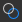
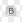
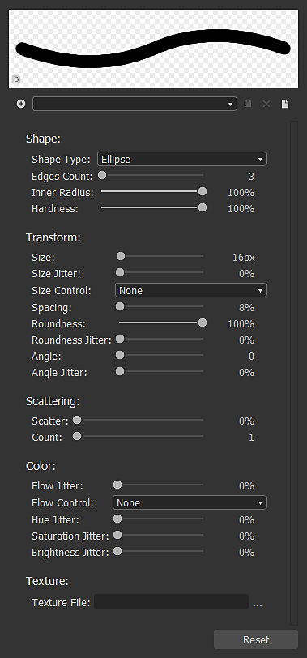

# Bitmap painting tools

This page describes the painting tools available in the [2D View](../../../interface/2d-view/2d-view.md) panel for compatible bitmaps.

{width="512px"}

## Overview

The [2D View](../../../interface/2d-view/2d-view.md) panel offers basic bitmap painting tools which let you create or edit images *manually* directly within the application. These tools are particularly useful, for instance, for quickly painting *masks*.

The tools support pen input, including *pen pressure*. To take advantage of pen displays, you may [undock](../../../interface/customizing-your-wor/customizing-your-workspace.md) the [2D view](../../../interface/2d-view/2d-view.md) panel, then place and resize it into any configuration which is more comfortable for painting.

Edits can be *undone individually*, and all the other features of the 2D View panel are still *available* to you while you edit the image, such as [Histogram](../../../interface/2d-view/2d-view.md) panel, [Tiled display](../../../interface/2d-view/2d-view.md), and [Background image](../../../interface/2d-view/2d-view.md).

>[!IMPORTANT]
>
> You can paint *only* on *8-bit* [bitmap resources](../bitmap-resource.md) which are [new or imported](../../importing-linking-and-new/importing-linking-and-new-resources.md).

>[!WARNING]
>
> **Windows only**
> 
> Tablet users should apply the settings described in the following page for the most reliable experience: [Configuring Pens and Tablets](https://docs.substance3d.com/display/SPDOC/Configuring+Pens+and+Tablets)

{width="512px"}

## Enabling the painting tools

The painting tools will be enabled automatically in the [2D view](../../../interface/2d-view/2d-view.md) panel when the following criteria regarding a bitmap are met:

* The bitmap is a [new or imported](../../importing-linking-and-new/importing-linking-and-new-resources.md) resource
* The bitmap has *8-bit* precision
* The bitmap is displayed in the [2D view](../../../interface/2d-view/2d-view.md) panel

*New* bitmaps can be created the following ways:

* In the [Explorer](https://helpx.adobe.com/substance-3d/unlisted/documentation/sddoc/the-explorer-129368147.html) panel, click RMB on an *SBS package* or a *folder* within a package to open their contextual menu, then open the <b>New</b> submenu and select the <b>Bitmap</b> option
* In a [graph](../../../interface/the-graph-view/the-graph-view.md), create a [Bitmap node](../../../compositing-graphs/nodes-reference-for-com/atomic-nodes/bitmap/bitmap.md) and select the <b>From new resource...</b> option in the contextual menu

The <b>New bitmap</b> window will open, letting you set the *name*, *resolution* and *background color* of the new bitmap resource.

>[!NOTE]
>
> *New* bitmap resources *always* have *RGBA* colors and *8-bit* precision.

>[!WARNING]
>
> For the best performance with the painting tools, we recommend using bitmaps with resolutions which are *powers of two* – e.g. 128, 256, 512, 1024, ...

## Toolbars

The painting tools and options are arranged in *toolbars* within the [2D view](../../../interface/2d-view/2d-view.md) panel. These toolbars can be relocated to *any side* of the panel or as a *floating toolbar*, by clicking and holding <b>LMB</b> on their *handle* – displayed as a triple line – then releasing <b>LMB</b> at the desired location.

Two toolbars are displayed when the painting tools are enabled: the and the , which are described below.

## Tool selection toolbar

The painting tools can be found in the **Tool selection toolbar**, which is placed on the *left side* of the [2D view](../../../interface/2d-view/2d-view.md) panel by default. Keyboard shortcuts let you access these tools quickly, and are marked below between parentheses after the tool/function name:

 <b>Color selection</b> <b>thumbnails:</b> Let you define a *primary* and *secondary* color. Click on any of these thumbnails to display the <b>Color editor</b> window and define a color. Tools will use the *primary* color. The primary and secondary colors can be *swapped* (<b>X</b>) at any time

 <b>Brush tool (B):</b> Applies the *primary* color at the cursor location, when the pen tip or <b>LMB</b> button is pressed, using the options defined in the

 <b>Stamp tool (T):</b> Lets you stamp a part of the image onto another. You can define the *source* which should be stamped by holding the <b>Alt</b> key and clicking <b>LMB</b>. This area of the image will then be stamped onto the *target* area of the image at the cursor location, when the pen tip or <b>LMB</b> button is pressed, using the options defined in the . Please note the source will *track* the movements of the target, and that the size of the *source* area will *match* the size of the *brush*

 <b>Enable alignment (Stamp tool option):</b> Lets you define whether the source should *stay in place* when a new stamp begins, or if it should *relocate relatively to the new stamp location*

<b>!&#91;&#93;(2dview-paintingtools-icon-eraser.png) Eraser (E):</b> Replaces the current color of the image with the (0, 0, 0, 0) value at the cursor location, when the pen tip or <b>LMB</b> button is pressed, using the options defined in the . Make sure the [Transparency display](../../../interface/2d-view/2d-view.md) is enabled to keep track of the impact of this tool on the <b>Alpha</b> channel.

## Tool options toolbar

The options for the tools available in the can be found in the Tool options toolbar, which is placed on the *top side* of the [2D view](../../../interface/2d-view/2d-view.md) panel by default.

<table>
<tr style="border: 0;">
<td style="border: 0;" valign="top">

### BRUSH SELECTION

The  <b>Brush selection</b> lets you select a *preconfigured* brush from the available brush *presets*, set its <b>Size</b> and <b>Hardness</b> *(*see <b>Shape</b> section of ), and displays a *preview* of a brush stroke.

Brush presets can be created and edited in the and arranged in *libraries*. The brush presets which will appear in this panel is the *sum* of all loaded brush presets libraries. These librairies can be managed by accessing the  <b>Brush library</b> menu (see <b>Presets</b> section of )

The  <b>Select background color</b> button lets you change the background color of the *brush stroke preview*.

</td>
<td style="border: 0;" valign="top">

</td>
</tr>
</table>

<table>
<tr style="border: 0;">
<td style="border: 0;" valign="top">

### BRUSH EDITOR

The  <b>Brush editor</b> gives access to granular options to define the behaviour of the brush:

<b>Presets</b>

Brushes can be customized then saved as a <b>Brush preset</b>, which will then be available in the  <b>Brush presets list</b> and the  <b>Brush selection</b> panel.

To create a preset, set the properties below to your liking, then click the  <b>Add brush preset </b>button and set a brush name in the <b>Preset name</b> window. The new preset is now automatically selected in the <b>Brush presets list</b>, and at any time you may  <b>update</b> it with the new current settings, or  <b>delete</b> it.

Presets are organised and saved in *libraries*, which can be managed in the  <b>Brush library</b> menu:

<b>Export library:</b> *save* the current presets and all their settings to a library file

<b>Import library:</b> *load* presets from an existing library file, and *add* them to the current list – presets with the *same name are replaced* by the ones from the library file

<b>Reset library:</b> resets the current presets by the default library

<b>Replace library:</b> *load* presets from an existing library file, and *dismiss* the current list

</td>
<td style="border: 0;" valign="top">

</td>
</tr>
</table>

#### Brush settings

The settings of a brush are grouped into the following sections:

+++Shape
The <b>Shape type</b> parameter controls the basic shape of the brush. Available shapes are:

* *Ellipse*: a round shape set as a *circle* by default

* *Rectangle*: a straight shape set as a *square* by default

* *Polygon*: a straight shape which has a *customisable* number of edges and angles

<b>Edges count </b>(*Polygon* shape only): lets you choose the number of *faces* of the polygon

<b>Inner radius </b>(*Polygon* shape only): provides control over the distance between a face *midpoint* and the shape center, effectively creating a *star* pattern

<b>Hardness</b>: defines *fade radius* of the shape

+++

+++Transform
When applying a brush stroke to the image, the stroke is effectively a repeated stamping of the brush pattern, following the behaviour defined by the controls in this section.

<b>Size</b>: sets the *diameter* of the brush shape in pixels

<b>Size jitter</b>: lets you *randomize* the brush size per stamp, is expressed as a *percentage* of the <b>Size</b> value and controls the *range* of random values from <b>0</b> to the <b>Size</b> value

<b>Size control</b>: if you use a pen input with support for *pen pressure*, you can use this parameter to let it control the brush size

<b>Spacing</b>: controls the spacing *between each individual stamp* along a brush stroke. This helps separate and define the shape patterns more clearly

<b>Roundness</b>: by default, the <b>Shape type</b> selected in the <b>Shape</b> section has a width-to-height ratio of *1:1*. This parameter lets you change this ratio by *lowering the width* as a percentage of the height

<b>Roundness jitter</b>: lets you *randomize* the roudness per stamp, is expressed as a *percentage* of the <b>Roundness</b> value and controls the *range* of random values from <b>0</b> to the <b>Roudness</b> value

<b>Angle</b>: controls the *rotation* of the brush pattern in *degrees*

<b>Angle jitter</b>: lets you *randomize* the rotation per stamp, is expressed as a *percentage* of the <b>Angle</b> value and controls the *range* of random values from <b>0</b> to <b>360 </b>degrees

+++

+++Scattering
By default, the shape pattern is stamped strictly along the stroke. You may want to disrupt this by applying an offset to the shape pattern so they can be scattered around the stroke for a more organic or chaotic effect.

<b>Scatter</b>: the maximum *distance* by which each individual stamp should be offset from the stroke, expressed as a percentage of the *brush size*. Note that this distance is *randomized by default* from <b>0</b> to the *set percentage* of the brush size, and that the *direction* of the offset is also random

<b>Count</b>: the number of scattered copies of individual stamp

+++

+++Color
The color applied by the brush is defined by the *selected primary color* – and the <b>Brush texture</b>, if one is currently applied. This color can be changed dynamically using the controls in this section.

<b>Flow jitter</b>: lets you *randomize* the flow per stamp, is expressed as a *percentage* of the maximum flow

<b>Flow control</b>: if you use a pen input with support for *pen pressure*, you can use this parameter to let it control the flow

<b>Hue jitter</b>: lets you *randomize* the color hue *offset* per stamp, is expressed as a *percentage* of the entire hue span

<b>Saturation jitter</b>: lets you *randomize* the color saturation *offset* per stamp, is expressed as a *percentage* of the entire saturation span

<b>Brightness jitter</b>: lets you *randomize* the color brightness *offset* per stamp, is expressed as a *percentage* of the entire brightness span

+++

+++Texture
You can apply a *bitmap file* to the brush, and use it to *stamp* that bitmap instead of a flat color. The brush texture behaves as follows:

<b>Texture file: </b>defines the *path* of the bitmap which should be used as a brush texture. You can select the bitmap through your system file browser by using the  button next to the input field

The texture *only* replaces the basic flat color of the brush, meaning that *all the brush properties listed above can still be used* and function as described

The texture's colors are *hue-shifted* towards the *set primary color*, meaning that if the set primary color is white, the texture colors can be used as-is. The more saturated the set primary color is, the more the texture colors whill be hue-shifted towards it

+++

### OPACITY/FLOW

The Brush, Stamp and Eraser tools offer controls for the <b>Opacity</b> and <b>Flow</b>:

<b>Opacity</b> controls the *maximum opaqueness* of the stamp. It is *additive on separate strokes*, meaning the opacity of an area can be added back to its maximum of 100% by performing multiple *separate* strokes in that area

<b>Flow</b> controls the *amount of the tool's effect* which is applied at any given time. It is *additive on the same stroke*, meaning the opacity of an area can be added back to its maximum of 100% by performing multiple passes of the *same stroke* in that area, or multiple separate strokes.

<table>
<tr style="border: 0;">
<td width="100.00%" style="border: 0;" valign="top">

### TILING MODE

The Brush, Stamp and Eraser tools also let you set their  <b>Tiling modes</b>, which define their ability to *loop back around* to the opposite side of the image when a stroke impacts an area outside of the image's bounds:

<b>Tiling X and Y</b>: brush strokes tile *both horizontally and vertically*

<b>Tiling X</b>: brush strokes tile *horizontally only*

<b>Tiling Y</b>: brush strokes tile *vertically only*

<b>No tiling</b>: brush strokes *do not tile*

</td>
<td width="25.00%" style="border: 0;" valign="top">

</td>
</tr>
</table>
