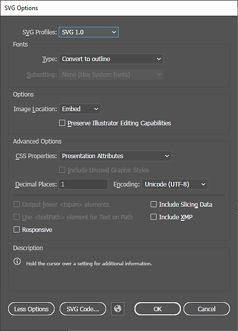
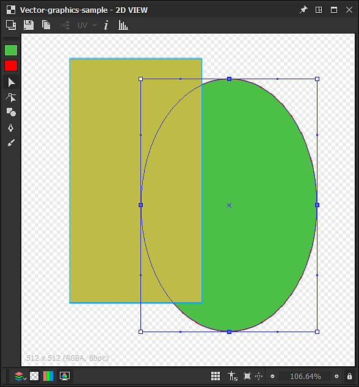
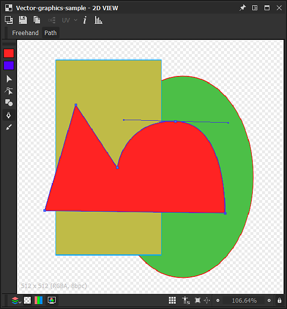
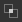

# Vector editing tools

This page describes the editing tools available in the [2D View](https://docs.substance3d.com/display/SDDOC/2D+view) panel for compatible vector graphics.

## Overview

<table>
<tr style="border: 0;">
<td style="border: 0;" valign="top">

The [2D View](https://docs.substance3d.com/display/SDDOC/2D+view) panel offers basic vector editing tools which let you create or edit vector graphics *manually* directly within [Substance 3D Designer](https://www.adobe.com/products/substance3d-designer.html). These tools are particularly useful, for instance, for quickly creating *masks* or *patterns*.

The tools support pen input. To take advantage of pen displays, you may [undock](https://docs.substance3d.com/display/SDDOC/Customizing+your+workspace) the [2D view](https://docs.substance3d.com/display/SDDOC/2D+view) panel, then place and resize it into any configuration which is more comfortable for painting.

Edits can be *undone individually*, and all the other features of the 2D View panel are still *available* to you while you edit the vector image, such as [Histogram](https://docs.substance3d.com/display/SDDOC/2D+view#id-2Dview-Histogram) panel, [Tiled display](https://docs.substance3d.com/display/SDDOC/2D+view#id-2Dview-Viewport), and [Background image](https://docs.substance3d.com/display/SDDOC/2D+view#id-2Dview-Backgroundimage).

</td>
<td style="border: 0;" valign="top">

{width="512px"}

</td>
</tr>
</table>

>[!TIP]
>
> **Windows only**
> 
> Tablet users should apply the settings described in the following page for the most reliable experience in Designer: [Configuring Pens and Tablets](https://docs.substance3d.com/display/SPDOC/Configuring+Pens+and+Tablets)

>[!IMPORTANT]
>
> You can paint *only* on *8-bit* [vector graphics resources](../../../resources/vector-graphics-svg-res/vector-graphics-svg-resource.md) which are [new or imported](https://docs.substance3d.com/display/SDDOC/Importing%2C+Linking+and+New+Resources).

{width="512px"}

## Enabling the vector editing tools

The vector editing tools will be enabled automatically in the [2D view](https://docs.substance3d.com/display/SDDOC/2D+view) panel when the following criteria regarding a vector graphics image are met:

* The vector graphics image is a [new or imported](https://docs.substance3d.com/display/SDDOC/Importing%2C+Linking+and+New+Resources) resource
* The bitmap is displayed in the [2D view](https://docs.substance3d.com/display/SDDOC/2D+view) panel

*New* vector graphics images can be created the following ways:

* In the [Explorer](https://docs.substance3d.com/display/SDDOC/The+Explorer+Window) panel, click RMB on an *SBS package* or a *folder* within a package to open their contextual menu, then open the **New** submenu and select the **SVG** option
* In a [graph](https://docs.substance3d.com/display/SDDOC/The+Graph+view), create an [SVG node](../../../compositing-graphs/nodes-reference-for-com/atomic-nodes/svg/svg.md) and select the **From new resource...** option in the contextual menu

The **New vectorial data** window will open, letting you set the *name* and *resolution* of the new vector graphics resource.

>[!TIP]
>
> For the best performance with the vector editing tools, we recommend using vector graphics images with resolutions which are *powers of two* – e.g. 128, 256, 512, 1024, ...

### Exporting vector graphics from other software

Designer *only* supports vector graphics using the **SVG** file format.

For the best compatibility and reliability in Designer and its editing tools, please make sure all objects are converted to *outlines* and ungrouped to *separate* objects using *flat colors*, so that *none of the following remain*:

* **Text**
* **Gradients**
* **Patterns** (both for fills and stroke outlines)
* **Styles**

**Adobe Illustrator** users can refer to the attached image for recommended SVG *export settings.*

+++Adobe Illustrator export options

+++

>[!NOTE]
>
> To learn more about SVG limitations, exporting from other software and SVG properties in Designer, please refer to the [Vector graphics (SVG) resource](../../../resources/vector-graphics-svg-res/vector-graphics-svg-resource.md) section.

## Tools

The painting tools and options are arranged in *toolbars* within the [2D view](https://docs.substance3d.com/display/SDDOC/2D+view) panel. These toolbars can be relocated to *any side* of the panel or as a *floating toolbar*, by clicking and holding **LMB** on their *handle* – displayed as a triple line – then releasing **LMB** at the desired location.

Two toolbars are displayed when the vector editing tools are enabled:

* **Tool selection** **toolbar**: lets you *select a tool* as well as the *fill/outline colors*, and is placed on the *left* side of the 2D View panel by default
* **Tool options toolbar**: lets you set the *options* for the *currently selected tool*, and is placed on the *top* side of the 2D View panel by default

Keyboard shortcuts let you access tools quickly, and are marked below between parentheses after the tool/function name:

+++Color selection
The  **Color selection** *thumbnails* let you define a *fill* and *outline* color for vector shapes. You can open the **Color editor** for each of these colors in the following ways:

* **Fill color:** Click on the *fill* color thumbnail (top), or double-click LMB on the canvas

* **Outline color:** Click on the *outline* color thumbnail (bottom), or *hold Ctrl* and double-click LMB on the canvas

The set colors will then be applied to the *currently selected shapes*.

If the current *outline* color is *black* – i.e. luminance 0 or RGB (0, 0, 0) – it will *not* be applied to the selected shapes until you *click on the outline color thumbnail*.

+++

+++Transformation
{width="512px"}

The  <b>Transformation</b> tool (<b>V</b>) can select shapes, which are then included in a transformation gizmo. This gizmo lets you perform the following actions:

<b>Move</b>: Click and hold LMB *inside* the gizmo

<b>Scale</b>: Click and hold LMB on any of the *square handles* along the gizmo to *scale* the object horizontally, vertically, or both. By default, scaling is done relatively to the handle on the *opposite* side of the gizmo. You can hold the <b>Alt</b> key to perform the scaling relatively to the *center* of the gizmo, and hold the <b>Shift</b> key to *lock* the gizmo width/height *ratio*

<b>Rotate: </b>Click and hold LMB next to any of the *square handles* along the gizmo, *outside* of the gizmo.

+++

+++Node
{width="512px"}

The  <b>Node</b> tool (<b>A</b>) lets you select individual vertices (i.e. nodes) of the selected shape and edit its position and handles, as well as add and remove vertices. Once a shape is selected, the following actions can be performed:

<b>Add vertex:</b> Ctrl+LMB on the shape outline

<b>Remove vertex</b>: Ctrl+LMB on the vertex

<b>Move vertex</b>: Hold LMB on the vertex

<b>Move vertex handles</b>: Hold LMB on the handle

<b>Move vertex handle independently</b>: Hold Alt+LMB on the handle. Note that handles will be *unlinked* past this point until they are *reset*

<b>Reset handles</b>: Click Alt+LMB on the vertex. The handles will be reset to the *vertex position*

<b>Move reset vertex handles</b>: Hold Alt+LMB on the vertex. *Linked* handles will appear

+++

+++Shape
{width="512px"}

The  <b>Shapes</b> tool (<b>M</b>) offers a set of primitive shapes, using the currentl *fill* color, which can be built from and edited:

* <b>Rectangle;</b>

* <b>Ellipse;</b>

* <b>Rounded rectangle:</b> The rounded angles have a locked radius;

* <b>Polygon:</b> Creates an octogon.

To draw a primitive, Hold <b>LMB</b> anywhere in the canvas from any of its *corners*. Hold <b>Alt+LMB</b> to draw the shape from its *center*.

+++

+++Pen
{width="512px"}

The  <b>Pen</b> tool (<b>P</b>) lets you draw a new custom shape, using the current *fill* color. Two modes are available:

In <b>Path </b>mode, the shape is drawn *one vertex at a time*. The following controls are available:

Add <b>straight in/straight out </b>vertex: Click LMB

Add <b>curve in/curve out</b> vertex (*aligned* tangents): Hold LMB and drag

Add <b>curve in/curve out </b>vertex (*unaligned* tangents)\*: Hold LMB and drag, then hold Alt+LMB

Add <b>curve in/straight out</b> vertex\*: same as curve in/curve out vertex (unaligned tangents), but the out line needs to be placed *on top of the new vertex*

Add <b>straight in/curve out</b> vertex\*: Hold Alt+LMB and drag

<b>Close shape</b> on *next* vertex: Hold Ctrl

<b>Close shape</b> on *current* vertex: Press Enter, or click LMB on the *first vertex* of the current shape

<b>Freehand </b>mode lets you draw shapes directly by dragging the pen across the canvas while holding LMB.

Vertices are *automatically placed* along the stroke so that the resulting path matches the stroke as closely as possible. The shape is *automatically closed* when the stroke ends, connecting the first vertex to the last in the stroke.

+++

+++Extrude
{width="512px"}

The  **Extrude** tool (E) *adds together* a shape of a *set diameter*, drawn along a path using the selected *drawing mode*, and applies the result in the canvas following the *merging mode* set in the options toolbar.

The following *drawing modes* are available:

 **Freeform**: draws the shape *directly by dragging* the pen across the canvas while holding LMB. The shape is added together when the stroke ends.

 **Polygonal**: draws the shape *one face at a time* by clicking LMB to add an angle. The shape is added together when the Enter key is pressed.

The drawn shape can be controlled using these parameters:

<b>Size</b>: Controls the diameter of the radial shape drawn at the cursor location.

<b>Smoothness</b>: Controls the amount by which the drawn shape should be *smoothed out and simplified* when added together at the end of the stroke.

When the drawing is completed, the shape is added together and merged with the currently selected shape using one of these available *merging modes*:

 **No merging**: The shape is drawn *on top* of the selected shape as a *separate object*.

 **Union**: The shape is *added* to the selected shape.

 **Subtraction**: The shape is *cut out* of the selected shape.

 **Intersection**: Only the *overlapping* portions of the new and the selected shape remain.

+++

## Shape operations

{width="512px"}

In addition to the tools listed above, a number of operations can be performed on *selected shapes*, using the contextual menu available when clicking RMB. These operations nearly all have a keyboard shortcut (in parentheses below) are organised in the following categories:

+++Adding and removing shapes
<b>Copy selection</b> (Ctrl+C): *Copy* the selected shapes to the clipboard

<b>Cut selection</b> (Ctrl+X): *Copy* the selected shapes to the clipboard and *remove* the shapes

<b>Paste</b> (Ctrl+V): Create the copied shape currently in the clipboard, at the *cursor location*

<b>Paste in place</b> (Ctrl+Shift+V): Create the copied shape currently in the clipboard, at the *copied shape location*

<b>Delete selection</b> (Del): *Remove* the selected shapes

+++

+++Arranging shapes
Shapes are arranged in a *stack*, which sets the *order* of the shapes in the canvas – i.e. which is on top of which. New shapes are created *on top* of the canvas by default, and the following controls let you change this arrangement:

<b>Bring to front</b> (Home): *raises* the selected shapes to the *top* of the shapes stack

<b>Bring forward</b> (PgUp): *raises* the selected shapes up by *one level* in the shapes stack

<b>Send backward</b> (PgDown): *lowers* the selected shapes down by *one level* in the shapes stack

<b>Send to back</b> (End): *lowers* the selected shapes to the *bottom* of the shapes stack

+++

+++Send to new SVG image
You can use shapes in the current image to create a *new [SVG resource](../../../resources/vector-graphics-svg-res/vector-graphics-svg-resource.md)* in the current [SBS package](../../../getting-started/overview/overview.md). To that regard, the following actions are available:

<b>Copy selection to new SVG</b>: Creates a new SVG resource, and copies the selected shapes *in place* in this new image.

<b>Cut selection to new SVG</b>: Creates a new SVG resource, copies the selected shapes *in place* in this new image, and *removes* them from the *current image*.

+++
