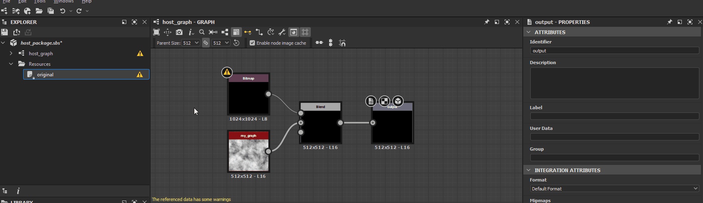

# Warnings from dependencies

This page lists warnings and error messages which may be triggered by dependencies in Substance 3D Designer, and offers common troubleshooting steps for each.

Dependencies are *other files* referenced by a Substance 3D file (SBS). They include [resources](../../resources/resources.md) and other Substance 3D files referenced by [graph instance](../../compositing-graphs/creating-compositing-gra/graph-instances-sub-gra/graph-instances-sub-graphs.md) nodes.

##  Invalid dependent package

A dependency package cannot be loaded, because it is missing, corrupted or incompatible with the version of Designer being used.

<b>!&#91;(tick)&#93;(check.svg) Solution</b>

There are two main ways of correcting this issue:

1. <b>Make the dependency load successfully</b>

   Check the dependency package exists at the location specified in the warning message. If it does not, find the file and put it back at that location, or recreate it in place. If the file exists, *try to load it* in Designer and look out for any warnings or errors related to that package. Refer to troubleshooting steps for those specific issues an fix them accordingly.

   Then, reload the host package by clicking RMB on it in the [Explorer](https://helpx.adobe.com/substance-3d/unlisted/documentation/sddoc/the-explorer-129368147.html) panel and selecting the <b>Reload</b> option in the contextual menu.

   
1. <b>Relocate the dependency in the package</b>

   You can relocate the dependency using the [Dependency manager](../../interface/dependency-manager/dependency-manager.md) . C lick RMB on the host package in the [Explorer](https://helpx.adobe.com/substance-3d/unlisted/documentation/sddoc/the-explorer-129368147.html) panel and select the <b>Dependency Manager</b> option in the contextual menu.

   Find the missing dependency in the Dependendy Manager's list, click RMB on it and select the <b>Relocate...</b> option. Find the dependency package using the file browser dialog and click <b>Open</b>.

   Then, reload the host package by clicking RMB on it in the [Explorer](https://helpx.adobe.com/substance-3d/unlisted/documentation/sddoc/the-explorer-129368147.html) panel and selecting the <b>Reload</b> option in the contextual menu.

   

##  Check the alias *'X'* is defined in your project

One of the package's dependencies or resources is being loaded from a location which is [aliased](../../interface/preferences-window/project-settings/project-settings.md) in the Substance 3D file (SBS) data under the alias reported in the warning, although that alias is not defined in the current [project files](../../interface/preferences-window/project-settings/project-settings.md).

<b>!&#91;(tick)&#93;(check.svg) Solution</b>

At least one of the [project files](../../interface/preferences-window/project-settings/project-settings.md) should define the alias that which is reported in the warning.

##  No file that matches this resource can be found

The files matching the *UDIM template* for a [Bitmap resource](../../resources/bitmap-resource/bitmap-resource.md) cannot be found.

<b>!&#91;(tick)&#93;(check.svg) Solution</b>

When a [Bitmap resource](../../resources/bitmap-resource/bitmap-resource.md) is linked and Designer detects a *UDIM naming taxonomy* in its filename – e.g. `0x1` in `my_texture_0x1.png`, it offers to link it as a *UDIM template*, so that [Bitmap](../../compositing-graphs/nodes-reference-for-com/atomic-nodes/bitmap/bitmap.md) nodes can *automatically switch* to other bitmaps in a UDIM set using that taxonomy, when using a UDIM workflow in Designer. In that case, Designer links the Bitmap resource in a *different way* which takes the UDIM numbering template into account.

There are two main ways of correcting this issue:

1. <b>Restore the files</b>

   Go to the location specified by the resource's <b>File Path</b> attribute and check that files following the template exist. If they do not, restore or recreate them.

   
1. <b>Relocate the files</b>

   If the files were moved or renamed, relocate them by clicking RMB on the resource item in the [Explorer](https://helpx.adobe.com/substance-3d/unlisted/documentation/sddoc/the-explorer-129368147.html) panel and select the <b>Relocate</b> option to link that resource to the *first file in a set* of UDIM images of the same type.

   

##  Linked file not found

The file referenced by a linked resource does not exist at the location specified by its <b>File Path</b> attribute.

<b>!&#91;(tick)&#93;(check.svg) Solution</b>

There are two main ways of correcting this issue:

1. <b>Restore the file</b>

   Go to the location specified by the resource's <b>File Path</b> attribute and check that the file exists. If it does not, restore or recreate it.

   
1. <b>Relocate the file</b>

   If the file was moved or renamed, relocate it by clicking RMB on the resource item in the [Explorer](https://helpx.adobe.com/substance-3d/unlisted/documentation/sddoc/the-explorer-129368147.html) panel and select the <b>Relocate</b> option to link that resource to another file of the same type.

   

##  Color space not found

A [Bitmap resource](../../resources/bitmap-resource/bitmap-resource.md) references a color space which cannot be found in the current [color management](../../color-management/color-management.md) environment. This may be an ICC profile or a color space in an OCIO configuration.

<b>!&#91;(tick)&#93;(check.svg) Solution</b>

The list of options for the Color space attribute is automatically populated with available valid color space. Change the color space value for that resource to any other entry in the list.

Alternatively, add that color space to the current [color management](../../color-management/color-management.md) environment, then restart Designer. This may be an ICC profile or a color space in an OCIO configuration.

>[!NOTE]
>
> This warning is only triggered when using a color management mode other than **Legacy** (which is akin to disabling color management). You may enable color management in the **Color Management** section of the [Project settings](../../interface/preferences-window/project-settings/project-settings.md).

##  Reference resource not found

The graph assigned to the UV tile of a [3D mesh resource](https://helpx.adobe.com/substance-3d/unlisted/documentation/sddoc/3d-mesh-resource-200574577.html) cannot be found at the location reported in the warning.

<b>!&#91;(tick)&#93;(check.svg) Solution</b>

There are two main ways of correcting this issue:

1. <b>Restore the graph</b>

   Check the contents of the package in the [Explorer](https://helpx.adobe.com/substance-3d/unlisted/documentation/sddoc/the-explorer-129368147.html) panel for the graph specified in the <b>UV Tiles</b> list. If it does not exist, restore or recreate it.

   
1. <b>Select another graph</b>

   Assign another graph in the package to the UV tile.

   

##  UV tiles are assigned multiple times

A UV tile for a [3D mesh resource](https://helpx.adobe.com/substance-3d/unlisted/documentation/sddoc/3d-mesh-resource-200574577.html) is assigned more than once to a [Substance graph](../../compositing-graphs/substance-compositing-graphs.md).

<b>!&#91;(tick)&#93;(check.svg) Solution</b>

For each UV set of a 3D mesh resource, make sure no UDIM index is present *more than once* in the <b>UV Tiles</b> list.

##  Invalid UV tiles

A UV tile listed for a [3D mesh resource](https://helpx.adobe.com/substance-3d/unlisted/documentation/sddoc/3d-mesh-resource-200574577.html) is not defined in the mesh or corrupted.

<b>!&#91;(tick)&#93;(check.svg) Solution</b>

For each UV set of a 3D mesh resource, make sure all items in the <b>UV Tiles</b> list refer to UDIMs which *exist* in the linked resource.

>[!NOTE]
>
> This warning cannot be triggered through the user interface, since it *only* lists the UDIMs detected in the linked resource. Only modifying the data in the Substance 3D file (SBS) *directly* can result in this warning being triggered.

