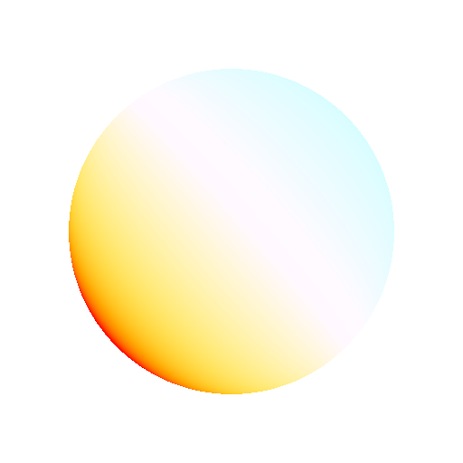

# Color Temperature Adjustment

<table>
<tr style="border: 0;">
<td style="border: 0;" valign="top">

{width="250px"}

## Color Temperature Adjustment

**In:** *3D View/HDRI Tools*

**Simple**

</td>
<td style="border: 0;" valign="top">

## Description

Adjusts input image's color balance. Similar to White Balance adjustment in photography. Can be used to warm or cool color in HDR images that are off-key.

## Parameters

* **Temperature**: *-1.0 - 1.0*   
  Shift colors between warm and cold.
* **Magenta-Green**: *-1.0 - 1.0*   
  Shift tone between magenta and green.
* **Color Space**: *HDR (linear), LDR (sRGB)*Determine how input image's color space is interpreted.

## Example Images

</td>
</tr>
</table>
